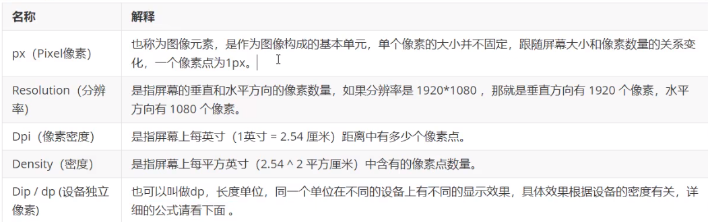
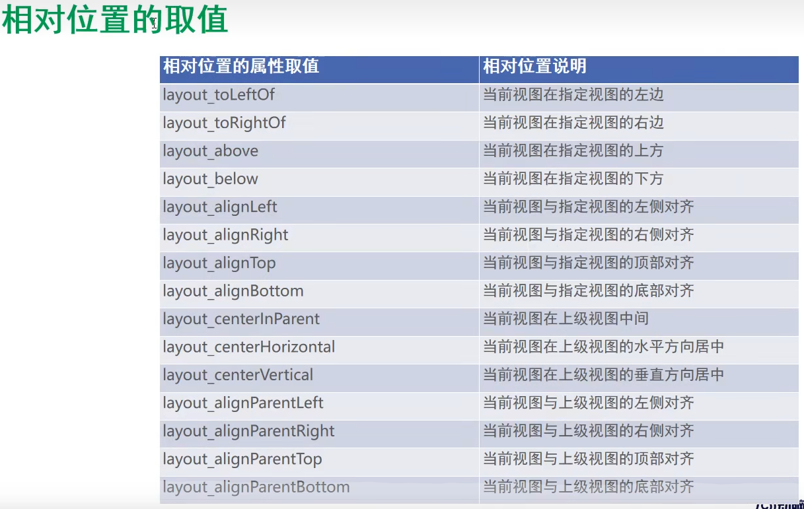

## 控件(简单，中级，高级，自定义)

#### 简单控件

1.字体

补充：



2.视图间距

设置视图的间距

> 设置视图的间距有两种方式:
>
> ●采用layout_margin属性，它指定了当前视图与周围平级视图之间的距离。包括layout_margin、layout_marginLeft、layout_marginTop、layout_marginRight、layout_marginBottom
>
> ●采用padding属性，它指定了当前视图与内部下级视图之间的距离。包括padding.paddingLeft、paddingTop、 paddingRight、paddingBottom

3.设置视图的对齐方式

> 设置视图的对齐方式有两种途径：
>
> ●采用layout_gravity属性，它指定了当前视图相对于上级视图的对齐方式（子视图对于父视图的位置）
>
> ●采用gravity属性，它指定了下级视图相对于当前视图的对齐方式。（子节点在父容器的位置）
>
> layout_gravity与gravity的取值包括: left、top、right、bottom，还可以用竖线连接各取值，例
>
> 如“left|top”表示即靠左又靠上，也就是朝左上角对齐。

#### 常用布局(4种)

```java
1.LinearLayout(线性布局)
2.RelativeLayout(相对布局)
 >相对布局的下级视图位置由其他视图决定。用于确定下级视图位置的参照物分两种:
	1)与该视图自身平级的视图;
	2)该视图的上级视图（也就是它归属的RelativeLayout)
 >如果不设定下级视图的参照物，那么下级视图默认显示在RelativeLayout内部的左上角。
3.GridLayout(网格布局)
>网格布局支持多行多列的表格排列。
>网格布局默认从左往右、从上到下排列,它新增了两个属性:
	columnCount属性，它指定了网格的列数，即每行能放多少个视图;
	rowCount属性，它指定了网格的行数，即每列能放多少个视图;
4.ScrollView(滚动布局,非常常用)
>滚动视图有两种:
●ScrollView，它是垂直方向的滚动视图;垂直方向滚动时，layout_width属性值设置为match_parent，layout_height属性值设置为wrap_content。
●HorizontalScrollView，它是水平方向的滚动视图;水平方向滚动时，layout_width属性值设置为wrap_content，layout_height属性值设置为match_parent。
```



#### 按钮触控

1.按钮控件Button

> 与TextView相比，Button增加了两个新属性:
> ● textAllCaps 属性，它指定了是否将英文字母转为大写，为true是表示自动转为大写，为false表示不做大写转换。
> ● onClick 属性，它用来接管用户的点击动作，指定了点击按钮时要触发哪个方法;

2.点击事件和长按事件

监听器，意思是专门监听控件的动作行为。只有控件发生了指定的动作，监听器才会触发开关去执行对应的代码逻辑。
>按钮控件有两种常用的监听器:
>● 点击监听器，通过 setOnClickListener 方法设置。按钮被按住少于500毫秒时，会触发点击事件。
>● 长按监听器，通过 setOnLongClickListener 方法设置。按钮被按住超过500毫秒时，会触发长按
>事件。

3.禁用与恢复按钮（验证码功能）

> 在实际业务中，按钮通常拥有两种状态，即可用状态和不可用状态，它们在功能上的区别如下：
>
> ● 不可用按钮：按钮不允许点击，即使点击也没反应，同时按钮文字为灰色；
>
> ● 可用按钮：按钮允许点击，点击按钮会触发点击事件，同时按钮文字为正常的黑色；
>
> 是否允许点击由enabled属性控制，属性值为true时表示允许点击，为false时表示不允许点击。

#### 图像显示

1.图像视图ImageView

> 图像视图展示的图片通常位于res/drawable***目录，设置图像视图的显示图片有两种方式:
> ● 在XML文件中，通过属性android:src设置图片资源，属性值格式形如“@drawable/不含扩展名的图片名称”。
> ● 在Java代码中，调用setlmageResource方法设置图片资源，方法参数格式形如“R.drawable.不含扩展名的图片名称”。

2.图像按钮ImageButton

> lmageButton是显示图片的图像按钮，但它继承自lmageView，而非继承Button。lmageButton和Button之间的区别有:
>
> ●  Button既可显示文本也可显示图片，lmageButton只能显示图片不能显示文本。
>
> ●  lmageButton上的图像可按比例缩放，而Button通过背景设置的图像会拉伸变形。
>
> ●  Button只能靠背景显示一张图片，而ImageButton可分别在前景和背景显示图片，从而实现两
>
> 张图片叠加的效果。

3.同时展示文本与图像

> 同时展示文本与图像的可能途径包括:
> (1）利用LinearLayout对ImageView和TextView组合布局。
> (2）通过按钮控件Button的drawable***属性设置文本周围的图标
>
> drawableTop:指定文字上方的图片。
>
> drawableBottom:指定文字下方的图片。
>
> drawableLeft:指定文字左边的图片。
>
> drawableRight:指定文字右边的图片。
>
> drawablePadding:指定图片与文字的间距。


### Activity

#### 生命周期


1.打开新页面的方法调用顺序为:
onCreate→onStart→onResume
2.关闭旧页面的方法调用顺序为:
onPause→onStop→onDestroy

#### Activity的启动模式

**1．在配置文件中指定启动模式**
打开AndroidManifest.xml，给activity节点添加属性android:launchMode，属性值填入standard表示采取标准模式，当然不添加属性的话默认就是标准模式。具体的activity节点配置内容示例如下:

```
<activity
    android:name=".MainActivity"
    android:exported="true"
    android:launchMode="standard">
```

**2.元数据**

配置好了activity节点的meta-data标签，再回到Java代码获取元数据信息，获取步骤分为下列3`步`： 

1.调用getPackageManager方法获得当前应用的包管理器。 

2.调用包管理器的getActivityInfo方法获得当前活动的信息对象。 

3.活动信息对象的metaData是Bundle包裹类型，调用包裹对象的getString即可获得指定名称的参数 值。

```java
// 显示配置的元数据 
private void showMetaData() { 
    try { 
        PackageManager pm = getPackageManager(); 
        // 获取应用包管理器 // 从应用包管理器中获取当前的活动信息 
        ActivityInfo act = pm.getActivityInfo(getComponentName(), PackageManager.GET_META_DATA); 
        Bundle bundle = act.metaData; 
        // 获取活动附加的元数据信息 
        String value = bundle.getString("weather");
        // 从包裹中取出名叫weather的字符串 
        tv_meta.setText("来自元数据信息：今天的天气是"+value);
        // 在文本视图上显示文字 
    } catch (Exception e) {
        e.printStackTrace();
    } 
    

```

**2.1**元数据不单单能传递简单的字符串参数，还能传送更复杂的资源数据，从Android 7.1开始新增的快捷方 式便用到了这点，譬如在手机桌面上长按支付宝图标


#### 中级控件

##### 1　图形定制

##### 2   选择按钮

##### 3   文本输入

##### 4   对话框

##### 5   实战，找回密码


