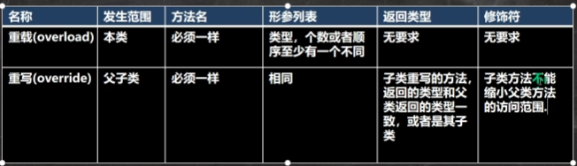
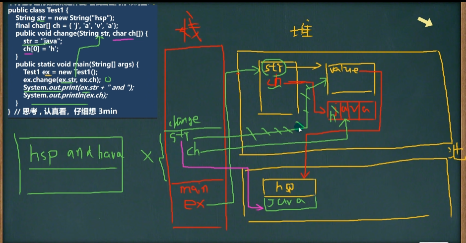

2024.8.2 星期五

##### 进制

- 进制介绍

  对于整数,有四种表示方式:

  1. 二进制:0,1，满2进1.以0b或0B开头。
  2. 十进制:0-9，满10进1。
  3. 八进制:0-7，满8进1.以数字0开头表示。
  4. 十六进制:0-9及A(10)-F(15)，满16进1.以Ox或OX开头表示。此处的A-F不区分大小写。

  ```java
  举例：
  // 二进制
  int n1 = 0b1010;
  // 十进制
  int n2 = 1010;
  // 八进制
  int n3 = 01010;
  // 十六进制
  int n4 = 0X10101;
  ```

##### 进制的转换（基本功）

进制转换的介绍

- 第一组
  1. 二进制转十进制
  2. 八进制转十进制
  3. 十六进制转十进制
- 第二组
  1. 十进制转二进制
  2. 十进制转八进制
  3. 十进制转十六进制
- 第三组
  1. 二进制转八进制
  2. 二进制转十六进制
- 第四组
  1. 八进制转二进制
  2. 十六进制转二进制


- 第一组

1. 二进制转十进制

   规则:从最低位(右边)开始,将每个位上的数提取出来，乘以2的(位数-1)次方，然后求和。

   ```java
   0b1011 =  1*2的(1-1)次方 + 1*2的(2-1)次方 + 1*2的(4-1)次方 = 1 + 2 + 8 = 11
   ```

2. 八进制转十进制

   规则:从最低位(右边)开始,将每个位上的数提取出来，乘以8的(位数-1)次方，然后求和。

   案例:请将0234转成十进制的数1

   ```java
   0234 = 2 * 8的(3-1)次方 + 3 * 8的(2-1)次方 + 4 * 8的(1-1)次方 = 2 * 64 + 24 + 4 = 156
   ```

3. 十六进制转十进制

   规则:从最低位(右边)开始,将每个位上的数提取出来，乘以16的(位数-1)次方，然后求和。

   案例:请将0x23A转成十进制的数

   ```java
   0x23A:2 * 16的2次方 + 3 * 16的1次方 + 10 * 16的0次方 = 512 + 48 + 10 = 570
   ```

   

- 第二组

1. 十进制转二进制

   规则:将该数不断除以2，直到商为0为止，然后将每步得到的余数倒过来，就是对应的二进制。

   案例:请将34转成二进制= 0b00100010

   

2. 十进制转八进制

   规则:将该数不断除以8，直到商为0为止，然后将每步得到的余数倒过来，就是对应的八进制。
   案例:请将131转成八进制=> 0203

   

3. 十进制转十六进制

   规则:将该数不断除以16，直到商为0为止，然后将每步得到的余数倒过来，就是对应的十六进制。
   案例:请将237转成十六进制=> 0xED


- 第三组

  1. 二进制转八进制

     规则:从低位开始,将二进制数每三位一组，转成对应的八进制数即可。

     案例:请将0b11010101转成八进制

     ```java
     0b11(3)010(2)101(5) -> 0325
     ```

  2. 二进制转十六进制 （A：10）

     规则:从低位开始，将二进制数每四位一组，转成对应的十六进制数即可。

     案例:请将0b11010101转成十六进制

     ```java
     0b1101(D)0101(5) = 0xD5
     ```

- 第四组

  1. 八进制转二进制

     规则:将八进制数每1位，转成对应的一个**<u>3位</u>**的二进制数即可。

     案例:请将0237转成二进制

     ```java
     02(010)3(011)7(111) = 0B 1001 1111
     ```

  2. 十六进制转二进制

     规则:将十六进制数每1位，转成对应的**<u>4位</u>**的一个二进制数即可。

     案例:请将0x23B转成二进制

     ```java
     0x2(0010)3(0011)B(1011) = 0b 0010 0011 1011
     ```


#### 原码、反码、补码（重点、难点）


#### 位运算


```java
// 1.先得到 2的补码 -> 2 的原码 00000000 00000000 00000000 00000010
// 	 2的补码 00000000 00000000 00000000 00000010
// 2.3的补码 -> 3的原码 00000000 00000000 00000000 00000011
// 	 3的补码 00000000 00000000 00000000 00000011
// 3.按位与 &
// 00000000 00000000 00000000 00000010
// 00000000 00000000 00000000 00000011
// 00000000 00000000 00000000 00000010 这是运算后的补码。要看原码
// 因为 它是正数，原码、补码、反码都一样，结果就是2
System.out.println(2&3);

// 1.先得到 -2的原码 10000000 00000000 00000000 00000010
// 2.得到 -2的反码   11111111 11111111 11111111 11111101
// 3.得到 -2的补码 	11111111 11111111 11111111 11111110
// 4.按位取反得到补码 00000000 00000000 00000000 00000001
// 因为是正数，所以得到三码合一，得到1
System.out.println(~-2);

// 1. 先得到2的补码，因为是整数所以三码合一 2的补码为 00000000 00000000 00000000 00000010
// 2. 按位取反 ~ ，~2的补码为 11111111 11111111 11111111 11111101
// 3. ~2的反码为 11111111 11111111 11111111 11111100
// 4. ~2的原码为 10000000 00000000 00000000 00000011
// 得到 -3
System.out.println(~2);
```

#### 

#### 位运算符


```java
int a = 1 >> 2; // 1 / 2 / 2 = 0
```


2024.5.28 星期二

##### break的注意事项和细节说明:

​    1.break 语句出现在多层嵌套的语句块中时，可以通过标签指明要终止的是那一层语句块
​    2.标签的基本使用

```java
        label1{
            label2{
                label3{
                    {
                        break label2;
                    }
                }
            }
        }
```

在实际的开发中，尽量不要使用。如果没有指定 break ，默认退出最近的循环体。

2024.5.30 星期四

#### 数组

​    数组的使用
​        使用方式1-动态初始化：数据类型[] 数组名 = new 数据类型[大小];
​        使用方式2-动态初始化: 1.先声明数组
​                                语法：数据类型 数组名[];也可以 数据类型[] 数组名; int[] a或者 int a[]
​                            2.创建数组
​                                语法：数组名 = new 数据类型[大小]; a = new int[10];
​        使用方式3-静态初始化：数据类型[] 数组名 = {元素值,元素值,......};

#####     数组使用注意事项和细节

​    1.数组是多个相同类型数据的组合，实现对这些数据的统一管理
​    2.数组中的元素可以是任何数据类型，包括基本类型和引用类型，但是不能混用。
​    3.数组创建后,如果没有赋值,有默认值int 0, short 0, byte 0, long 0, float 0.0,double 0.0, char \u0000, boolean false, String null
​    4.使用数组的步骤 1.声明数组并开辟空间 2 给数组各个元素赋值 3 使用数组
​    5.数组的下标是从0开始的。
​    6.数组下标必须在指定范围内使用，否则报:下标越界异常，比如int[] arr=new int[5]; 则有效下标为 0-4
​    7.数组属引用类型，数组型数据是对象(object)

    数组赋值机制
    1.基本数据类型赋值，这个值就是具体的数据，而且相互不影响。int n1 = 2;  int n2 = n1;
    2.数组在默认情况下是引用传递，赋的值是地址。

2024.6.1 星期五

### 类和对象

​    类和对象的内存分配机制
​    Java内存的结构分析
​	    1.栈:一般存放基本数据类型(局部变量)
​	    2.堆:存放对象(Cat cat，数组等)
​	    3.方法区:常量池(常量，比如字符串)，类加载信息
​	    4.示意图[Cat(name, age. price)]

######    Java内存的结构分析图


#### 成员方法

成员方法的好处：1.可以提高代码的复用性	2.可以将实现的细节封装起来，然后供其他用户调用即可。

##### 注意事项和使用细节

​	√ 形参列表

​		1.一个方法可以有0个参数，也可以有多个参数，中间用逗号隔开,比如getSum(int n1,int n2)

​		2．参数类型可以为任意类型，包含基本类型或引用类型，比如printArr(int[][] map)

​		3．调用带参数的方法时，一定对应着参数列表传入相同类型或兼容类型的参数!

​		4．方法定义时的参数称为形式参数，简称形参;

​		      方法调用时的传入参数称为实际参数，简称实参，实参和形参的类型要一致或兼容、个数、顺序必须一致!

​	√方法体

​		里面写完成功能的具体的语句，可以为输入、输出、变量、运算、分支、循环、方法调用，但里面不能再定义方法!即:方法不能嵌套定义。 

##### <u>成员方法传参机制：</u>

<u>基本数据类型</u>：传递的是*值*(值拷贝)，形参的任何改变不影响实参!

<u>引用数据类型：</u>传递的是*地址*（传递的也是值，但值是地址），可以通过形参影响实参！

注意事项：

在方法内置空只是将p指向的地址变成null，原本的地址值仍然存在。


JVM的内存 

方法的**递归**调用


**递归重要规则**

1. 执行一个方法时，就创建一个新的受保护的独立空间(栈空间)
2. 方法的局部变量是独立的，不会相互影响,比如n变量
3. 如果方法中使用的是引用类型变量(比如数组，对象)，就会共享该引用类型的数据.
4. 递归必须向退出递归的条件逼近，否则就是无限递归,出现(StackOverflowError，死龟了:)
5. 当一个方法执行完毕，或者遇到return，就会返回，遵守谁调用，就将结果返回给谁，同时当方法执行完毕或者

返回时，该方法也就执行完毕。

##### 方法重载

注意事项和使用细节

1. 方法名：必须相同
2. 形参列表：必须不同（形参类型或个数或顺序，至少有一样不同，参数名无要求）
3. 返回类型：无要求

##### 可变参数

基本概念：

java允许将同一个类中多个同名同功能但参数个数不同的方法，封装成一个方法。就可以通过可变参数实现。

基本语法：

访问修饰符 返回类型 方法名(数据类型... 形参名){

}

例：1. int...   表示接受的是可变参数，类型是int ,即可以接收多个int(0-多)

​	2．使用可变参数时，可以当做数组来使用，即 nums 可以当做数组

```java
public int sum(int... nums){
}
```

注意事项和使用细节

1. 可变参数的实参可以为0个或任意多个。

2. 可变参数的实参可以为数组。

3. 可变参数的本质就是数组。

4. 可变参数可以和普通类型的参数一起放在形参列表，但必须保证可变参数在最后。

   ```
   public void f2(String str, double... nums){
   
   }
   ```

5. 一个形参列表中只能出现一个可变参数。

##### 作用域

 基本使用

1. 在java编程中，主要的变量就是属性(成员变量)和局部变量。
2. 我们说的局部变量一般是指在成员方法中定义的变量。
3. java中作用域的分类

​		全局变量:也就是属性，作用域为整个类体

​		局部变量:也就是除了属性之外的其他变量，作用域为定义它的代码块中!

   4.<u>全局变量可以不赋值，直接使用，因为有默认值，局部变量必须赋值后，才能使用，因为没有默认值。</u>

注意事项和细节使用

1. 属性和局部变量可以重名，访问时遵循就近原则。

2. 在同一个作用域中，比如在同一个成员方法中，两个局部变量，不能重名。

3. 属性生命周期较长，伴随着对象的创建而创建，伴随着对象的死亡而死亡。

   局部变量，生命周期较短，伴随着它的代码块的执行而创建，伴随着代码块的结束而死亡。即在一次方法调用过程中。

4. 作用域范围不同

   全局变量/属性:可以被本类使用，或其他类使用(通过对象调用)

   局部变量:只能在本类中对应的方法中使用

5. 修饰符不同

​	全局变量/属性可以加修饰符；局部变量不可以加修饰符

##### 构造方法/构造器

构造方法又叫构造器(constructor)，是类的一种特殊的方法，它的主要作用是完成**对新对象的初始化**。

它有几个特点:

1. 方法名和类名相同
2. 没有返回值
3. 在创建对象时，系统会自动的调用该类的构造器完成对对象的初始化

注意事项和使用细节

1. 一个类可以定义多个不同的构造器，即构造器重载。

   比如:我们可以再给Person类定义一个构造器,用来创建对象的时候,只指定人名,不需要指定年龄。

2. 构造器名和类名要相同。

3. 构造器没有返回值。

4. 构造器是完成对象的初始化.并不是创建对象。

5. 在创建对象时,系统自动的调用该类的构造方法。

6. 如果程序员没有定义构造器，系统会自动给类生成一个默认无参构造方法(也叫默认构造方法)。

7. <u>一旦定义了自己的构造器,默认的构造器就覆盖了，就不能再使用默认的无参构造器，除非显式的定义一下。</u>


**流程分析（面试题）**

1. 加载Person类信息（Person.class），只会加载一次

2. 在堆中分配空间（地址）

3. 完成对象初始化 

   ​	3.1 默认初始化 age=0 name=null

   ​	3.2 显式初始化 age=90 name=null

   ​	3.3 构造器的初始化 age=20 name="黄豫湘"

4. 在对象在堆中的地址返回给p (p是对象名，也可以理解成是对象的引用)


##### this 关键字（传统的命名查找是就近原则，而this明确指向全局变量)

this的注意事项和使用细节

1. this关键字可以用来访问本类的属性、方法、构造器
2. this用于区分当前类的属性和局部变量
3. 访问成员方法的语法:this.方法名(参数列表);
4. 访问构造器语法:this(参数列表);***注意只能在构造器中使用（即只能在构造器中访问另外一个构造器，必须放在第一条语句）***
5. this不能在类定义的外部使用，只能在类定义的方法中使用。


**访问修饰符**


### 面向对象三大特征：封装，继承，多态


#### 继承

注意事项和细节：

1. 子类继承了所有的属性和方法，非私有的属性和方法可以直接访问，但是私有属性不能在子类直接访问，要通过公共的方法去访问
2. 子类必须调用父类的构造器，完成父类的初始化
3. 当创建子类对象时，不管使用子类的哪个构造器，默认情况下总会去调用父类的无参构造器，如果父类没有提供无参构造器，则必须在子类的构造器中用super去指定使用父类的哪个构造器完成对父类的初始化工作，否则，编译不会通过
4. 如果希望指定去调用父类的某个构造器，则显式的调用一下：super(参数列表)
5. super在使用时，需要放在构造器第一行（super只能在构造器中使用）
6. super()和this()都只能放在构造器第一行，因此这两个方法不能共存在一个构造器中
7. java所有类都是Object类的子类，Object是所有类的基类
8. 父类构造器的调用不限于直接父类！将一直往上追溯直到Object类（顶级父类）
9. 子类最多只能继承一个父类(指直接继承)，即java中是**单继承机制**。
10. 不能滥用继承，子类和父类之间必须满足is-a的逻辑关系

**本质分析**（非常重要）

 这时请大家注意，要按照查找关系来返回信息
 （1）首先看子类是否有该属性
 （2）如果子类有这个属性，并且可以访问，则返回信息
 （3）如果子类没有这个属性，就看父类有没有这个属性(如果父类有该属性，并且可以访问，就返回信息...)
 （4）如果父类没有就按照(3)的规则，继续找上级父类，直到Object...

如果父类中的属性为 private 时，子类的堆内存有，但是不能被子类直接调用

如果子类要调用age属性，父类中有一个私有的age属性，则不会找父类的父类中公开的age属性。

子类创建的内存布局图如下所示：


##### super关键字

基本介绍

super代表父类的引用，用于访问父类的属性、方法、构造器

基本语法

1. 访问父类的属性，但不能访问父类的private属性。	super.属性名;
2. 访问父类的方法，不能访问父类的private方法	        super.方法名(参数列表);
3. 访问父类的构造器(这点前面用过):super(参数列表);只能放在构造器的第一句，只能出现一句!

super 给编程带来的便利/细节

1. 调用父类的构造器的好处(分工明确,父类属性由父类初始化，子类的属性由子类初始化)

2. 当子类中有和父类中的成员（属性和方法)重名时，为了访问父类的成员，必须通过super。如果没有重名，使用super、this、直接访问是一样的效果!

   

3. super的访问不限于直接父类，如果爷爷类和本类中有同名的成员，也可以使用super去访问爷爷类的成员;如果多个基类（上级类）中都有同名的成员，使用super访问遵循就近原则。A->B->C，当然也需要遵守访问权限的相关规则。

   ##### **super 和 this 的比较**

   


**方法重写**

注意事项和使用细节

1. 子类的方法的形参列表，方法名称，要和父类方法的形参列表，方法名称完全一样。

2. 子类方法的返回类型和父类方法返回类型一样，或者是父类返回类型的子类。

   比如 父类 返回类型是 Object ，子类方法返回类型是 String

3. 子类方法不能缩小父类方法的访问权限。

重写 和 重载 的区别




## 多态

1. 方法的多态，重写和重载就体现多态。

2. 对象的多态(核心，困难，重点)

   重要的几句话:

   (1)一个对象的编译类型和运行类型可以不一致

   (2)编译类型在定义对象时，就确定了，不能改变

   (3)运行类型是可以变化的

   (4)编译类型看定义时 = 号的左边，运行类型看 = 号的右边

多态注意事项和细节讨论

向上转型

```java
//向上转型:父类的引用指向了子类的对象
//语法:父类类型引用名= new子类类型();
Animal animal = new catO) ;
0bject obj = new cat;//可以吗？可以 0bject也是 Cat的父类

// 可以调用父类中的所有成员(需遵守访问权限)
// 但是不能调用子类的特有的成员
// 因为在编译阶段，能调用哪些成员，是由编译类型来决定的 
// animal.catchMouse();错误
// 最终运行效果看子类(运行类型)的具体实现，即调用方法时，按照从子类(运行类型)开始查找方法
// 然后调用，规则我前面我们讲的方法调用规则一致。
animal.eat();
animal.run();
animal.show();
animal.sleep();
```

向下转型

1. 语法: 子类类型  引用名  =  (子类类型)   父类引用
2. 只能强转父类的引用，不能强转父类的对象
3. 要求父类的引用必须指向的是当前目标类型的对象
4. 可以调用子类类型中所有的成员

```java
//老师希望，可以调用Cat的catchMouse方法
//多态的向下转型
//(1)语法:子类类型 引用名 = (子类类型) 父类引用;
//问一个问题? cat的编译类型Cat,运行类型是Cat
Cat cat = (Cat) animal;
cat.catchNouse();//猫抓老鼠
//(2)要求父类的引用必须指向的是当前目标类型的对象
// Dog dog = (Dog) animal;//可以吗?
```

属性没有重写之说！属性的值看编译类型。

instanceOf 比较操作符，用于判断对象的**运行类型**是否为 XX 类型或 XX 类型的子类型

#### java的动态绑定机制*（非常非常重要）*

java重要特性：动态绑定机制

1. 当调用对象**方法**的时候，**该方法会和该对象的内存地址/运行类型**绑定
2. 当调用对象**属性**时，没有动态绑定机制，哪里声明，那里使用

多态的应用

1. 多态数组

   数组的定义为父类类型，里面保存的实际元素类型为子类类型

2. 多态参数

   方法定义的形参类型为父类类型，实参类型允许为子类类型


### Object类详解

- .equals()方法


​	== 和 equals 的对比**（面试题）**

​	== 是一个比较运算符

1. ==：既可以判断基本类型，又可以判断引用类型
2. ==：如果判断基本类型，判断的值是否相等。
3. ==：如果判断引用类型，判断的是地址是否相等，即判定是不是同一个对象。
4. equals：是Object类中的方法，只能判断引用类型。
5. 默认判断的是地址是否相等，子类中往往重写该方法，用于判断内容是否相等。比如Integer，String

- .hashcode()方法


1. 提高具有哈希结构的容器的效率!
2. 两个引用，如果指向的是同一个对象，则哈希值肯定是一样的!
3. 两个引用，如果指向的是不同对象，则哈希值是不一样的
4. 哈希值主要根据地址号来的!，不能完全将哈希值等价于地址。
5. 案例演示[HashCode_.java]: obj.hashCode() [测试:A obj1 = new AO; A obj2 = new A);Aobj3 = obj1]
6. 后面在集合，中hashCode如果需要的话，也会重写

- .toString()方法


1. 基本介绍

   默认返回：全类名 + @ + 哈希值的十六进制

   子类往往重写toString方法，用于返回对象的属性信息

2. 重写toString()方法，打印对象或拼接对象时，都会自动调用该对象的toString形式.

   ```java
   // 没有重写默认调用Object类中的toString方法
   System.out.println(monster.toString());// com.javaexec.object_.Monster@1b6d3586
   ```

3. 当直接输出一个对象时,toString()方法会被默认调用

   ```java
   System.out.println(monster.toString());//Monster{name='小妖怪', job='巡山', sal=1000.0}
   System.out.println("==当直接输出一个对象时，toString方法会被默认的调用==");
   System.out.println(monster);//Monster{name='小妖怪', job='巡山', sal=1000.0}
   ```


- finalize()方法，终结器调用

1. 当对象被回收时，系统自动调用该对象的finalize()方法。子类可以重写该方法,做一些释放资源的操作
2. 什么时候被回收:当某个对象没有任何引用时，则jvm就认为这个对象是一个垃圾对象，就会使用垃圾回收机制来销毁该对象，在销毁该对象前，会先调用finalize方法
3. 垃圾回收机制的调用，是由系统来决定（即有自己的GC机制）,也可以通过System.gc()主动触发垃圾回收机制


**断点调试**

快捷键

F7（跳入） F8（跳过）	shift+F8（跳出）	F9（resume，执行到下一个断点）

F7:跳入方法内

F8:逐行执行代码

shift + F8:跳出方法


# 				第二阶段

##### **类变量和类方法**

**类变量**

- 类变量内存布局：


有些书说在方法区...，jdk版本有关系，*记住一点*：static 变量是对象共享

不管static变量在哪里，共识：

1.  static 变量是同一个类所有对象共享。
2.  static 类变量，在类加载的时候就生成了。

- 介绍：

类变量也叫静态变量/静态属性，是该类的所有对象共享的变量,任何一个该类的对象去访问它时,取到的都是相同的值,同样任何一个该类的对象去修改它时,修改的也是同一个变量。这个从前面的图也可看出来。

- 语法：

​	访问修饰符  static  数据类型  变量名;  [推荐]

​	static  访问修饰符  数据类型  变量名;

- 如何使用类变量

​	类名.类变量名

​	或者  对象名.类变量名      [静态变量的访问修饰符的访问权限和范围和普通属性是一样的。]

​	推荐使用：类名.类变量名

```java
public static void main(String[] args){
    // 类名.类变量名
    // 说明:类变量是随着类的加载而创建，所以即使没有创建对象实例也可以访问
    System.out.println(A.name)
}
class A{
    // 类变量
    // 静态变量的访问修饰符的访问权限和范围和普通属性是一样的
    public static String name = "黄豫湘";
}
```

- 类变量使用注意事项和细节讨论

1. 什么时候需要用类变量

   当我们需要让某个类的所有对象都共享一个变量时，就可以考虑使用类变量(静态变量):比如:定义学生类，统计

   所有学生共交多少钱。

2. 类变量与实例变量(普通属性)区别

   类变量是该类的所有对象共享的，而实例变量是每个对象独享的。

3. 加上static称为类变量或静态变量，否则称为实例变量/普通变量/非静态变量

4. 类变量可以通过类名.类变量名或者对象名.类变量名来访问，但java设计者推荐我们使用类名.类变量名方式访

   问。【前提是满足访问修饰符的访问权限和范围】

5. 实例变量不能通过  类名.类变量名  方式访问。

6. 类变量是在类加载时就初始化了，也就是说，即使你没有创建对象，只要类加载了，就可以使用类变量了。

7. 类变量的生命周期是随类的加载开始，随着类消亡而销毁。类变量只加载一次。


**类方法**

- 介绍

​	类方法也叫静态方法。‘

​	形式如下：访问修饰符  static   数据返回类型   方法名(){  }【推荐】

​				static   访问修饰符   数据返回类型   方法名(){    }

- 类方法的调用:

​	使用方式:	类名.类方法名	或者	对象名.类方法名 【前提是满足访问修饰符的访问权限和范围】

- 类方法经典的使用场景

  当方法中不涉及到任何和对象相关的成员，则可以将方法设计成静态方法，提高开发效率。

  比如:工具类中的方法 utils

  Math类、Arrays类、Collections集合类看下源码:

- 小结

  在程序员实际开发，往往会将一些通用的方法，设计成静态方法，这样我们不需要创建对象就可以使用了，比

  如打印一维数组，冒泡排序。完成某个计算任务等.

- 类方法使用注意事项和细节讨论

1. 类方法和普通方法都是随着类的加载而加载，将结构信息存储在方法区:

   类方法中无this的参数

   普通方法中隐含着this的参数

2. 类方法可以通过类名调用，也可以通过对象名调用。[举例]

3. 普通方法和对象有关，需要通过对象名调用，比如对象名.方法名(参数)，不能通过类名调用。[举例]

4. 类方法中不允许使用和对象有关的关键字，比如this和super。普通方法(成员方法)可以。

5. 类方法(静态方法)中只能访问静态变量或静态方法。【如何理解】

6. 普通成员方法，既可以访问非静态成员，也可以访问静态成员。

小结：静态方法，只能访问静态的成员，非静态的方法，可以访问静态成员和非静态成员(必须遵守访问权限)


**main方法**

深入理解main方法

解释main方法的形式:public static void main(String[] args){}

1. main方法时虚拟机调用

2. java虚拟机需要调用类的main()方法，所以该方法的访问权限必须是public
3. java虚拟机在执行main()方法时不必创建对象，所以该方法必须是static
4. 该方法接收String类型的数组参数，该数组中保存执行java命令时传递给所运行的类的参数案例演示，接收参数.
5. java  执行的程序  参数1  参数2  参数3

特别提示:

1. 在main()方法中，我们可以直接调用main方法所在类的静态方法或静态属性。
2. 但是，不能直接访问该类中的非静态成员，必须创建该类的一个实例对象后，才能通过这个对象去访问类中的非静态成员,

**代码块**

●基本介绍

代码化块又称为**初始化块**,属于类中的成员[即是类的一部分]，类似于方法，将逻辑语句封装在方法体中，通过{ }

 包围起来。

但和方法不同，没有方法名，没有返回，没有参数，只有方法体，而且不用通过对象或类显式调用,而是加载类、

时，或创建对象时隐式调用。

●基本语法

```java
[修饰符]{
	//代码;
};
```

注意:

1) 修饰符可选,要写的话，也只能写static

2) 代码块分为两类，使用static修饰的叫静态代码块，没有static修饰的，叫普通代码块/非静态代码块

3) 逻辑语句可以为任何逻辑语句(输入、输出、方法调用、循环、判断等)

4) ;号可以写上,也可以省略。

- 代码块的好处和案例演示

老师理解:

1) 相当于另外一种形式的构造器(对构造器的补充机制)，可以做初始化的操作

2) 场景:如果多个构造器中都有重复的语句，可以抽取到初始化块中，提高代码的重用性

3) 代码块的快速入门

- 代码块使用注意事项和细节讨论

1. static代码块也叫静态代码块，作用就是对类进行初始化，而且它随着**类的加载**而执行，并且**只会执行一次**。如果是普通代码块，每创建一个对象，就执行。

2. 类什么时候被加载**( 重要！！！背下来)**

   1. 创建对象实例时(new)

   2. 创建子类对象实例，父类也会被加载。而且，父类先被加载，子类后被加载

   3. 使用类的静态成员时(静态属性,静态方法)

      案例演示:A类 extends B类 的静态块

3. 普通的代码块，在创建对象实例（new 对象）时，会被隐式的调用。被创建一次，就会调用一次。
   如果只是使用类的静态成员时，普通代码块并不会执行。

4. 创建一个对象时，在**一个类调用顺序是  **(重点，难点)∶

   1) 调用静态代码块和静态属性初始化(注意:静态代码块和静态属性初始化调用的优先级一样，如果有多个静态代码块和多个静态变量初始化，则按他们定义的顺序调用)
   2) 调用普通代码块和普通属性的初始化(注意:普通代码块和普通属性初始化调用的优先级一样,如果有多个普通代码块和多个普通属性初始化，则按定义顺序调用)
   3) 调用构造方法。

5. 构造方法(构造器)的最前面其实隐含了super()和调用普通代码块，新写一个类演示[截图+说明],

   静态相关的代码块，属性初始化，在类加载时，就执行完毕，因此是优先于构造器和普通代码块执行的.

6. 我们看一下创建一个**子类时(继承关系)**，他们的静态代码块，静态属性初始化，普通代码块，普通属性初始化，构造方法的**调用顺序**如下:

   1. 父类的静态代码块和静态属性(优先级一样,按定义顺序执行)
   2. 子类的静态代码块和静态属性(优先级一样，按定义顺序执行)
   3. 父类的普通代码块和普通属性初始化(优先级一样，按定义顺序执行)
   4. 父类的构造方法
   5. 子类的普通代码块和普通属性初始化(优先级一样，按定义顺序执行)
   6. 子类的构造方法**//面试题**
      A，B,  C 类演示【10Min ]55 CodeBlockDetail04.java

7. 静态代码块只能直接调用静态成员(静态属性和静态方法)，普通代码块可以调用任意成员。


**单例设计模式**

- 什么是单例模式	单例(单个的实例)

  1. 所谓类的单例设计模式，就是采取一定的方法保证在整个的软件系统中，对某个类只能存在一个对象实例，并且该类只提供一个取得其对象实例的方法
  2. 单例模式有两种方式:1)  饿汉式         2)   懒汉式

- 单例模式应用实例

  演示饿汉式和懒汉式单例模式的实现。

  [单例模式-饿汉式]步骤如下:（饿汉式可能造成创建了对象，但是没有使用）

  1. 构造器私有化，防止直接 new

  2. 类的内部创建对象

  3. 向外暴露一个静态的公共方法 getInstance

  4. 代码实现

     ```java
     // 为什么是饿汉式？
     class GirlFriend{
         private String name;
         //为了能够在静态方法中，返回gf对象，需要将其修饰为static
         private static GirlFriend gf = new GirlFriend("小红");
     
         // 如何保障我们只能创建一个GirlFriend 对象
         // 步骤[单例模式-饿汉式]
         // 1.将构造器私有化
         // 2.在类的内部直接创建(该对象是 static )
         // 3.提供一个公共的static方法，返回 gf 对象
         private GirlFriend(String name) {
             this.name = name;
         }
     
         public static GirlFriend getInstance(){
             return gf;
         }
     
     }
     
     GirlFriend girlFriend = GirlFriend.getInstance();
     System.out.println(GirlFriend.n1);
     // 因为上面调用的虽然是GirlFriend.n1属性，构造器并未使用但已经加载，因此称为饿汉式
     ```

  [单例模式-懒汉式]步骤如下:

  只有当用户使用getInstance时，才返回Cat对象，后面再调用时，会返回上次创建的Cat对象，从而保证了单例。

  1. 构造器私有化，防止直接 new

  2. 定义一个static静态属性对象

  3. 提供一个 public 的static 方法，可以返回一个Cat对象

  4. 代码实现

     ```java
     // 懒汉式
     class Cat {
         private String name;
         public static int n1 = 999;
         private static Cat cat;
         
         // 步骤
         // 1.仍然构造器私有化
         // 2.定义一个static静态属性对象
         // 3.提供一个 public 的static 方法，可以返回一个Cat对象
         
         private Cat(String name) {
             System.out.println("构造器被调用");
             this.name = name;
         }
     
         public static Cat getInstance() {
             if (cat == null) {
                 cat = new Cat("小可爱");
             }
             return cat;
         }
     }
     ```

饿汉式和懒汉式的区别：

1. 二者最主要的区别在于创建对象的时机不同:饿汉式是在类加载就创建了对象实例,而懒汉式是在使用时才创建。

2. 饿汉式不存在线程安全问题，懒汉式存在线程安全问题。(后面学习线程后，会完善·一把)

3. 饿汉式存在浪费资源的可能。因为如果程序员一个对象实例都没有使用，那么饿汉式创建的对象就浪费了，懒汉式是使用时才创建，就不存在这个问题。

4. 在我们javaSE标准类中，java.lang.Runtime就是经典的单例模式。

   

**final关键字**

final中文意思:最后的,最终的.

final可以修饰类、属性、方法和局部变量.

在某些情况下,程序员可能有以下需求，就会使用到final:

1) 当不希望类被继承时,可以用final修饰.【案例演示】

2) 当不希望父类的某个方法被子类覆盖/重写(override)时,可以用final关键字修饰。【案例演示:访问修饰符 final返回类型  方法名】

3) 当不希望类的的某个属性的值被修改,可以用final修饰.【案例演示: public final double TAX_RATE=0.08】

4) 当不希望某个局部变量被修改，可以使用final修饰【案例演示: final double TAX_RATE=0.08 】 

5) **final 修饰数组时，数组的地址不能被修改，但其中的数据可以改变**   

- 使用注意事项和细节讨论

1. final修饰的属性又叫常量,一般用XX_XX_XX来命名

2. final修饰的属性在定义时,必须赋初值,并且以后不能再修改，赋值可以在如下位置之一【选择一个位置赋初值即可】:
   ①定义时:如public final double TAX_RATE=0.08;

   ②在构造器中

   ③在代码块中。

3. 如果final修饰的属性是静态的，则初始化的位置只能是

   ①定义时

   ②在静态代码块，不能在构造器中赋值。

4. final类不能继承,但是可以实例化对象。[A2类]

5. 如果类不是final类，但是含有final方法，则该方法虽然不能重写，但是可以被继承。[A3类]

6. 一般来说，如果一个类已经是final类了，就没有必要再将方法修饰成final方法。

7. final不能修饰构造方法(即构造器)

8. final和static往往搭配使用，效率更高，不会导致类加载，底层编译器做了优化处理。（jvm在连接中的准备阶段将 final + static 修饰的属性赋值）

   ```java
   class Demo{
   public static final int i=16;
       static{
   	System.out.printIn("hyx~");
       }
   }
   ```

9) 包装类(Integer,Double,Float,Boolean等都是final) ,   String也是final类。

```java
public class Something { 
public int addOne(final int x){//下面的代码是否有误，为什么?
    ++x;	//错误,原因是不能修改final x的值
	return x + 1;//这里是可以
	}
}
```


**抽象类**

当父类的某些方法，需要声明，但是又不确定如何实现时，可以将其声明为抽象方法，那么这个类就是抽象类。

当父类的一些方法不能确定时,可以用abstract关键字来修饰该方法，这个方法就是抽象方法.用abstract来修饰该类就是抽象类。

- 抽象类的介绍

1. 用abstract关键字来修饰一个类时,这个类就叫抽象类

   访问修饰符  abstract  类名{
   }

2. 用 abstract 关键字来修饰一个方法时,这个方法就是抽象方法
   访问修饰符  abstract  返回类型  方法名(参数列表);//没有方法体

3. 抽象类的价值更多作用是在于设计,是设计者设计好后，让子类继承并实现抽象类()

4. 抽象类,是考官比较爱问的知识点,在框架和设计模式使用较多

- 抽象类使用的注意事项和细节讨论 

1) 抽象类不能被实例化
2) 抽象类不一定要包含abstract方法。也就是说,抽象类可以没有abstract方法
3) 一旦类包含了abstract方法,则这个类必须声明为abstract 
4) abstract只能修饰类和方法，不能修饰属性和其它的。
5) 抽象类可以有任意成员【**因为抽象类还是类**】，比如:非抽象方法、构造器、静态属性等等
6) 抽象方法不能有主体，即不能实现
7) 如果一个类继承了抽象类，则它必须实现抽象类的所有抽象方法，除非它自己也声明为abstract类。
8) 抽象方法不能使用private、final和 static来修饰，因为这些关键字都是和重写相违背的。

- 抽象类最佳实践-模板设计模式

基本介绍：抽象类体现的就是一种模板模式的设计，抽象类作为多个子类的通用模板，子类在抽象类的基础上进行扩展、改造，但子类总体上会保留抽象类的行为方式。

能解决的问题：

1) 当功能内部一部分实现是确定，一部分实现是不确定的。这时可以把不确定的部分暴露出去，让子类去实现
2) 编写一个抽象父类，父类提供了多个子类的通用方法，并把一个或多个方法留给其子类实现，就是一种模板模式.


**接口**

- 基本介绍

  接口就是给出一些没有实现的方法,封装到一起,到某个类要使用的时候,在根据具体情况把这些方法写出来。

  - 小结:

    1.在Jdk7.0前接口里的所有方法都没有方法体，即都是抽象方法。

    2.Jdk8.0后接口类可以有静态方法，默认方法，也就是说接口中可以有方法的具体实现，**但必须需要使用 default 或者 static 关键字修饰**。

    interface 中的方法：1、抽象方法	2、默认实现方法	3、静态方法

- 注意事项和细节

  1. 接口不能被实例化

  2. 接口中所有的方法是 public方法，接口中抽象方法，可以不用abstract修饰

  3. 一个普通类实现接口,就必须将该接口的所有方法都实现

  4. 抽象类实现接口，可以不用实现接口

  5. 一个类同时可以实现多个接口

  6. 接口中的属性,只能是final的，而且是public static final 修饰符。

     比如:int a=1;实际上是public static final int a=1; (必须初始化)

     ```java
     interface A{
     	int n1 = 10;//等价于 public static final int n1 = 10;
     }
     ```

  7. 接口中属性的访问形式:接口名.属性名

  8. 一个接口不能继承其它的类,但是可以继承多个别的接口[举例]
     interface A extends B,C

  9. 接口的修饰符只能是public和默认，这点和类的修饰符是一样的。

- 接口和继承的关系

  实现接口vs继承类

  1. 接口和继承解决的问题不同

     继承的价值主要在于:解决代码的**复用性和可维护性。**

     接口的价值主要在于:设计，设计好**各种规范**(方法)，让其它类去实现这些方法。

  2. 接口比继承更加灵活

     接口比继承更加灵活，继承是满足is - a的关系，而接口只需满足like - a的关系。

     接口在一定程度上实现代码解耦，[即:接口规范性+动态绑定机制]。

- 接口的多态特性

  1. 多态参数(前面案例体现)
     在前面的 Usb 接口案例，Usb usb，既可以接收手机对象，又可以接收相机对象，就体现了接口多态(接口引用可以指向实现了接口的类的对象)

     ```java
     public class InterfacePloyParameter {
         public static void main(String[] args) {
             // 接口多态体现
             // 接口类型的变量 ia 可以指向 实现了IA接口的对象实例
             IA ia = new A1();
             ia = new A2();
             // 继承体现的多态
             // 父类类型的变量 ia 可以指向 实现了P1接口的对象实例
             P1 p1 = new A1();
             p1 = new A2();
         }
     }
     interface IA{ }
     // 父类
     class P1{}
     class A1 extends P1 implements IA{}
     class A2 extends P1 implements IA{}
     
     ```

  2. 多态数组
     演示一个案例:给Usb数组中，存放 Phone 和 相机对象，Phone类还有一个特有的方法call()，请遍历Usb数组，如果是Phone对象，除了调用Usb接口定义的方法外，还需要调用Phone特有方法 call.

     ```java
     public class InterfacePloyArr {
         public static void main(String[] args) {
             // 多态数组 -> 接口类型的数组
             Usb[] usbs = new Usb[2];
             usbs[0] = new Camera_();
             usbs[1] = new Phone_();
             /*
             演示一个案例:给Usb数组中，存放 Phone 和 相机对象，Phone类还有一个特有的方法call()，请遍历Usb数组，
             如果是Phone对象，除了调用Usb接口定义的方法外，还需要调用Phone特有方法 call.
              */
             for (int i = 0; i < usbs.length; i++) {
                 usbs[i].work();// 动态绑定机制
                 // 和前面一样，我们仍然需要进行类型的向下转型
                 if (usbs[i] instanceof  Phone_){
                     Phone_ phone = (Phone_) usbs[i];
                     phone.call();
                 }
             }
         }
     }
     
     interface Usb{	 void work();	}
     class Phone_ implements Usb{
         public void call(){
             System.out.println("手机可以打电话");
         }
         @Override
         public void work() {
             System.out.println("手机工作中");
         }
     }
     class Camera_ implements Usb{
         @Override
         public void work() {
             System.out.println("相机工作中");
         }
     }
     ```

  3. 接口存在多态传递现象

     ```java
     /**
      * 演示多态传递现象
      */
     public class InterfacePloyPass {
         public static void main(String[] args) {
             // 接口类型的变量可以指向，实现了该接口的类的对象实例
             IG ig = new Teacher();
             //如果IG继承了IH接口，而Teacher类实现了IG接口
             //那么，实际上就相当于 Teacher类也实现了IH接口。
             IH ih = new Teacher(); // 多态传递
         }
     }
     
     interface IH{ }
     interface IG extends IH{ }
     class Teacher implements IG{ }
     
     ```

     

小结：类的五大成员（1）属性（2）方法（3）构造器（4）代码块（5）内部类


#### **内部类(重难点！！！)** 

一个类的内部又完整的嵌套了另一个类结构。被嵌套的类称为内部类(inner class),嵌套其他类的类称为外部(outer class)。是我们类的第五大成员【思考:类的五大成员是哪些?】，内部类最大的特点就是**可以直接访问私有属性**，并且可以体现类与类之间的包含关系。放在方法或者代码块中。

- 基本语法

  ```java
  class Outer{ //外部类
      class inner{ // 内部类   
      }
  }
  class Other{ // 外部其他类    
  }
  ```

- 内部类的分类(四种)

  - 定义在外部类局部位置上(比如方法内):
    1) 局部内部类(有类名)
    2) 匿名内部类(没有类名，**重点!!!!!!!!!!!!!!!!!!!!!!!!!!!!!!!!!!!!!!!!!!**)

  - 定义在外部类的成员位置上:
    1. 成员内部类(没用static修饰)
    2. 静态内部类(使用static修饰)

**局部内部类**

说明:局部内部类是定义在外部类的局部位置，比如方法中，并且有类名.

1. 可以直接访问外部类的所有成员，包含私有的

2. 不能添加访问修饰符,因为它的地位就是一个局部变量。局部变量是不能使用修饰符的。但是可以使用final修饰,因为局部变量也可以使用final

3. 作用域:仅仅在定义它的方法或代码块中。

4. 局部内部类---访问---->外部类的成员[访问方式:直接访问]

5. 外部类---访问---->局部内部类的成员
   访问方式:创建对象,再访问(注意:必须在作用域内)

6. 外部其他类---不能访问----->局部内部类（因为局部内部类地位是一个局部变量)

7. 如果外部类和局部内部类的成员重名时，*默认遵循就近原则*，如果想访问外部类的成员，则可以使用(外部类名.this.成员)去访问

   ```java
   // 演示
   System.out.println("外部类的n2=" + 外部类名.this.n2);
   ```

记住：

1. 局部内部类定义在方法中/代码块
2. 作用域在方法体或者代码块中
3. 本质仍然是一个类


**匿名内部类（重要！！！！！！！！！！！！！！！！！！！！！！！！！！）**

// (1) 本质是类 （2）内部类（3）该类没有名字（4）同时还是一个对象

说明：说明:匿名内部类是定义在外部类的局部位置，比如方法中，并且没有类名

1. 匿名内部类的基本语法

   new 类或接口(参数列表){	

   ​	类体

   };

2. 匿名内部类的语法比较奇特，请大家注意，因为匿名内部类既是一个类的定义同时它本身也是一个对象，因此从语法上看，它既有定义类的特征，也有创建对象的特征，对前面代码分析可以看出这个特点,因此可以调用匿名内部类方法。

3. 可以直接访问外部类的所有成员，包含私有的[案例演示]

4. 不能添加访问修饰符,因为它的地位就是一个局部变量。[过]

5. 作用域:仅仅在定义它的方法或代码块中。[过]

6. 匿名内部类---访问---->外部类成员[访问方式:直接访问]

7. 外部其他类---不能访问----->匿名内部类（因为匿名内部类地位是一个局部变量)

8. 如果外部类和内部类的成员重名时，内部类访问的话，默认遵循就近原则，如果想访问外部类的成员，则可以使用(外部类名.this.成员)去访问

```java
 		// 基于接口的匿名内部类：
        A tiger = new A() {
            @Override
            public void cry() {
                System.out.println("老虎叫");
            }
        };
        tiger.cry();
        System.out.println("tiger的运行类型为" + tiger.getClass());
        // 基于类的匿名内部类：
        // 1.father 的编译类型 Father
        // 2.father 的运行类型 Outer04$2 就是匿名内部类
        // 3.注意("jack") 参数列表会传递给构造器
        Father father = new Father("jack") {
            @Override
            public void test() {
                System.out.println("匿名内部类重写了test方法");
            }
        };
        System.out.println("father的运行类型：" + father.getClass());
        father.test();
        // 基于抽象类的匿名内部类，必须实现抽象方法
        Animal animal = new Animal() {
            @Override
            void eat() {
                System.out.println("小狗吃骨头");
            }
        };
        animal.eat();
    }
}

interface A {
    void cry();
}
class Father {
    public Father(String name) {
    }
    public void test() {
    }
}
abstract class Animal {
    abstract void eat();
}
```

**成员内部类**

说明:  成员内部类是定义在外部类的成员位置,并且没有static修饰。

1. 可以直接访问外部类的所有成员，包含私有的

2. 可以添加任意访问修饰符(public、protected、默认、private),因为它的地位就是一个成员。

3. 作用域

   和外部类的其他成员一样:为整个类体

   比如前面案例,在外部类的成员方法中创建成员内部类对象，再调用方法.

4. 成员内部类---访问---->外部类(比如:属性）[访问方式:直接访问] (说明)

5. 外部类---访问------>成员  内部类(说明)访问方式:创建对象,再访问

6. 外部其他类---访问---->成员内部类

7. 如果外部类和内部类的成员重名时，内部类访问的话，默认遵循就近原则，如果想访问外部类的成员,则可以使用(外部类名.this.成员)去访问

   ```java
   public class Homework07 {
       public static void main(String[] args) {
           // 外部其他类，使用成员内部类的两种方法
           Car car = new Car(90);
           // 第一种方式
           Car.Air air = car.new Air();
           air.flow();
           // 第二种方式：在外部类中，编写一个方法，可以返回 Air 对象
           Car.Air airInstance = car.getAirInstance();
       }
   
   }
   class Car {
       private int temperature;
   
       public Car(int temperature) {
           this.temperature = temperature;
       }
   	// 成员内部类
       class Air {
       }
       
       public Air getAirInstance(){
           return new Air();
       }
   }
   ```

   

**静态内部类**

说明:静态内部类是定义在外部类的成员位置，并且有static修饰

1. .可以直接访问外部类的所有静态成员，包含私有的，但不能直接访问非静态成员

2. 可以添加任意访问修饰符(public、protected、默认、private),因为它的地位就是一个成员

3. 作用域：同其他的成员，为整个类体

4. 静态内部类---访问---->外部类(比如:静态属性)[访问方式:直接访问所有静态成员]

5. 外部类---访问------>静态内部类访问方式:创建对象,再访问

6. 外部其他类---访问----->静态内部类

   ```java
   // 方式1
   // 因为静态内部类,是可以通过类名直接访问(前提是满足访问权限)
   Outer10.Inner10 inner10 = new Outer10.Inner10();
   inner10.say();
   // 方式2
   // 编写一个方法,可以返回静态内部类的对象实例.
   // 方式3
   // 编写一个静态方法,通过  类名.方法名  可以返回静态内部类的对象实例.
   ```

7. 如果外部类和静态内部类的成员重名时，静态内部类访问的时，默认遵循就近原则，如果想访问外部类的成员，则可以使用(外部类名.成员)去访问


**枚举**

1) 枚举对应英文(enumeration,简写 enum)
2) 枚举是一组常量的集合。
3) 可以这里理解:枚举属于一种特殊的类，里面只包含一组有限的特定的对象。

- 实现方式：

1. 自定义实现枚举

   1) 不需要提供setXxx方法，因为枚举对象值通常为只读.
   2) 对枚举对象/属性使用final + static共同修饰，实现底层优化.
   3) 枚举对象名通常使用全部大写，常量的命名规范.
   4) 枚举对象根据需要，也可以有多个属性

   小结：进行自定义类实现枚举，有如下特点：

   1) 构造器私有化
   2) 本类内部创建一组对象
   3) 对外暴露对象（通过为对象添加public final static修饰符）
   4) 可以提供 get 方法，但是不要提供 set

   ```java
   // 演示自定义枚举实现
   // 1. 将构造器私有化,目的防止直接new
   // 2. 去掉setXxx方法,防止属性被修改
   // 3. 在Season 内部，直接创建固定的对象
   class Season {
       private String name;
       private String desc;
   
       public static final Season SPRING = new Season("春天", "温暖");
       public static final Season SUMMER = new Season("夏天", "炎热");
       public static final Season AUTUMN = new Season("秋天", "凉爽");
       public static final Season WINTER = new Season("冬天", "寒冷");
   
       private Season(String name, String desc) {
           this.name = name;
           this.desc = desc;
       }
   ```

2. 使用enum关键字实现枚举

   使用enum来实现前面的枚举案例，看老师演示，主要体会和自定义类实现枚举不同的地方

   ```java
   public class Enumeration03 {
       public static void main(String[] args) {
           System.out.println(Season2.AUTUMN);
       }
   }
   enum Season2 {
       // 如果使用了 enum 来实现枚举类
       // 1.使用关键字 enum 代替 class
       // 2.public static final Season SPRING = new Season2("春天", "温暖");直接使用
       // SPRING("春天","温暖") 解读 常量名 (实参列表)
       // 3.如果有多个常量(对象)，使用 ,号间隔即可
       // 4.如果使用 enum 来实现枚举，要求将定义常量对象，写在前面
       // 5.如果我们使用的是无参构造器，创建常量对象，则可以省略()
       SPRING("春天", "温暖"),
       SUMMER("夏天", "炎热"),
       AUTUMN("秋天", "凉爽"),
       WINTER("冬天", "寒冷");
       private String name;
       private String desc;
   
       private Season2(String name, String desc) {
           this.name = name;
           this.desc = desc;
       }
   }
   ```

- enum关键字实现枚举注意事项

  1) 当我们使用enum 关键字开发一个枚举类时，默认会继承 Enum 类[如何证明]
  2) 传统的public static final Season2 SPRING = new Season2("春天","温暖");简化成SPRING("春天","温暖")，这里必须知道，它调用的是哪个构造器.
  3) 如果使用无参构造器 创建 枚举对象，则实参列表和小括号都可以省略
  4) 当有多个枚举对象时，使用  **,**  间隔，最后有一个分号结尾
  5) 枚举对象必须放在枚举类的***行首***.
  6) 枚举类的构造器默认 private

- enum常用方法应用实例

  我们一起来举例说明 enum 常用的方法的使用，对 Season2测试. EnumMethod.java

  1) toString : Enum类已经重写过了，返回的是当前对象名,子类可以重写该方法，用于返回对象的属性信息
  2) name :  返回当前对象名 (常量名)，子类中不能重写
  3) ordinal : 返回当前对象的位置号，默认从0开始
  4) values : 返回当前枚举类中所有的常量
  5) valueOf : 将字符串转换成枚举对象，要求字符串必须为已有的常量名，否则报异常!
  6) compareTo : 比较两个枚举常量，比较的就是*位置号*!

- enum 实现接口

  1. 使用 enum 关键字后，就不能再继承其它类了，因为 enum 会隐式继承Enum.而 Java 是单继承机制。

  2. 枚举类和普通类一样，可以实现接口，如下形式。

     enum  类名  implements  接口1,接口2{}


**注解**

1. 注解(Annotation)也被称为元数据(Metadata)，用于修饰解释包、类、方法、属性、构造器、局部变量等数据信息。

2. 和注释一样，注解不影响程序逻辑，但注解可以被编译或运行，相当于嵌入在代码中的补充信息。

3. 在JavaSE中，注解的使用目的比较简单，例如标记过时的功能，忽略警告等。在JavaEE中注解占据了更重要的角色，例如用来配置应用程序的任何切面，代替java EE旧版中所遗留的繁冗代码和XML配置等。

4. 使用 Annotation 时要在其前面增加@符号,并把该 Annotation 当成一个修饰符使用。用于修饰它支持的程序元素

   三个基本的 Annotation：

   - @Override:限定某个方法,是重写父类方法,该注解只能用于方法
   - @Deprecated:用于表示某个程序元素(类,方法等)已过时
   - @SuppressWarnings:抑制编译器警告

@Override使用说明：

1) @Override表示指定重写父类的方法（从编译层面验证)，如果父类没有fly方法，则会报错
2) 如果不写@Override注解,而父类仍有public void fly(){}，仍然构成重写
3) @Override 只能修饰方法，不能修饰其它类，包，属性等等
4) 查看@Override注解源码为@Target(Element Type.METHOD),说明只能修饰方法
5) @Target是修饰注解的注解，称为元注解

@Deprecated的说明：

1) 用于表示某个程元素(类,方法等)已过时
2) 可以修饰方法，类，字段,包,参数等等
3) @Target(value={CONSTRUCTOR, FIELD, LOCAL_VARIABLE, METHOD,PACKAGE,PARAMETER,TYPE))
4) @Deprecated的作用可以做到新旧版本的兼容和过渡

@SuppressWarnings注解的案例

说明各种值

1) unchecked是忽略没有检查的警告
2) rawtypes是忽略没有指定泛型的警告(传参时没有指定泛型的警告错误)
3) unused是忽略没有使用某个变量的警告错误
4) @SuppressWarnings可以修饰的程序元素为,查看@Target
5) 生成@SupperssWarnings时，不用背，直接点击左侧的黄色提示，就可以选择(注意可以指定生成的位置)

元注解的种类(使用不多，了解,不用深入研究)

1) Retention//指定注解的作用范围,三种SOURCE,CLASS,RUNTIME
2) Target//指定注解可以在哪些地方使用
3) Documented//指定该注解是否会在javadoc体现
4) Inherited //子类会继承父类注解


## 						 异常

- 基本概念：Java语言中，将程序执行中发生的不正常情况称为“异常”。(开发过程中的语法错误和逻辑错误不是异常)

  执行过程中所发生的异常事件可分为两类：

1. Error(错误):Java虚拟机无法解决的严重问题。如:JVM系统内部错误、资源耗尽等严重情况。比如:

  StackOverflowError[栈溢出]和OOM(out of memory). Error是严重错误,程序会崩溃。

2. Exception:其它因编程错误或偶然的外在因素导致的一般性问题,可以使用针对性的代码进行处理。例如空指针访问，试图读取不存在的文件，网络连接中断等等，Exception分为两大类:运行时异常和编译时异常。

- 异常体系图（！！）

小结：

1) 异常分为两大类,运行时异常和编译时异常.
2) 运行时异常，编译器不要求强制处置的异常。一般是指编程时的逻辑错误，是程序员应该避免其出现的异常。java.lang.RuntimeException类及它的子类都是运行时异常
3) 对于运行时异常，可以不作处理，因为这类异常很普遍，若全处理可能会对程序的可读性和运行效率产生影响
4) 编译时异常，是编译器要求必须处置的异常。

**异常处理**

- 基本介绍
  异常处理就是当异常发生时，对异常处理的方式。
- 异常处理的方式（如果程序员，没有显示是处理异常，默认throws）
  1) try-catch-finally
     程序员在代码中捕获发生的异常，自行处理
  1) throws
     将发生的异常抛出，交给调用者(方法)来处理，最顶级的处理者就是JVM

把自定义异常做成运行时异常，好处时，我们可以使用默认的处理机制。

- throw 和 throws 的区别

​			     意义					位置				后面跟的东西
throws	异常处理的一种方式		方法声明处				异常类型
throw	手动生成异常对象的关键字	方法体中				  异常对象


#### **包装类**

- 包装类和基本数据的转换

  演示 包装类 和 基本数据类型 的相互转换,这里以int 和 Integer演示。

  1) jdk5前的手动装箱和拆箱方式，装箱:基本类型->包装类型,反之，拆箱
  2) jdk5以后(含jdk5)的自动装箱和拆箱方式

  3) 自动装箱底层调用的是valueOf方法，比如Integer.valueOf()

```java
        // 演示int <--> Integer 的装箱和拆箱
        // jdk5前是手动装箱和拆箱
        // 手动装箱 int --> Integer
        int n1 = 100;
        Integer integer = new Integer(n1);
        Integer integer1 = Integer.valueOf(n1);

        //手动拆箱
        //Integer -> int
        int i = integer.intValue();

        // jdk5后，就可以自动装箱和自动拆箱
         int n2 = 200;
        // 自动装箱int->Integer
        Integer integer2 = n2;//底层使用的是Integer.valueOf(n2)
        //自动拆箱Integer->int
         int n3 = integer2;
```


​	**三元运算符是一个整体，要看精度最高的那个。（面试题）**

- 包装类型和String类型的相互转换

  ```java
          //包装类(Integer)->String
          Integer i = 100;//自动装箱
          // 方式1
          String str1 = i + "";
          // 方式2
          String str2 = i.toString();
          // 方式3
          String str3 = String.valueOf(i);
  
          //String ->包装类(Integer)
          String str4 = "12345";
          Integer i2 = Integer.parseInt(str4);//使用到自动装箱
          Integer i3 = new Integer(str4); // 构造器
  ```

  - 面试题


```java
要点：This method will always cache values in the range -128 to 127
  public static Integer valueOf(int i) {
        if (i >= IntegerCache.low && i <= IntegerCache.high)
            return IntegerCache.cache[i + (-IntegerCache.low)];
        return new Integer(i);
    }
```


​	示例七中的 == 判断的是值，因为有一边是基本数据类型，Integer执行了自行拆箱功能


#### **String类**

- String类的理解和创建对象

  1. String 对象用于保存字符串，也就是一组字符序列 

  2. 字符串常量对象是用双引号括起的字符序列。例如:"你好"、"12.97"."boy"等·

  3. 字符串的字符使用Unicode字符编码，一个字符(不区分字母还是汉字)占两个字节。

  4. String类较常用构造方法(其它看手册):

     String s1 = new String()；

     String s2 = new String(String original);

     String s3 = new String(char\[] a);

     String s4 = new String(char[]a,int start Index,int count);

  5. String 类实现了 接口 Serializable 【String 可以串行化:可以在网络传输】                   

     ​				接口Comparable 【String对象可以比较大小】

  6. String是final类，不能被其他的类继承*，代表不可变的字符序列。*

  7. String有属性 private final char value[];用于存放字符串内容'

  8. 一定要注意:value 是一个final类型，不可以修改(需要功力,指的是数据存放的地址)。

- 创建String对象的两种方式

  方式一:直接赋值String s = "hyx";

  方式二:调用构造器 String s = new String("hyx");

  1) 方式一:先从常量池查看是否有"hyx”数据空间，如果有，直接指向;如果没有则重新创建，然后指向。s最终指向的是*常量池*的空间地址
  2) 方式二:先在堆中创建空间，里面维护了value属性，指向常量池的hyx空间。
     如果常量池没有"hyx"，重新创建,如果有，直接通过value指向。最终指向的是*堆中*的空间地址。
  3) 画出两种方式的内存分布图


- 字符串的特性

  - String是一个final类，代表不可变的字符序列
  - 字符串是不可变的。一个字符串对象一旦被分配，其内容是不可变的.

  ```java
  String s1 = "hello"; // 在池中创建hello字段，s1 指向池中 hello 地址，
  s1="haha";  // 在池中创建 haha 字段，s1 指向池中 haha 地址，hello地址则自动销毁
  
  // 只创建了一个对象
  String a = "hello"+"abc";//==>优化等价 String a = "helloabc"; 
  
  
  String a1 = "hello"; // 创建a对象
  String a2 = "abc"; // 创建b对象
  /**
  1.先创建一个StringBuilder sb = new StringBuilder();
  2.执行sb.append("hello");
  3.sb.append( "abc");
  4.String c= sb.toString()
  最后其实是 c指向堆中的对象(String) value[] ->池中“helloabc"
  */
  String a3 = a + b; 
  // 一共创建了3个对象
  ```

  如何理解！！！




- String类的常见方法

  equals //区分大小写，判断内容是否相等

  equalslgnoreCase //忽略大小写的判断内容是否相等

  length//获取字符的个数，字符串的长度

  indexOf//获取字符在字符串中第1次出现的索引,索引从0开始,如果找不到,返回-1

  lastIndexOf//获取字符在字符串中最后1次出现的索引,索引从O开始,如找不到,返回-1

  substring 1/截取指定范围的子串

  trim //去前后空格

  charAt:获取某索引处的字符.注意不能使用Str[index]这种方式.

  toupperCase：转换成大写

  toLowerCase：转换成小写

  concat：拼接字符串

  replace：替换字符串中的字符（s1.replace()方法执行后，返回的结果才是替换过的.注意对s1没有任何影响）

  split：分割字符串,返回一个数组。对于某些分割字符，我们需要转义比如|    \\等

  案例: String poem="锄禾日当午,汗滴禾下土,谁知盘中餐,粒粒皆辛苦";和文件路径.

  ```java
  String poem="锄禾日当午,汗滴禾下土,谁知盘中餐,粒粒皆辛苦";
  String[] spilt = poem.split(",");
  poem = "E:\\aaa\\bbb";
  spilt = poem.split("\\\\");//对于某些分割字符，我们需要转义比如\\\\等
  ```

  compareTo ：比较两个字符串的大小，如果前者大，则返回正数；后者大，则返回负数，如果相等，返回0

  toCharArray ：转换成字符数组

  format ：格式字符串，%s 字符串   %c 字符  %d 整型   %.2f  浮点型（替换后只会保留小数点两位，并且进行四舍五入的处理）

  案例，将一个人的信息格式化输出.

  ```java
  String formatStr ="我的姓名是%s 年龄是%d 成绩是%.2f 性别是%c 希望大家喜欢我!";
  String info2 = String.format(formatStr,name,age,score,gender);
  System.out.println( "info2=" + info2);
  ```

  

#### **StringBuffer**

- java.lang.StringBuffer代表可变的字符序列，可以对字符串内容进行增删。

- 很多方法与String相同，但StringBuffer是可变长度的。

- StringBuffer是一个容器。

  ```java
  //1. StringBuffer的直接父类是 AbstractStringBuilder
  //2. StringBuffer实现了Serializable，即StringBuffer的对象可以串行化
  //3．在父类中 AbstractStringBuilder有属性 char[] value,不是final
  //该value数组存放字符串内容，引出存放在堆中的
  //4. StringBuffer是一个final类,不能被继承
  //5.因为StringBuffer字符内容是存在char[] value，所有在变化(增加/删除)不用每次都更换地址(即创建新对象),所以效率高于 String
  StringBuffer stringBuffer = new StringBuffer("hello");
  ```

- String VS StringBuffer

  1) String保存的是字符串常量，里面的值不能更改，每次String类的更新实际上就是更改地址，效率较低
  2) StringBuffer保存的是字符串变量，里面的值可以更改，每次StringBuffer的更新实际上可以更新内容，不用每次更新地址,效率较高  //这个放在堆.

- StringBuffer类常见方法

  - 增append
  - 删delete(start,end)
  - 改replace(start, end, string)//将start----end间的内容替换掉,不含end
  - 查indexOf  //查找子串在字符串第1次出现的索引,如果找不到返回-1
  - 插insert
  - 获取长度length


#### **StringBuilder**

- 基本介绍
  1)  一个可变的字符序列。此类提供一个与StringBuffer兼容的API，但不保证同步(StringBuilder不是线程安全)。该类被设计用作 StringBuffer的一个简易替换，*用在字符串缓冲区被**单个线程使用**的时候*。如果可能,建议优先采用该类,因为在大多数实现中，它比 StringBuffer要快[后面测]。
  2)  在 StringBuilder上的主要操作是append和insert方法，可重载这些方法，以接受任意类型的数据。


##### String 和 StringBuffer 和 StringBuilder 的比较

1. StringBuilder和 StringBuffer非常类似，均代表可变的字符序列，而且方法也一样

2. String:不可变字符序列,**效率低,但是复用率高。**

3. StringBuffer:可变字符序列、效率较高(增删)、线程安全

4. StringBuilder:可变字符序列、效率最高、线程不安全

5. String使用注意说明:
   String s="a";  //创建了一个字符串
   s += "b" ;//实际上原来的"a"字符串对象已经丢弃了，现在又产生了一个字符串s+"b”(也就是"ab")。如果多次执行这些改变串内容的操作，会导致大量副本字符串对象存留在内存中，降低效率。如果这样的操作放到循环中，会极大影响程序的性能。

  **结论:如果我们对String做大量修改,不要使用String**

  效率：StringBuilder > StringBuffer > String

**String 和 StringBuffer 和 StringBuilder 的选择**

使用的原则,结论:

1. 如果字符串存在大量的修改操作，一般使用StringBuffer 或StringBuilder

2. 如果字符串存在大量的修改操作，并在单线程的情况,使用 StringBuilder

3. 如果字符串存在大量的修改操作，并在多线程的情况,使用 StringBuffer

4. 如果我们字符串很少修改，被多个对象引用，使用String,比如配置信息等

   StringBuilder的方法使用和StringBuffer一样,不再说。


#### Math类

- 基本介绍

  Math类包含用于执行基本数学运算的方法，如初等指数、对数、平方根和三角函数。

- 常用方法

  1. abs绝对值

  2. pow求幂

  3. ceil向上取整

  4. floor向下取整

  5. round 四舍五入

  6. sqrt求开方

  7. random求随机数

    //思考:请写出获取a-b之间的一个随机整数,a,b均为整数?   2-7

  8. max求两个数的最大值

  9. min求两个数的最小值

练习题:获取一个a-b之间的一个随机整数

公式：int num =(int)(Math.random()*(b-a+1)+a)


#### Arrays类

Arrays里面包含了一系列静态方法，用于管理或操作数组(比如排序和搜索)

1) toString返回数组的字符串形式	Arrays.toString(arr)

2. sort 排序(自然排序和定制排序)       Integer arr[]= {1,-1,7,0,89};

3. binarySearch通过二分搜索法进行查找，要求必须排好序
   int index = Arrays.binarySearch(arr,3);

4. copyOf 数组元素的复制
   Integer[] newArr = Arrays.copyOf(arr, arr.length);

5. fill数组元素的填充
   Integer[] num = new Integer{9,3,2};

  	Arrays.fill(num,99);

6. equals比较两个数组元素内容是否完全一致boolean equals = Arrays.equals(arr, arr2);

7. asList将一组值，转换成list

  List<lnteger> asList = Arrays.asList(2,3,4,5,6,1);

  System.out.println("asList=" + asList);


#### System类

System类常见方法和案例

1) exit 退出当前程序

2. arraycopy:复制数组元素，比较适合底层调用,一般使用 Arrays.copyOf 完成复制数组.
   int[] src={1,2.3};
   int[] dest = new int[3];
   System.arraycopy(src, 0, dest, 0,3);

  从src原数组索引为0的位置开始拷贝，到目标数组dest的0索引，拷贝三个数据。

3. currentTimeMillens:返回当前时间距离1970-1-1的毫秒数

4. gc:运行垃圾回收机制System.gc0;


#### Biglnteger和BigDecimal类

应用场景：

1) Biglnteger适合保存比较大的整型
2) BigDecimal适合保存精度更高的浮点型(小数)


#### 日期类

第一代日期类

1. Date:精确到毫秒，代表特定的瞬间

2. SimpleDateFormat:格式和解析日期的类

  SimpleDateFormat格式化和解析日期的具体类。它允许进行格式化(日期->文本)、解析(文本->日期)和规范化.

第二代日期类

Calendar类

第三代日期类

前面两代日期类的不足分析

JDK 1.0中包含了一个java.util.Date类,但是它的大多数方法已经在JDK 1.1引入Calendar类之后被弃用了。而Calendar也存在问题是:

1) 可变性:像日期和时间这样的类应该是不可变的。
2) 偏移性:Date中的年份是从1900开始的,而月份都从0开始。
3) 格式化:格式化只对Date有用,Calendar则不行。
4) 此外，它们也不是线程安全的;不能处理闰秒等(每隔2天,多出1s)。

第三代日期类常见方法

1. LocalDate(日期)、LocalTime(时间)、LocalDateTime(日期时间)JDK8加入

   LocalDate只包含日期，可以获取日期字段
   LocalTime只包含时间,可以获取时间字段
   LocalDateTime包含白期+时间，可以获取日期和时间字段

2. DateTimeFormatter格式日期类类似于SimpleDateFormat

   DateTimeFormat dtf = DateTimeFormatter.ofPattern("yyyy年MM月dd日 HH小时mm分钟ss秒");

  String str = dtf.format(日期对象);

3. Instant时间戳类似于Date

  提供了一系列和Date类转换的方式

  lnstant—>Date:
  Date date = Date.from(instant);

  Date->Instant:
  lnstant instant = date.tolnstant();

  案例演示:;

  ```java
Instant now = Instant.now();
System.out.println(now);
Date date = Date.from(now);
Instant instant = date.tolnstant();
  ```

4) 第三代日期类更多方法LocalDateTime类
   - MonthDay类:检查重复事件是否是闰年
   - 增加日期的某个部分
   - 使用plus方法测试增加时间的某个部分
   - 使用minus方法测试查看一年前和一年后的日期


# 集合 

（集合框架体系、Collection、Map、Collections）

- 集合的理解和好处

  1) 可以动态保存任意多个对象，使用比较方便!
  2) 提供了一系列方便的操作对象的方法:add,remove,set,get等
  3) 使用集合添加删除新元素的示意代码-简洁明了
  4) 集合只能存储引用类型

- Java的集合类很多，主要分为两大类,如图**:[背下来]**

  单列集合

  Collection接口有两个重要的子接口 List Set，他们的实现子类都是单列集合。


​	双列集合

​	Map 接口的实现子类 是双列集合，存放 key-value。


### Collection接口

- Collection接口实现类的特点

  public interface Collection <E> extends Iterable <E>

  1) collection实现子类可以存放多个元素，每个元素可以是Object
  2) 有些Collection的实现类,可以存放重复的元素,有些不可以
  3) 有些Collection的实现类，有些是*有序的(List)*，有些不是*有序(Set)*
  4) Collection接口没有直接的实现子类,是通过它的子接口Set 和List来实现的

- Collection接口常用方法,以实现子类ArrayList来演示. CollectionMethod.java

  1) add:添加单个元素
  2) remove:删除指定元素
  3) contains:查找元素是否存在
  4) size:获取元素个数
  5) isEmpty:判断是否为空
  6) clear:清空
  7) addAll:添加多个元素
  8) containsAll:查找多个元素是否都存在
  9) removeAll:删除多个元素
  10) 说明:以ArrayList实现类来演示.


- Collection接口遍历元素

- 方式1-使用lterator(迭代器)

  基本介绍

  1. Iterator对象称为迭代器，主要用于遍历Collection集合中的元素。

  2. 所有实现了Collection接口的集合类都有一个iterator()方法,用以返回一个实现了lterator接口的对象,即可以返回一个迭代器。

  3. Iterator的结构.[图:]

  4. Iterator仅用于遍历集合,Iterator本身并不存放对象。

  迭代器的执行原理

  ​	lterator iterator = coll.iterator();//得到一个集合的迭代器

  ​	//hasNext():判断是否还有下一个元素

  ​	while(iterator.hasNext()){
  ​		//next():①指针下移②将下移以后集合位置上的元素返回
  ​	System.out.println(iterator.next();

​		}

- Collection接口遍历对象方式2-for循环增强.
  增强for循环，可以代替iterator迭代器，特点:增强for就是简化版的iterator,本质一样。只能用于遍历集合或数组。

  >基本语法

​		for(元素类型元素名:集合名或数组名){

​			访问元素

​		}

### **Collection -> List接口和常用方法**

- List接口基本介绍
  List接口是Collection接口的子接口

  1) List集合类中元素有序(即添加顺序和取出顺序一致)、且可重复[案例]
  2) List集合中的每个元素都有其对应的顺序索引，即支持索引。[案例]

  3) List容器中的元素都对应一个整数型的序号记载其在容器中的位置,可以根据序号存取容器中的元素。
  4) JDK API中List接口的实现类有：常用的有:ArrayList、LinkedList和Vector.

- List接口的常用方法

  List集合里添加了一些根据索引来操作集合元素的方法

  1) void add(int index,Object ele):在index位置插入ele元素

  2) boolean addAll(int index, Collection eles):从index位置开始将eles中的所有元素添加进来
  3) Object get(int index):获取指定index位置的元素
  4) int indexOf(Object obj):返回obj在集合中首次出现的位詈
  5) int lastIndexOf(object obj):返回obj在当前集合中末次出现的位置
  6) Object remove(int index):移除指定index位置的元素，并返回此元素
  7) Object set(int index,Object ele):设置指定index位置的元素为ele ,相当于是替换.
  8) List subList(int fromlndex, int tolndex);返回从fromindex到tolndex位置的子集合

- List的三种遍历方式[ArrayList, LinkedList, Vector]

  1. 方式一:使用iterator

     ```java
     Iterator iter = col.iterator();
     while(iter.hasNext()){
     	Object o = iter.next();
     }
     ```

  2. 方式二:使用增强for

     ```java
     for(Object o:col){
     }
     ```

  3. 方式三:使用普通for

     ```java
     for(int i=o;i<list.size0;i++){
       	Object object= list.get(i);
         System.out.println(object);
     }
     ```

#### ArrayList

- ArrayList的注意事项

  1) permits all elements, including null ,ArrayList可以加入nul,并且多个
  2) ArrayList是由*数组来实现*数据存储的
  3) ArrayList 基本等同于Vector,除了ArrayList是线程不 安全(执行效率高）看源码.,在多线程情况下，不建议使用ArrayList。

- **ArrayList的底层操作机制源码分析(重点，难点.)**ArrayListSource.java

  1. ArrayList中维护了一个Object类型的数组elementData. [debug 看源码]transient Object[] elementData;

  2. 当创建ArrayList对象时，如果使用的是无参构造器，则初始elementData容量为0，**第1次添加，则扩容elementData为10，如需要再次扩容，则扩容elementData为1.5倍。**

  3. 如果使用的是指定大小的构造器，则初始elementData容量为指定大小，**如果需要扩容,则直接扩容elementData为1.5倍。**

     transient：表示瞬间短暂的,表示该属性不会被序列化

     ```java
     //使用的是无参构造器    
     public ArrayList() {
             this.elementData = DEFAULTCAPACITY_EMPTY_ELEMENTDATA;//Object[]
         }
     
         public boolean add(E e) {
             ensureCapacityInternal(size + 1);  // Increments modCount!!
             elementData[size++] = e;
             return true;
         }
     
     	private void ensureCapacityInternal(int minCapacity) {
             ensureExplicitCapacity(calculateCapacity(elementData, minCapacity));
         }
     
     	//DEFAULT_CAPACITY:10,
     	//DEFAULTCAPACITY_EMPTY_ELEMENTDATA：Object[] 数组 = {};
         private static int calculateCapacity(Object[] elementData, int minCapacity) {
             // 第一次比较是将空字符串与elementData进行比较,如果相等，								返回DEFAULT_CAPACITY:10,
             if (elementData == DEFAULTCAPACITY_EMPTY_ELEMENTDATA) {
                 return Math.max(DEFAULT_CAPACITY, minCapacity);
             }
             return minCapacity;
         }
     
         private void ensureExplicitCapacity(int minCapacity) {
             modCount++;
             // overflow-conscious code
             // minCapacity：最小需要的容量；elementData.length:目前数组的长度
             if (minCapacity - elementData.length > 0)
                 grow(minCapacity);
         }
     
         private void grow(int minCapacity) {
             // overflow-conscious code
             int oldCapacity = elementData.length;
             // 实际上第一次并没有按照数组的1.5倍扩容
             int newCapacity = oldCapacity + (oldCapacity >> 1);
             if (newCapacity - minCapacity < 0)
                 newCapacity = minCapacity;
             if (newCapacity - MAX_ARRAY_SIZE > 0)
                 newCapacity = hugeCapacity(minCapacity);
             // minCapacity is usually close to size, so this is a win:
             elementData = Arrays.copyOf(elementData, newCapacity);
         }
     
         private static int hugeCapacity(int minCapacity) {
             if (minCapacity < 0) // overflow
                 throw new OutOfMemoryError();
             return (minCapacity > MAX_ARRAY_SIZE) ?
                 Integer.MAX_VALUE :
                 MAX_ARRAY_SIZE;
         }
     
     //使用的是有参构造器    
         public ArrayList(int initialCapacity) {
             if (initialCapacity > 0) {
                 this.elementData = new Object[initialCapacity];
             } else if (initialCapacity == 0) {
                 this.elementData = EMPTY_ELEMENTDATA;
             } else {
                 throw new IllegalArgumentException("Illegal Capacity: "+
                                                    initialCapacity);
             }
         }
     ```

#### Vector

  Vector的基本介绍   Vector .java

1) Vector类的定义说明
2) vector底层也是一个对象数组，protected object[] elementData;
3) Vector是线程同步的,即线程安全, Vector类的操作方法带有**synchronized**
4) 在开发中,需要线程同步安全时,考虑使用Vector

- Vector和ArrayList的比较


​	


#### LinkedList

- LinkedList的全面说明
  1) LinkedList底层实现了**双向链表**和**双端队列**特点
  2) 可以添加任意元素(元素可以重复)，包括null
  3) 线程不安全，没有实现同步

- LinkedList的底层操作机制
  1) LinkedList底层维护了一个双向链表.
  2) LinkedList中维护了两个属性first和last分别指向首节点和尾节点
  3) 每个节点(Node对象)，里面又维护了prev、next、item三个属性，其中通过prev指向前一个,通过next指向后一个节点。最终实现双向链表.
  4) 所以LinkedList的元素的添加和删除，不是通过数组完成的，相对来说效率较高。
  5) 模拟一个简单的双向链表【走代码】LinkedList01.java

```java
// LinkedList源码
    public LinkedList() {
    }

    public boolean add(E e) {
        linkLast(e);
        return true;
    }

    void linkLast(E e) {
        final Node<E> l = last;
        final Node<E> newNode = new Node<>(l, e, null);
        last = newNode;
        if (l == null)
            first = newNode;
        else
            l.next = newNode;
        size++;
        modCount++;
    }

    private static class Node<E> {
        E item;
        Node<E> next;
        Node<E> prev;

        Node(Node<E> prev, E element, Node<E> next) {
            this.item = element;
            this.next = next;
            this.prev = prev;
        }
    }
```


- ArrayList和LinkedList的比较


如何选择ArrayList和LinkedList:

1) 如果我们改查的操作多，选择ArrayList
2) 如果我们增删的操作多，选择LinkedList
3) 一般来说，在程序中，80%-90%都是查询，因此大部分情况下会选择ArrayList
4) 在一个项目中，根据业务灵活选择，也可能这样，一个模块使用的是ArrayList,另外一个模块是LinkedList.


#### **Collection ->Set接口和常用方法**

- Set接口基本介绍
  1) 无序（添加和取出的顺序不一致)，没有索引
  2) 不允许重复元素，所以最多包含一个null
  3) set不能使用普通for循环

##### **Set接口实现类-HashSet**

- HashSet的全面说明

1) HashSet实现了Set接口
2) HashSet实际上是HashMap，看下源码.(图)
3) 可以存放null值,但是只能有一个null
4) HashSet不保证元素是有序的,取决于hash后，再确定索引的结果.（即不保证存放元素的顺序和取出顺序一致）
5) 不能有重复元素/对象.在前面Set接口使用已经讲过

```java
        hashSet = new HashSet();
        hashSet.add("lucy"); // true
        hashSet.add("lucy"); // false
        hashSet.add(new Dog("tom")); // ok
        hashSet.add(new Dog("tom")); // ok


        // 在加深一下。非常经典的面试题.
        // 看源码，做分析
        hashSet.add(new String("hyx"));//ok
        hashSet.add(new String("hyx"));//加入不了
        System.out.println(hashSet);
```

- #### ***HashSet底层机制说明（IDEA:HashSetSource.java）hash值不是HashCode值***

  分析HashSet底层是HashMap, HashMap底层是(数组+单向链表+红黑树)

  分析HashSet的添加元素底层是如何实现(hash()+equals())

  1. HashSet底层是HashMap

  2. 添加一个元素时，先得到hash值-会转成->索引值

  3. 找到存储数据表table，看这个索引位置是否已经存放的有元素

  4. 如果没有，直接加入

  5. 如果有，调用equals比较，如果相同，就放弃添加,如果不相同，则添加到最后

    注意：equals方法不一定就比较内容，它可以由程序员自己定义的

  6. 在Java8中，如果一条链表的元素个数到达TREEIFY_THRESHOLD(默认是8)，并且table的大小>=

    MIN TREEIFY CAPACITY(默认64),就会进行树化(红黑树)

​	**分析HashSet的扩容和转成红黑树机制**

1. HashSet底层是HashMap,第一次添加时，table数组扩容到16临界值(threshold)是16 * 加载因子(loadFactor)是0.75 = 12

   加载因子中的12，是只要在数组或者数组里面的链表中加入数据，加载因子就会++，

2. 如果**table数组使用到了临界值12,就会扩容**到16 *  2=32, 新的临界值就是32*0.75 = 24.依次类推

3. 在Java8中,如果一条链表的元素个数到达TREEIFY_THRESHOLD(默认是8),并且table的大小>= MINTREEIFY_CAPACITY(默认64),就会进行树化(红黑树).**否则仍然采用数组扩容机制**


##### **Set接口实现类->LinkedHashSet**

1. LinkedHashSet 是 HashSet的子类
2. LinkedHashSet底层是一个 LinkedHashMap，底层维护了一个 数组+双向链表
3. LinkedHashSet根据元素的hashCode值来决定元素的存储位置,同时使用链表维护元素的*次序*(图)，这使得元素看起来是以插入顺序保存的。
4. LinkedHashSet 不允许添重复元素
5. LinkedHashSet加入顺序和取出元素/数据的顺序一致
6. 添加第一次时，直接将数组table 扩容到16，存放的结点类型是 LinkedHashMap$Entry
7. 数组是 HashMap$Node[]存放的元素/数据是 LinkedHashMap$Entry类型

- LinkedHashSet底层机制示意图

  1. 在LinkedHastSet中维护了一个hash表和双向链表 （LinkedHashSet有 head 和 tail）

  2. 每一个节点有before 和after属性,这样可以形成双向链表

  3. 在添加一个元素时，先求hash值，在求索引..确定该元素在table的位置，然后将添加的元素加入到双向链

     表(如果已经存在，不添加[原则和hashset一样])

  4. 这样的话，我们遍历LinkedHashSet也能确保插入顺序和遍历顺序一致


##### Set接口实现类->TreeSet

1. 当我们使用无参构造器，创建TreeSet时，默认有一个默认排序
2. 老师希望添加的元素，按照字符串大小来排序
3. 使用TreeSet提供的一个构造器，可以传入一个比较器(匿名内部类) 并指定排序规则


### Map接口

- Map接口实现类的特点[很实用]

  注意:这里讲的是JDK8的Map接口特点 Map_.java

  1) Map与Collection并列存在。用于保存具有映射关系的数据:Key-Value
  2) Map中的key 和 value可以是任何引用类型的数据，会封装到HashMap$Node对象中
  3) Map 中的key 不允许重复，原因和HashSet一样,前面分析过源码.
  4) 当插入的key重复时，就会替换 value 的值  
  5) Map中的value可以重复
  6) Map 的key 可以为null, value也可以为null，注意key为null, 只能有一个,value为null ,可以多个.
  7) 常用String类作为Map的key
  8) key 和value 之间存在单向一对一关系，即通过指定的key总能找到对应的value
  9) Map存放数据的key-value示意图,一对 k-v 是放在一个Node中的，有因为Node实现了Entry 接口，有些书上也说一对k-v就是一个Entry(如图)[代码演示]

底层原理：

Map里面有个table表是以数组+链表+红黑树 来组织 HashMap$Node<K,V> 的。为了方便管理，它将Node封装成Entry，放入EntrySet。除此之外，它还提供KeySet集合（本质是Set） 和 Values集合（本质是Collection）


- Map接口的常用方法
  1) put:添加
  2) remove:根据键删除映射关系
  3) get:根据键获取值
  4) size:获取元素个数
  5) isEmpty:判断个数是否为
  6) clear:清除
  7) containsKey:查找键是否存在

#### **Map接口实现类->HashMap**

- Map接口遍历方法

  1) containsKey:查找键是否存在
  2) keySet:获取所有的键
  3) entrySet:获取所有关系k-v
  4) values:获取所有的值

- Map小结

- HashMap小结

  1) Map接口的常用实现类:HashMap、Hashtable和Properties.
  2) HashMap是 Map 接口使用频率最高的实现类。
  3) HashMap 是以 key-val对的方式来存储数据[案例Entry]
  4) key不能重复，但是是值可以重复,允许使用null键和null值。
  5) 如果添加相同的key，则会覆盖原来的key-val ,等同于修改.(key不会替换,val会替换)
  6) 与HashSet一样，不保证映射的顺序，因为底层是以hash表的方式来存储的.
  7) HashMap没有实现同步，因此是线程不安全的，方法没有做同步互斥的操作,没有synchronized

- ##### HashMap底层机制及源码剖析

  1) (k,v)是一个Node实现了Map.Entry<K,V>，查看HashMap的源码可以看到.
  2) jdk7.0的hashmap 底层实现[数组+链表], jdk8.0底层[数组+链表+红黑树]

  ##### 扩容机制[和HashSet相同]

  1. HashMap底层维护了Node类型的数组table，默认为null

  2. 当创建对象时，将加载因子(loadfactor)初始化为0.75.

  3. 当添加key-val时，通过*key*的哈希值得到在table的索引。然后判断该索引处是否有元素,如果没有元素直

    接添加。如果该索引处有元素，继续判断该元素的key是否和准备加入的key相等，如果相等，则直接替换

    val;如果不相等需要判断是树结构还是链表结构，做出相应处理。如果添加时发现容量不够，则需要扩容.

  4. 第1次添加，则需要扩容table容量为**16**，临界值(threshold)为**12**

  5. 以后再扩容，则需要扩容table容量为原来的2倍，临界值为原来的2倍,即24,依次类推.

  6. 在Java8中,如果一条链表的元素个数超过TREIFY_THRESHOLD(默认是8),并且table的大小 >= MIN_TREEIFY_CAPACITY(默认64),就会进行树化(红黑树)


#### **Map接口实现类->HashTable**

- HashTable的基本介绍

  1. 存放的元素是键值对:即 K-V
  2. hashtable的键和值都不能为null，否则会抛出NullPointerException
  3. hashTable使用方法基本上和HashMap一样
  4. hashTable是线程安全的，hashMap是线程不安全的
  5. 简单看下底层结构
     - 底层有数组 Hashtable$Entry[]  *初始化大小为11*
     - 临界值 threshold 8 = 11 * 0.75
     - 扩容:按照自己的扩容机制来进行即可
     - 执行方法 addEntry(hash， key，value，index);添加K-V封装到Entry
     - 当 if (count >= threshold)满足时，就进行扩容，按照int newCapacity = (oldCapacity << 1) +1;的大小扩容.

- HashTable 和 HashMap 对比

  

#### **Map接口实现类->Properties(继承 Hashtable)**

- 基本介绍
  1) Properties类继承自Hashtable类并且实现了Map接口，也是使用一种键值对的形式来保存数据。
  2) 他的使用特点和Hashtable类似，键和值都不能为null，否则会抛出NullPointerException
  3) Properties还可以用于从xxx.properties 文件中，加载数据到Properties类对象,并进行读取和修改
  4) 说明:工作后xxx.properties文件通常作为配置文件，这个知识点在IO流举例,有兴趣可先看文章

#### Map接口实现类->TreeMap

```java
@SuppressWarnings({"all"})
public class TreeMap_ {
    public static void main(String[] args) {
        TreeMap treeMap = new TreeMap(new Comparator() {
            @Override
            public int compare(Object o1, Object o2) {
                return ((String) o1).length() - ((String) o2).length();
            }
        });
        treeMap.put("jack", "杰克");
        treeMap.put("tom", "汤姆");
        treeMap.put("kristina", "克瑞斯提诺");
        treeMap.put("smith", "斯密斯");
        treeMap.put("smith", "斯密斯2");// 加入不进去，value的值被替换
        System.out.println(treeMap);
        /*
        解读源码
        1.构造器，把传入的实现了Comparator接口的匿名内部类(对象)，传给给TreeMap的comparator
            public TreeMap(Comparator<? super K> comparator) {
                this.comparator = comparator;
            }
        2.调用put方法
        2.1 第一次添加  把k-v封装到 Entry对象，放入root
            if (t == null) {
                compare(key, key); // type (and possibly null) check

                root = new Entry<>(key, value, null);
                size = 1;
                modCount++;
                return null;
            }
        2.2 以后添加
            Comparator<? super K> cpr = comparator;
            if (cpr != null) {
                do {
                    parent = t;
                    cmp = cpr.compare(key, t.key);
                    if (cmp < 0)
                        t = t.left;
                    else if (cmp > 0)
                        t = t.right;
                    else  //如果遍历过程中，发现准备添加Key和当前已有的Key 相等，就替换已有key的value
                        return t.setValue(value);
                } while (t != null);
            }
         */

    }
}
```


### 面试：ConcurrentHashMap

1. ConcurrentHashMap的整体架构

   在 jdk1.8 以后，它是由数组+单向链表+红黑树来构成的，初始ConcurrentHashMap，默认初始化一个长度为16的数组，ConcurrentHashMap采用链式寻址的方式来解决Hash冲突。如果一条链表的元素个数到达TREEIFY_THRESHOLD(默认是8)，并且table的大小>= MIN TREEIFY CAPACITY(默认64),就会进行树化(红黑树)。一旦链表的长度小于等于6，就会退化为单向链表

2. ConcurrentHashMap的基本功能

   它提供了并发安全的一个实现，并发安全的实现主要是通过对于Node节点去加锁来保证数据更新的安全性

3. ConcurrentHashMap在性能方面的优化

   ConcurrentHashMap锁的粒度是数组中的某一个节点，而在 jdk1.7里面，他锁定的是一个segment，锁的范围更大，所以性能上他会更低。引入红黑树机制，去降低了数据查询的时间复杂度

   - 当线程竞争不激烈时，直接采用CAS的方式来实现元素个数的一个原子递增
   - 当线程竞争激烈时，使用一个数组来维护元素个数，如果要增加总的元素个数的时候，直接从数组中随机选择一个，在通过CAS算法来实现原子递增。它的思想是使用数组来实现对并发更新的一个负载。


## 			总结-开发中如何选择集合实现类（*记住*）

在开发中，选择什么集合实现类，主要取决于业务操作特点，然后根据集合实现类特性进行选择，分析如下:

1. 先判断存储的类型(一组对象[单列]或一组键值对[双列])

2. 一组对象:Collection接口

   ​	允许重复:List

   ​		增删多:LinkedList[底层维护了一个双向链表]

   ​		改查多:;ArrayList[底层维护Object类型的可变数组]

   ​	不允许重复: Set

   ​		无序: HashSet底层是HashMap，维护了一个哈希表即(数组+链表+红黑树)

   ​		排序:TreeSet

   ​		插入和取出顺序一致:LinkedHashSet，维护数组+双向链表

3. 一组键值对:Map

   ​	键无序:HashMap [底层是: 哈希表 jdk7:数组+链表，jdk8:数组+链表+红黑树]

   ​	键排序:TreeMap

   ​	键插入和取出顺序一致:LinkedHashMap

   ​	读取文件Properties


#### Collections工具类

- Collections工具类介绍

  1. Collections是一个操作 Set、List和Map等集合的工具类

  2. Collections中提供了一系列静态的方法对集合元素进行排序、查询和修改等操作

     - 排序操作:(均为static方法)

       1) reverse(List):反转List中元素的顺序
       2) shuffle(List):对List集合元素进行随机排序
       3) sort(List):根据元素的自然顺序对指定List 集合元素按升序排序
       4) sort(List, Comparator):根据指定的Comparator 产生的顺序对 List集合元素进行排序
       5) swap(List，int，int):将指定 list集合中的i处元素和j处元素进行交换

     - 查找、替换

       1) Object max(Collection):根据元素的自然顺序，返回给定集合中的最大元素
       2) Object max(Collection,Comparator):根据Comparator 指定的顺序.返回给定集合中的最大元素
       3) Object min(Collection)
       4) Object min(Collection,Comparator)
       5) int frequency(Collection，object):返回指定集合中指定元素的出现次数
       6) void copy(List dest,List src):将src中的内容复制到dest中
       7) boolean replaceAll(List list,Object oldVal,Object newVal):使用新值替换List对象的所有旧值

       

## 					chapter15 泛型

- 泛型的好处

  1) 编译时，检查添加元素的类型，提高了安全性
  2) 减少了类型转换的次数,提高效率[说明]

  √不使用泛型

  Dog -加入-> Object -取出-> Dog//放入到ArrayList会先转成Object，在取出时，还需要转换成Dog

  √使用泛型

  Dog -> Dog -> Dog 1/放入时，和取出时，不需要类型转换，提高效率

  3) 不再提示编译警告

- 泛型介绍

  int a= 10;

  老韩理解:泛(广泛)型(类型=> Integer,String,Dog

  1. 泛型又称参数化类型，是Jdk5.0出现的新特性,解决数据类型的安全性问题

  2. 在类声明或实例化时只要指定好需要的具体的类型即可。

  3. Java泛型可以保证如果程序在编译时没有发出警告，运行时就不会产生ClassCastException异常。同时，代码更加简洁、健壮

  4. 泛型的作用是:可以在类声明时通过一个标识表示类中某个属性的类型,或者是某个方法的返回值的类型，或者是参数类型。[有点难，举例GenericO3.java]

     ```java
     class Person<E> {
         E s;// E 表示 s的数据类型，该数据类型在定义Person对象的时候指定,即在编译期间，就确定E		   是什么类型
         public Person(E s) {
             this.s = s;
         }
         public E f() {
             return s;
         }
     }
     ```

     

##### 泛型的语法

- 泛型的声明

  interface接口<T>和class类<K,V>{}

  //比如: List , ArrayList

  说明:

  1) 其中，T,K,V不代表值，而是表示类型。

  2) 任意字母都可以。常用T表示，是Type的缩弓

- 泛型的实例化

  要在类名后面指定类型参数的值(类型)。如:

  1) List< String>  strList = new ArrayList<String>();      [举例说明]
  2) Iterator<Customer> iterator = customers.iteratorO;

##### 泛型使用的注意事项和细节

1. interface List<T>o , public class HashSet<E>{}...等等

   说明:T,E只能是引用类型

2. 在指定泛型具体类型后，可以传入该类型或者其子类类型

3. 泛型使用形式

   List<Integer> list1 =new ArrayList<lnteger>();

   List<lnteger> list2 = new ArrayList<>();[说明:]

   如果我们这样写List list3 = new ArrayList();默认给它的泛型是<E>E就是Object ]即:

##### 自定义泛型类（难度）

基本语法
class类名<T,R...>{

​        成员

}
注意细节

1)普通成员可以使用泛型(属性、方法)

2)使用泛型的数组，不能初始化

3)静态方法中不能使用类的泛型

4)泛型类的类型，是在创建对象时确定的(因为创建对象时，需要指定确定类型)

5)如果在创建对象时,没有指定类型,默认为Object

##### 自定义泛型接口

基本语法
interface接口名<T,R...> {

}

注意细节

1) 接口中，静态成员也不能使用泛型(这个和泛型类规定一样）
2) 泛型接口的类型,在**继承接口**或者**实现接口**时确定
3) 没有指定类型，默认为Object

##### 自定义泛型方法

基本语法

修饰符 <T,R..> 返回类型 方法名(参数列表){

}

注意细节

1. 泛型方法，可以定义在普通类中,也可以定义在泛型类中

2. 当泛型方法被调用时，类型会确定

3. public void eat(E e){}.修饰符后没有<T,R..> 

   eat方法不是泛型方法，而是使用了泛型

##### 泛型的继承和通配符

- 泛型的继承和通配符说明
  1) 泛型*不具备继承性*
  2) <?>:支持任意泛型类型
  3) <? extends A>:支持A类以及A类的子类,规定了泛型的上限
  4) <? super A>:支持A类以及A类的父类，不限于直接父类，规定了泛型的下限


JUint

基本介绍：

1) JUint是一个Java语言的单元测试框架
2) 多数Java的开发环境都已经集成了JUint作为单元测试的工具.


# 					线程

##### 线程相关概念

- 进程

  1. 进程是指运行中的程序，比如我们使用QQ，就启动了一个进程，操作系统就会为该进程分配内存空间。

     当我们使用迅雷，又启动了一个进程,操作系统将为迅雷分配新的内存空间。

  2. 进程是程序的一次执行过程，或是正在运行的一个程序。是动态过程:有它自身的产生、存在和消亡的过程

- 什么是线程

  1) 线程由进程创建的，是进程的一个实体
  2) 一个进程可以拥有多个线程,如下图

- 其他相关概念

  1. 单线程:同一个时刻，只允许执行一个线程
  2. 多线程:同一个时刻，可以执行多个线程，比如:一个qq进程,可以同时打开多个聊天窗口,一个迅雷进程,可以同时下载多个文件
  3. 并发:同一个时刻，多个任务交替执行,造成一种 “貌似同时” 的错觉，简单的说，单核cpu实现的多任务就是并发。
  4. 并行:同一个时刻，多个任务同时执行。多核cpu可以实现并行。
  5. 并发和并行可以同时存在。

##### 线程基本使用

在java中线程来使用有两种方法。

1. 继承Thread类，重写run方法
2. 实现Runnable接口，重写run方法
   - 说明：
     1) java是单继承的，在某些情况下一个类可能已经继承了某个父类,这时在用继承Thread类方法来创建线程显然不可能了。
     2) java设计者们提供了另外一个方式创建线程，就是通过实现Runnable接口来创建线程	
3. 利用Callable接口和Future接口方式实现


##### 继承Thread vs 实现Runable的区别

1. 从java的设计来看，通过继承Thread或者实现Runnable接口来创建线程本质上没有区别.从jdk帮助文档我们

   可以看到Thread类本身就实现了Runnable接口

2. 实现Runnable接口方式更加适合多个线程**共享**一个资源的情况，并且避免了单继承的限制

##### 线程终止

- 基本说明

  1. 当线程完成任务后，会自动退出。

  2. 还可以通过*使用变量*来控制run方法退出的方式停止线程，即通知方式。

     ```java
     main方法：
             T1 t1 = new T1();
             t1.start();
             // 如果希望main线程去控制t1 线程的终止，必须可以修改loop
             // 让 t1 退出 run 方法，从而终止t1线程 -> 通知方式
             Thread.sleep(10 * 1000);// 让主线程休眠10秒，再通知t1线程退出
             t1.setLoop(false);
     
     class T1 extends Thread {
     // 设置一个控制变量
         private boolean loop = true;
         @Override
         public void run() {
             while (loop) {
                 try {
                     Thread.sleep(50);
                 } catch (InterruptedException e) {
                     e.printStackTrace();
                 }
             }
         }
         public void setLoop(boolean loop) {
             this.loop = loop;
         }
     }
     ```

     

##### 线程常用方法

- 常用方法第一组

  1) setName //设置线程名称，使之与参数name 相同
  2) getName //返回该线程的名称
  3) start //使该线程开始执行;Java虚拟机底层调用该线程的 start0方法
  4) run //调用线程对象 run方法;
  5) setPriority //更改线程的优先级
  6) getPriority //获取线程的优先级
  7) sleep //在指定的毫秒数内让当前正在执行的线程休眠（暂停执行)
  8) interrupt //中断线程(不是终止线程)

- 注意事项和细节

  1. start底层会创建新的线程，调用run，run就是一个简单的方法调用，不会启动新线程

  2. 线程优先级的范围

     - | `public static final int` | `MAX_PRIORITY`  | `10` |
       | :------------------------ | --------------- | ---- |
       | `public static final int` | `MIN_PRIORITY`  | `1`  |
       | `public static final int` | `NORM_PRIORITY` | `5`  |

  3. interrupt，中断线程，但并没有真正的结束线程。所以一般用于中断正在休眠线程

  4. sleep:线程的静态方法，使当前线程休眠

- 常用方法第二组

  1. yield:线程的礼让。让出cpu，让其他线程执行，但礼让的时间不确定，所以也不一定礼让成功

  2. join:线程的插队。插队的线程一旦插队成功，则肯定先执行完插入的线程所有的任务

##### 用户线程和守护线程

1. 用户线程：也叫工作线程，当线程的任务执行完或通知方式结束

2. **守护线程**：一般是为工作线程服务的，当所有的用户线程结束，守护线程自动结束

   ```java
           // 如果我们希望当main线程结束后，子线程自动结束，只需将子线程设为守护线程即可
           myDaemonThread.setDaemon(true);
   ```

   

3. 常见的守护线程:垃圾回收机制

#### 线程的生命周期（新建、就绪、运行、等待、超时等待、阻塞、死亡）

 


#### synchronized

- 线程同步机制

  1) 在多线程编程，一些敏感数据不允许被多个线程同时访问，此时就使用同步访问技术，保证数据在任何同一时刻，最多有一个线程访问，以保证数据的完整性。

  2) 也可以这里理解:线程同步，即当有一个线程在对内存进行操作时，其他线程都不可以对这个内存地址进行操作，直到该线程完成操作，其他线程才能对该内存地址进行操作.

- 同步具体方法-Synchronized

  1．同步代码块

  ```java
  synchronized(对象){ //得到对象的锁,才能操作同步代码
      //需要被同步代码;
  }
  ```

  2. synchronized还可以放在方法声明中, 表示整个方法-为同步方法

    ```java
  public synchronized void m (String name){
  	//需要被同步的代码
  }
    ```

  3. 如何理解:
     就好像某小伙伴上厕所前先把门关上(上锁).完事后再出来(解锁).那么其它小伙伴就可在使用厕所了


##### 互斥锁

- 基本介绍
  1. Java语言中，引入了对象互斥锁的概念，来保证共享数据操作的完整性。
  2. 每个对象都对应于一个可称为“互斥锁”的标记，这个标记用来保证在任一时刻，只能有一个线程访问该对象。
  3. 关键字synchronized来与对象的互斥锁联系。当某个对象用synchronized修饰时，表明该对象在任一时刻只能由一个线程访问
  4. 同步的局限性:导致程序的执行效率要降低
  5. 同步方法(非静态的)的锁可以是this,也可以是其他对象(要求是同一个对象)
  6. 同步方法(静态的)的锁为当前类本身。

- 注意事项和细节
  1. 同步方法如果没有使用static修饰:默认锁对象为this
  2. 如果方法使用static修饰，默认锁对象:当前类.class
  3. 实现的落地步骤:
     - 需要先分析上锁的代码
     - 选择*同步代码块*或同步方法
     - 要求多个线程的锁对象为同一个即可!

##### 线程死锁

- 基本介绍

  多个线程都占用了对方的锁资源，但不肯相让，导致了死锁,在编程是一定要避免死锁的发生。

  

##### 释放锁

- 下面操作会释放锁

  1. 当前线程的同步方法、同步代码块执行结束。

     案例:上厕所，完事出来

  2. 当前线程在同步代码块、同步方法中遇到break、return.

     案例:没有正常的完事,经理叫他修改bug,不得已出来

  3. 当前线程在同步代码块、同步方法中出现了未处理的Error或Exception,导致异常结束

     案例:没有正常的完事，发现忘带纸,不得已出来

  4. 当前线程在同步代码块、同步方法中执行了线程对象的wait()方法，当前线程暂停，并释
     放锁。

- 下面操作不会释放锁

  1. 线程执行同步代码块或同步方法时，程序调用Thread.sleep()、Thread.yield()方法暂停当前线程的执行,不

     会释放锁

     案例:上厕所，太困了，在坑位上眯了一会

  2. 线程执行同步代码块时，其他线程调用了该线程的suspend()方法将该线程挂起，该线程不会释放锁。

     提示;应尽量避免使用suspend()和resume()来控制线程，方法不再推荐使用

- ## 						IO流

##### 常用的文件操作

- 创建文件对象相关构造器和方法

  相关方法

  1) new File(String pathname)//根据路径构建一个File对象
  2) new File(File parent,String child)//根据父目录文件+子路径构建
  3) new File(String parent,String child)//根据父目录+子路径构建

```java
    @Test
    public void create01() {
        String path = "e:\\news1.txt";
        File file = new File(path);
        try {
            //只有执行了createNewFile 方法，才会真正的，在磁盘创建该文件
            file.createNewFile();
            System.out.println("文件创建成功");
        } catch (IOException e) {
            e.printStackTrace();
        }
    }
```

- 获取文件的相关信息

  getName、getAbsolutePath、getParent、length（文件大小(字节)）、exists、isFile、isDirectory

- 目录的操作和文件删除

  mkdir创建一级目录、mkdirs创建多级目录、delete删除空目录或文件

##### IO流原理及流的分类

- Java lO流原理

  1. I/O是Input/Output的缩写，I/O技术是非常实用的技术，用于处理数据传输，如读/写文件，网络通讯等。
  2. Java程序中，对于数据的输入/输出操作以”流(stream)”的方式进行。
  3. java.io包下提供了各种“流”类和接口，用以获取不同种类的数据，并通过方法输入或输出数据。
  4. 输入input:读取外部数据(磁盘、光盘等存储设备的数据)到程序(内存)中。
  5. 输出output:将程序(内存)数据输出到磁盘、光盘等存储设备中

- 流的分类

  - 按操作数据单位不同分为:字节流(8 bit) 二进制文件，字符流(按字符)文本文件
  - 按数据流的流向不同分为:输入流，输出流
  - 按流的角色的不同分为:节点流，处理流/包装流

  | (抽象基类) |    字节流    | 字符流 |
  | :--------: | :----------: | :----: |
  |   输入流   | InputStream  | Reader |
  |   输出流   | OutputStream | Writer |

  1) Java的IO流共涉及40多个类，实际上非常规则，都是从如上4个抽象基类派生的。
  2) 由这四个类派生出来的子类名称都是以其父类名作为子类名后缀

##### IO流体系图-常用的类


- ##### InputStream:字节输入流

  InputStream抽象类是所有类**字节**输入流的超类

  - InputStream常用的子类

    - FileInputStream：字节输入流

    - BufferedInputStream：缓冲字节输入流
    - ObjectlnputStream：对象字节输入流

- ##### OutputStream:字节输出流


- ##### FileReader 和 FileWriter介绍

  FileReader和 FileWriter是**字符**流，即按照字符来操作IO

  - FileReader相关方法:

  1. new FileReader(File/String)

  2. read:每次读取单个字符，返回该字符，如果到文件末尾返回-1

  3. read(char[]):批量读取多个字符到数组，返回读取到的字符数，如果到文件末尾返回.

    相关APl:

      1) new String(char):将char[]转换成String
      2) new String(char[],off,len):将char[]的指定部分转换成String

  - FileWriter常用方法

    1. new FileWriter(File/String):覆盖模式，相当于流的指针在首端2

    2. new FileWriter(File/String,true):追加模式，相当于流的指针在尾端

    3. write(int):写入单个字符

    4. write(char):写入指定数组

    5. write(char[],off,len):写入指定数组的指定部分

    6. write (string):写入整个字符串

    7. write(string,off,len):写入字符串的指定部分

      相关APl: String类:**toCharArray:将String转换成char[]**

      注意:
      **FileWriter使用后，必须要关闭(close)或刷新(flush)，否则写入不到指定的文件!**


##### 节点流和处理流

基本介绍

1. 节点流可以从一个特定的数据源*读写数据*,如FileReader、FileWriter

2. 处理流(也叫包装流)是“连接”在已存在的流（节点流或处理流)之上，为程序提供更为强大的读写功能,如 BufferedReader，BufferedWriter


- 节点流和处理流一览图

  

- 节点流和处理流的区别和联系
  1. 节点流是底层流/低级流,直接跟数据源相接。
  2. 处理流(包装流)包装节点流，既可以消除不同节点流的实现差异，也可以提供更方便的方法来完成输入输出。[源码理解]
  3. 处理流(也叫*包装流*)对节点流进行包装，使用了*修饰器设计模式*，不会直接与数据源相连[模拟修饰器设计模式]

- 处理流的功能主要体现在以下两个方面:
  1. 性能的提高:主要以增加缓冲的方式来提高输入输出的效率。
  2. 操作的便捷:处理流可能提供了一系列便捷的方法来一次输入输出大批量的数据,使用更加灵活方便


- ##### 处理流-BufferedReader和BufferedWriter（需要.flush手动刷新，否则不会写入）

  BufferedReader 和 BufferedWriter属于字符流，是按照字符来读取数据的关闭时，只需要关闭外层流即可。

  1) BufferedReader和 BufferedWriter是安装字符操作
  2) 不要去操作二进制文件，可能造成文件损坏

BufferedReader ：

```java
 // 1.BufferedReader和 BufferedWriter是安装字符操作
 // 2.不要去操作二进制文件，可能造成文件损坏
public class BufferedReader_ {
    public static void main(String[] args) throws IOException {
        String filePath = "e:\\note.txt";
        // 创建 BufferedReader 对象
        BufferedReader bufferedReader = new BufferedReader(new FileReader(filePath));
        // 读取
        String line;//按行读取
        // bufferedReader.readLine() 是按行读取文件
        // 2.当返回null时，表示文件读取完毕
        while ((line = bufferedReader.readLine()) != null) {
            System.out.println(line);
        }
        // 关闭流，只需要关闭外层流即可。因为底层会自动的去关闭节点流
        bufferedReader.close();

    }
}
```

 BufferedWriter：

```java
public class BufferedWriter_ {
    public static void main(String[] args) throws IOException {
        String filePath = "e:\\note.txt";
        BufferedWriter bufferedWriter = new BufferedWriter(new FileWriter(filePath));

        bufferedWriter.write("hello，黄豫湘");
        bufferedWriter.newLine();// 插入一个和系统相关的换行符
        bufferedWriter.write("hello2，黄豫湘");
        bufferedWriter.newLine();// 插入一个和系统相关的换行符
        bufferedWriter.write("hello3，黄豫湘");

        // 关闭流
        bufferedWriter.close();
    }
}
```

- ##### 处理流-BufferedInputStream和BufferedOutputStream

BufferedInputStream：

BufferedInputStream是字节流，在创建BufferedInputStream时，会创建一个内部缓冲区数组.

BufferedOutputStream：

BufferedOutputStream是字节流,实现缓冲的输出流，可以将多个字节写入底层输出流中，而不必对每次字节写入调用底层系统


- ##### 对象流-ObjectlnputStream和ObjectOutputStream

  看一个需求

  1. 将int num = 100这个int数据保存到文件中，注意不是100数字，而是int 100，并且，能够从文件中直接恢复int 100
  2. 将Dog dog = new Dog(“小黄”，3) 这个dog对象保存到文件中，并且能够从文件恢复.
  3. 上面的要求，就是能够将基本数据类型或者对象进行  **序列化**  和  **反序列化**  操作

序列化和反序列化

1. 序列化就是在保存数据时，保存**数据的值**和**数据类型**

2. 反序列化就是在恢复数据时，恢复**数据的值**和**数据类型**

3. 需要让某个对象支持序列化机制，则必须让其类是可序列化的，为了让某个类是可序列化的，

   该类必须实现如下两个接口之一:

   - Serializable //这是一个标记接口
   - Externalizable // 该接口有方法需要实现，因此我们一般实现上面的 Serializable接口

基本介绍：

1. 功能:提供了对基本类型或对象类型的序列化和反序列化的方法
2. ObjectOutputStream提供序列化功能
3. ObjectInputStream提供反序列化功能

- ##### 注意事项和细节说明

  1. 读写顺序要一致

  2. 要求实现序列化或反序列化对象，需要实现Serializable

  3. 序列化的类中建议添加SerialVersionUID,为了提高版本的兼容性

     ```java
         // serialVersionUID : 序列化的版本号，可以提高兼容性
         private static final long serialVersionUID = 1L;
     ```

  4. 序列化对象时，默认将里面所有属性都进行序列化，但除了static或transient修饰的成员·

  5. 序列化对象时，要求里面属性的类型也需要实现序列化接口

  6. 序列化具备可继承性,也就是如果某类已经实现了序列化，则它的所有子类也已经默认实现了序列化


- 标准输入输出流

  介绍：

  |                    |    类型     | 默认设备 |
  | :----------------: | :---------: | :------: |
  | System.in标准输入  | InputStream |   键盘   |
  | System.out标准输出 | PrintStream |  显示器  |


- ##### 转换流 InputStreamReader和 OutputStreamWriter(可以指定编码方式，避免出现乱码问题)

  介绍：

  1) InputStreamReader:Reader的子类,可以将InputStream(字节流)包装(转换)成Reader(字符流)
  2) OutputStreamWriter:Writer的子类，实现将OutputStream(字节流)包装成Writer(字符流)
  3) 当处理纯文本数据时，如果使用字符流效率更高，并且可以有效解决中文问题，所以建议将字节流转换成字符流
  4) 可以在使用时指定编码格式(比如utf-8, gbk , gb2312, ISO8859-1等)


- 打印流-PrintStream和PrintWriter

  打印流只有输出流，没有输入流


#### Properties 类

- 基本介绍

  1. 专门用于读写配置文件的集合类
     配置文件的格式:
     键=值
     键=值

  2. 注意:键值对不需要有空格,值不需要用引号一起来。默认类型是String

  3. Properties的常见方法

     load: 加载配置文件的键值对到Properties对象

     list:将数据显示到指定设备

     getProperty(key):根据键获取值

     setProperty(key,value):设置键值对到Properties对象

     store:将Properties中的键值对存储到配置文件,在idea中，保存信息到配置文件,如果含有中文，会存储为unicode码


## 						网络编程

##### 网络的相关概念

- 网络

  1. 概念:两台或多台设备通过一定物理设备连接起来构成了网络
  2. 根据网络的覆盖范围不同，对网络进行分类:
     - 局域网:覆盖范围最小,仅仅覆盖一个教室或一个机房
     - 城域网:覆盖范围较大，可以覆盖一个城市
     - 广域网:覆盖范围最大，可以覆盖全国，甚至全球，万维网是广域网的代表

- ip地址

  1. 概念:用于唯一标识网络中的每台计算机
  2. 查看ip地址: ipconfig
  3. ip地址的表示形式:点分十进制XX.XX.XX.XX
  4. 每一个十进制数的范围:0~255
  5. ip地址的组成=网络地址+主机地址，比如:192.168.16.69
  6. iIPv6是互联网工程任务组设计的用于替代IPv4的下一代IP协议，其地址数量号称可以为全世界的每一粒沙子编上一个地址[1]
  7. 由于IPv4最大的问题在于网络地址资源有限，严重制约了互联网的应用和发展。IPv6的使用，不仅能解决网络地址资源数量的问题，而且也解决了多种接入设备连入互联网的障碍

- ipv4地址分类

  


- 域名

  1. www.baidu.com
  2. 好处:为了方便记忆，解决记ip的困难
  3. 概念:将ip地址映射成域名

- 端口号

  1. 概念:用于标识计算机上某个特定的网络程序

  2. 表示形式:以整数形式,范围0~65535

  3. 0~1024已经被占用,比如ssh 22, ftp 21, smtp 25 http 80

  4. 常见的网络程序端口号:

     tomcat :8080

     mysql:3306

     oracle:1521

     sqlserver:1433

- 网络通信协议协议(tcp/ip)

  TCP/IP (Transmission Control Protocol/lnternet Protocol)的简写,中文译名为传输控制协议/因特网互联协议,

  又叫网络通讯协议,这个协议是lnternet最基本的协议、Internet国际互联网络的基础,简单地说,就是由网络层

  的IP协议和传输层的TCP协议组成的。[示意图】

- TCP和UDP

  - TCP协议（传输控制协议）:
    1. 使用TCP协议前，须先建立TCP连接，形成传输数据通道
    2. 传输前，采用"三次握手"方式，是**可靠**的
    3. TCP协议进行通信的两个应用进程:客户端、服务端
    4. 在连接中可进行大数据量的传输
    5. 传输完毕，需释放已建立的连接，**效率低**
  - UDP协议（用户数据协议）:
    1. 将数据、源、目的封装成数据包,不需要建立连接
    2. .每个数据报的大小限制在64K内，*不适合传输大量数据*
    3. 因无需连接,故是不可靠的
    4. 发送数据结束时无需释放资源(因为不是面向连接的)，*速度快*
    5. 举例:厕所通知:发短信

##### InetAddress类

- 相关方法
  1. 获取本机InetAddress对象 getLocalHost
  2. 根据指定主机名/域名获取ip地址对象  getByName
  3. 根据指定域名获取InetAddress对象的主机名  getByName
  4. 获取InetAddress对象的地址  getHostAddress
  5. 通过InetAddress对象，获取对应的主机名/或者的域名 getHostName


#### Socket

基本介绍

1. 套接字(Socket)开发网络应用程序被广泛采用，以至于成为事实上的标准。
2. 通信的两端都要有Socket，是两台机器间通信的端点
3. ​    网络通信其实就是Socket间的通信。
4. Socket允许程序把网络连接当成一个流，数据在两个Socket间通过IO传输.
5. 一般主动发起通信的应用程序属客户端,等待通信请求的为服务端

分为1、TCP编程（可靠）2、UDP编程（不可靠）

- ##### TCP网络通信编程

  - netstat 指令

    1. netstat -an可以查看当前主机网络情况，包括**端口监听**情况和**网络连接**情况

    2. netstat -an | more可以分页显示

    3. 要求在dos控制台下执行win+r

       说明:

       (1)Listening表示某个端口在监听

       (2)如果有一个外部程序(客户端)连接到该端口，就会显示一条连接信息.

当客户端连接到服务端后，实际上客户端也是通过一个端口和服务端进行通讯的，这个端口是TCP/IP来分配的，是不确定的，是随机的.。


- UDP网络通信编程[了解]

  - 基本介绍
    1. 类DatagramSocket和 DatagramPacket[数据包/数据报]实现了基于UDP协议网络程序。
    2. UDP数据报通过数据报套接字DatagramSocket发送和接收，系统不保证UDP数据报一定能够安全送到自的地，也不能确定什么时候可以抵达。
    3. DatagramPacket对象封装了UDP数据报，在数据报中包含了发送端的IP地址和端口号以及接收端的IP地址和端口号。
    4. UDP协议中每个数据报都给出了完整的地址信息，因此无须建立发送方和接收方的连接

  UDP说明:

  1. 没有明确的服务端和客户端,演变成数据的发送端和接收端
  2. 接收数据和发送数据是通过DatagramSocket对象完成
  3. 将数据封装到DatagramPacket 对象/装包
  4. 当接收到DatagramPacket 对象,需要进行拆包，取出数据
  5. DatagramSocket 可以指定在哪个端口接收数据

  - 基本流程
    1. 核心的两个类/对象DatagramSocket与DatagramPacket
    2. 建立发送端，接收端
    3. 建立数据包
    4. 调用DatagramSocket的发送、接收方法
    5. 关闭DatagramSocket

  


## 											反射机制

- ##### Java Reflection

  1. 反射机制允许程序在执行期借助于Reflection API取得任何类的内部信息(比如成员变量,构造器，成员方法等等)，并能操作对象的属性及方法。反射在设计模式和框架底层都会用到
  2. 加载完类之后，在堆中就产生了一个Class类型的对象(一个类只有一个Class对象)，这个对象包含了类的完整结构信息。通过这个对象得到类的结构。这个对象就像一面镜子，透过这个镜子看到类的结构,所以,形象的称之为:反射


- Java反射机制可以完成
  1. 在运行时判断任意一个对象所属的类
  2. 在运行时构造任意一个类的对象
  3. 在运行时得到任意一个类所具有的成员变量和方法
  4. 在运行时调用任意一个对象的成员变量和方法
  5. 生成动态代理

- 反射相关的主要类:
  1. java.lang.Class:代表一个类，Class对象表示某个类加载后在堆中的对象
  2. java.lang.reflect.Method:代表类的方法
  3. java.lang.reflect.Field:代表类的成员变量,Field对象表示某个类的成员变量
  4. java.lang.reflect.Constructor:代表类的构造方法

- 反射优点和缺点
  1. 优点:可以动态的创建和使用对象(也是框架底层核心)，使用灵活,没有反射机制，框架技术就失去底层支撑。
  2. 缺点:使用反射基本是解释执行,对执行速度有影响。

- 反射调用优化-关闭访问检查
  1. Method和Field、Constructor对象都有setAccessible()方法
  2. setAccessible作用是启动和禁用访问安全检查的开关
  3. 参数值为true表示反射的对象在使用时取消访问检查，提高反射的效率。参数值为false则表示反射的对象执行访问检查

#### 								Class类

- 基本介绍:
  1. Class也是类,因此也继承Object类[类图]
  2. Class类对象不是new出来的，而是系统创建的[演示]
  3. 对于某个类的Class类对象，在内存中只有一份，因为类只加载一次[演示]
  4. 每个类的实例都会记得自己是由哪个Class 实例所生成
  5. 通过Class可以完整地得到一个类的完整结构,通过一系列API
  6. Class对象是存放在堆的
  7. 类的字节码二进制数据，是放在方法区的，有的地方称为类的元数据(包括 方法代码，变量名，方法名，访问权限等等)

```java
public class Class02 {
    public static void main(String[] args) throws Exception {
        String classAllPath = "com.java.reflection.Car";
        // 1.获取到 Car 类对应的 Class 对象
        // <?>：表示不确定的 Java 类型
        Class<?> cls = Class.forName(classAllPath);
        // 2.输出 cls
        System.out.println(cls);
        System.out.println(cls.getClasses());// 输出 cls 运行类型 				   			java.lang.Class;@1b6d3586
        // 3.得到包名
        System.out.println(cls.getPackage().getName());
        // 4.得到类名
        System.out.println(cls.getName());
        // 5.通过cls创建对象实例
        Car car = (Car) cls.newInstance();
        System.out.println(car);
        // 6.通过反射获取属性 brand
        Field brand = cls.getField("brand");
        System.out.println(brand.get(car)); // 宝马
        // 7.通过反射给属性赋值
        brand.set(car,"奔驰");
        System.out.println(brand.get(car)); // 奔驰
        // 8.遍历所有的属性
        System.out.println("=====所有的字段属性=====");
        Field[] fields = cls.getFields();
        for (Field field : fields) {
            System.out.println(field.getName());
        }
    }
}
```

- 获取Class对象

  1. 前提:已知一个类的全类名，且该类在类路径下，可通过**Class类的静态方法forName**(获取，可能抛出ClassNotFoundException，

     实例:Class cls1 =Class.forName( "java.lang.Cat");

     **应用场景:**多用于配置文件,读取类全路径,加载类.

  2. 前提:若已知具体的类，通过**类名.class** 获取，该方式最为安全可靠,**程序性能最高**

     实例:Class cls2 = Cat.class;

     **应用场景:**多用于参数传递，比如通过反射得到对应构造器对象.

  3. 前提:已知某个**类**的实例，调用该实例的**getClass()方法**获取Class对象，

     实例:Class clazz =对象.getClass()://运行类型

     **应用场景:**通过创建好的对象，获取Class对象.

  4. 通过**类加载器**来获取类的Class对象
     ClassLoader cl =对象.getClass().getClassLoader();

     Class clazz4 = cl.loadClass(“类的全类名”);

  5. 基本数据(int, char,boolean,float,double,byte,long,short)按如下方式得到Class类对象

     ```java
     Class cls = 基本数据类型.class
     ```

  6. 基本数据类型对应的包装类,可以通过.type得到Class类对象

     ```java
     Class cls = 包装类.TYPE
     ```

##### 哪些类型有Class对象

- 如下类型有Class对象

  1. 外部类,成员内部类，静态内部类，局部内部类，匿名内部类
  2. interface:接口
  3. 数组
  4. enum:枚举

  5. annotation:注解
  6. 基本数据类型
  7. void


### 											类加载

- 基本说明

  反射机制是java实现动态语言的关键，也就是通过反射实现类动态加载。

  1. 静态加载:编译时加载相关的类，如果没有则报错，依赖性太强
  2. 动态加载:运行时加载需要的类，如果运行时不用该类，则不报错，降低了依赖性

- 类加载时机

  1. 当创建对象时(new)  // 静态加载
  2. 当子类被加载时，父类也加载  // 静态加载
  3. 调用类中的静态成员时  // 静态加载
  4. 通过反射  //动态加载

- ### **类加载过程图（面试题）**


- #### *类加载*各阶段完成任务

  验证：对文件的安全进行校验，比如说源数据，字节码文件的安全作出验证

  准备：对静态变量进行默认初始化，并分配空间

  解析：把符号引用转成直接引用


- ##### 加载阶段

  JVM在该阶段的主要目的是将字节码从不同的数据源（可能是class文件、也可能是jar包，甚至网络）转化为二进制字节流加载到内存中，并生成一个代表该类的java.lang.Class 对象

- ##### 连接阶段

  - ##### 连接阶段-验证

  1. 目的是为了确保 Class文件的字节流中包含的信息符合当前虚拟机的要求，并且不会危害虚拟机自身的安全。
  2. 包括:文件格式验证(是否以魔数oxcafebabe开头)、元数据验证、字节码验证和符号引用验证[举例说明]
  3. 可以考虑使用**-Xverify:none** 参数来关闭大部分的类验证措施，缩短虚拟机类加载的时间。**（优化机制）**

  - ##### 连接阶段-准备

    JVM 会在该阶段对*静态变量*分配内存并默认初始化(对应数据类型的默认初始值，如0、0L、null、false等)。这些变量所使用的内存都将在方法区中进行分配

  - ##### 连接阶段-解析

    虚拟机将常量池内的符号引用替换为直接引用的过程。

- ##### 初始化阶段

  1. 到初始化阶段，才真正开始执行类中定义的Java程序代码，此阶段是执行<clinit>方法的过程。
  2. <clinit>()方法是由编译器按语句在源文件中出现的顺序，依次自动收集类中的所有**静态变量**的赋值动作和**静态代码块**中的语句,并进行合并。
  3. 虚拟机会保证一个类的<clinit>()方法在多线程环境中被正确地加锁、同步，如果多个线程同时去初始化一个类，那么只会有一个线程去执行这个类的<clinit>()方法，其他线程都需要阻塞等待，直到活动线程执行<clinit>()方法完毕[debug源码]


#### 									通过反射获取类的结构信息

- ##### 第一组: java.lang.Class类

  1. getName:获取全类名
  2. getSimpleName:获取简单类名
  3. getFields:获取所有public修饰的属性,包含本类以及父类的
  4. getDeclaredFields:获取本类中所有属性
  5. getMethods:获取所有*public*修饰的方法，包含本类以及父类的
  6. getDeclaredMethods:获取本类中所有方法
  7. getConstructors: 获取所有public修饰的构造器，包含本类以及父类的
  8. getDeclaredConstructors:获取本类中所有构造器
  9. getPackage:以Package形式返回包信息
  10. getSuperClass:以Class形式返回父类信息
  11. getInterfaces:以Class[形式返回接口信息
  12. getAnnotations:以Annotation形式返回注解信息

- ##### 第二组: java.lang.reflect.Field类

  1. getModifiers:以int形式返回修饰符

     [说明:默认修饰符是0，public是1 , private是2，protected是4，static是8， final是16]

  2. getType:以Class形式返回类型

  3. getName:返回属性名

- ##### 第三组: java.lang.reflect.Method类

  1. getModifiers:以int形式返回修饰符
     [说明:默认修饰符是0，public是1，private是2，protected是4static是8,final是16]

  2. getReturnType:以Class形式获取返回类型
  3. getName:返回方法名
  4. getParameterTypes:以Class[]返回形参参数类型数组

- ##### 第四组: java.lang.reflect.Constructor类

  1. getModifiers: 以int形式返回修饰符
  2. getName:返回构造器名(全类名)
  3. getParameterTypes:以Class[]返回形参参数类型数组


#### 										通过反射创建对象

1. 方式一:调用类中的public修饰的无参构造器

   ```java
   Object o = userCls.newInstance();
   ```

2. 方式二:调用类中的指定构造器

   ```java
           // 3.1 先得到构造器
           Constructor<?> constructor = userCls.getConstructor(String.class);
           // 3.2 创建实例，并传入实参
           Object hyx = constructor.newInstance("黄豫湘");
   ```

3. Class类相关方法
   newInstance :调用类中的无参构造器，获取对应类的对象
   getConstructor(Class...clazz):根据参数列表，获取对应的public构造器对象
   getDeclaredConstructor(Class..clazz):根据参数列表，获取对应的所有构造器对象

   ```java
   // 4.1 得到private的构造器对象
   Constructor<?> declaredConstructor = userCls.getDeclaredConstructor(int.class, String.class);
   ```

4. Constructor类相关方法
   setAccessible：暴破
   newInstance(Object...obj)：调用构造器

   ```java
   // 4.1 得到private的构造器对象
   Constructor<?> declaredConstructor = userCls.getDeclaredConstructor(int.class, String.class);
   // 暴破，使用反射可以访问到 private 构造器/方法/属性，反射面前，都是纸老虎
   declaredConstructor.setAccessible(true);
   Object o1 = declaredConstructor.newInstance(123, "私有构造器");
   ```

   

#### 									通过反射访问类中的成员

- ##### 访问属性

1. 根据属性名获取Field对象
   Field f = clazz对象.getDeclaredField(属性名);.

2. 暴破：f.setAccessible(true);//f 是Field

3. 访问

   f.set(o,值);  // o表示对象

   syso(f.get(o));  // o表示对象

4. 如果是静态属性，则set和get中的参数o，可以写成null，因为静态属性只在类中加载一次，所有对象共享静态属性

- ##### 访问方法

  1. 根据方法名和参数列表获取Method方法对象:Method m = clazz.getDeclaredMethod(方法名,XX.class);
  2. 获取对象:Object o=clazz.newlnstance();
  3. 暴破:m.setAccessible(true);
  4. 访问:Object returnValue = m.invoke(o,实参列表);在反射中，如果方法有返回值，统一返回Object
  5. 注意:如果是静态方法，则invoke的参数o，可以写成null!


