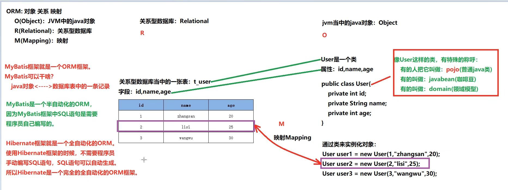

# 一、MyBatis概述

## 1.1 框架

- 在文献中看到的framework被翻译为框架
- Java常用框架：
  - SSM三大框架：Spring + SpringMVC + MyBatis
  - SpringBoot
  - SpringCloud
  - 等。。
- 框架其实就是对通用代码的封装，提前写好了一堆接口和类，我们可以在做项目的时候直接引入这些接口和类（引入框架），基于这些现有的接口和类进行开发，可以大大提高开发效率。
- 框架一般都以jar包的形式存在。(jar包中有class文件以及各种配置文件等。)
- SSM三大框架的学习顺序：MyBatis、Spring、SpringMVC（仅仅是建议）

## 1.2 三层架构


- 表现层（UI）：直接跟前端打交互（一是接收前端ajax请求，二是返回json数据给前端）
- 业务逻辑层（BLL）：一是处理表现层转发过来的前端请求（也就是具体业务），二是将从持久层获取的数据返回到表现层。
- 数据访问层（DAL）：直接操作数据库完成CRUD，并将获得的数据返回到上一层（也就是业务逻辑层）。
- Java持久层框架：
  - MyBatis
  - Hibernate（实现了JPA规范）
  - jOOQ
  - Guzz
  - Spring Data（实现了JPA规范）
  - ActiveJDBC
  - ......

## 1.3 JDBC不足

- 示例代码1：

```java
// ......
// sql语句写死在java程序中
String sql = "insert into t_user(id,idCard,username,password,birth,gender,email,city,street,zipcode,phone,grade) values(?,?,?,?,?,?,?,?,?,?,?,?)";
PreparedStatement ps = conn.prepareStatement(sql);
// 繁琐的赋值：思考一下，这种有规律的代码能不能通过反射机制来做自动化。
ps.setString(1, "1");
ps.setString(2, "123456789");
ps.setString(3, "zhangsan");
ps.setString(4, "123456");
ps.setString(5, "1980-10-11");
ps.setString(6, "男");
ps.setString(7, "zhangsan@126.com");
ps.setString(8, "北京");
ps.setString(9, "大兴区凉水河二街");
ps.setString(10, "1000000");
ps.setString(11, "16398574152");
ps.setString(12, "A");
// 执行SQL
int count = ps.executeUpdate();
// ......
```

- 示例代码2：

```java
// ......
// sql语句写死在java程序中
String sql = "select id,idCard,username,password,birth,gender,email,city,street,zipcode,phone,grade from t_user";
PreparedStatement ps = conn.prepareStatement(sql);
ResultSet rs = ps.executeQuery();
List<User> userList = new ArrayList<>();
// 思考以下循环中的所有代码是否可以使用反射进行自动化封装。
while(rs.next()){
    // 获取数据
    String id = rs.getString("id");
    String idCard = rs.getString("idCard");
    String username = rs.getString("username");
    String password = rs.getString("password");
    String birth = rs.getString("birth");
    String gender = rs.getString("gender");
    String email = rs.getString("email");
    String city = rs.getString("city");
    String street = rs.getString("street");
    String zipcode = rs.getString("zipcode");
    String phone = rs.getString("phone");
    String grade = rs.getString("grade");
    // 创建对象
    User user = new User();
    // 给对象属性赋值
    user.setId(id);
    user.setIdCard(idCard);
    user.setUsername(username);
    user.setPassword(password);
    user.setBirth(birth);
    user.setGender(gender);
    user.setEmail(email);
    user.setCity(city);
    user.setStreet(street);
    user.setZipcode(zipcode);
    user.setPhone(phone);
    user.setGrade(grade);
    // 添加到集合
    userList.add(user);
}
// ......
```

- JDBC不足：
  - SQL语句写死在Java程序中，不灵活。改SQL的话就要改Java代码。违背开闭原则OCP。
  - 给?传值是繁琐的。能不能自动化？？？
  - 将结果集封装成Java对象是繁琐的。能不能自动化？？？

## 1.4 了解MyBatis

- MyBatis本质上就是对JDBC的封装，通过MyBatis完成CRUD。

- **MyBatis在三层架构中负责持久层的，属于持久层框架。**

- MyBatis的发展历程：【引用百度百科】

  - MyBatis本是apache的一个开源项目iBatis，2010年这个项目由apache software foundation迁移到了google code，并且改名为MyBatis。2013年11月迁移到Github。
  - iBATIS一词来源于“internet”和“abatis”的组合，是一个基于Java的持久层框架。iBATIS提供的持久层框架包括SQL Maps和Data Access Objects（DAOs）。

- 打开mybatis代码可以看到它的包结构中包含：ibatis

  - 

- ORM：对象关系映射

  - O（Object）：Java虚拟机中的Java对象

  - R（Relational）：关系型数据库

  - M（Mapping）：将Java虚拟机中的Java对象映射到数据库表中一行记录，或是将数据库表中一行记录映射成Java虚拟机中的一个Java对象。

  - ORM图示

    

    - 
    - 

  - MyBatis属于**半自动化**ORM框架。sql语句程序员自己编写。

  - Hibernate属于**全自动化**的ORM框架。

- MyBatis框架特点：

  - 支持定制化 SQL、存储过程、基本映射以及高级映射
  - 避免了几乎所有的 JDBC 代码中手动设置参数以及获取结果集
  - 支持**XML开发**，也支持注解式开发。【为了保证sql语句的灵活，所以mybatis大部分是采用XML方式开发。】
  - 将接口和 Java 的 POJOs(Plain Ordinary Java Object，简单普通的Java对象)映射成数据库中的记录
  - 体积小好学：两个jar包，两个XML配置文件。
  - 完全做到sql解耦合。
  - 提供了基本映射标签。
  - 提供了高级映射标签。
  - 提供了XML标签，支持动态SQL的编写。
  - ......


# 二、MyBatis入门程序

只要你会JDBC，MyBatis就可以学。

## 2.1 版本

### 软件版本：

- IntelliJ IDEA：2022.1.4
- Navicat for MySQL：16.0.14
- MySQL数据库：8.0.30

### 组件版本：

- MySQL驱动：8.0.30
- MyBatis：3.5.10
- JDK：Java17
- JUnit：4.13.2
- Logback：1.2.11

## 2.2 MyBatis下载

- 从github上下载，地址：[https://github.com/mybatis/mybatis-3](https://github.com/mybatis/mybatis-3)
  - 
  - 
- 将框架以及框架的源码都下载下来，下载框架后解压，打开mybatis目录
  - 
  - 通过以上解压可以看到，框架一般都是以jar包的形式存在。我们的mybatis课程使用maven，所以这个jar我们不需要。
  - 官方手册需要。

## 2.3 MyBatis入门程序开发步骤

- 写代码前准备：
  - 准备数据库表：汽车表t_car，字段包括：
    - id：主键（自增）【bigint】
    - car_num：汽车编号【varchar】
    - brand：品牌【varchar】
    - guide_price：厂家指导价【decimal类型，专门为财务数据准备的类型】
    - produce_time：生产时间【char，年月日即可，10个长度，'2022-10-11'】
    - car_type：汽车类型（燃油车、电车、氢能源）【varchar】
  - 使用navicat for mysql工具建表
    - 
  - 使用navicat for mysql工具向t_car表中插入两条数据，如下：
    - 
  - 创建Project：建议创建Empty Project，设置Java版本以及编译版本等。
  - 设置IDEA的maven
  - 创建Module：普通的Maven Java模块
- 步骤1：打包方式：jar（不需要war，因为mybatis封装的是jdbc。）

```xml
<groupId>com.powernode</groupId>
<artifactId>mybatis-001-introduction</artifactId>
<version>1.0-SNAPSHOT</version>
<packaging>jar</packaging>
```

- 步骤2：引入依赖（mybatis依赖 + mysql驱动依赖）

```xml
<!--mybatis核心依赖-->
<dependency>
  <groupId>org.mybatis</groupId>
  <artifactId>mybatis</artifactId>
  <version>3.5.10</version>
</dependency>
<!--mysql驱动依赖-->
<dependency>
  <groupId>mysql</groupId>
  <artifactId>mysql-connector-java</artifactId>
  <version>8.0.30</version>
</dependency>
```

- 步骤3：在resources根目录下新建mybatis-config.xml配置文件（可以参考mybatis手册拷贝）

```xml
<?xml version="1.0" encoding="UTF-8" ?>
<!DOCTYPE configuration
        PUBLIC "-//mybatis.org//DTD Config 3.0//EN"
        "http://mybatis.org/dtd/mybatis-3-config.dtd">
<configuration>
    <environments default="development">
        <environment id="development">
            <transactionManager type="JDBC"/>
            <dataSource type="POOLED">
                <property name="driver" value="com.mysql.cj.jdbc.Driver"/>
                <property name="url" value="jdbc:mysql://localhost:3306/powernode"/>
                <property name="username" value="root"/>
                <property name="password" value="root"/>
            </dataSource>
        </environment>
    </environments>
    <mappers>
        <!--sql映射文件创建好之后，需要将该文件路径配置到这里-->
        <mapper resource=""/>
    </mappers>
</configuration>
```

注意1：mybatis核心配置文件的文件名不一定是mybatis-config.xml，可以是其它名字。
注意2：mybatis核心配置文件存放的位置也可以随意。这里选择放在resources根下，相当于放到了类的根路径下。

- 步骤4：在resources根目录下新建CarMapper.xml配置文件（可以参考mybatis手册拷贝）

```xml
<?xml version="1.0" encoding="UTF-8" ?>
<!DOCTYPE mapper
        PUBLIC "-//mybatis.org//DTD Mapper 3.0//EN"
        "http://mybatis.org/dtd/mybatis-3-mapper.dtd">
<!--namespace先随意写一个-->
<mapper namespace="car">
    <!--insert sql：保存一个汽车信息-->
    <insert id="insertCar">
        insert into t_car
            (id,car_num,brand,guide_price,produce_time,car_type) 
        values
            (null,'102','丰田mirai',40.30,'2014-10-05','氢能源')
    </insert>
</mapper>
```

注意1：**sql语句最后结尾可以不写“;”**
注意2：CarMapper.xml文件的名字不是固定的。可以使用其它名字。
注意3：CarMapper.xml文件的位置也是随意的。这里选择放在resources根下，相当于放到了类的根路径下。
注意4：将CarMapper.xml文件路径配置到mybatis-config.xml：

```xml
<mapper resource="CarMapper.xml"/>
```

- 步骤5：编写MyBatisIntroductionTest代码

```java
package com.powernode.mybatis;

import org.apache.ibatis.session.SqlSession;
import org.apache.ibatis.session.SqlSessionFactory;
import org.apache.ibatis.session.SqlSessionFactoryBuilder;

import java.io.InputStream;

/**
 * MyBatis入门程序
 * @author 老杜
 * @since 1.0
 * @version 1.0
 */
public class MyBatisIntroductionTest {
    public static void main(String[] args) {
        // 1. 创建SqlSessionFactoryBuilder对象
        SqlSessionFactoryBuilder sqlSessionFactoryBuilder = new SqlSessionFactoryBuilder();
        // 2. 创建SqlSessionFactory对象
        InputStream is = Thread.currentThread().getContextClassLoader().getResourceAsStream("mybatis-config.xml");
        SqlSessionFactory sqlSessionFactory = sqlSessionFactoryBuilder.build(is);
        // 3. 创建SqlSession对象
        SqlSession sqlSession = sqlSessionFactory.openSession();
        // 4. 执行sql
        int count = sqlSession.insert("insertCar"); // 这个"insertCar"必须是sql的id
        System.out.println("插入几条数据：" + count);
        // 5. 提交（mybatis默认采用的事务管理器是JDBC，默认是不提交的，需要手动提交。）
        sqlSession.commit();
        // 6. 关闭资源（只关闭是不会提交的）
        sqlSession.close();
    }
}
```

注意1：默认采用的事务管理器是：JDBC。JDBC事务默认是不提交的，需要手动提交。

- 步骤6：运行程序，查看运行结果，以及数据库表中的数据
  - 
  - 

## 2.4 关于MyBatis核心配置文件的名字和路径详解

- 核心配置文件的名字是随意的，因为以下的代码：

```java
// 文件名是出现在程序中的，文件名如果修改了，对应这里的java程序也改一下就行了。
InputStream is = Thread.currentThread().getContextClassLoader().getResourceAsStream("mybatis-config.xml");
```

- 核心配置文件必须放到resources下吗？放到D盘根目录下，可以吗？测试一下：

将mybatis-config.xml文件拷贝一份放到D盘根下，然后编写以下程序：

```java
package com.powernode.mybatis;

import org.apache.ibatis.session.SqlSession;
import org.apache.ibatis.session.SqlSessionFactory;
import org.apache.ibatis.session.SqlSessionFactoryBuilder;

import java.io.FileInputStream;
import java.io.InputStream;

/**
 * 测试mybatis核心配置文件路径问题
 * @author 老杜
 * @since 1.0
 * @version 1.0
 */
public class MyBatisConfigFilePath {
    public static void main(String[] args) throws Exception{
        // 1. 创建SqlSessionFactoryBuilder对象
        SqlSessionFactoryBuilder sqlSessionFactoryBuilder = new SqlSessionFactoryBuilder();
        // 2. 创建SqlSessionFactory对象
        // 这只是一个输入流，可以自己new。
        InputStream is = new FileInputStream("D:/mybatis-config.xml"); 
        SqlSessionFactory sqlSessionFactory = sqlSessionFactoryBuilder.build(is);
        // 3. 创建SqlSession对象
        SqlSession sqlSession = sqlSessionFactory.openSession();
        // 4. 执行sql
        int count = sqlSession.insert("insertCar");
        System.out.println("插入几条数据：" + count);
        // 5. 提交（mybatis默认采用的事务管理器是JDBC，默认是不提交的，需要手动提交。）
        sqlSession.commit();
        // 6. 关闭资源（只关闭是不会提交的）
        sqlSession.close();
    }
}
```

以上程序运行后，看到数据库表t_car中又新增一条数据，如下（成功了）：

经过测试说明mybatis核心配置文件的名字是随意的，存放路径也是随意的。
虽然mybatis核心配置文件的名字不是固定的，但通常该文件的名字叫做：mybatis-config.xml
虽然mybatis核心配置文件的路径不是固定的，但通常该文件会存放到**类路径**当中，这样让项目的移植更加健壮。

- 在mybatis中提供了一个类：Resources【org.apache.ibatis.io.Resources】，该类可以从类路径当中获取资源，我们通常使用它来获取输入流InputStream，代码如下

```java
// 这种方式只能从类路径当中获取资源，也就是说mybatis-config.xml文件需要在类路径下。
InputStream is = Resources.getResourceAsStream("mybatis-config.xml");
```

## 2.5 MyBatis第一个比较完整的代码写法

```java
package com.powernode.mybatis;

import org.apache.ibatis.io.Resources;
import org.apache.ibatis.session.SqlSession;
import org.apache.ibatis.session.SqlSessionFactory;
import org.apache.ibatis.session.SqlSessionFactoryBuilder;

import java.io.IOException;

/**
 * 比较完整的第一个mybatis程序写法
 * @author 老杜
 * @since 1.0
 * @version 1.0
 */
public class MyBatisCompleteCodeTest {
    public static void main(String[] args) {
        SqlSession sqlSession = null;
        try {
            // 1.创建SqlSessionFactoryBuilder对象
            SqlSessionFactoryBuilder sqlSessionFactoryBuilder = new SqlSessionFactoryBuilder();
            // 2.创建SqlSessionFactory对象
            SqlSessionFactory sqlSessionFactory = sqlSessionFactoryBuilder.build(Resources.getResourceAsStream("mybatis-config.xml"));
            // 3.创建SqlSession对象
            sqlSession = sqlSessionFactory.openSession();
            // 4.执行SQL
            int count = sqlSession.insert("insertCar");
            System.out.println("更新了几条记录：" + count);
            // 5.提交
            sqlSession.commit();
        } catch (Exception e) {
            // 回滚
            if (sqlSession != null) {
                sqlSession.rollback();
            }
            e.printStackTrace();
        } finally {
            // 6.关闭
            if (sqlSession != null) {
                sqlSession.close();
            }
        }
    }
}
```

运行后数据库表的变化：


## 2.6 引入JUnit

- JUnit是专门做单元测试的组件。
  - 在实际开发中，单元测试一般是由我们Java程序员来完成的。
  - 我们要对我们自己写的每一个业务方法负责任，要保证每个业务方法在进行测试的时候都能通过。
  - 测试的过程中涉及到两个概念：
    - 期望值
    - 实际值
  - 期望值和实际值相同表示测试通过，期望值和实际值不同则单元测试执行时会报错。
- 这里引入JUnit是为了代替main方法。
- 使用JUnit步骤：
  - 第一步：引入依赖

```xml
<!-- junit依赖 -->
<dependency>
    <groupId>junit</groupId>
    <artifactId>junit</artifactId>
    <version>4.13.2</version>
    <scope>test</scope>
</dependency>
```

   - 第二步：编写单元测试类【测试用例】，测试用例中每一个测试方法上使用@Test注解进行标注。
     - 测试用例的名字以及每个测试方法的定义都是有规范的：
       - 测试用例的名字：XxxTest
       - 测试方法声明格式：public void test业务方法名(){}

```java
// 测试用例
public class CarMapperTest{
    
    // 测试方法
    @Test
    public void testInsert(){}
    
    @Test
    public void testUpdate(){}
    
}
```

   - 第三步：可以在类上执行，也可以在方法上执行
     - 在类上执行时，该类中所有的测试方法都会执行。
     - 在方法上执行时，只执行当前的测试方法。
- 编写一个测试用例，来测试insertCar业务

```java
package com.powernode.mybatis;

import org.apache.ibatis.io.Resources;
import org.apache.ibatis.session.SqlSession;
import org.apache.ibatis.session.SqlSessionFactory;
import org.apache.ibatis.session.SqlSessionFactoryBuilder;
import org.junit.Test;

public class CarMapperTest {
    
    @Test
    public void testInsertCar(){
        SqlSession sqlSession = null;
        try {
            // 1.创建SqlSessionFactoryBuilder对象
            SqlSessionFactoryBuilder sqlSessionFactoryBuilder = new SqlSessionFactoryBuilder();
            // 2.创建SqlSessionFactory对象
            SqlSessionFactory sqlSessionFactory = sqlSessionFactoryBuilder.build(Resources.getResourceAsStream("mybatis-config.xml"));
            // 3.创建SqlSession对象
            sqlSession = sqlSessionFactory.openSession();
            // 4.执行SQL
            int count = sqlSession.insert("insertCar");
            System.out.println("更新了几条记录：" + count);
            // 5.提交
            sqlSession.commit();
        } catch (Exception e) {
            // 回滚
            if (sqlSession != null) {
                sqlSession.rollback();
            }
            e.printStackTrace();
        } finally {
            // 6.关闭
            if (sqlSession != null) {
                sqlSession.close();
            }
        }
    }
}
```

执行单元测试，查看数据库表的变化：


## 2.7 引入日志框架logback

- 引入日志框架的目的是为了看清楚mybatis执行的具体sql。
- 启用标准日志组件，只需要在mybatis-config.xml文件中添加以下配置：【可参考mybatis手册】

```xml
<settings>
  <setting name="logImpl" value="STDOUT_LOGGING" />
</settings>
```

标准日志也可以用，但是配置不够灵活，可以集成其他的日志组件，例如：log4j，logback等。

- logback是目前日志框架中性能较好的，较流行的，所以我们选它。
- 引入logback的步骤：
  - 第一步：引入logback相关依赖

```xml
<dependency>
  <groupId>ch.qos.logback</groupId>
  <artifactId>logback-classic</artifactId>
  <version>1.2.11</version>
  <scope>test</scope>
</dependency>
```

   - 第二步：引入logback相关配置文件（文件名叫做logback.xml或logback-test.xml，放到类路径当中）

```xml
<?xml version="1.0" encoding="UTF-8"?>

<configuration debug="false">
    <!-- 控制台输出 -->
    <appender name="STDOUT" class="ch.qos.logback.core.ConsoleAppender">
        <encoder class="ch.qos.logback.classic.encoder.PatternLayoutEncoder">
            <!--格式化输出：%d表示日期，%thread表示线程名，%-5level：级别从左显示5个字符宽度%msg：日志消息，%n是换行符-->
            <pattern>%d{yyyy-MM-dd HH:mm:ss.SSS} [%thread] %-5level %logger{50} - %msg%n</pattern>
        </encoder>
    </appender>
    <!-- 按照每天生成日志文件 -->
    <appender name="FILE" class="ch.qos.logback.core.rolling.RollingFileAppender">
        <rollingPolicy class="ch.qos.logback.core.rolling.TimeBasedRollingPolicy">
            <!--日志文件输出的文件名-->
            <FileNamePattern>${LOG_HOME}/TestWeb.log.%d{yyyy-MM-dd}.log</FileNamePattern>
            <!--日志文件保留天数-->
            <MaxHistory>30</MaxHistory>
        </rollingPolicy>
        <encoder class="ch.qos.logback.classic.encoder.PatternLayoutEncoder">
            <!--格式化输出：%d表示日期，%thread表示线程名，%-5level：级别从左显示5个字符宽度%msg：日志消息，%n是换行符-->
            <pattern>%d{yyyy-MM-dd HH:mm:ss.SSS} [%thread] %-5level %logger{50} - %msg%n</pattern>
        </encoder>
        <!--日志文件最大的大小-->
        <triggeringPolicy class="ch.qos.logback.core.rolling.SizeBasedTriggeringPolicy">
            <MaxFileSize>100MB</MaxFileSize>
        </triggeringPolicy>
    </appender>

    <!--mybatis log configure-->
    <logger name="com.apache.ibatis" level="TRACE"/>
    <logger name="java.sql.Connection" level="DEBUG"/>
    <logger name="java.sql.Statement" level="DEBUG"/>
    <logger name="java.sql.PreparedStatement" level="DEBUG"/>

    <!-- 日志输出级别,logback日志级别包括五个：TRACE < DEBUG < INFO < WARN < ERROR -->
    <root level="DEBUG">
        <appender-ref ref="STDOUT"/>
        <appender-ref ref="FILE"/>
    </root>

</configuration>
```

- 再次执行单元测试方法testInsertCar，查看控制台是否有sql语句输出
  - 

## 2.8 MyBatis工具类SqlSessionUtil的封装

- 每一次获取SqlSession对象代码太繁琐，封装一个工具类

```java
package com.powernode.mybatis.utils;

import org.apache.ibatis.io.Resources;
import org.apache.ibatis.session.SqlSession;
import org.apache.ibatis.session.SqlSessionFactory;
import org.apache.ibatis.session.SqlSessionFactoryBuilder;

/**
 * MyBatis工具类
 *
 * @author 老杜
 * @version 1.0
 * @since 1.0
 */
public class SqlSessionUtil {
    private static SqlSessionFactory sqlSessionFactory;

    /**
     * 类加载时初始化sqlSessionFactory对象
     */
    static {
        try {
            SqlSessionFactoryBuilder sqlSessionFactoryBuilder = new SqlSessionFactoryBuilder();
            sqlSessionFactory = sqlSessionFactoryBuilder.build(Resources.getResourceAsStream("mybatis-config.xml"));
        } catch (Exception e) {
            e.printStackTrace();
        }
    }

    /**
     * 每调用一次openSession()可获取一个新的会话，该会话支持自动提交。
     *
     * @return 新的会话对象
     */
    public static SqlSession openSession() {
        return sqlSessionFactory.openSession(true);
    }
}
```

- 测试工具类，将testInsertCar()改造

```java
@Test
public void testInsertCar(){
    SqlSession sqlSession = SqlSessionUtil.openSession();
    // 执行SQL
    int count = sqlSession.insert("insertCar");
    System.out.println("插入了几条记录:" + count);
    sqlSession.close();
}
```


# 三、使用MyBatis完成CRUD

- 准备工作
  - 创建module（Maven的普通Java模块）：mybatis-002-crud
  - pom.xml
    - 打包方式jar
    - 依赖：
      - mybatis依赖
      - mysql驱动依赖
      - junit依赖
      - logback依赖
  - mybatis-config.xml放在类的根路径下
  - CarMapper.xml放在类的根路径下
  - logback.xml放在类的根路径下
  - 提供com.powernode.mybatis.utils.SqlSessionUtil工具类
  - 创建测试用例：com.powernode.mybatis.CarMapperTest

## 3.1 insert（Create）

分析以下SQL映射文件中SQL语句存在的问题

```xml
<?xml version="1.0" encoding="UTF-8" ?>
<!DOCTYPE mapper
        PUBLIC "-//mybatis.org//DTD Mapper 3.0//EN"
        "http://mybatis.org/dtd/mybatis-3-mapper.dtd">

<!--namespace先随便写-->
<mapper namespace="car">
    <insert id="insertCar">
        insert into t_car(car_num,brand,guide_price,produce_time,car_type) values('103', '奔驰E300L', 50.3, '2022-01-01', '燃油车')
    </insert>
</mapper>
```

存在的问题是：SQL语句中的值不应该写死，值应该是用户提供的。之前的JDBC代码是这样写的：

```java
// JDBC中使用 ? 作为占位符。那么MyBatis中会使用什么作为占位符呢？
String sql = "insert into t_car(car_num,brand,guide_price,produce_time,car_type) values(?,?,?,?,?)";
// ......
// 给 ? 传值。那么MyBatis中应该怎么传值呢？
ps.setString(1,"103");
ps.setString(2,"奔驰E300L");
ps.setDouble(3,50.3);
ps.setString(4,"2022-01-01");
ps.setString(5,"燃油车");
```

在MyBatis中可以这样做：
**在Java程序中，将数据放到Map集合中**
**在sql语句中使用 #{map集合的key} 来完成传值，#{} 等同于JDBC中的 ? ，#{}就是占位符**
Java程序这样写：

```java
package com.powernode.mybatis;

import com.powernode.mybatis.utils.SqlSessionUtil;
import org.apache.ibatis.session.SqlSession;
import org.junit.Test;

import java.util.HashMap;
import java.util.Map;

/**
 * 测试MyBatis的CRUD
 * @author 老杜
 * @version 1.0
 * @since 1.0
 */
public class CarMapperTest {
    @Test
    public void testInsertCar(){
        // 准备数据
        Map<String, Object> map = new HashMap<>();
        map.put("k1", "103");
        map.put("k2", "奔驰E300L");
        map.put("k3", 50.3);
        map.put("k4", "2020-10-01");
        map.put("k5", "燃油车");
        // 获取SqlSession对象
        SqlSession sqlSession = SqlSessionUtil.openSession();
        // 执行SQL语句（使用map集合给sql语句传递数据）
        int count = sqlSession.insert("insertCar", map);
        System.out.println("插入了几条记录：" + count);
    }
}
```

SQL语句这样写：

```xml
<?xml version="1.0" encoding="UTF-8" ?>
<!DOCTYPE mapper
        PUBLIC "-//mybatis.org//DTD Mapper 3.0//EN"
        "http://mybatis.org/dtd/mybatis-3-mapper.dtd">

<!--namespace先随便写-->
<mapper namespace="car">
    <insert id="insertCar">
        insert into t_car(car_num,brand,guide_price,produce_time,car_type) values(#{k1},#{k2},#{k3},#{k4},#{k5})
    </insert>
</mapper>
```

**#{} 的里面必须填写map集合的key，不能随便写。**运行测试程序，查看数据库：

如果#{}里写的是map集合中不存在的key会有什么问题？

```xml
<?xml version="1.0" encoding="UTF-8" ?>
<!DOCTYPE mapper
        PUBLIC "-//mybatis.org//DTD Mapper 3.0//EN"
        "http://mybatis.org/dtd/mybatis-3-mapper.dtd">

<mapper namespace="car">
    <insert id="insertCar">
        insert into t_car(car_num,brand,guide_price,produce_time,car_type) values(#{kk},#{k2},#{k3},#{k4},#{k5})
    </insert>
</mapper>
```

运行程序：


通过测试，看到程序并没有报错。正常执行。不过 #{kk} 的写法导致无法获取到map集合中的数据，最终导致数据库表car_num插入了NULL。
在以上sql语句中，可以看到#{k1} #{k2} #{k3} #{k4} #{k5}的可读性太差，为了增强可读性，我们可以将Java程序做如下修改：

```java
Map<String, Object> map = new HashMap<>();
// 让key的可读性增强
map.put("carNum", "103");
map.put("brand", "奔驰E300L");
map.put("guidePrice", 50.3);
map.put("produceTime", "2020-10-01");
map.put("carType", "燃油车");
```

SQL语句做如下修改，这样可以增强程序的可读性：

```xml
<?xml version="1.0" encoding="UTF-8" ?>
<!DOCTYPE mapper
        PUBLIC "-//mybatis.org//DTD Mapper 3.0//EN"
        "http://mybatis.org/dtd/mybatis-3-mapper.dtd">
<mapper namespace="car">
    <insert id="insertCar">
        insert into t_car(car_num,brand,guide_price,produce_time,car_type) values(#{carNum},#{brand},#{guidePrice},#{produceTime},#{carType})
    </insert>
</mapper>
```

运行程序，查看数据库表：

使用Map集合可以传参，那使用**pojo**（简单普通的java对象）可以完成传参吗？测试一下：

- 第一步：定义一个pojo类Car，提供相关属性。

```java
package com.powernode.mybatis.pojo;

/**
 * POJOs，简单普通的Java对象。封装数据用的。
 * @author 老杜
 * @version 1.0
 * @since 1.0
 */
public class Car {
    private Long id;
    private String carNum;
    private String brand;
    private Double guidePrice;
    private String produceTime;
    private String carType;

    @Override
    public String toString() {
        return "Car{" +
                "id=" + id +
                ", carNum='" + carNum + '\'' +
                ", brand='" + brand + '\'' +
                ", guidePrice=" + guidePrice +
                ", produceTime='" + produceTime + '\'' +
                ", carType='" + carType + '\'' +
                '}';
    }

    public Car() {
    }

    public Car(Long id, String carNum, String brand, Double guidePrice, String produceTime, String carType) {
        this.id = id;
        this.carNum = carNum;
        this.brand = brand;
        this.guidePrice = guidePrice;
        this.produceTime = produceTime;
        this.carType = carType;
    }

    public Long getId() {
        return id;
    }

    public void setId(Long id) {
        this.id = id;
    }

    public String getCarNum() {
        return carNum;
    }

    public void setCarNum(String carNum) {
        this.carNum = carNum;
    }

    public String getBrand() {
        return brand;
    }

    public void setBrand(String brand) {
        this.brand = brand;
    }

    public Double getGuidePrice() {
        return guidePrice;
    }

    public void setGuidePrice(Double guidePrice) {
        this.guidePrice = guidePrice;
    }

    public String getProduceTime() {
        return produceTime;
    }

    public void setProduceTime(String produceTime) {
        this.produceTime = produceTime;
    }

    public String getCarType() {
        return carType;
    }

    public void setCarType(String carType) {
        this.carType = carType;
    }
}
```

- 第二步：Java程序

```java
@Test
public void testInsertCarByPOJO(){
    // 创建POJO，封装数据
    Car car = new Car();
    car.setCarNum("103");
    car.setBrand("奔驰C200");
    car.setGuidePrice(33.23);
    car.setProduceTime("2020-10-11");
    car.setCarType("燃油车");
    // 获取SqlSession对象
    SqlSession sqlSession = SqlSessionUtil.openSession();
    // 执行SQL，传数据
    int count = sqlSession.insert("insertCarByPOJO", car);
    System.out.println("插入了几条记录" + count);
}
```

- 第三步：SQL语句

```xml
<insert id="insertCarByPOJO">
  <!--#{} 里写的是POJO的属性名-->
  insert into t_car(car_num,brand,guide_price,produce_time,car_type) values(#{carNum},#{brand},#{guidePrice},#{produceTime},#{carType})
</insert>
```

- 运行程序，查看数据库表：


#{} 里写的是POJO的属性名，如果写成其他的会有问题吗？

```xml
<insert id="insertCarByPOJO">
  insert into t_car(car_num,brand,guide_price,produce_time,car_type) values(#{a},#{brand},#{guidePrice},#{produceTime},#{carType})
</insert>
```

运行程序，出现了以下异常：
错误信息中描述：在Car类中没有找到a属性的getter方法。
修改POJO类Car的代码，**只将getCarNum()方法名修改为getA()，其他代码不变**，如下：

再运行程序，查看数据库表中数据：

**经过测试得出结论：**
**如果采用map集合传参，#{} 里写的是map集合的key，如果key不存在不会报错，数据库表中会插入NULL。**
**如果采用POJO传参，#{} 里写的是get方法的方法名去掉get之后将剩下的单词首字母变小写（例如：getAge对应的是#{age}，getUserName对应的是#{userName})，如果这样的get方法不存在会报错。**
注意：其实传参数的时候有一个属性parameterType，这个属性用来指定传参的数据类型，不过这个属性是可以省略的

```xml
<insert id="insertCar" parameterType="java.util.Map">
  insert into t_car(car_num,brand,guide_price,produce_time,car_type) values(#{carNum},#{brand},#{guidePrice},#{produceTime},#{carType})
</insert>

<insert id="insertCarByPOJO" parameterType="com.powernode.mybatis.pojo.Car">
  insert into t_car(car_num,brand,guide_price,produce_time,car_type) values(#{carNum},#{brand},#{guidePrice},#{produceTime},#{carType})
</insert>
```

## 3.2 delete（Delete）

需求：根据car_num进行删除。
SQL语句这样写：

```xml
<delete id="deleteByCarNum">
  delete from t_car where car_num = #{SuiBianXie}
</delete>
```

Java程序这样写：

```java
@Test
public void testDeleteByCarNum(){
    // 获取SqlSession对象
    SqlSession sqlSession = SqlSessionUtil.openSession();
    // 执行SQL语句
    int count = sqlSession.delete("deleteByCarNum", "102");
    System.out.println("删除了几条记录：" + count);
}
```

运行结果：
**注意：当占位符只有一个的时候，${} 里面的内容可以随便写。**

## 3.3 update（Update）

需求：修改id=34的Car信息，car_num为102，brand为比亚迪汉，guide_price为30.23，produce_time为2018-09-10，car_type为电车
修改前：

SQL语句如下：

```xml
<update id="updateCarByPOJO">
  update t_car set 
    car_num = #{carNum}, brand = #{brand}, 
    guide_price = #{guidePrice}, produce_time = #{produceTime}, 
    car_type = #{carType} 
  where id = #{id}
</update>
```

Java代码如下：

```java
    @Test
    public void testUpdateCarByPOJO(){
        // 准备数据
        Car car = new Car();
        car.setId(34L);
        car.setCarNum("102");
        car.setBrand("比亚迪汉");
        car.setGuidePrice(30.23);
        car.setProduceTime("2018-09-10");
        car.setCarType("电车");
        // 获取SqlSession对象
        SqlSession sqlSession = SqlSessionUtil.openSession();
        // 执行SQL语句
        int count = sqlSession.update("updateCarByPOJO", car);
        System.out.println("更新了几条记录：" + count);
    }
```

运行结果：

当然了，如果使用**map**传数据也是可以的。

## 3.4 select（Retrieve）

select语句和其它语句不同的是：查询会有一个结果集。来看mybatis是怎么处理结果集的！！！

### 查询一条数据

需求：查询id为1的Car信息
SQL语句如下：

```xml
<select id="selectCarById">
  select * from t_car where id = #{id}
</select>
```

Java程序如下：

```java
@Test
public void testSelectCarById(){
    // 获取SqlSession对象
    SqlSession sqlSession = SqlSessionUtil.openSession();
    // 执行SQL语句
    Object car = sqlSession.selectOne("selectCarById", 1);
    System.out.println(car);
}
```

运行结果如下：

```java
### Error querying database.  Cause: org.apache.ibatis.executor.ExecutorException: 
    A query was run and no Result Maps were found for the Mapped Statement 'car.selectCarById'.  【翻译】：对于一个查询语句来说，没有找到查询的结果映射。
    It's likely that neither a Result Type nor a Result Map was specified.						 【翻译】：很可能既没有指定结果类型，也没有指定结果映射。
```

以上的异常大致的意思是：对于一个查询语句来说，你需要指定它的“结果类型”或者“结果映射”。
所以说，你想让mybatis查询之后返回一个Java对象的话，至少你要告诉mybatis返回一个什么类型的Java对象，可以在<select>标签中添加resultType属性，用来指定查询要转换的类型：

```xml
<select id="selectCarById" resultType="com.powernode.mybatis.pojo.Car">
  select * from t_car where id = #{id}
</select>
```

运行结果：
运行后之前的异常不再出现了，这说明添加了resultType属性之后，解决了之前的异常，可以看出resultType是不能省略的。
仔细观察控制台的日志信息，不难看出，结果查询出了一条。并且每个字段都查询到值了：Row: 1, 100, 宝马520Li, 41.00, 2022-09-01, 燃油车
但是奇怪的是返回的Car对象，只有id和brand两个属性有值，其它属性的值都是null，这是为什么呢？我们来观察一下查询结果列名和Car类的属性名是否能一一对应：
查询结果集的列名：id, car_num, brand, guide_price, produce_time, car_type
Car类的属性名：id, carNum, brand, guidePrice, produceTime, carType
通过观察发现：只有id和brand是一致的，其他字段名和属性名对应不上，这是不是导致null的原因呢？我们尝试在sql语句中使用as关键字来给查询结果列名起别名试试：

```xml
<select id="selectCarById" resultType="com.powernode.mybatis.pojo.Car">
  select 
    id, car_num as carNum, brand, guide_price as guidePrice, produce_time as produceTime, car_type as carType 
  from 
    t_car 
  where 
    id = #{id}
</select>
```

运行结果如下：

通过测试得知，如果当查询结果的字段名和java类的属性名对应不上的话，可以采用as关键字起别名，**当然还有其它解决方案，我们后面再看**。

### 查询多条数据

需求：查询所有的Car信息。
SQL语句如下：

```xml
<!--虽然结果是List集合，但是resultType属性需要指定的是List集合中元素的类型。-->
<select id="selectCarAll" resultType="com.powernode.mybatis.pojo.Car">
  <!--记得使用as起别名，让查询结果的字段名和java类的属性名对应上。-->
  select
    id, car_num as carNum, brand, guide_price as guidePrice, produce_time as produceTime, car_type as carType
  from
    t_car
</select>
```

Java代码如下：

```java
@Test
public void testSelectCarAll(){
    // 获取SqlSession对象
    SqlSession sqlSession = SqlSessionUtil.openSession();
    // 执行SQL语句
    List<Object> cars = sqlSession.selectList("selectCarAll");
    // 输出结果
    cars.forEach(car -> System.out.println(car));
}
```

运行结果如下：


## 3.5 关于SQL Mapper的namespace

在SQL Mapper配置文件中<mapper>标签的namespace属性可以翻译为命名空间，这个命名空间主要是为了防止sqlId冲突的。
创建CarMapper2.xml文件，代码如下：

```xml
<?xml version="1.0" encoding="UTF-8" ?>
<!DOCTYPE mapper
        PUBLIC "-//mybatis.org//DTD Mapper 3.0//EN"
        "http://mybatis.org/dtd/mybatis-3-mapper.dtd">

<mapper namespace="car2">
    <select id="selectCarAll" resultType="com.powernode.mybatis.pojo.Car">
        select
            id, car_num as carNum, brand, guide_price as guidePrice, produce_time as produceTime, car_type as carType
        from
            t_car
    </select>
</mapper>
```

不难看出，CarMapper.xml和CarMapper2.xml文件中都有 id="selectCarAll"
将CarMapper2.xml配置到mybatis-config.xml文件中。

```xml
<mappers>
  <mapper resource="CarMapper.xml"/>
  <mapper resource="CarMapper2.xml"/>
</mappers>
```

编写Java代码如下：

```java
@Test
public void testNamespace(){
    // 获取SqlSession对象
    SqlSession sqlSession = SqlSessionUtil.openSession();
    // 执行SQL语句
    List<Object> cars = sqlSession.selectList("selectCarAll");
    // 输出结果
    cars.forEach(car -> System.out.println(car));
}
```

运行结果如下：

```
org.apache.ibatis.exceptions.PersistenceException: 
### Error querying database.  Cause: java.lang.IllegalArgumentException: 
  selectCarAll is ambiguous in Mapped Statements collection (try using the full name including the namespace, or rename one of the entries) 
  【翻译】selectCarAll在Mapped Statements集合中不明确（请尝试使用包含名称空间的全名，或重命名其中一个条目）
  【大致意思是】selectCarAll重名了，你要么在selectCarAll前添加一个名称空间，要有你改个其它名字。
```

Java代码修改如下：

```java
@Test
public void testNamespace(){
    // 获取SqlSession对象
    SqlSession sqlSession = SqlSessionUtil.openSession();
    // 执行SQL语句
    //List<Object> cars = sqlSession.selectList("car.selectCarAll");
    List<Object> cars = sqlSession.selectList("car2.selectCarAll");
    // 输出结果
    cars.forEach(car -> System.out.println(car));
}
```

运行结果如下：


# 四、MyBatis核心配置文件详解

```xml
<?xml version="1.0" encoding="UTF-8" ?>
<!DOCTYPE configuration
        PUBLIC "-//mybatis.org//DTD Config 3.0//EN"
        "http://mybatis.org/dtd/mybatis-3-config.dtd">
<configuration>
    <environments default="development">
        <environment id="development">
            <transactionManager type="JDBC"/>
            <dataSource type="POOLED">
                <property name="driver" value="com.mysql.cj.jdbc.Driver"/>
                <property name="url" value="jdbc:mysql://localhost:3306/powernode"/>
                <property name="username" value="root"/>
                <property name="password" value="root"/>
            </dataSource>
        </environment>
    </environments>
    <mappers>
        <mapper resource="CarMapper.xml"/>
        <mapper resource="CarMapper2.xml"/>
    </mappers>
</configuration>
```

- configuration：根标签，表示配置信息。
- environments：环境（多个），以“s”结尾表示复数，也就是说mybatis的环境可以配置多个数据源。
  - default属性：表示默认使用的是哪个环境，default后面填写的是environment的id。**default的值只需要和environment的id值一致即可**。
- environment：具体的环境配置（**主要包括：事务管理器的配置 + 数据源的配置**）
  - id：给当前环境一个唯一标识，该标识用在environments的default后面，用来指定默认环境的选择。
- transactionManager：配置事务管理器
  - type属性：指定事务管理器具体使用什么方式，可选值包括两个
    - **JDBC**：使用JDBC原生的事务管理机制。**底层原理：事务开启conn.setAutoCommit(false); ...处理业务...事务提交conn.commit();**
    - **MANAGED**：交给其它容器来管理事务，比如WebLogic、JBOSS等。如果没有管理事务的容器，则没有事务。**没有事务的含义：只要执行一条DML语句，则提交一次**。
- dataSource：指定数据源
  - type属性：用来指定具体使用的数据库连接池的策略，可选值包括三个
    - **UNPOOLED**：采用传统的获取连接的方式，虽然也实现Javax.sql.DataSource接口，但是并没有使用池的思想。
      - property可以是：
        - driver 这是 JDBC 驱动的 Java 类全限定名。
        - url 这是数据库的 JDBC URL 地址。
        - username 登录数据库的用户名。
        - password 登录数据库的密码。
        - defaultTransactionIsolationLevel 默认的连接事务隔离级别。
        - defaultNetworkTimeout 等待数据库操作完成的默认网络超时时间（单位：毫秒）
    - **POOLED**：采用传统的javax.sql.DataSource规范中的连接池，mybatis中有针对规范的实现。
      - property可以是（除了包含**UNPOOLED**中之外）：
        - poolMaximumActiveConnections 在任意时间可存在的活动（正在使用）连接数量，默认值：10
        - poolMaximumIdleConnections 任意时间可能存在的空闲连接数。
        - 其它....
    - **JNDI**：采用服务器提供的JNDI技术实现，来获取DataSource对象，不同的服务器所能拿到DataSource是不一样。如果不是web或者maven的war工程，JNDI是不能使用的。
      - property可以是（最多只包含以下两个属性）：
        - initial_context 这个属性用来在 InitialContext 中寻找上下文（即，initialContext.lookup(initial_context)）这是个可选属性，如果忽略，那么将会直接从 InitialContext 中寻找 data_source 属性。
        - data_source 这是引用数据源实例位置的上下文路径。提供了 initial_context 配置时会在其返回的上下文中进行查找，没有提供时则直接在 InitialContext 中查找。
- mappers：在mappers标签中可以配置多个sql映射文件的路径。
- mapper：配置某个sql映射文件的路径
  - resource属性：使用相对于类路径的资源引用方式
  - url属性：使用完全限定资源定位符（URL）方式

## 4.1 environment

mybatis-003-configuration

```xml
<?xml version="1.0" encoding="UTF-8" ?>
<!DOCTYPE configuration
        PUBLIC "-//mybatis.org//DTD Config 3.0//EN"
        "http://mybatis.org/dtd/mybatis-3-config.dtd">
<configuration>
    <!--默认使用开发环境-->
    <!--<environments default="dev">-->
    <!--默认使用生产环境-->
    <environments default="production">
        <!--开发环境-->
        <environment id="dev">
            <transactionManager type="JDBC"/>
            <dataSource type="POOLED">
                <property name="driver" value="com.mysql.cj.jdbc.Driver"/>
                <property name="url" value="jdbc:mysql://localhost:3306/powernode"/>
                <property name="username" value="root"/>
                <property name="password" value="root"/>
            </dataSource>
        </environment>
        <!--生产环境-->
        <environment id="production">
            <transactionManager type="JDBC" />
            <dataSource type="POOLED">
                <property name="driver" value="com.mysql.cj.jdbc.Driver"/>
                <property name="url" value="jdbc:mysql://localhost:3306/mybatis"/>
                <property name="username" value="root"/>
                <property name="password" value="root"/>
            </dataSource>
        </environment>
    </environments>
    <mappers>
        <mapper resource="CarMapper.xml"/>
    </mappers>
</configuration>
```

```xml
<?xml version="1.0" encoding="UTF-8" ?>
<!DOCTYPE mapper
        PUBLIC "-//mybatis.org//DTD Mapper 3.0//EN"
        "http://mybatis.org/dtd/mybatis-3-mapper.dtd">

<mapper namespace="car">
    <insert id="insertCar">
        insert into t_car(id,car_num,brand,guide_price,produce_time,car_type) values(null,#{carNum},#{brand},#{guidePrice},#{produceTime},#{carType})
    </insert>
</mapper>
```

```java
package com.powernode.mybatis;

import com.powernode.mybatis.pojo.Car;
import org.apache.ibatis.io.Resources;
import org.apache.ibatis.session.SqlSession;
import org.apache.ibatis.session.SqlSessionFactory;
import org.apache.ibatis.session.SqlSessionFactoryBuilder;
import org.junit.Test;

public class ConfigurationTest {

    @Test
    public void testEnvironment() throws Exception{
        // 准备数据
        Car car = new Car();
        car.setCarNum("133");
        car.setBrand("丰田霸道");
        car.setGuidePrice(50.3);
        car.setProduceTime("2020-01-10");
        car.setCarType("燃油车");

        // 一个数据库对应一个SqlSessionFactory对象
        // 两个数据库对应两个SqlSessionFactory对象，以此类推
        SqlSessionFactoryBuilder sqlSessionFactoryBuilder = new SqlSessionFactoryBuilder();

        // 使用默认数据库
        SqlSessionFactory sqlSessionFactory = sqlSessionFactoryBuilder.build(Resources.getResourceAsStream("mybatis-config.xml"));
        SqlSession sqlSession = sqlSessionFactory.openSession(true);
        int count = sqlSession.insert("insertCar", car);
        System.out.println("插入了几条记录：" + count);

        // 使用指定数据库
        SqlSessionFactory sqlSessionFactory1 = sqlSessionFactoryBuilder.build(Resources.getResourceAsStream("mybatis-config.xml"), "dev");
        SqlSession sqlSession1 = sqlSessionFactory1.openSession(true);
        int count1 = sqlSession1.insert("insertCar", car);
        System.out.println("插入了几条记录：" + count1);
    }
}
```

执行结果：


## 4.2 transactionManager

```xml
<?xml version="1.0" encoding="UTF-8" ?>
<!DOCTYPE configuration
        PUBLIC "-//mybatis.org//DTD Config 3.0//EN"
        "http://mybatis.org/dtd/mybatis-3-config.dtd">
<configuration>
    <environments default="dev">
        <environment id="dev">
            <transactionManager type="MANAGED"/>
            <dataSource type="POOLED">
                <property name="driver" value="com.mysql.cj.jdbc.Driver"/>
                <property name="url" value="jdbc:mysql://localhost:3306/powernode"/>
                <property name="username" value="root"/>
                <property name="password" value="root"/>
            </dataSource>
        </environment>
    </environments>
    <mappers>
        <mapper resource="CarMapper.xml"/>
    </mappers>
</configuration>
```

```java
@Test
public void testTransactionManager() throws Exception{
    // 准备数据
    Car car = new Car();
    car.setCarNum("133");
    car.setBrand("丰田霸道");
    car.setGuidePrice(50.3);
    car.setProduceTime("2020-01-10");
    car.setCarType("燃油车");
    // 获取SqlSessionFactory对象
    SqlSessionFactoryBuilder sqlSessionFactoryBuilder = new SqlSessionFactoryBuilder();
    SqlSessionFactory sqlSessionFactory = sqlSessionFactoryBuilder.build(Resources.getResourceAsStream("mybatis-config2.xml"));
    // 获取SqlSession对象
    SqlSession sqlSession = sqlSessionFactory.openSession();
    // 执行SQL
    int count = sqlSession.insert("insertCar", car);
    System.out.println("插入了几条记录：" + count);
}
```

当事务管理器是：JDBC

- 采用JDBC的原生事务机制：
  - 开启事务：conn.setAutoCommit(false);
  - 处理业务......
  - 提交事务：conn.commit();

当事务管理器是：MANAGED

- 交给容器去管理事务，但目前使用的是本地程序，没有容器的支持，**当mybatis找不到容器的支持时：没有事务**。也就是说只要执行一条DML语句，则提交一次。

## 4.3 dataSource

```xml
<?xml version="1.0" encoding="UTF-8" ?>
<!DOCTYPE configuration
        PUBLIC "-//mybatis.org//DTD Config 3.0//EN"
        "http://mybatis.org/dtd/mybatis-3-config.dtd">
<configuration>
    <environments default="dev">
        <environment id="dev">
            <transactionManager type="JDBC"/>
            <dataSource type="UNPOOLED">
                <property name="driver" value="com.mysql.cj.jdbc.Driver"/>
                <property name="url" value="jdbc:mysql://localhost:3306/powernode"/>
                <property name="username" value="root"/>
                <property name="password" value="root"/>
            </dataSource>
        </environment>
    </environments>
    <mappers>
        <mapper resource="CarMapper.xml"/>
    </mappers>
</configuration>
```

```java
@Test
public void testDataSource() throws Exception{
    // 准备数据
    Car car = new Car();
    car.setCarNum("133");
    car.setBrand("丰田霸道");
    car.setGuidePrice(50.3);
    car.setProduceTime("2020-01-10");
    car.setCarType("燃油车");
    // 获取SqlSessionFactory对象
    SqlSessionFactoryBuilder sqlSessionFactoryBuilder = new SqlSessionFactoryBuilder();
    SqlSessionFactory sqlSessionFactory = sqlSessionFactoryBuilder.build(Resources.getResourceAsStream("mybatis-config3.xml"));
    // 获取SqlSession对象
    SqlSession sqlSession = sqlSessionFactory.openSession(true);
    // 执行SQL
    int count = sqlSession.insert("insertCar", car);
    System.out.println("插入了几条记录：" + count);
    // 关闭会话
    sqlSession.close();
}
```

当type是UNPOOLED，控制台输出：

修改配置文件mybatis-config3.xml中的配置：

```xml
<dataSource type="POOLED">
```

Java测试程序不需要修改，直接执行，看控制台输出：

通过测试得出：UNPOOLED不会使用连接池，每一次都会新建JDBC连接对象。POOLED会使用数据库连接池。【这个连接池是mybatis自己实现的。】

```xml
<dataSource type="JNDI">
```

JNDI的方式：表示对接JNDI服务器中的连接池。这种方式给了我们可以使用第三方连接池的接口。如果想使用dbcp、c3p0、druid（德鲁伊）等，需要使用这种方式。
这种再重点说一下type="POOLED"的时候，它的属性有哪些？

```xml
<?xml version="1.0" encoding="UTF-8" ?>
<!DOCTYPE configuration
        PUBLIC "-//mybatis.org//DTD Config 3.0//EN"
        "http://mybatis.org/dtd/mybatis-3-config.dtd">
<configuration>
    <environments default="dev">
        <environment id="dev">
            <transactionManager type="JDBC"/>
            <dataSource type="POOLED">
                <property name="driver" value="com.mysql.cj.jdbc.Driver"/>
                <property name="url" value="jdbc:mysql://localhost:3306/powernode"/>
                <property name="username" value="root"/>
                <property name="password" value="root"/>
                <!--最大连接数-->
                <property name="poolMaximumActiveConnections" value="3"/>
                <!--这是一个底层设置，如果获取连接花费了相当长的时间，连接池会打印状态日志并重新尝试获取一个连接（避免在误配置的情况下一直失败且不打印日志），默认值：20000 毫秒（即 20 秒）。-->
                <property name="poolTimeToWait" value="20000"/>
                <!--强行回归池的时间-->
                <property name="poolMaximumCheckoutTime" value="20000"/>
                <!--最多空闲数量-->
                <property name="poolMaximumIdleConnections" value="1"/>
            </dataSource>
        </environment>
    </environments>
    <mappers>
        <mapper resource="CarMapper.xml"/>
    </mappers>
</configuration>
```

poolMaximumActiveConnections：最大的活动的连接数量。默认值10
poolMaximumIdleConnections：最大的空闲连接数量。默认值5
poolMaximumCheckoutTime：强行回归池的时间。默认值20秒。
poolTimeToWait：当无法获取到空闲连接时，每隔20秒打印一次日志，避免因代码配置有误，导致傻等。（时长是可以配置的）
当然，还有其他属性。对于连接池来说，以上几个属性比较重要。
最大的活动的连接数量就是连接池连接数量的上限。默认值10，如果有10个请求正在使用这10个连接，第11个请求只能等待空闲连接。
**最大的空闲连接数量。默认值5，如何已经有了5个空闲连接，当第6个连接要空闲下来的时候，连接池会选择关闭该连接对象。来减少数据库的开销。**
需要根据系统的并发情况，来合理调整连接池最大连接数以及最多空闲数量。充分发挥数据库连接池的性能。【可以根据实际情况进行测试，然后调整一个合理的数量。】
下图是默认配置：

在以上配置的基础之上，可以编写java程序测试：

```java
@Test
public void testPool() throws Exception{
    SqlSessionFactoryBuilder sqlSessionFactoryBuilder = new SqlSessionFactoryBuilder();
    SqlSessionFactory sqlSessionFactory = sqlSessionFactoryBuilder.build(Resources.getResourceAsStream("mybatis-config3.xml"));
    for (int i = 0; i < 4; i++) {
        SqlSession sqlSession = sqlSessionFactory.openSession();
        Object selectCarByCarNum = sqlSession.selectOne("selectCarByCarNum");
    }
}
```

```xml
<select id="selectCarByCarNum" resultType="com.powernode.mybatis.pojo.Car">
  select id,car_num carNum,brand,guide_price guidePrice,produce_time produceTime,car_type carType from t_car where car_num = '100'
</select>
```


## 4.4 properties

mybatis提供了更加灵活的配置，连接数据库的信息可以单独写到一个属性资源文件中，假设在类的根路径下创建jdbc.properties文件，配置如下：

```properties
jdbc.driver=com.mysql.cj.jdbc.Driver
jdbc.url=jdbc:mysql://localhost:3306/powernode
```

在mybatis核心配置文件中引入并使用：

```xml
<?xml version="1.0" encoding="UTF-8" ?>
<!DOCTYPE configuration
        PUBLIC "-//mybatis.org//DTD Config 3.0//EN"
        "http://mybatis.org/dtd/mybatis-3-config.dtd">
<configuration>

    <!--引入外部属性资源文件-->
    <properties resource="jdbc.properties">
        <property name="jdbc.username" value="root"/>
        <property name="jdbc.password" value="root"/>
    </properties>

    <environments default="dev">
        <environment id="dev">
            <transactionManager type="JDBC"/>
            <dataSource type="POOLED">
                <!--${key}使用-->
                <property name="driver" value="${jdbc.driver}"/>
                <property name="url" value="${jdbc.url}"/>
                <property name="username" value="${jdbc.username}"/>
                <property name="password" value="${jdbc.password}"/>
            </dataSource>
        </environment>
    </environments>
    <mappers>
        <mapper resource="CarMapper.xml"/>
    </mappers>
</configuration>
```

编写Java程序进行测试：

```java
@Test
public void testProperties() throws Exception{
    SqlSessionFactoryBuilder sqlSessionFactoryBuilder = new SqlSessionFactoryBuilder();
    SqlSessionFactory sqlSessionFactory = sqlSessionFactoryBuilder.build(Resources.getResourceAsStream("mybatis-config4.xml"));
    SqlSession sqlSession = sqlSessionFactory.openSession();
    Object car = sqlSession.selectOne("selectCarByCarNum");
    System.out.println(car);
}
```

**properties两个属性：**
**resource：这个属性从类的根路径下开始加载。【常用的。】**
**url：从指定的url加载，假设文件放在d:/jdbc.properties，这个url可以写成：file:///d:/jdbc.properties。注意是三个斜杠哦。**
注意：如果不知道mybatis-config.xml文件中标签的编写顺序的话，可以有两种方式知道它的顺序：

- 第一种方式：查看dtd约束文件。
- 第二种方式：通过idea的报错提示信息。【一般采用这种方式】

## 4.5 mapper

mapper标签用来指定SQL映射文件的路径，包含多种指定方式，这里先主要看其中两种：
第一种：resource，从类的根路径下开始加载【比url常用】

```xml
<mappers>
  <mapper resource="CarMapper.xml"/>
</mappers>
```

如果是这样写的话，必须保证类的根下有CarMapper.xml文件。
如果类的根路径下有一个包叫做test，CarMapper.xml如果放在test包下的话，这个配置应该是这样写：

```xml
<mappers>
  <mapper resource="test/CarMapper.xml"/>
</mappers>
```

第二种：url，从指定的url位置加载
假设CarMapper.xml文件放在d盘的根下，这个配置就需要这样写：

```xml
<mappers>
  <mapper url="file:///d:/CarMapper.xml"/>
</mappers>
```

**mapper还有其他的指定方式，后面再看！！！**


# 五、手写MyBatis框架（掌握原理）

警示：该部分内容有难度，基础较弱的程序员可能有些部分是听不懂的，如果无法跟下来，可直接跳过，不影响后续知识点的学习。当然，如果你要能够跟下来，必然会让你加深对MyBatis框架的理解。
**我们给自己的框架起个名：GodBatis（起名灵感来源于：my god!!! 我的天呢！）**

## 5.1 dom4j解析XML文件

该部分内容不再赘述，不会解析XML的，请观看老杜前面讲解的dom4j解析XML文件的视频。
模块名：parse-xml-by-dom4j（普通的Java Maven模块）
第一步：引入dom4j的依赖

```xml
<?xml version="1.0" encoding="UTF-8"?>
<project xmlns="http://maven.apache.org/POM/4.0.0"
         xmlns:xsi="http://www.w3.org/2001/XMLSchema-instance"
         xsi:schemaLocation="http://maven.apache.org/POM/4.0.0 http://maven.apache.org/xsd/maven-4.0.0.xsd">
    <modelVersion>4.0.0</modelVersion>

    <groupId>org.group</groupId>
    <artifactId>parse-xml-by-dom4j</artifactId>
    <version>1.0-SNAPSHOT</version>
    <packaging>jar</packaging>

    <dependencies>
        <!--dom4j依赖-->
        <dependency>
            <groupId>org.dom4j</groupId>
            <artifactId>dom4j</artifactId>
            <version>2.1.3</version>
        </dependency>
        <!--jaxen依赖-->
        <dependency>
            <groupId>jaxen</groupId>
            <artifactId>jaxen</artifactId>
            <version>1.2.0</version>
        </dependency>
        <!--junit依赖-->
        <dependency>
            <groupId>junit</groupId>
            <artifactId>junit</artifactId>
            <version>4.13.2</version>
            <scope>test</scope>
        </dependency>
    </dependencies>

    <properties>
        <maven.compiler.source>17</maven.compiler.source>
        <maven.compiler.target>17</maven.compiler.target>
    </properties>

</project>
```

第二步：编写配置文件godbatis-config.xml

```xml
<?xml version="1.0" encoding="UTF-8" ?>

<configuration>
    <environments default="dev">
        <environment id="dev">
            <transactionManager type="JDBC"/>
            <dataSource type="POOLED">
                <property name="driver" value="com.mysql.cj.jdbc.Driver"/>
                <property name="url" value="jdbc:mysql://localhost:3306/powernode"/>
                <property name="username" value="root"/>
                <property name="password" value="root"/>
            </dataSource>
        </environment>
        <mappers>
            <mapper resource="sqlmapper.xml"/>
        </mappers>
    </environments>
</configuration>
```

第三步：解析godbatis-config.xml

```java
package com.powernode.dom4j;

import org.dom4j.Document;
import org.dom4j.Element;
import org.dom4j.Node;
import org.dom4j.io.SAXReader;
import org.junit.Test;

import java.util.HashMap;
import java.util.List;
import java.util.Map;

/**
 * 使用dom4j解析XML文件
 */
public class ParseXMLByDom4j {
    @Test
    public void testGodBatisConfig() throws Exception{

        // 读取xml，获取document对象
        SAXReader saxReader = new SAXReader();
        Document document = saxReader.read(Thread.currentThread().getContextClassLoader().getResourceAsStream("godbatis-config.xml"));

        // 获取<environments>标签的default属性的值
        Element environmentsElt = (Element)document.selectSingleNode("/configuration/environments");
        String defaultId = environmentsElt.attributeValue("default");
        System.out.println(defaultId);

        // 获取environment标签
        Element environmentElt = (Element)document.selectSingleNode("/configuration/environments/environment[@id='" + defaultId + "']");

        // 获取事务管理器类型
        Element transactionManager = environmentElt.element("transactionManager");
        String transactionManagerType = transactionManager.attributeValue("type");
        System.out.println(transactionManagerType);

        // 获取数据源类型
        Element dataSource = environmentElt.element("dataSource");
        String dataSourceType = dataSource.attributeValue("type");
        System.out.println(dataSourceType);

        // 将数据源信息封装到Map集合
        Map<String,String> dataSourceMap = new HashMap<>();
        dataSource.elements().forEach(propertyElt -> {
            dataSourceMap.put(propertyElt.attributeValue("name"), propertyElt.attributeValue("value"));
        });

        dataSourceMap.forEach((k, v) -> System.out.println(k + ":" + v));

        // 获取sqlmapper.xml文件的路径
        Element mappersElt = (Element) document.selectSingleNode("/configuration/environments/mappers");
        mappersElt.elements().forEach(mapper -> {
            System.out.println(mapper.attributeValue("resource"));
        });
    }
}
```

执行结果：

第四步：编写配置文件sqlmapper.xml

```xml
<?xml version="1.0" encoding="UTF-8" ?>

<mapper namespace="car">
    <insert id="insertCar">
        insert into t_car(id,car_num,brand,guide_price,produce_time,car_type) values(null,#{carNum},#{brand},#{guidePrice},#{produceTime},#{carType})
    </insert>
    <select id="selectCarByCarNum" resultType="com.powernode.mybatis.pojo.Car">
        select id,car_num carNum,brand,guide_price guidePrice,produce_time produceTime,car_type carType from t_car where car_num = #{carNum}
    </select>
</mapper>
```

第五步：解析sqlmapper.xml

```java
@Test
public void testSqlMapper() throws Exception{
    // 读取xml，获取document对象
    SAXReader saxReader = new SAXReader();
    Document document = saxReader.read(Thread.currentThread().getContextClassLoader().getResourceAsStream("sqlmapper.xml"));

    // 获取namespace
    Element mapperElt = (Element) document.selectSingleNode("/mapper");
    String namespace = mapperElt.attributeValue("namespace");
    System.out.println(namespace);

    // 获取sql id
    mapperElt.elements().forEach(statementElt -> {
        // 标签名
        String name = statementElt.getName();
        System.out.println("name:" + name);
        // 如果是select标签，还要获取它的resultType
        if ("select".equals(name)) {
            String resultType = statementElt.attributeValue("resultType");
            System.out.println("resultType:" + resultType);
        }
        // sql id
        String id = statementElt.attributeValue("id");
        System.out.println("sqlId:" + id);
        // sql语句
        String sql = statementElt.getTextTrim();
        System.out.println("sql:" + sql);
    });
}
```

执行结果：


## 5.2 GodBatis

手写框架之前，如果没有思路，可以先参考一下mybatis的客户端程序，通过客户端程序来逆推需要的类，参考代码：

```java
@Test
public void testInsert(){
    SqlSession sqlSession = null;
    try {
        // 1.创建SqlSessionFactoryBuilder对象
        SqlSessionFactoryBuilder sqlSessionFactoryBuilder = new SqlSessionFactoryBuilder();
        // 2.创建SqlSessionFactory对象
        SqlSessionFactory sqlSessionFactory = sqlSessionFactoryBuilder.build(Resources.getResourceAsStream("mybatis-config.xml"));
        // 3.创建SqlSession对象
        sqlSession = sqlSessionFactory.openSession();
        // 4.执行SQL
        Car car = new Car(null, "111", "宝马X7", "70.3", "2010-10-11", "燃油车");
        int count = sqlSession.insert("insertCar",car);
        System.out.println("更新了几条记录：" + count);
        // 5.提交
        sqlSession.commit();
    } catch (Exception e) {
        // 回滚
        if (sqlSession != null) {
            sqlSession.rollback();
        }
        e.printStackTrace();
    } finally {
        // 6.关闭
        if (sqlSession != null) {
            sqlSession.close();
        }
    }
}

@Test
public void testSelectOne(){
    SqlSession sqlSession = null;
    try {
        // 1.创建SqlSessionFactoryBuilder对象
        SqlSessionFactoryBuilder sqlSessionFactoryBuilder = new SqlSessionFactoryBuilder();
        // 2.创建SqlSessionFactory对象
        SqlSessionFactory sqlSessionFactory = sqlSessionFactoryBuilder.build(Resources.getResourceAsStream("mybatis-config.xml"));
        // 3.创建SqlSession对象
        sqlSession = sqlSessionFactory.openSession();
        // 4.执行SQL
        Car car = (Car)sqlSession.selectOne("selectCarByCarNum", "111");
        System.out.println(car);
        // 5.提交
        sqlSession.commit();
    } catch (Exception e) {
        // 回滚
        if (sqlSession != null) {
            sqlSession.rollback();
        }
        e.printStackTrace();
    } finally {
        // 6.关闭
        if (sqlSession != null) {
            sqlSession.close();
        }
    }
}
```

### 第一步：IDEA中创建模块

模块：godbatis（创建普通的Java Maven模块，打包方式jar），引入相关依赖

```xml
<?xml version="1.0" encoding="UTF-8"?>
<project xmlns="http://maven.apache.org/POM/4.0.0"
         xmlns:xsi="http://www.w3.org/2001/XMLSchema-instance"
         xsi:schemaLocation="http://maven.apache.org/POM/4.0.0 http://maven.apache.org/xsd/maven-4.0.0.xsd">
    <modelVersion>4.0.0</modelVersion>

    <groupId>org.god</groupId>
    <artifactId>godbatis</artifactId>
    <version>1.0.0</version>
    <packaging>jar</packaging>

    <dependencies>
        <!--dom4j依赖-->
        <dependency>
            <groupId>org.dom4j</groupId>
            <artifactId>dom4j</artifactId>
            <version>2.1.3</version>
        </dependency>
        <!--jaxen依赖-->
        <dependency>
            <groupId>jaxen</groupId>
            <artifactId>jaxen</artifactId>
            <version>1.2.0</version>
        </dependency>
        <!--junit依赖-->
        <dependency>
            <groupId>junit</groupId>
            <artifactId>junit</artifactId>
            <version>4.13.2</version>
            <scope>test</scope>
        </dependency>
    </dependencies>
    
    <properties>
        <maven.compiler.source>17</maven.compiler.source>
        <maven.compiler.target>17</maven.compiler.target>
    </properties>

</project>
```

### 第二步：资源工具类，方便获取指向配置文件的输入流

```java
package org.god.core;

import java.io.InputStream;

/**
 * 资源工具类
 * @author 老杜
 * @version 1.0
 * @since 1.0
 */
public class Resources {

    /**
     * 从类路径中获取配置文件的输入流
     * @param config
     * @return 输入流，该输入流指向类路径中的配置文件
     */
    public static InputStream getResourcesAsStream(String config){
        return Thread.currentThread().getContextClassLoader().getResourceAsStream(config);
    }
}
```

### 第三步：定义SqlSessionFactoryBuilder类

提供一个无参数构造方法，再提供一个build方法，该build方法要返回SqlSessionFactory对象

```java
package org.god.core;

import java.io.InputStream;

/**
 * SqlSessionFactory对象构建器
 * @author 老杜
 * @version 1.0
 * @since 1.0
 */
public class SqlSessionFactoryBuilder {

    /**
     * 创建构建器对象
     */
    public SqlSessionFactoryBuilder() {
    }


    /**
     * 获取SqlSessionFactory对象
     * 该方法主要功能是：读取godbatis核心配置文件，并构建SqlSessionFactory对象
     * @param inputStream 指向核心配置文件的输入流
     * @return SqlSessionFactory对象
     */
    public SqlSessionFactory build(InputStream inputStream){
        // 解析配置文件，创建数据源对象
        // 解析配置文件，创建事务管理器对象
        // 解析配置文件，获取所有的SQL映射对象
        // 将以上信息封装到SqlSessionFactory对象中
        // 返回
        return null;
    }
}
```

### 第四步：分析SqlSessionFactory类中有哪些属性

- 事务管理器
  - GodJDBCTransaction
- SQL映射对象集合
  - Map<String, GodMappedStatement>

### 第五步：定义GodJDBCTransaction

事务管理器最好是定义一个接口，然后每一个具体的事务管理器都实现这个接口。

```java
package org.god.core;

import java.sql.Connection;

/**
 * 事务管理器接口
 * @author 老杜
 * @version 1.0
 * @since 1.0
 */
public interface TransactionManager {
    /**
     * 提交事务
     */
    void commit();

    /**
     * 回滚事务
     */
    void rollback();

    /**
     * 关闭事务
     */
    void close();

    /**
     * 开启连接
     */
    void openConnection();
    
    /**
     * 获取连接对象
     * @return 连接对象
     */
    Connection getConnection();
}

```

```java
package org.god.core;

import javax.sql.DataSource;
import java.sql.Connection;
import java.sql.SQLException;

/**
 * 事务管理器
 * @author 老杜
 * @version 1.0
 * @since 1.0
 */
public class GodJDBCTransaction implements TransactionManager {
    /**
     * 连接对象，控制事务时需要
     */
    private Connection conn;

    /**
     * 数据源对象
     */
    private DataSource dataSource;

    /**
     * 自动提交标志：
     * true表示自动提交
     * false表示不自动提交
     */
    private boolean autoCommit;

    /**
     * 构造事务管理器对象
     * @param autoCommit
     */
    public GodJDBCTransaction(DataSource dataSource, boolean autoCommit) {
        this.dataSource = dataSource;
        this.autoCommit = autoCommit;
    }

    /**
     * 提交事务
     */
    public void commit(){
        try {
            conn.commit();
        } catch (SQLException e) {
            throw new RuntimeException(e);
        }
    }

    /**
     * 回滚事务
     */
    public void rollback(){
        try {
            conn.rollback();
        } catch (SQLException e) {
            throw new RuntimeException(e);
        }
    }

    @Override
    public void close() {
        try {
            conn.close();
        } catch (SQLException e) {
            throw new RuntimeException(e);
        }
    }

    @Override
    public void openConnection() {
        try {
            this.conn = dataSource.getConnection();
            this.conn.setAutoCommit(this.autoCommit);
        } catch (SQLException e) {
            throw new RuntimeException(e);
        }
    }

    @Override
    public Connection getConnection() {
        return conn;
    }
}
```

### 第六步：事务管理器中需要数据源，定义GodUNPOOLEDDataSource

```java
package org.god.core;

import java.io.PrintWriter;
import java.sql.Connection;
import java.sql.DriverManager;
import java.sql.SQLException;
import java.sql.SQLFeatureNotSupportedException;
import java.util.logging.Logger;

/**
 * 数据源实现类，不使用连接池
 * @author 老杜
 * @version 1.0
 * @since 1.0
 */
public class GodUNPOOLEDDataSource implements javax.sql.DataSource{
    private String url;
    private String username;
    private String password;

    public GodUNPOOLEDDataSource(String driver, String url, String username, String password) {
        try {
            // 注册驱动
            Class.forName(driver);
        } catch (ClassNotFoundException e) {
            throw new RuntimeException(e);
        }
        this.url = url;
        this.username = username;
        this.password = password;
    }

    @Override
    public Connection getConnection() throws SQLException {
        return DriverManager.getConnection(url, username, password);
    }

    @Override
    public Connection getConnection(String username, String password) throws SQLException {
        return null;
    }

    @Override
    public PrintWriter getLogWriter() throws SQLException {
        return null;
    }

    @Override
    public void setLogWriter(PrintWriter out) throws SQLException {

    }

    @Override
    public void setLoginTimeout(int seconds) throws SQLException {

    }

    @Override
    public int getLoginTimeout() throws SQLException {
        return 0;
    }

    @Override
    public Logger getParentLogger() throws SQLFeatureNotSupportedException {
        return null;
    }

    @Override
    public <T> T unwrap(Class<T> iface) throws SQLException {
        return null;
    }

    @Override
    public boolean isWrapperFor(Class<?> iface) throws SQLException {
        return false;
    }
}
```

### 第七步：定义GodMappedStatement

```java
package org.god.core;

/**
 * SQL映射实体类
 * @author 老杜
 * @version 1.0
 * @since 1.0
 */
public class GodMappedStatement {
    private String sqlId;
    private String resultType;
    private String sql;
    private String parameterType;

    private String sqlType;

    @Override
    public String toString() {
        return "GodMappedStatement{" +
                "sqlId='" + sqlId + '\'' +
                ", resultType='" + resultType + '\'' +
                ", sql='" + sql + '\'' +
                ", parameterType='" + parameterType + '\'' +
                ", sqlType='" + sqlType + '\'' +
                '}';
    }

    public String getSqlId() {
        return sqlId;
    }

    public void setSqlId(String sqlId) {
        this.sqlId = sqlId;
    }

    public String getResultType() {
        return resultType;
    }

    public void setResultType(String resultType) {
        this.resultType = resultType;
    }

    public String getSql() {
        return sql;
    }

    public void setSql(String sql) {
        this.sql = sql;
    }

    public String getParameterType() {
        return parameterType;
    }

    public void setParameterType(String parameterType) {
        this.parameterType = parameterType;
    }

    public String getSqlType() {
        return sqlType;
    }

    public void setSqlType(String sqlType) {
        this.sqlType = sqlType;
    }

    public GodMappedStatement(String sqlId, String resultType, String sql, String parameterType, String sqlType) {
        this.sqlId = sqlId;
        this.resultType = resultType;
        this.sql = sql;
        this.parameterType = parameterType;
        this.sqlType = sqlType;
    }
}


```

### 第八步：完善SqlSessionFactory类

```java
package org.god.core;

import javax.sql.DataSource;
import java.util.List;
import java.util.Map;

/**
 * SqlSession工厂对象，使用SqlSessionFactory可以获取会话对象
 * @author 老杜
 * @version 1.0
 * @since 1.0
 */
public class SqlSessionFactory {
    private TransactionManager transactionManager;
    private Map<String, GodMappedStatement> mappedStatements;

    public SqlSessionFactory(TransactionManager transactionManager, Map<String, GodMappedStatement> mappedStatements) {
        this.transactionManager = transactionManager;
        this.mappedStatements = mappedStatements;
    }

    public TransactionManager getTransactionManager() {
        return transactionManager;
    }

    public void setTransactionManager(TransactionManager transactionManager) {
        this.transactionManager = transactionManager;
    }

    public Map<String, GodMappedStatement> getMappedStatements() {
        return mappedStatements;
    }

    public void setMappedStatements(Map<String, GodMappedStatement> mappedStatements) {
        this.mappedStatements = mappedStatements;
    }
}


```

### 第九步：完善SqlSessionFactoryBuilder中的build方法

```java
package org.god.core;

import org.dom4j.Document;
import org.dom4j.DocumentException;
import org.dom4j.Element;
import org.dom4j.io.SAXReader;

import javax.sql.DataSource;
import java.io.InputStream;
import java.util.HashMap;
import java.util.Map;

/**
 * SqlSessionFactory对象构建器
 *
 * @author 老杜
 * @version 1.0
 * @since 1.0
 */
public class SqlSessionFactoryBuilder {

    /**
     * 创建构建器对象
     */
    public SqlSessionFactoryBuilder() {
    }


    /**
     * 获取SqlSessionFactory对象
     * 该方法主要功能是：读取godbatis核心配置文件，并构建SqlSessionFactory对象
     *
     * @param inputStream 指向核心配置文件的输入流
     * @return SqlSessionFactory对象
     */
    public SqlSessionFactory build(InputStream inputStream) throws DocumentException {
        SAXReader saxReader = new SAXReader();
        Document document = saxReader.read(inputStream);
        Element environmentsElt = (Element) document.selectSingleNode("/configuration/environments");
        String defaultEnv = environmentsElt.attributeValue("default");
        Element environmentElt = (Element) document.selectSingleNode("/configuration/environments/environment[@id='" + defaultEnv + "']");
        // 解析配置文件，创建数据源对象
        Element dataSourceElt = environmentElt.element("dataSource");
        DataSource dataSource = getDataSource(dataSourceElt);
        // 解析配置文件，创建事务管理器对象
        Element transactionManagerElt = environmentElt.element("transactionManager");
        TransactionManager transactionManager = getTransactionManager(transactionManagerElt, dataSource);
        // 解析配置文件，获取所有的SQL映射对象
        Element mappers = environmentsElt.element("mappers");
        Map<String, GodMappedStatement> mappedStatements = getMappedStatements(mappers);
        // 将以上信息封装到SqlSessionFactory对象中
        SqlSessionFactory sqlSessionFactory = new SqlSessionFactory(transactionManager, mappedStatements);
        // 返回
        return sqlSessionFactory;
    }

    private Map<String, GodMappedStatement> getMappedStatements(Element mappers) {
        Map<String, GodMappedStatement> mappedStatements = new HashMap<>();
        mappers.elements().forEach(mapperElt -> {
            try {
                String resource = mapperElt.attributeValue("resource");
                SAXReader saxReader = new SAXReader();
                Document document = saxReader.read(Resources.getResourcesAsStream(resource));
                Element mapper = (Element) document.selectSingleNode("/mapper");
                String namespace = mapper.attributeValue("namespace");

                mapper.elements().forEach(sqlMapper -> {
                    String sqlId = sqlMapper.attributeValue("id");
                    String sql = sqlMapper.getTextTrim();
                    String parameterType = sqlMapper.attributeValue("parameterType");
                    String resultType = sqlMapper.attributeValue("resultType");
                    String sqlType = sqlMapper.getName().toLowerCase();
                    // 封装GodMappedStatement对象
                    GodMappedStatement godMappedStatement = new GodMappedStatement(sqlId, resultType, sql, parameterType, sqlType);
                    mappedStatements.put(namespace + "." + sqlId, godMappedStatement);
                });

            } catch (DocumentException e) {
                throw new RuntimeException(e);
            }
        });
        return mappedStatements;
    }


    private TransactionManager getTransactionManager(Element transactionManagerElt, DataSource dataSource) {
        String type = transactionManagerElt.attributeValue("type").toUpperCase();
        TransactionManager transactionManager = null;
        if ("JDBC".equals(type)) {
            // 使用JDBC事务
            transactionManager = new GodJDBCTransaction(dataSource, false);
        } else if ("MANAGED".equals(type)) {
            // 事务管理器是交给JEE容器的
        }
        return transactionManager;
    }

    private DataSource getDataSource(Element dataSourceElt) {
        // 获取所有数据源的属性配置
        Map<String, String> dataSourceMap = new HashMap<>();
        dataSourceElt.elements().forEach(propertyElt -> {
            dataSourceMap.put(propertyElt.attributeValue("name"), propertyElt.attributeValue("value"));
        });

        String dataSourceType = dataSourceElt.attributeValue("type").toUpperCase();
        DataSource dataSource = null;
        if ("POOLED".equals(dataSourceType)) {

        } else if ("UNPOOLED".equals(dataSourceType)) {
            dataSource = new GodUNPOOLEDDataSource(dataSourceMap.get("driver"), dataSourceMap.get("url"), dataSourceMap.get("username"), dataSourceMap.get("password"));
        } else if ("JNDI".equals(dataSourceType)) {

        }
        return dataSource;
    }
}

```

### 第十步：在SqlSessionFactory中添加openSession方法

```java
public SqlSession openSession(){
    transactionManager.openConnection();
    SqlSession sqlSession = new SqlSession(transactionManager, mappedStatements);
    return sqlSession;
}
```

### 第十一步：编写SqlSession类中commit rollback close方法

```java
package org.god.core;

import java.sql.SQLException;
import java.util.Map;

/**
 * 数据库会话对象
 * @author 老杜
 * @version 1.0
 * @since 1.0
 */
public class SqlSession {
    private TransactionManager transactionManager;
    private Map<String, GodMappedStatement> mappedStatements;

    public SqlSession(TransactionManager transactionManager, Map<String, GodMappedStatement> mappedStatements) {
        this.transactionManager = transactionManager;
        this.mappedStatements = mappedStatements;
    }

    public void commit(){
        try {
            transactionManager.getConnection().commit();
        } catch (SQLException e) {
            throw new RuntimeException(e);
        }
    }

    public void rollback(){
        try {
            transactionManager.getConnection().rollback();
        } catch (SQLException e) {
            throw new RuntimeException(e);
        }
    }

    public void close(){
        try {
            transactionManager.getConnection().close();
        } catch (SQLException e) {
            throw new RuntimeException(e);
        }
    }
}

```

### 第十二步：编写SqlSession类中的insert方法

```java
/**
 * 插入数据
 *
 * @param sqlId 要执行的sqlId
 * @param obj   插入的数据
 * @return
 */
public int insert(String sqlId, Object obj) {
    GodMappedStatement godMappedStatement = mappedStatements.get(sqlId);
    Connection connection = transactionManager.getConnection();
    // 获取sql语句
    // insert into t_car(id,car_num,brand,guide_price,produce_time,car_type) values(null,#{carNum},#{brand},#{guidePrice},#{produceTime},#{carType})
    String godbatisSql = godMappedStatement.getSql();
    // insert into t_car(id,car_num,brand,guide_price,produce_time,car_type) values(null,?,?,?,?,?)
    String sql = godbatisSql.replaceAll("#\\{[a-zA-Z0-9_\\$]*}", "?");

    // 重点一步
    Map<Integer, String> map = new HashMap<>();
    int index = 1;
    while (godbatisSql.indexOf("#") >= 0) {
        int beginIndex = godbatisSql.indexOf("#") + 2;
        int endIndex = godbatisSql.indexOf("}");
        map.put(index++, godbatisSql.substring(beginIndex, endIndex).trim());
        godbatisSql = godbatisSql.substring(endIndex + 1);
    }

    final PreparedStatement ps;
    try {
        ps = connection.prepareStatement(sql);

        // 给?赋值
        map.forEach((k, v) -> {
            try {
                // 获取java实体类的get方法名
                String getMethodName = "get" + v.toUpperCase().charAt(0) + v.substring(1);
                Method getMethod = obj.getClass().getDeclaredMethod(getMethodName);
                ps.setString(k, getMethod.invoke(obj).toString());
            } catch (Exception e) {
                throw new RuntimeException(e);
            }
        });
        int count = ps.executeUpdate();
        ps.close();
        return count;
    } catch (Exception e) {
        throw new RuntimeException(e);
    }
}
```

### 第十三步：编写SqlSession类中的selectOne方法

```java
/**
 * 查询一个对象
 * @param sqlId
 * @param parameterObj
 * @return
 */
public Object selectOne(String sqlId, Object parameterObj){
    GodMappedStatement godMappedStatement = mappedStatements.get(sqlId);
    Connection connection = transactionManager.getConnection();
    // 获取sql语句
    String godbatisSql = godMappedStatement.getSql();
    String sql = godbatisSql.replaceAll("#\\{[a-zA-Z0-9_\\$]*}", "?");
    // 执行sql
    PreparedStatement ps = null;
    ResultSet rs = null;
    Object obj = null;
    try {
        ps = connection.prepareStatement(sql);
        ps.setString(1, parameterObj.toString());
        rs = ps.executeQuery();
        if (rs.next()) {
            // 将结果集封装对象，通过反射
            String resultType = godMappedStatement.getResultType();
            Class<?> aClass = Class.forName(resultType);
            Constructor<?> con = aClass.getDeclaredConstructor();
            obj = con.newInstance();
            // 给对象obj属性赋值
            ResultSetMetaData rsmd = rs.getMetaData();
            int columnCount = rsmd.getColumnCount();
            for (int i = 1; i <= columnCount; i++) {
                String columnName = rsmd.getColumnName(i);
                String setMethodName = "set" + columnName.toUpperCase().charAt(0) + columnName.substring(1);
                Method setMethod = aClass.getDeclaredMethod(setMethodName, aClass.getDeclaredField(columnName).getType());
                setMethod.invoke(obj, rs.getString(columnName));
            }
        }
    } catch (Exception e) {
        throw new RuntimeException(e);
    } finally {
        if (rs != null) {
            try {
                rs.close();
            } catch (SQLException e) {
                throw new RuntimeException(e);
            }
        }
        try {
            ps.close();
        } catch (SQLException e) {
            throw new RuntimeException(e);
        }
    }
    return obj;
}
```

## 5.3 GodBatis使用Maven打包


查看本地仓库中是否已经有jar包：


## 5.4 使用GodBatis

使用GodBatis就和使用MyBatis是一样的。
第一步：准备数据库表t_user

第二步：创建模块，普通的Java Maven模块：godbatis-test
第三步：引入依赖

```xml
<?xml version="1.0" encoding="UTF-8"?>
<project xmlns="http://maven.apache.org/POM/4.0.0"
         xmlns:xsi="http://www.w3.org/2001/XMLSchema-instance"
         xsi:schemaLocation="http://maven.apache.org/POM/4.0.0 http://maven.apache.org/xsd/maven-4.0.0.xsd">
  <modelVersion>4.0.0</modelVersion>
  
  <groupId>com.powernode</groupId>
  <artifactId>godbatis-test</artifactId>
  <version>1.0-SNAPSHOT</version>
  <packaging>jar</packaging>
  
  <dependencies>
    <!--godbatis依赖-->
    <dependency>
      <groupId>org.god</groupId>
      <artifactId>godbatis</artifactId>
      <version>1.0.0</version>
    </dependency>
    <!--mysql-->
    <dependency>
      <groupId>mysql</groupId>
      <artifactId>mysql-connector-java</artifactId>
      <version>8.0.30</version>
    </dependency>
    <!--junit-->
    <dependency>
      <groupId>junit</groupId>
      <artifactId>junit</artifactId>
      <version>4.13.2</version>
      <scope>test</scope>
    </dependency>
  </dependencies>
  
  <properties>
    <maven.compiler.source>17</maven.compiler.source>
    <maven.compiler.target>17</maven.compiler.target>
  </properties>
  
</project>
```

第四步：编写pojo类

```java
package com.powernode.godbatis.pojo;

public class User {
    private String id;
    private String name;
    private String email;
    private String address;

    @Override
    public String toString() {
        return "User{" +
                "id='" + id + '\'' +
                ", name='" + name + '\'' +
                ", email='" + email + '\'' +
                ", address='" + address + '\'' +
                '}';
    }

    public String getId() {
        return id;
    }

    public void setId(String id) {
        this.id = id;
    }

    public String getName() {
        return name;
    }

    public void setName(String name) {
        this.name = name;
    }

    public String getEmail() {
        return email;
    }

    public void setEmail(String email) {
        this.email = email;
    }

    public String getAddress() {
        return address;
    }

    public void setAddress(String address) {
        this.address = address;
    }

    public User() {
    }

    public User(String id, String name, String email, String address) {
        this.id = id;
        this.name = name;
        this.email = email;
        this.address = address;
    }
}

```

第五步：编写核心配置文件：godbatis-config.xml

```xml
<?xml version="1.0" encoding="UTF-8" ?>

<configuration>
    <environments default="dev">
        <environment id="dev">
            <transactionManager type="JDBC"/>
            <dataSource type="UNPOOLED">
                <property name="driver" value="com.mysql.cj.jdbc.Driver"/>
                <property name="url" value="jdbc:mysql://localhost:3306/powernode"/>
                <property name="username" value="root"/>
                <property name="password" value="root"/>
            </dataSource>
        </environment>
        <mappers>
            <mapper resource="UserMapper.xml"/>
        </mappers>
    </environments>
</configuration>
```

第六步：编写sql映射文件：UserMapper.xml

```xml
<?xml version="1.0" encoding="UTF-8" ?>

<mapper namespace="user">
    <insert id="insertUser">
        insert into t_user(id,name,email,address) values(#{id},#{name},#{email},#{address})
    </insert>
    <select id="selectUserById" resultType="com.powernode.godbatis.pojo.User">
        select * from t_user where id = #{id}
    </select>
</mapper>
```

第七步：编写测试类

```java
package com.powernode.godbatis.test;

import com.powernode.godbatis.pojo.User;
import org.god.core.Resources;
import org.god.core.SqlSession;
import org.god.core.SqlSessionFactory;
import org.god.core.SqlSessionFactoryBuilder;
import org.junit.Test;

public class GodBatisTest {
    
    @Test
    public void testInsertUser() throws Exception{
        User user = new User("1", "zhangsan", "zhangsan@1234.com", "北京大兴区");
        SqlSessionFactoryBuilder sqlSessionFactoryBuilder = new SqlSessionFactoryBuilder();
        SqlSessionFactory sqlSessionFactory = sqlSessionFactoryBuilder.build(Resources.getResourcesAsStream("godbatis-config.xml"));
        SqlSession sqlSession = sqlSessionFactory.openSession();
        int count = sqlSession.insert("user.insertUser", user);
        System.out.println("插入了几条记录：" + count);
        sqlSession.commit();
        sqlSession.close();
    }
    
    @Test
    public void testSelectUserById() throws Exception{
        SqlSessionFactoryBuilder sqlSessionFactoryBuilder = new SqlSessionFactoryBuilder();
        SqlSessionFactory sqlSessionFactory = sqlSessionFactoryBuilder.build(Resources.getResourcesAsStream("godbatis-config.xml"));
        SqlSession sqlSession = sqlSessionFactory.openSession();
        Object user = sqlSession.selectOne("user.selectUserById", "1");
        System.out.println(user);
        sqlSession.close();
    }
}

```

第八步：运行结果


## 5.5 总结MyBatis框架的重要实现原理

```xml
<?xml version="1.0" encoding="UTF-8" ?>

<mapper namespace="user">
  <insert id="insertUser">
    insert into t_user(id,name,email,address) values(#{id},#{name},#{email},#{address})
  </insert>
  <select id="selectUserById" resultType="com.powernode.godbatis.pojo.User">
    select id,name,email,address from t_user where id = #{id}
  </select>
</mapper>

```

思考两个问题：

- 为什么insert语句中 #{} 里填写的必须是属性名？
- 为什么select语句查询结果列名要属性名一致？


# 六、在WEB中应用MyBatis（使用MVC架构模式）

**目标：**

- 掌握mybatis在web应用中怎么用
- mybatis三大对象的作用域和生命周期
- ThreadLocal原理及使用
- 巩固MVC架构模式
- 为学习MyBatis的接口代理机制做准备

**实现功能：**

- 银行账户转账

**使用技术：**

- HTML + Servlet + MyBatis

**WEB应用的名称：**

- bank

## 6.1 需求描述


## 6.2 数据库表的设计和准备数据


## 6.3 实现步骤

### 第一步：环境搭建

- IDEA中创建Maven WEB应用（**mybatis-004-web**）


- IDEA配置Tomcat，这里Tomcat使用10+版本。并部署应用到tomcat。


- 默认创建的maven web应用没有java和resources目录，包括两种解决方案
  - 第一种：自己手动加上。


   - 第二种：修改maven-archetype-webapp-1.4.jar中的配置文件


- web.xml文件的版本较低，可以从tomcat10的样例文件中复制，然后修改

```xml
<?xml version="1.0" encoding="UTF-8"?>
<web-app xmlns="https://jakarta.ee/xml/ns/jakartaee"
         xmlns:xsi="http://www.w3.org/2001/XMLSchema-instance"
         xsi:schemaLocation="https://jakarta.ee/xml/ns/jakartaee
                      https://jakarta.ee/xml/ns/jakartaee/web-app_5_0.xsd"
         version="5.0"
         metadata-complete="true">

</web-app>
```

- 删除index.jsp文件，因为我们这个项目不使用JSP。只使用html。
- 确定pom.xml文件中的打包方式是war包。
- 引入相关依赖
  - 编译器版本修改为17
  - 引入的依赖包括：mybatis，mysql驱动，junit，logback，servlet。

```xml
<?xml version="1.0" encoding="UTF-8"?>

<project xmlns="http://maven.apache.org/POM/4.0.0" xmlns:xsi="http://www.w3.org/2001/XMLSchema-instance"
         xsi:schemaLocation="http://maven.apache.org/POM/4.0.0 http://maven.apache.org/xsd/maven-4.0.0.xsd">
    <modelVersion>4.0.0</modelVersion>

    <groupId>com.powernode</groupId>
    <artifactId>mybatis-004-web</artifactId>
    <version>1.0-SNAPSHOT</version>
    <packaging>war</packaging>

    <name>mybatis-004-web</name>
    <url>http://localhost:8080/bank</url>

    <properties>
        <project.build.sourceEncoding>UTF-8</project.build.sourceEncoding>
        <maven.compiler.source>17</maven.compiler.source>
        <maven.compiler.target>17</maven.compiler.target>
    </properties>

    <dependencies>
        <!--mybatis依赖-->
        <dependency>
            <groupId>org.mybatis</groupId>
            <artifactId>mybatis</artifactId>
            <version>3.5.10</version>
        </dependency>
        <!--mysql驱动依赖-->
        <dependency>
            <groupId>mysql</groupId>
            <artifactId>mysql-connector-java</artifactId>
            <version>8.0.30</version>
        </dependency>
        <!--junit依赖-->
        <dependency>
            <groupId>junit</groupId>
            <artifactId>junit</artifactId>
            <version>4.13.2</version>
            <scope>test</scope>
        </dependency>
        <!--logback依赖-->
        <dependency>
            <groupId>ch.qos.logback</groupId>
            <artifactId>logback-classic</artifactId>
            <version>1.2.11</version>
        </dependency>
        <!--servlet依赖-->
        <dependency>
            <groupId>jakarta.servlet</groupId>
            <artifactId>jakarta.servlet-api</artifactId>
            <version>5.0.0</version>
            <scope>provided</scope>
        </dependency>

    </dependencies>

    <build>
        <finalName>mybatis-004-web</finalName>
        <pluginManagement>
            <plugins>
                <plugin>
                    <artifactId>maven-clean-plugin</artifactId>
                    <version>3.1.0</version>
                </plugin>
                <plugin>
                    <artifactId>maven-resources-plugin</artifactId>
                    <version>3.0.2</version>
                </plugin>
                <plugin>
                    <artifactId>maven-compiler-plugin</artifactId>
                    <version>3.8.0</version>
                </plugin>
                <plugin>
                    <artifactId>maven-surefire-plugin</artifactId>
                    <version>2.22.1</version>
                </plugin>
                <plugin>
                    <artifactId>maven-war-plugin</artifactId>
                    <version>3.2.2</version>
                </plugin>
                <plugin>
                    <artifactId>maven-install-plugin</artifactId>
                    <version>2.5.2</version>
                </plugin>
                <plugin>
                    <artifactId>maven-deploy-plugin</artifactId>
                    <version>2.8.2</version>
                </plugin>
            </plugins>
        </pluginManagement>
    </build>
</project>

```

- 引入相关配置文件，放到resources目录下（全部放到类的根路径下）
  - mybatis-config.xml
  - AccountMapper.xml
  - logback.xml
  - jdbc.properties

```properties
jdbc.driver=com.mysql.cj.jdbc.Driver
jdbc.url=jdbc:mysql://localhost:3306/powernode
jdbc.username=root
jdbc.password=root
```

```xml
<?xml version="1.0" encoding="UTF-8" ?>
<!DOCTYPE configuration
        PUBLIC "-//mybatis.org//DTD Config 3.0//EN"
        "http://mybatis.org/dtd/mybatis-3-config.dtd">
<configuration>

    <properties resource="jdbc.properties"/>

    <environments default="dev">
        <environment id="dev">
            <transactionManager type="JDBC"/>
            <dataSource type="POOLED">
                <property name="driver" value="${jdbc.driver}"/>
                <property name="url" value="${jdbc.url}"/>
                <property name="username" value="${jdbc.username}"/>
                <property name="password" value="${jdbc.password}"/>
            </dataSource>
        </environment>
    </environments>
    <mappers>
        <!--一定要注意这里的路径哦！！！-->
        <mapper resource="AccountMapper.xml"/>
    </mappers>
</configuration>
```

```xml
<?xml version="1.0" encoding="UTF-8" ?>
<!DOCTYPE mapper
        PUBLIC "-//mybatis.org//DTD Mapper 3.0//EN"
        "http://mybatis.org/dtd/mybatis-3-mapper.dtd">

<mapper namespace="account">

</mapper>
```

### 第二步：前端页面index.html

```html
<!DOCTYPE html>
<html lang="en">
<head>
    <meta charset="UTF-8">
    <title>银行账户转账</title>
</head>
<body>
<!--/bank是应用的根，部署web应用到tomcat的时候一定要注意这个名字-->
<form action="/bank/transfer" method="post">
    转出账户：<input type="text" name="fromActno"/><br>
    转入账户：<input type="text" name="toActno"/><br>
    转账金额：<input type="text" name="money"/><br>
    <input type="submit" value="转账"/>
</form>
</body>
</html>
```

### 第三步：创建pojo包、service包、dao包、web包、utils包

- com.powernode.bank.pojo
- com.powernode.bank.service
- com.powernode.bank.service.impl
- com.powernode.bank.dao
- com.powernode.bank.dao.impl
- com.powernode.bank.web.controller
- com.powernode.bank.exception
- com.powernode.bank.utils：**将之前编写的SqlSessionUtil工具类拷贝到该包下。**

### 第四步：定义pojo类：Account

```java
package com.powernode.bank.pojo;

/**
 * 银行账户类
 * @author 老杜
 * @version 1.0
 * @since 1.0
 */
public class Account {
    private Long id;
    private String actno;
    private Double balance;

    @Override
    public String toString() {
        return "Account{" +
                "id=" + id +
                ", actno='" + actno + '\'' +
                ", balance=" + balance +
                '}';
    }

    public Account() {
    }

    public Account(Long id, String actno, Double balance) {
        this.id = id;
        this.actno = actno;
        this.balance = balance;
    }

    public Long getId() {
        return id;
    }

    public void setId(Long id) {
        this.id = id;
    }

    public String getActno() {
        return actno;
    }

    public void setActno(String actno) {
        this.actno = actno;
    }

    public Double getBalance() {
        return balance;
    }

    public void setBalance(Double balance) {
        this.balance = balance;
    }
}

```

### 第五步：编写AccountDao接口，以及AccountDaoImpl实现类

分析dao中至少要提供几个方法，才能完成转账：

- 转账前需要查询余额是否充足：selectByActno
- 转账时要更新账户：update

```java
package com.powernode.bank.dao;

import com.powernode.bank.pojo.Account;

/**
 * 账户数据访问对象
 * @author 老杜
 * @version 1.0
 * @since 1.0
 */
public interface AccountDao {

    /**
     * 根据账号获取账户信息
     * @param actno 账号
     * @return 账户信息
     */
    Account selectByActno(String actno);

    /**
     * 更新账户信息
     * @param act 账户信息
     * @return 1表示更新成功，其他值表示失败
     */
    int update(Account act);
}

```

```java
package com.powernode.bank.dao.impl;

import com.powernode.bank.dao.AccountDao;
import com.powernode.bank.pojo.Account;
import com.powernode.bank.utils.SqlSessionUtil;
import org.apache.ibatis.session.SqlSession;

public class AccountDaoImpl implements AccountDao {
    @Override
    public Account selectByActno(String actno) {
        SqlSession sqlSession = SqlSessionUtil.openSession();
        Account act = (Account)sqlSession.selectOne("selectByActno", actno);
        sqlSession.close();
        return act;
    }

    @Override
    public int update(Account act) {
        SqlSession sqlSession = SqlSessionUtil.openSession();
        int count = sqlSession.update("update", act);
        sqlSession.commit();
        sqlSession.close();
        return count;
    }
}

```

### 第六步：AccountDaoImpl中编写了mybatis代码，需要编写SQL映射文件了

```xml
<?xml version="1.0" encoding="UTF-8" ?>
<!DOCTYPE mapper
        PUBLIC "-//mybatis.org//DTD Mapper 3.0//EN"
        "http://mybatis.org/dtd/mybatis-3-mapper.dtd">

<mapper namespace="account">
    <select id="selectByActno" resultType="com.powernode.bank.pojo.Account">
        select * from t_act where actno = #{actno}
    </select>
    <update id="update">
        update t_act set balance = #{balance} where actno = #{actno}
    </update>
</mapper>
```

### 第七步：编写AccountService接口以及AccountServiceImpl

```java
package com.powernode.bank.exception;

/**
 * 余额不足异常
 * @author 老杜
 * @version 1.0
 * @since 1.0
 */
public class MoneyNotEnoughException extends Exception{
    public MoneyNotEnoughException(){}
    public MoneyNotEnoughException(String msg){ super(msg); }
}

```

```java
package com.powernode.bank.exception;

/**
 * 应用异常
 * @author 老杜
 * @version 1.0
 * @since 1.0
 */
public class AppException extends Exception{
    public AppException(){}
    public AppException(String msg){ super(msg); }
}

```

```java
package com.powernode.bank.service;

import com.powernode.bank.exception.AppException;
import com.powernode.bank.exception.MoneyNotEnoughException;

/**
 * 账户业务类。
 * @author 老杜
 * @version 1.0
 * @since 1.0
 */
public interface AccountService {

    /**
     * 银行账户转正
     * @param fromActno 转出账户
     * @param toActno 转入账户
     * @param money 转账金额
     * @throws MoneyNotEnoughException 余额不足异常
     * @throws AppException App发生异常
     */
    void transfer(String fromActno, String toActno, double money) throws MoneyNotEnoughException, AppException;
}

```

```java
package com.powernode.bank.service.impl;

import com.powernode.bank.dao.AccountDao;
import com.powernode.bank.dao.impl.AccountDaoImpl;
import com.powernode.bank.exception.AppException;
import com.powernode.bank.exception.MoneyNotEnoughException;
import com.powernode.bank.pojo.Account;
import com.powernode.bank.service.AccountService;

public class AccountServiceImpl implements AccountService {

    private AccountDao accountDao = new AccountDaoImpl();

    @Override
    public void transfer(String fromActno, String toActno, double money) throws MoneyNotEnoughException, AppException {
        // 查询转出账户的余额
        Account fromAct = accountDao.selectByActno(fromActno);
        if (fromAct.getBalance() < money) {
            throw new MoneyNotEnoughException("对不起，您的余额不足。");
        }
        try {
            // 程序如果执行到这里说明余额充足
            // 修改账户余额
            Account toAct = accountDao.selectByActno(toActno);
            fromAct.setBalance(fromAct.getBalance() - money);
            toAct.setBalance(toAct.getBalance() + money);
            // 更新数据库
            accountDao.update(fromAct);
            accountDao.update(toAct);
        } catch (Exception e) {
            throw new AppException("转账失败，未知原因！");
        }
    }
}

```

### 第八步：编写AccountController

```java
package com.powernode.bank.web.controller;

import com.powernode.bank.exception.AppException;
import com.powernode.bank.exception.MoneyNotEnoughException;
import com.powernode.bank.service.AccountService;
import com.powernode.bank.service.impl.AccountServiceImpl;

import javax.servlet.ServletException;
import javax.servlet.http.HttpServlet;
import javax.servlet.http.HttpServletRequest;
import javax.servlet.http.HttpServletResponse;
import java.io.IOException;
import java.io.PrintWriter;

/**
 * 账户控制器
 * @author 老杜
 * @version 1.0
 * @since 1.0
 */
@WebServlet("/transfer")
public class AccountController extends HttpServlet {

    private AccountService accountService = new AccountServiceImpl();

    @Override
    protected void doPost(HttpServletRequest request, HttpServletResponse response)
            throws ServletException, IOException {
        // 获取响应流
        response.setContentType("text/html;charset=UTF-8");
        PrintWriter out = response.getWriter();
        // 获取账户信息
        String fromActno = request.getParameter("fromActno");
        String toActno = request.getParameter("toActno");
        double money = Integer.parseInt(request.getParameter("money"));
        // 调用业务方法完成转账
        try {
            accountService.transfer(fromActno, toActno, money);
            out.print("<h1>转账成功！！！</h1>");
        } catch (MoneyNotEnoughException e) {
            out.print(e.getMessage());
        } catch (AppException e) {
            out.print(e.getMessage());
        }
    }
}

```

启动服务器，打开浏览器，输入地址：http://localhost:8080/bank，测试：


## 6.4 MyBatis对象作用域以及事务问题

### MyBatis核心对象的作用域

#### SqlSessionFactoryBuilder

这个类可以被实例化、使用和丢弃，一旦创建了 SqlSessionFactory，就不再需要它了。 因此 SqlSessionFactoryBuilder 实例的最佳作用域是方法作用域（也就是局部方法变量）。 你可以重用 SqlSessionFactoryBuilder 来创建多个 SqlSessionFactory 实例，但最好还是不要一直保留着它，以保证所有的 XML 解析资源可以被释放给更重要的事情。

#### SqlSessionFactory

SqlSessionFactory 一旦被创建就应该在应用的运行期间一直存在，没有任何理由丢弃它或重新创建另一个实例。 使用 SqlSessionFactory 的最佳实践是在应用运行期间不要重复创建多次，多次重建 SqlSessionFactory 被视为一种代码“坏习惯”。因此 SqlSessionFactory 的最佳作用域是应用作用域。 有很多方法可以做到，最简单的就是使用单例模式或者静态单例模式。

#### SqlSession

每个线程都应该有它自己的 SqlSession 实例。SqlSession 的实例不是线程安全的，因此是不能被共享的，所以它的最佳的作用域是请求或方法作用域。 绝对不能将 SqlSession 实例的引用放在一个类的静态域，甚至一个类的实例变量也不行。 也绝不能将 SqlSession 实例的引用放在任何类型的托管作用域中，比如 Servlet 框架中的 HttpSession。 如果你现在正在使用一种 Web 框架，考虑将 SqlSession 放在一个和 HTTP 请求相似的作用域中。 换句话说，每次收到 HTTP 请求，就可以打开一个 SqlSession，返回一个响应后，就关闭它。 这个关闭操作很重要，为了确保每次都能执行关闭操作，你应该把这个关闭操作放到 finally 块中。 下面的示例就是一个确保 SqlSession 关闭的标准模式：

```java
try (SqlSession session = sqlSessionFactory.openSession()) {
  // 你的应用逻辑代码
}
```

### 事务问题

在之前的转账业务中，更新了两个账户，我们需要保证它们的同时成功或同时失败，这个时候就需要使用事务机制，在transfer方法开始执行时开启事务，直到两个更新都成功之后，再提交事务，我们尝试将transfer方法进行如下修改：

```java
package com.powernode.bank.service.impl;

import com.powernode.bank.dao.AccountDao;
import com.powernode.bank.dao.impl.AccountDaoImpl;
import com.powernode.bank.exception.AppException;
import com.powernode.bank.exception.MoneyNotEnoughException;
import com.powernode.bank.pojo.Account;
import com.powernode.bank.service.AccountService;
import com.powernode.bank.utils.SqlSessionUtil;
import org.apache.ibatis.session.SqlSession;

public class AccountServiceImpl implements AccountService {

    private AccountDao accountDao = new AccountDaoImpl();

    @Override
    public void transfer(String fromActno, String toActno, double money) throws MoneyNotEnoughException, AppException {
        // 查询转出账户的余额
        Account fromAct = accountDao.selectByActno(fromActno);
        if (fromAct.getBalance() < money) {
            throw new MoneyNotEnoughException("对不起，您的余额不足。");
        }
        try {
            // 程序如果执行到这里说明余额充足
            // 修改账户余额
            Account toAct = accountDao.selectByActno(toActno);
            fromAct.setBalance(fromAct.getBalance() - money);
            toAct.setBalance(toAct.getBalance() + money);
            // 更新数据库（添加事务）
            SqlSession sqlSession = SqlSessionUtil.openSession();
            accountDao.update(fromAct);
            // 模拟异常
            String s = null;
            s.toString();
            accountDao.update(toAct);
            sqlSession.commit();
            sqlSession.close();
        } catch (Exception e) {
            throw new AppException("转账失败，未知原因！");
        }
    }
}

```

运行前注意看数据库表中当前的数据：

执行程序：


再次查看数据库表中的数据：

**傻眼了吧！！！事务出问题了，转账失败了，钱仍然是少了1万。这是什么原因呢？主要是因为service和dao中使用的SqlSession对象不是同一个。**
怎么办？为了保证service和dao中使用的SqlSession对象是同一个，可以将SqlSession对象存放到ThreadLocal当中。修改SqlSessionUtil工具类：

```java
package com.powernode.bank.utils;

import org.apache.ibatis.io.Resources;
import org.apache.ibatis.session.SqlSession;
import org.apache.ibatis.session.SqlSessionFactory;
import org.apache.ibatis.session.SqlSessionFactoryBuilder;

/**
 * MyBatis工具类
 *
 * @author 老杜
 * @version 1.0
 * @since 1.0
 */
public class SqlSessionUtil {
    private static SqlSessionFactory sqlSessionFactory;

    /**
     * 类加载时初始化sqlSessionFactory对象
     */
    static {
        try {
            SqlSessionFactoryBuilder sqlSessionFactoryBuilder = new SqlSessionFactoryBuilder();
            sqlSessionFactory = sqlSessionFactoryBuilder.build(Resources.getResourceAsStream("mybatis-config.xml"));
        } catch (Exception e) {
            e.printStackTrace();
        }
    }

    private static ThreadLocal<SqlSession> local = new ThreadLocal<>();

    /**
     * 每调用一次openSession()可获取一个新的会话，该会话支持自动提交。
     *
     * @return 新的会话对象
     */
    public static SqlSession openSession() {
        SqlSession sqlSession = local.get();
        if (sqlSession == null) {
            sqlSession = sqlSessionFactory.openSession();
            local.set(sqlSession);
        }
        return sqlSession;
    }

    /**
     * 关闭SqlSession对象
     * @param sqlSession
     */
    public static void close(SqlSession sqlSession){
        if (sqlSession != null) {
            sqlSession.close();
        }
        local.remove();
    }
}
```

修改dao中的方法：AccountDaoImpl中所有方法中的提交commit和关闭close代码全部删除。

```java
package com.powernode.bank.dao.impl;

import com.powernode.bank.dao.AccountDao;
import com.powernode.bank.pojo.Account;
import com.powernode.bank.utils.SqlSessionUtil;
import org.apache.ibatis.session.SqlSession;

public class AccountDaoImpl implements AccountDao {
    @Override
    public Account selectByActno(String actno) {
        SqlSession sqlSession = SqlSessionUtil.openSession();
        Account act = (Account)sqlSession.selectOne("account.selectByActno", actno);
        return act;
    }

    @Override
    public int update(Account act) {
        SqlSession sqlSession = SqlSessionUtil.openSession();
        int count = sqlSession.update("account.update", act);
        return count;
    }
}

```

修改service中的方法：

```java
package com.powernode.bank.service.impl;

import com.powernode.bank.dao.AccountDao;
import com.powernode.bank.dao.impl.AccountDaoImpl;
import com.powernode.bank.exception.AppException;
import com.powernode.bank.exception.MoneyNotEnoughException;
import com.powernode.bank.pojo.Account;
import com.powernode.bank.service.AccountService;
import com.powernode.bank.utils.SqlSessionUtil;
import org.apache.ibatis.session.SqlSession;

public class AccountServiceImpl implements AccountService {

    private AccountDao accountDao = new AccountDaoImpl();

    @Override
    public void transfer(String fromActno, String toActno, double money) throws MoneyNotEnoughException, AppException {
        // 查询转出账户的余额
        Account fromAct = accountDao.selectByActno(fromActno);
        if (fromAct.getBalance() < money) {
            throw new MoneyNotEnoughException("对不起，您的余额不足。");
        }
        try {
            // 程序如果执行到这里说明余额充足
            // 修改账户余额
            Account toAct = accountDao.selectByActno(toActno);
            fromAct.setBalance(fromAct.getBalance() - money);
            toAct.setBalance(toAct.getBalance() + money);
            // 更新数据库（添加事务）
            SqlSession sqlSession = SqlSessionUtil.openSession();
            accountDao.update(fromAct);
            // 模拟异常
            String s = null;
            s.toString();
            accountDao.update(toAct);
            sqlSession.commit();
            SqlSessionUtil.close(sqlSession);  // 只修改了这一行代码。
        } catch (Exception e) {
            throw new AppException("转账失败，未知原因！");
        }
    }
}

```

当前数据库表中的数据：

再次运行程序：


查看数据库表：没有问题。

再测试转账成功：


如果余额不足呢：


账户的余额依然正常：


## 6.5 分析当前程序存在的问题

我们来看一下DaoImpl的代码

```java
package com.powernode.bank.dao.impl;

import com.powernode.bank.dao.AccountDao;
import com.powernode.bank.pojo.Account;
import com.powernode.bank.utils.SqlSessionUtil;
import org.apache.ibatis.session.SqlSession;

public class AccountDaoImpl implements AccountDao {
    @Override
    public Account selectByActno(String actno) {
        SqlSession sqlSession = SqlSessionUtil.openSession();
        Account act = (Account)sqlSession.selectOne("account.selectByActno", actno);
        return act;
    }

    @Override
    public int update(Account act) {
        SqlSession sqlSession = SqlSessionUtil.openSession();
        int count = sqlSession.update("account.update", act);
        return count;
    }
}

```

我们不难发现，这个dao实现类中的方法代码很固定，基本上就是一行代码，通过SqlSession对象调用insert、delete、update、select等方法，这个类中的方法没有任何业务逻辑，既然是这样，**这个类我们能不能动态的生成**，以后可以不写这个类吗？答案：可以。


# 七、使用javassist生成类

来自百度百科：

> Javassist是一个开源的分析、编辑和创建Java字节码的类库。是由东京工业大学的数学和计算机科学系的 Shigeru Chiba （千叶 滋）所创建的。它已加入了开放源代码JBoss 应用服务器项目，通过使用Javassist对字节码操作为JBoss实现动态"AOP"框架。

## 7.1 Javassist的使用

我们要使用javassist，首先要引入它的依赖

```xml
<dependency>
  <groupId>org.javassist</groupId>
  <artifactId>javassist</artifactId>
  <version>3.29.1-GA</version>
</dependency>
```

样例代码：

```java
package com.powernode.javassist;

import javassist.ClassPool;
import javassist.CtClass;
import javassist.CtMethod;
import javassist.Modifier;

import java.lang.reflect.Method;

public class JavassistTest {
    public static void main(String[] args) throws Exception {
        // 获取类池
        ClassPool pool = ClassPool.getDefault();
        // 创建类
        CtClass ctClass = pool.makeClass("com.powernode.javassist.Test");
        // 创建方法
        // 1.返回值类型 2.方法名 3.形式参数列表 4.所属类
        CtMethod ctMethod = new CtMethod(CtClass.voidType, "execute", new CtClass[]{}, ctClass);
        // 设置方法的修饰符列表
        ctMethod.setModifiers(Modifier.PUBLIC);
        // 设置方法体
        ctMethod.setBody("{System.out.println(\"hello world\");}");
        // 给类添加方法
        ctClass.addMethod(ctMethod);
        // 调用方法
        Class<?> aClass = ctClass.toClass();
        Object o = aClass.newInstance();
        Method method = aClass.getDeclaredMethod("execute");
        method.invoke(o);
    }
}

```

运行要注意：加两个参数，要不然会有异常。

- --add-opens java.base/java.lang=ALL-UNNAMED
- --add-opens java.base/sun.net.util=ALL-UNNAMED


运行结果：


## 7.2 使用Javassist生成DaoImpl类

使用Javassist动态生成DaoImpl类

```java
package com.powernode.bank.utils;

import org.apache.ibatis.javassist.CannotCompileException;
import org.apache.ibatis.javassist.ClassPool;
import org.apache.ibatis.javassist.CtClass;
import org.apache.ibatis.javassist.CtMethod;
import org.apache.ibatis.session.SqlSession;

import java.lang.reflect.Constructor;
import java.lang.reflect.Method;
import java.lang.reflect.Modifier;
import java.util.Arrays;

/**
 * 使用javassist库动态生成dao接口的实现类
 *
 * @author 老杜
 * @version 1.0
 * @since 1.0
 */
public class GenerateDaoByJavassist {

    /**
     * 根据dao接口生成dao接口的代理对象
     *
     * @param sqlSession   sql会话
     * @param daoInterface dao接口
     * @return dao接口代理对象
     */
    public static Object getMapper(SqlSession sqlSession, Class daoInterface) {
        ClassPool pool = ClassPool.getDefault();
        // 生成代理类
        CtClass ctClass = pool.makeClass(daoInterface.getPackageName() + ".impl." + daoInterface.getSimpleName() + "Impl");
        // 接口
        CtClass ctInterface = pool.makeClass(daoInterface.getName());
        // 代理类实现接口
        ctClass.addInterface(ctInterface);
        // 获取所有的方法
        Method[] methods = daoInterface.getDeclaredMethods();
        Arrays.stream(methods).forEach(method -> {
            // 拼接方法的签名
            StringBuilder methodStr = new StringBuilder();
            String returnTypeName = method.getReturnType().getName();
            methodStr.append(returnTypeName);
            methodStr.append(" ");
            String methodName = method.getName();
            methodStr.append(methodName);
            methodStr.append("(");
            Class<?>[] parameterTypes = method.getParameterTypes();
            for (int i = 0; i < parameterTypes.length; i++) {
                methodStr.append(parameterTypes[i].getName());
                methodStr.append(" arg");
                methodStr.append(i);
                if (i != parameterTypes.length - 1) {
                    methodStr.append(",");
                }
            }
            methodStr.append("){");
            // 方法体当中的代码怎么写？
            // 获取sqlId（这里非常重要：因为这行代码导致以后namespace必须是接口的全限定接口名，sqlId必须是接口中方法的方法名。）
            String sqlId = daoInterface.getName() + "." + methodName;
            // 获取SqlCommondType
            String sqlCommondTypeName = sqlSession.getConfiguration().getMappedStatement(sqlId).getSqlCommandType().name();
            if ("SELECT".equals(sqlCommondTypeName)) {
                methodStr.append("org.apache.ibatis.session.SqlSession sqlSession = com.powernode.bank.utils.SqlSessionUtil.openSession();");
                methodStr.append("Object obj = sqlSession.selectOne(\"" + sqlId + "\", arg0);");
                methodStr.append("return (" + returnTypeName + ")obj;");
            } else if ("UPDATE".equals(sqlCommondTypeName)) {
                methodStr.append("org.apache.ibatis.session.SqlSession sqlSession = com.powernode.bank.utils.SqlSessionUtil.openSession();");
                methodStr.append("int count = sqlSession.update(\"" + sqlId + "\", arg0);");
                methodStr.append("return count;");
            }
            methodStr.append("}");
            System.out.println(methodStr);
            try {
                // 创建CtMethod对象
                CtMethod ctMethod = CtMethod.make(methodStr.toString(), ctClass);
                ctMethod.setModifiers(Modifier.PUBLIC);
                // 将方法添加到类
                ctClass.addMethod(ctMethod);
            } catch (CannotCompileException e) {
                throw new RuntimeException(e);
            }
        });
        try {
            // 创建代理对象
            Class<?> aClass = ctClass.toClass();
            Constructor<?> defaultCon = aClass.getDeclaredConstructor();
            Object o = defaultCon.newInstance();
            return o;
        } catch (Exception e) {
            throw new RuntimeException(e);
        }
    }
}
```

**修改AccountMapper.xml文件：namespace必须是dao接口的全限定名称，id必须是dao接口中的方法名：**

```xml
<?xml version="1.0" encoding="UTF-8" ?>
<!DOCTYPE mapper
        PUBLIC "-//mybatis.org//DTD Mapper 3.0//EN"
        "http://mybatis.org/dtd/mybatis-3-mapper.dtd">

<mapper namespace="com.powernode.bank.dao.AccountDao">
    <select id="selectByActno" resultType="com.powernode.bank.pojo.Account">
        select * from t_act where actno = #{actno}
    </select>
    <update id="update">
        update t_act set balance = #{balance} where actno = #{actno}
    </update>
</mapper>
```

修改service类中获取dao对象的代码：

启动服务器：**启动过程中显示，tomcat服务器自动添加了以下的两个运行参数。所以不需要再单独配置。**

测试前数据：

打开浏览器测试：


# 八、MyBatis中接口代理机制及使用

好消息！！！其实以上所讲内容mybatis内部已经实现了。直接调用以下代码即可获取dao接口的代理类：

```java
AccountDao accountDao = (AccountDao)sqlSession.getMapper(AccountDao.class);
```

使用以上代码的前提是：**AccountMapper.xml文件中的namespace必须和dao接口的全限定名称一致，id必须和dao接口中方法名一致。**
将service中获取dao对象的代码再次修改，如下：

测试前数据：

测试后数据：


# 九、MyBatis小技巧

## 9.1 #{}和${}

#{}：先编译sql语句，再给占位符传值，底层是PreparedStatement实现。可以防止sql注入，比较常用。
${}：先进行sql语句拼接，然后再编译sql语句，底层是Statement实现。存在sql注入现象。只有在需要进行sql语句关键字拼接的情况下才会用到。
需求：根据car_type查询汽车
模块名：mybatis-005-antic

### 使用#{}

依赖

```xml
<?xml version="1.0" encoding="UTF-8"?>
<project xmlns="http://maven.apache.org/POM/4.0.0"
         xmlns:xsi="http://www.w3.org/2001/XMLSchema-instance"
         xsi:schemaLocation="http://maven.apache.org/POM/4.0.0 http://maven.apache.org/xsd/maven-4.0.0.xsd">
    <modelVersion>4.0.0</modelVersion>

    <groupId>com.powernode</groupId>
    <artifactId>mybatis-005-antic</artifactId>
    <version>1.0-SNAPSHOT</version>
    <packaging>jar</packaging>

    <dependencies>
        <!--mybatis依赖-->
        <dependency>
            <groupId>org.mybatis</groupId>
            <artifactId>mybatis</artifactId>
            <version>3.5.10</version>
        </dependency>
        <!--mysql驱动依赖-->
        <dependency>
            <groupId>mysql</groupId>
            <artifactId>mysql-connector-java</artifactId>
            <version>8.0.30</version>
        </dependency>
        <!--junit依赖-->
        <dependency>
            <groupId>junit</groupId>
            <artifactId>junit</artifactId>
            <version>4.13.2</version>
            <scope>test</scope>
        </dependency>
        <!--logback依赖-->
        <dependency>
            <groupId>ch.qos.logback</groupId>
            <artifactId>logback-classic</artifactId>
            <version>1.2.11</version>
        </dependency>
    </dependencies>

    <properties>
        <maven.compiler.source>17</maven.compiler.source>
        <maven.compiler.target>17</maven.compiler.target>
    </properties>

</project>
```

jdbc.properties放在类的根路径下

```properties
jdbc.driver=com.mysql.cj.jdbc.Driver
jdbc.url=jdbc:mysql://localhost:3306/powernode
jdbc.username=root
jdbc.password=root
```

logback.xml，可以拷贝之前的，放到类的根路径下
utils

```java
package com.powernode.mybatis.utils;

import org.apache.ibatis.io.Resources;
import org.apache.ibatis.session.SqlSession;
import org.apache.ibatis.session.SqlSessionFactory;
import org.apache.ibatis.session.SqlSessionFactoryBuilder;

/**
 * MyBatis工具类
 *
 * @author 老杜
 * @version 1.0
 * @since 1.0
 */
public class SqlSessionUtil {
    private static SqlSessionFactory sqlSessionFactory;

    /**
     * 类加载时初始化sqlSessionFactory对象
     */
    static {
        try {
            SqlSessionFactoryBuilder sqlSessionFactoryBuilder = new SqlSessionFactoryBuilder();
            sqlSessionFactory = sqlSessionFactoryBuilder.build(Resources.getResourceAsStream("mybatis-config.xml"));
        } catch (Exception e) {
            e.printStackTrace();
        }
    }

    private static ThreadLocal<SqlSession> local = new ThreadLocal<>();

    /**
     * 每调用一次openSession()可获取一个新的会话，该会话支持自动提交。
     *
     * @return 新的会话对象
     */
    public static SqlSession openSession() {
        SqlSession sqlSession = local.get();
        if (sqlSession == null) {
            sqlSession = sqlSessionFactory.openSession();
            local.set(sqlSession);
        }
        return sqlSession;
    }

    /**
     * 关闭SqlSession对象
     * @param sqlSession
     */
    public static void close(SqlSession sqlSession){
        if (sqlSession != null) {
            sqlSession.close();
        }
        local.remove();
    }
}
```

pojo

```java
package com.powernode.mybatis.pojo;
/**
 * 普通实体类：汽车
 * @author 老杜
 * @version 1.0
 * @since 1.0
 */
public class Car {
    private Long id;
    private String carNum;
    private String brand;
    private Double guidePrice;
    private String produceTime;
    private String carType;
    // 构造方法
    // set get方法
    // toString方法
}
```

mapper接口

```java
package com.powernode.mybatis.mapper;

import com.powernode.mybatis.pojo.Car;

import java.util.List;

/**
 * Car的sql映射对象
 * @author 老杜
 * @version 1.0
 * @since 1.0
 */
public interface CarMapper {

    /**
     * 根据car_num获取Car
     * @param carType
     * @return
     */
    List<Car> selectByCarType(String carType);

}

```

mybatis-config.xml，放在类的根路径下

```xml
<?xml version="1.0" encoding="UTF-8" ?>
<!DOCTYPE configuration
        PUBLIC "-//mybatis.org//DTD Config 3.0//EN"
        "http://mybatis.org/dtd/mybatis-3-config.dtd">
<configuration>
    <properties resource="jdbc.properties"/>
    <environments default="dev">
        <environment id="dev">
            <transactionManager type="JDBC"/>
            <dataSource type="POOLED">
                <property name="driver" value="${jdbc.driver}"/>
                <property name="url" value="${jdbc.url}"/>
                <property name="username" value="${jdbc.username}"/>
                <property name="password" value="${jdbc.password}"/>
            </dataSource>
        </environment>
    </environments>
    <mappers>
        <mapper resource="CarMapper.xml"/>
    </mappers>
</configuration>
```

CarMapper.xml，放在类的根路径下：**注意namespace必须和接口名一致。id必须和接口中方法名一致**。

```xml
<?xml version="1.0" encoding="UTF-8" ?>
<!DOCTYPE mapper
        PUBLIC "-//mybatis.org//DTD Mapper 3.0//EN"
        "http://mybatis.org/dtd/mybatis-3-mapper.dtd">

<mapper namespace="com.powernode.mybatis.mapper.CarMapper">
    <select id="selectByCarType" resultType="com.powernode.mybatis.pojo.Car">
        select
            id,car_num as carNum,brand,guide_price as guidePrice,produce_time as produceTime,car_type as carType
        from
            t_car
        where
            car_type = #{carType}
    </select>
</mapper>
```

测试程序

```java
package com.powernode.mybatis.test;

import com.powernode.mybatis.mapper.CarMapper;
import com.powernode.mybatis.pojo.Car;
import com.powernode.mybatis.utils.SqlSessionUtil;
import org.junit.Test;

import java.util.List;

/**
 * CarMapper测试类
 * @author 老杜
 * @version 1.0
 * @since 1.0
 */
public class CarMapperTest {

    @Test
    public void testSelectByCarType(){
        CarMapper mapper = (CarMapper) SqlSessionUtil.openSession().getMapper(CarMapper.class);
        List<Car> cars = mapper.selectByCarType("燃油车");
        cars.forEach(car -> System.out.println(car));
    }
}

```

执行结果：

通过执行可以清楚的看到，sql语句中是带有 ? 的，这个 ? 就是大家在JDBC中所学的占位符，专门用来接收值的。
把“燃油车”以String类型的值，传递给 ? 
这就是 #{}，它会先进行sql语句的预编译，然后再给占位符传值

### 使用${}

同样的需求，我们使用${}来完成
CarMapper.xml文件修改如下：

```xml
<?xml version="1.0" encoding="UTF-8" ?>
<!DOCTYPE mapper
        PUBLIC "-//mybatis.org//DTD Mapper 3.0//EN"
        "http://mybatis.org/dtd/mybatis-3-mapper.dtd">

<mapper namespace="com.powernode.mybatis.mapper.CarMapper">
    <select id="selectByCarType" resultType="com.powernode.mybatis.pojo.Car">
        select
            id,car_num as carNum,brand,guide_price as guidePrice,produce_time as produceTime,car_type as carType
        from
            t_car
        where
            <!--car_type = #{carType}-->
            car_type = ${carType}
    </select>
</mapper>
```

再次运行测试程序：

出现异常了，这是为什么呢？看看生成的sql语句：

很显然，${} 是先进行sql语句的拼接，然后再编译，出现语法错误是正常的，因为 燃油车 是一个字符串，在sql语句中应该添加单引号
修改：

```xml
<?xml version="1.0" encoding="UTF-8" ?>
<!DOCTYPE mapper
        PUBLIC "-//mybatis.org//DTD Mapper 3.0//EN"
        "http://mybatis.org/dtd/mybatis-3-mapper.dtd">

<mapper namespace="com.powernode.mybatis.mapper.CarMapper">
    <select id="selectByCarType" resultType="com.powernode.mybatis.pojo.Car">
        select
            id,car_num as carNum,brand,guide_price as guidePrice,produce_time as produceTime,car_type as carType
        from
            t_car
        where
            <!--car_type = #{carType}-->
            <!--car_type = ${carType}-->
            car_type = '${carType}'
    </select>
</mapper>
```

再执行测试程序：

通过以上测试，可以看出，对于以上这种需求来说，还是建议使用 #{} 的方式。
原则：能用 #{} 就不用 ${}

### 什么情况下必须使用${}

当需要进行sql语句关键字拼接的时候。必须使用${}
需求：通过向sql语句中注入asc或desc关键字，来完成数据的升序或降序排列。

- **先使用#{}尝试：**

CarMapper接口：

```java
/**
 * 查询所有的Car
 * @param ascOrDesc asc或desc
 * @return
 */
List<Car> selectAll(String ascOrDesc);
```

CarMapper.xml文件：

```xml
<select id="selectAll" resultType="com.powernode.mybatis.pojo.Car">
  select
  id,car_num as carNum,brand,guide_price as guidePrice,produce_time as produceTime,car_type as carType
  from
  t_car
  order by carNum #{key}
</select>
```

测试程序

```java
@Test
public void testSelectAll(){
    CarMapper mapper = (CarMapper) SqlSessionUtil.openSession().getMapper(CarMapper.class);
    List<Car> cars = mapper.selectAll("desc");
    cars.forEach(car -> System.out.println(car));
}
```

运行：

报错的原因是sql语句不合法，因为采用这种方式传值，最终sql语句会是这样：
select id,car_num as carNum,brand,guide_price as guidePrice,produce_time as produceTime,car_type as carType from t_car order by carNum 'desc'
desc是一个关键字，不能带单引号的，所以在进行sql语句关键字拼接的时候，必须使用${}

- **使用${} 改造**

```xml
<select id="selectAll" resultType="com.powernode.mybatis.pojo.Car">
  select
  id,car_num as carNum,brand,guide_price as guidePrice,produce_time as produceTime,car_type as carType
  from
  t_car
  <!--order by carNum #{key}-->
  order by carNum ${key}
</select>
```

再次执行测试程序：


### 拼接表名

业务背景：实际开发中，有的表数据量非常庞大，可能会采用分表方式进行存储，比如每天生成一张表，表的名字与日期挂钩，例如：2022年8月1日生成的表：t_user20220108。2000年1月1日生成的表：t_user20000101。此时前端在进行查询的时候会提交一个具体的日期，比如前端提交的日期为：2000年1月1日，那么后端就会根据这个日期动态拼接表名为：t_user20000101。有了这个表名之后，将表名拼接到sql语句当中，返回查询结果。那么大家思考一下，拼接表名到sql语句当中应该使用#{} 还是 ${} 呢？
使用#{}会是这样：select * from 't_car'
使用${}会是这样：select * from t_car

```xml
<select id="selectAllByTableName" resultType="car">
  select
  id,car_num as carNum,brand,guide_price as guidePrice,produce_time as produceTime,car_type as carType
  from
  ${tableName}
</select>
```

```java
/**
 * 根据表名查询所有的Car
 * @param tableName
 * @return
 */
List<Car> selectAllByTableName(String tableName);
```

```java
@Test
public void testSelectAllByTableName(){
    CarMapper mapper = SqlSessionUtil.openSession().getMapper(CarMapper.class);
    List<Car> cars = mapper.selectAllByTableName("t_car");
    cars.forEach(car -> System.out.println(car));
}
```

执行结果：


### 批量删除

业务背景：一次删除多条记录。

对应的sql语句：

- delete from t_user where id = 1 or id = 2 or id = 3;
- delete from t_user where id in(1, 2, 3);

假设现在使用in的方式处理，前端传过来的字符串：1, 2, 3
如果使用mybatis处理，应该使用#{} 还是 ${}
使用#{} ：delete from t_user where id in('1,2,3') **执行错误：1292 - Truncated incorrect DOUBLE value: '1,2,3'**
使用${} ：delete from t_user where id in(1, 2, 3)

```java
/**
     * 根据id批量删除
     * @param ids
     * @return
     */
int deleteBatch(String ids);
```

```xml
<delete id="deleteBatch">
  delete from t_car where id in(${ids})
</delete>
```

```java
@Test
public void testDeleteBatch(){
    CarMapper mapper = SqlSessionUtil.openSession().getMapper(CarMapper.class);
    int count = mapper.deleteBatch("1,2,3");
    System.out.println("删除了几条记录：" + count);
    SqlSessionUtil.openSession().commit();
}
```

执行结果：


### 模糊查询

需求：查询奔驰系列的汽车。【只要品牌brand中含有奔驰两个字的都查询出来。】

#### 使用${}

```java
/**
     * 根据品牌进行模糊查询
     * @param likeBrank
     * @return
     */
List<Car> selectLikeByBrand(String likeBrank);
```

```xml
<select id="selectLikeByBrand" resultType="Car">
  select
  id,car_num as carNum,brand,guide_price as guidePrice,produce_time as produceTime,car_type as carType
  from
  t_car
  where
  brand like '%${brand}%'
</select>
```

```java
@Test
public void testSelectLikeByBrand(){
    CarMapper mapper = SqlSessionUtil.openSession().getMapper(CarMapper.class);
    List<Car> cars = mapper.selectLikeByBrand("奔驰");
    cars.forEach(car -> System.out.println(car));
}
```

执行结果：


#### 使用#{}

第一种：concat函数

```xml
<select id="selectLikeByBrand" resultType="Car">
  select
  id,car_num as carNum,brand,guide_price as guidePrice,produce_time as produceTime,car_type as carType
  from
  t_car
  where
  brand like concat('%',#{brand},'%')
</select>
```

执行结果：

第二种：双引号方式

```xml
<select id="selectLikeByBrand" resultType="Car">
  select
  id,car_num as carNum,brand,guide_price as guidePrice,produce_time as produceTime,car_type as carType
  from
  t_car
  where
  brand like "%"#{brand}"%"
</select>
```


## 9.2 typeAliases

我们来观察一下CarMapper.xml中的配置信息：

```xml
<?xml version="1.0" encoding="UTF-8" ?>
<!DOCTYPE mapper
        PUBLIC "-//mybatis.org//DTD Mapper 3.0//EN"
        "http://mybatis.org/dtd/mybatis-3-mapper.dtd">

<mapper namespace="com.powernode.mybatis.mapper.CarMapper">

    <select id="selectAll" resultType="com.powernode.mybatis.pojo.Car">
        select
            id,car_num as carNum,brand,guide_price as guidePrice,produce_time as produceTime,car_type as carType
        from
            t_car
        order by carNum ${key}
    </select>

    <select id="selectByCarType" resultType="com.powernode.mybatis.pojo.Car">
        select
            id,car_num as carNum,brand,guide_price as guidePrice,produce_time as produceTime,car_type as carType
        from
            t_car
        where
            car_type = '${carType}'
    </select>
</mapper>
```

resultType属性用来指定查询结果集的封装类型，这个名字太长，可以起别名吗？可以。
在mybatis-config.xml文件中使用typeAliases标签来起别名，包括两种方式：

### 第一种方式：typeAlias

```xml
<typeAliases>
  <typeAlias type="com.powernode.mybatis.pojo.Car" alias="Car"/>
</typeAliases>
```

- 首先要注意typeAliases标签的放置位置，如果不清楚的话，可以看看错误提示信息。
- typeAliases标签中的typeAlias可以写多个。
- typeAlias：
  - type属性：指定给哪个类起别名
  - alias属性：别名。
    - alias属性不是必须的，如果缺省的话，type属性指定的类型名的简类名作为别名。
    - alias是大小写不敏感的。也就是说假设alias="Car"，再用的时候，可以CAR，也可以car，也可以Car，都行。

### 第二种方式：package

如果一个包下的类太多，每个类都要起别名，会导致typeAlias标签配置较多，所以mybatis用提供package的配置方式，只需要指定包名，该包下的所有类都自动起别名，别名就是简类名。并且别名不区分大小写。

```xml
<typeAliases>
  <package name="com.powernode.mybatis.pojo"/>
</typeAliases>
```

package也可以配置多个的。

### 在SQL映射文件中用一下

```xml
<?xml version="1.0" encoding="UTF-8" ?>
<!DOCTYPE mapper
        PUBLIC "-//mybatis.org//DTD Mapper 3.0//EN"
        "http://mybatis.org/dtd/mybatis-3-mapper.dtd">

<mapper namespace="com.powernode.mybatis.mapper.CarMapper">

    <select id="selectAll" resultType="CAR">
        select
            id,car_num as carNum,brand,guide_price as guidePrice,produce_time as produceTime,car_type as carType
        from
            t_car
        order by carNum ${key}
    </select>

    <select id="selectByCarType" resultType="car">
        select
            id,car_num as carNum,brand,guide_price as guidePrice,produce_time as produceTime,car_type as carType
        from
            t_car
        where
            car_type = '${carType}'
    </select>
</mapper>
```

运行测试程序：正常。

## 9.3 mappers

SQL映射文件的配置方式包括四种：

- resource：从类路径中加载
- url：从指定的全限定资源路径中加载
- class：使用映射器接口实现类的完全限定类名
- package：将包内的映射器接口实现全部注册为映射器

### resource

这种方式是从类路径中加载配置文件，所以这种方式要求SQL映射文件必须放在resources目录下或其子目录下。

```xml
<mappers>
  <mapper resource="org/mybatis/builder/AuthorMapper.xml"/>
  <mapper resource="org/mybatis/builder/BlogMapper.xml"/>
  <mapper resource="org/mybatis/builder/PostMapper.xml"/>
</mappers>
```

### url

这种方式显然使用了绝对路径的方式，这种配置对SQL映射文件存放的位置没有要求，随意。

```xml
<mappers>
  <mapper url="file:///var/mappers/AuthorMapper.xml"/>
  <mapper url="file:///var/mappers/BlogMapper.xml"/>
  <mapper url="file:///var/mappers/PostMapper.xml"/>
</mappers>
```

### class

如果使用这种方式必须满足以下条件：

- SQL映射文件和mapper接口放在同一个目录下。
- SQL映射文件的名字也必须和mapper接口名一致。

```xml
<!-- 使用映射器接口实现类的完全限定类名 -->
<mappers>
  <mapper class="org.mybatis.builder.AuthorMapper"/>
  <mapper class="org.mybatis.builder.BlogMapper"/>
  <mapper class="org.mybatis.builder.PostMapper"/>
</mappers>
```

将CarMapper.xml文件移动到和mapper接口同一个目录下：

- 在resources目录下新建：com/powernode/mybatis/mapper【这里千万要注意：**不能这样新建 com.powernode.mybatis.dao**】
- 将CarMapper.xml文件移动到mapper目录下
- 修改mybatis-config.xml文件

```xml
<mappers>
  <mapper class="com.powernode.mybatis.mapper.CarMapper"/>
</mappers>
```

运行程序：正常！！！

### package

如果class较多，可以使用这种package的方式，但前提条件和上一种方式一样。

```xml
<!-- 将包内的映射器接口实现全部注册为映射器 -->
<mappers>
  <package name="com.powernode.mybatis.mapper"/>
</mappers>
```

## 9.4 idea配置文件模板

mybatis-config.xml和SqlMapper.xml文件可以在IDEA中提前创建好模板，以后通过模板创建配置文件。


## 9.5 插入数据时获取自动生成的主键

前提是：主键是自动生成的。
业务背景：一个用户有多个角色。

插入一条新的记录之后，自动生成了主键，而这个主键需要在其他表中使用时。
插入一个用户数据的同时需要给该用户分配角色：需要将生成的用户的id插入到角色表的user_id字段上。
第一种方式：可以先插入用户数据，再写一条查询语句获取id，然后再插入user_id字段。【比较麻烦】
第二种方式：mybatis提供了一种方式更加便捷。

```java
/**
     * 获取自动生成的主键
     * @param car
     */
void insertUseGeneratedKeys(Car car);
```

```xml
<insert id="insertUseGeneratedKeys" useGeneratedKeys="true" keyProperty="id">
  insert into t_car(id,car_num,brand,guide_price,produce_time,car_type) values(null,#{carNum},#{brand},#{guidePrice},#{produceTime},#{carType})
</insert>
```

```java
@Test
public void testInsertUseGeneratedKeys(){
    CarMapper mapper = SqlSessionUtil.openSession().getMapper(CarMapper.class);
    Car car = new Car();
    car.setCarNum("5262");
    car.setBrand("BYD汉");
    car.setGuidePrice(30.3);
    car.setProduceTime("2020-10-11");
    car.setCarType("新能源");
    mapper.insertUseGeneratedKeys(car);
    SqlSessionUtil.openSession().commit();
    System.out.println(car.getId());
}
```


# 十、MyBatis参数处理

模块名：mybatis-006-param
表：t_student

表中现有数据：

pojo类：

```java
package com.powernode.mybatis.pojo;

import java.util.Date;

/**
 * 学生类
 * @author 老杜
 * @version 1.0
 * @since 1.0
 */
public class Student {
    private Long id;
    private String name;
    private Integer age;
    private Double height;
    private Character sex;
    private Date birth;
    // constructor
    // setter and getter
    // toString
}
```

## 10.1 单个简单类型参数

简单类型包括：

- byte short int long float double char
- Byte Short Integer Long Float Double Character
- String
- java.util.Date
- java.sql.Date

需求：根据name查、根据id查、根据birth查、根据sex查

```java
package com.powernode.mybatis.mapper;

import com.powernode.mybatis.pojo.Student;

import java.util.Date;
import java.util.List;

/**
 * 学生数据Sql映射器
 * @author 老杜
 * @version 1.0
 * @since 1.0
 */
public interface StudentMapper {
    /**
     * 根据name查询
     * @param name
     * @return
     */
    List<Student> selectByName(String name);

    /**
     * 根据id查询
     * @param id
     * @return
     */
    Student selectById(Long id);

    /**
     * 根据birth查询
     * @param birth
     * @return
     */
    List<Student> selectByBirth(Date birth);

    /**
     * 根据sex查询
     * @param sex
     * @return
     */
    List<Student> selectBySex(Character sex);
}

```

```xml
<?xml version="1.0" encoding="UTF-8" ?>
<!DOCTYPE mapper
        PUBLIC "-//mybatis.org//DTD Mapper 3.0//EN"
        "http://mybatis.org/dtd/mybatis-3-mapper.dtd">

<mapper namespace="com.powernode.mybatis.mapper.StudentMapper">
    <select id="selectByName" resultType="student">
        select * from t_student where name = #{name}
    </select>
    <select id="selectById" resultType="student">
        select * from t_student where id = #{id}
    </select>
    <select id="selectByBirth" resultType="student">
        select * from t_student where birth = #{birth}
    </select>
    <select id="selectBySex" resultType="student">
        select * from t_student where sex = #{sex}
    </select>
</mapper>
```

```java
package com.powernode.mybatis.test;

import com.powernode.mybatis.mapper.StudentMapper;
import com.powernode.mybatis.pojo.Student;
import com.powernode.mybatis.utils.SqlSessionUtil;
import org.junit.Test;

import java.text.ParseException;
import java.text.SimpleDateFormat;
import java.util.Date;
import java.util.List;

public class StudentMapperTest {

    StudentMapper mapper = SqlSessionUtil.openSession().getMapper(StudentMapper.class);

    @Test
    public void testSelectByName(){
        List<Student> students = mapper.selectByName("张三");
        students.forEach(student -> System.out.println(student));
    }
    @Test
    public void testSelectById(){
        Student student = mapper.selectById(2L);
        System.out.println(student);
    }
    @Test
    public void testSelectByBirth(){
        try {
            Date birth = new SimpleDateFormat("yyyy-MM-dd").parse("2022-08-16");
            List<Student> students = mapper.selectByBirth(birth);
            students.forEach(student -> System.out.println(student));
        } catch (ParseException e) {
            throw new RuntimeException(e);
        }

    }
    @Test
    public void testSelectBySex(){
        List<Student> students = mapper.selectBySex('男');
        students.forEach(student -> System.out.println(student));
    }
}

```

通过测试得知，简单类型对于mybatis来说都是可以自动类型识别的：

- 也就是说对于mybatis来说，它是可以自动推断出ps.setXxxx()方法的。ps.setString()还是ps.setInt()。它可以自动推断。

其实SQL映射文件中的配置比较完整的写法是：

```xml
<select id="selectByName" resultType="student" parameterType="java.lang.String">
  select * from t_student where name = #{name, javaType=String, jdbcType=VARCHAR}
</select>
```

其中sql语句中的javaType，jdbcType，以及select标签中的parameterType属性，都是用来帮助mybatis进行类型确定的。不过这些配置多数是可以省略的。因为mybatis它有强大的自动类型推断机制。

- javaType：可以省略
- jdbcType：可以省略
- parameterType：可以省略

**如果参数只有一个的话，#{} 里面的内容就随便写了。对于 ${} 来说，注意加单引号。**

## 10.2 Map参数

需求：根据name和age查询

```java
/**
* 根据name和age查询
* @param paramMap
* @return
*/
List<Student> selectByParamMap(Map<String,Object> paramMap);
```

```java
@Test
public void testSelectByParamMap(){
    // 准备Map
    Map<String,Object> paramMap = new HashMap<>();
    paramMap.put("nameKey", "张三");
    paramMap.put("ageKey", 20);

    List<Student> students = mapper.selectByParamMap(paramMap);
    students.forEach(student -> System.out.println(student));
}
```

```xml
<select id="selectByParamMap" resultType="student">
  select * from t_student where name = #{nameKey} and age = #{ageKey}
</select>
```

测试运行正常。
**这种方式是手动封装Map集合，将每个条件以key和value的形式存放到集合中。然后在使用的时候通过#{map集合的key}来取值。**

## 10.3 实体类参数

需求：插入一条Student数据

```java
/**
 * 保存学生数据
 * @param student
 * @return
 */
int insert(Student student);
```

```xml
<insert id="insert">
  insert into t_student values(null,#{name},#{age},#{height},#{birth},#{sex})
</insert>
```

```java
@Test
public void testInsert(){
    Student student = new Student();
    student.setName("李四");
    student.setAge(30);
    student.setHeight(1.70);
    student.setSex('男');
    student.setBirth(new Date());
    int count = mapper.insert(student);
    SqlSessionUtil.openSession().commit();
}
```

运行正常，数据库中成功添加一条数据。
**这里需要注意的是：#{} 里面写的是属性名字。这个属性名其本质上是：set/get方法名去掉set/get之后的名字。**

## 10.4 多参数

需求：通过name和sex查询

```java
    /**
     * 根据name和sex查询
     * @param name
     * @param sex
     * @return
     */
    List<Student> selectByNameAndSex(String name, Character sex);
```

```java
@Test
public void testSelectByNameAndSex(){
    List<Student> students = mapper.selectByNameAndSex("张三", '女');
    students.forEach(student -> System.out.println(student));
}
```

```xml
<select id="selectByNameAndSex" resultType="student">
  select * from t_student where name = #{name} and sex = #{sex}
</select>
```

执行结果：

异常信息描述了：name参数找不到，可用的参数包括[arg1, arg0, param1, param2]
修改StudentMapper.xml配置文件：尝试使用[arg1, arg0, param1, param2]去参数

```xml
<select id="selectByNameAndSex" resultType="student">
  <!--select * from t_student where name = #{name} and sex = #{sex}-->
  select * from t_student where name = #{arg0} and sex = #{arg1}
</select>
```

运行结果：

再次尝试修改StudentMapper.xml文件

```xml
<select id="selectByNameAndSex" resultType="student">
  <!--select * from t_student where name = #{name} and sex = #{sex}-->
  <!--select * from t_student where name = #{arg0} and sex = #{arg1}-->
  <!--select * from t_student where name = #{param1} and sex = #{param2}-->
  select * from t_student where name = #{arg0} and sex = #{param2}
</select>
```

通过测试可以看到：

- arg0 是第一个参数
- param1是第一个参数
- arg1 是第二个参数
- param2是第二个参数

实现原理：**实际上在mybatis底层会创建一个map集合，以arg0/param1为key，以方法上的参数为value**，例如以下代码：

```java
Map<String,Object> map = new HashMap<>();
map.put("arg0", name);
map.put("arg1", sex);
map.put("param1", name);
map.put("param2", sex);

// 所以可以这样取值：#{arg0} #{arg1} #{param1} #{param2}
// 其本质就是#{map集合的key}
```

注意：**使用mybatis3.4.2之前的版本时：要用#{0}和#{1}这种形式。**

## 10.5 @Param注解（命名参数）

可以不用arg0 arg1 param1 param2吗？这个map集合的key我们自定义可以吗？当然可以。使用@Param注解即可。这样可以增强可读性。
需求：根据name和age查询

```java
    /**
     * 根据name和age查询
     * @param name
     * @param age
     * @return
     */
    List<Student> selectByNameAndAge(@Param(value="name") String name, @Param("age") int age);
```

```java
    @Test
    public void testSelectByNameAndAge(){
        List<Student> stus = mapper.selectByNameAndAge("张三", 20);
        stus.forEach(student -> System.out.println(student));
    }
```

```xml
<select id="selectByNameAndAge" resultType="student">
  select * from t_student where name = #{name} and age = #{age}
</select>
```

通过测试，一切正常。
核心：@Param("**这里填写的其实就是map集合的key**")

## 10.6 @Param源码分析


# 十一、MyBatis查询语句专题

模块名：mybatis-007-select
打包方式：jar
引入依赖：mysql驱动依赖、mybatis依赖、logback依赖、junit依赖。
引入配置文件：jdbc.properties、mybatis-config.xml、logback.xml
创建pojo类：Car
创建Mapper接口：CarMapper
创建Mapper接口对应的映射文件：com/powernode/mybatis/mapper/CarMapper.xml
创建单元测试：CarMapperTest
拷贝工具类：SqlSessionUtil

## 11.1 返回Car

当查询的结果，有对应的实体类，并且查询结果只有一条时：

```java
package com.powernode.mybatis.mapper;

import com.powernode.mybatis.pojo.Car;

/**
 * Car SQL映射器
 * @author 老杜
 * @version 1.0
 * @since 1.0
 */
public interface CarMapper {

    /**
     * 根据id主键查询：结果最多只有一条
     * @param id
     * @return
     */
    Car selectById(Long id);
}

```

```xml
<?xml version="1.0" encoding="UTF-8" ?>
<!DOCTYPE mapper
        PUBLIC "-//mybatis.org//DTD Mapper 3.0//EN"
        "http://mybatis.org/dtd/mybatis-3-mapper.dtd">

<mapper namespace="com.powernode.mybatis.mapper.CarMapper">
    <select id="selectById" resultType="Car">
        select id,car_num carNum,brand,guide_price guidePrice,produce_time produceTime,car_type carType from t_car where id = #{id}
    </select>
</mapper>
```

```java
package com.powernode.mybatis.test;

import com.powernode.mybatis.mapper.CarMapper;
import com.powernode.mybatis.pojo.Car;
import com.powernode.mybatis.utils.SqlSessionUtil;
import org.junit.Test;

public class CarMapperTest {

    @Test
    public void testSelectById(){
        CarMapper mapper = SqlSessionUtil.openSession().getMapper(CarMapper.class);
        Car car = mapper.selectById(35L);
        System.out.println(car);
    }
}

```

执行结果：

**查询结果是一条的话可以使用List集合接收吗？当然可以**。

```java
/**
* 根据id主键查询：结果最多只有一条，可以放到List集合中吗？
* @return
*/
List<Car> selectByIdToList(Long id);
```

```xml
<select id="selectByIdToList" resultType="Car">
  select id,car_num carNum,brand,guide_price guidePrice,produce_time produceTime,car_type carType from t_car where id = #{id}
</select>
```

```java
@Test
public void testSelectByIdToList(){
    CarMapper mapper = SqlSessionUtil.openSession().getMapper(CarMapper.class);
    List<Car> cars = mapper.selectByIdToList(35L);
    System.out.println(cars);
}
```

执行结果：


## 11.2 返回List<Car>

当查询的记录条数是多条的时候，必须使用集合接收。如果使用单个实体类接收会出现异常。

```java
/**
* 查询所有的Car
* @return
*/
List<Car> selectAll();
```

```xml
<select id="selectAll" resultType="Car">
  select id,car_num carNum,brand,guide_price guidePrice,produce_time produceTime,car_type carType from t_car
</select>
```

```java
@Test
public void testSelectAll(){
    CarMapper mapper = SqlSessionUtil.openSession().getMapper(CarMapper.class);
    List<Car> cars = mapper.selectAll();
    cars.forEach(car -> System.out.println(car));
}
```


如果返回多条记录，采用单个实体类接收会怎样？

```java
/**
* 查询多条记录，采用单个实体类接收会怎样？
* @return
*/
Car selectAll2();
```

```xml
<select id="selectAll2" resultType="Car">
  select id,car_num carNum,brand,guide_price guidePrice,produce_time produceTime,car_type carType from t_car
</select>
```

```java
@Test
public void testSelectAll2(){
    CarMapper mapper = SqlSessionUtil.openSession().getMapper(CarMapper.class);
    Car car = mapper.selectAll2();
    System.out.println(car);
}
```

执行结果：


## 11.3 返回Map

当返回的数据，没有合适的实体类对应的话，可以采用Map集合接收。字段名做key，字段值做value。
查询如果可以保证只有一条数据，则返回一个Map集合即可。


```java
/**
 * 通过id查询一条记录，返回Map集合
 * @param id
 * @return
 */
Map<String, Object> selectByIdRetMap(Long id);
```

```xml
<select id="selectByIdRetMap" resultType="map">
  select id,car_num carNum,brand,guide_price guidePrice,produce_time produceTime,car_type carType from t_car where id = #{id}
</select>
```

**resultMap="map"，这是因为mybatis内置了很多别名。【参见mybatis开发手册】**

```java
@Test
public void testSelectByIdRetMap(){
    CarMapper mapper = SqlSessionUtil.openSession().getMapper(CarMapper.class);
    Map<String,Object> car = mapper.selectByIdRetMap(35L);
    System.out.println(car);
}
```

执行结果：

当然，如果返回一个Map集合，可以将Map集合放到List集合中吗？当然可以，这里就不再测试了。
反过来，如果返回的不是一条记录，是多条记录的话，只采用单个Map集合接收，这样同样会出现之前的异常：**TooManyResultsException**

## 11.4 返回List<Map>

查询结果条数大于等于1条数据，则可以返回一个存储Map集合的List集合。List<Map>等同于List<Car>


```java
/**
     * 查询所有的Car，返回一个List集合。List集合中存储的是Map集合。
     * @return
     */
List<Map<String,Object>> selectAllRetListMap();
```

```xml
<select id="selectAllRetListMap" resultType="map">
  select id,car_num carNum,brand,guide_price guidePrice,produce_time produceTime,car_type carType from t_car
</select>
```

```java
@Test
public void testSelectAllRetListMap(){
    CarMapper mapper = SqlSessionUtil.openSession().getMapper(CarMapper.class);
    List<Map<String,Object>> cars = mapper.selectAllRetListMap();
    System.out.println(cars);
}
```

执行结果：

```json
[
  {carType=燃油车, carNum=103, guidePrice=50.30, produceTime=2020-10-01, id=33, brand=奔驰E300L}, 
  {carType=电车, carNum=102, guidePrice=30.23, produceTime=2018-09-10, id=34, brand=比亚迪汉}, 
  {carType=燃油车, carNum=103, guidePrice=50.30, produceTime=2020-10-01, id=35, brand=奔驰E300L}, 
  {carType=燃油车, carNum=103, guidePrice=33.23, produceTime=2020-10-11, id=36, brand=奔驰C200},
  ......
]
```

## 11.5 返回Map<String,Map>

**拿Car的id做key，以后取出对应的Map集合时更方便。**


```java
/**
     * 获取所有的Car，返回一个Map集合。
     * Map集合的key是Car的id。
     * Map集合的value是对应Car。
     * @return
     */
@MapKey("id")
Map<Long,Map<String,Object>> selectAllRetMap();
```

```xml
<select id="selectAllRetMap" resultType="map">
  select id,car_num carNum,brand,guide_price guidePrice,produce_time produceTime,car_type carType from t_car
</select>
```

```java
@Test
public void testSelectAllRetMap(){
    CarMapper mapper = SqlSessionUtil.openSession().getMapper(CarMapper.class);
    Map<Long,Map<String,Object>> cars = mapper.selectAllRetMap();
    System.out.println(cars);
}
```

执行结果：

```json
{
64={carType=燃油车, carNum=133, guidePrice=50.30, produceTime=2020-01-10, id=64, brand=丰田霸道}, 
66={carType=燃油车, carNum=133, guidePrice=50.30, produceTime=2020-01-10, id=66, brand=丰田霸道}, 
67={carType=燃油车, carNum=133, guidePrice=50.30, produceTime=2020-01-10, id=67, brand=丰田霸道}, 
69={carType=燃油车, carNum=133, guidePrice=50.30, produceTime=2020-01-10, id=69, brand=丰田霸道},
......
}
```

## 11.6 resultMap结果映射

查询结果的列名和java对象的属性名对应不上怎么办？

- 第一种方式：as 给列起别名
- 第二种方式：使用resultMap进行结果映射
- 第三种方式：是否开启驼峰命名自动映射（配置settings）

### 使用resultMap进行结果映射

```java
/**
     * 查询所有Car，使用resultMap进行结果映射
     * @return
     */
List<Car> selectAllByResultMap();
```

```xml
<!--
        resultMap:
            id：这个结果映射的标识，作为select标签的resultMap属性的值。
            type：结果集要映射的类。可以使用别名。
-->
<resultMap id="carResultMap" type="car">
  <!--对象的唯一标识，官方解释是：为了提高mybatis的性能。建议写上。-->
  <id property="id" column="id"/>
  <result property="carNum" column="car_num"/>
  <!--当属性名和数据库列名一致时，可以省略。但建议都写上。-->
  <!--javaType用来指定属性类型。jdbcType用来指定列类型。一般可以省略。-->
  <result property="brand" column="brand" javaType="string" jdbcType="VARCHAR"/>
  <result property="guidePrice" column="guide_price"/>
  <result property="produceTime" column="produce_time"/>
  <result property="carType" column="car_type"/>
</resultMap>

<!--resultMap属性的值必须和resultMap标签中id属性值一致。-->
<select id="selectAllByResultMap" resultMap="carResultMap">
  select * from t_car
</select>
```

```java
@Test
public void testSelectAllByResultMap(){
    CarMapper carMapper = SqlSessionUtil.openSession().getMapper(CarMapper.class);
    List<Car> cars = carMapper.selectAllByResultMap();
    System.out.println(cars);
}
```

执行结果正常。

### 是否开启驼峰命名自动映射

使用这种方式的前提是：属性名遵循Java的命名规范，数据库表的列名遵循SQL的命名规范。
Java命名规范：首字母小写，后面每个单词首字母大写，遵循驼峰命名方式。
SQL命名规范：全部小写，单词之间采用下划线分割。
比如以下的对应关系：

| **实体类中的属性名** | **数据库表的列名** |
| -------------------- | ------------------ |
| carNum               | car_num            |
| carType              | car_type           |
| produceTime          | produce_time       |

如何启用该功能，在mybatis-config.xml文件中进行配置：

```xml
<!--放在properties标签后面-->
<settings>
  <setting name="mapUnderscoreToCamelCase" value="true"/>
</settings>
```

```java
/**
* 查询所有Car，启用驼峰命名自动映射
* @return
*/
List<Car> selectAllByMapUnderscoreToCamelCase();
```

```xml
<select id="selectAllByMapUnderscoreToCamelCase" resultType="Car">
  select * from t_car
</select>
```

```java
@Test
public void testSelectAllByMapUnderscoreToCamelCase(){
    CarMapper carMapper = SqlSessionUtil.openSession().getMapper(CarMapper.class);
    List<Car> cars = carMapper.selectAllByMapUnderscoreToCamelCase();
    System.out.println(cars);
}
```

执行结果正常。

## 11.7 返回总记录条数

需求：查询总记录条数

```java
/**
     * 获取总记录条数
     * @return
     */
Long selectTotal();
```

```xml
<!--long是别名，可参考mybatis开发手册。-->
<select id="selectTotal" resultType="long">
  select count(*) from t_car
</select>
```

```java
@Test
public void testSelectTotal(){
    CarMapper carMapper = SqlSessionUtil.openSession().getMapper(CarMapper.class);
    Long total = carMapper.selectTotal();
    System.out.println(total);
}
```


# 十二、动态SQL

有的业务场景，也需要SQL语句进行动态拼接，例如：

- 批量删除


```sql
delete from t_car where id in(1,2,3,4,5,6,......这里的值是动态的，根据用户选择的id不同，值是不同的);
```

- 多条件查询


```sql
select * from t_car where brand like '丰田%' and guide_price > 30 and .....;
```

创建模块：mybatis-008-dynamic-sql
打包方式：jar
引入依赖：mysql驱动依赖、mybatis依赖、junit依赖、logback依赖
pojo：com.powernode.mybatis.pojo.Car
mapper接口：com.powernode.mybatis.mapper.CarMapper
引入配置文件：mybatis-config.xml、jdbc.properties、logback.xml
mapper配置文件：com/powernode/mybatis/mapper/CarMapper.xml
编写测试类：com.powernode.mybatis.test.CarMapperTest
拷贝工具类：SqlSessionUtil

## 12.1 if标签

需求：多条件查询。
可能的条件包括：品牌（brand）、指导价格（guide_price）、汽车类型（car_type）

```java
package com.powernode.mybatis.mapper;

import com.powernode.mybatis.pojo.Car;
import org.apache.ibatis.annotations.Param;

import java.util.List;

public interface CarMapper {


    /**
     * 根据多条件查询Car
     * @param brand
     * @param guidePrice
     * @param carType
     * @return
     */
    List<Car> selectByMultiCondition(@Param("brand") String brand, @Param("guidePrice") Double guidePrice, @Param("carType") String carType);
}

```

```xml
<?xml version="1.0" encoding="UTF-8" ?>
<!DOCTYPE mapper
        PUBLIC "-//mybatis.org//DTD Mapper 3.0//EN"
        "http://mybatis.org/dtd/mybatis-3-mapper.dtd">

<mapper namespace="com.powernode.mybatis.mapper.CarMapper">

    <select id="selectByMultiCondition" resultType="car">
        select * from t_car where
        <if test="brand != null and brand != ''">
            brand like "%"#{brand}"%"
        </if>
        <if test="guidePrice != null and guidePrice != ''">
            and guide_price >= #{guidePrice}
        </if>
        <if test="carType != null and carType != ''">
            and car_type = #{carType}
        </if>
    </select>

</mapper>
```

```java
package com.powernode.mybatis.test;

import com.powernode.mybatis.mapper.CarMapper;
import com.powernode.mybatis.pojo.Car;
import com.powernode.mybatis.utils.SqlSessionUtil;
import org.junit.Test;

import java.util.List;

public class CarMapperTest {
    @Test
    public void testSelectByMultiCondition(){
        CarMapper mapper = SqlSessionUtil.openSession().getMapper(CarMapper.class);
        List<Car> cars = mapper.selectByMultiCondition("丰田", 20.0, "燃油车");
        System.out.println(cars);
    }
}

```

执行结果：

如果第一个条件为空，剩下两个条件不为空，会是怎样呢？

```java
List<Car> cars = mapper.selectByMultiCondition("", 20.0, "燃油车");
```

执行结果：

报错了，SQL语法有问题，where后面出现了and。这该怎么解决呢？

- 可以where后面添加一个恒成立的条件。


执行结果：

如果三个条件都是空，有影响吗？

```java
List<Car> cars = mapper.selectByMultiCondition("", null, "");
```

执行结果：

三个条件都不为空呢？

```java
List<Car> cars = mapper.selectByMultiCondition("丰田", 20.0, "燃油车");
```

执行结果：


## 12.2 where标签

where标签的作用：让where子句更加动态智能。

- 所有条件都为空时，where标签保证不会生成where子句。
- 自动去除某些条件**前面**多余的and或or。

继续使用if标签中的需求。

```java
/**
* 根据多条件查询Car，使用where标签
* @param brand
* @param guidePrice
* @param carType
* @return
*/
List<Car> selectByMultiConditionWithWhere(@Param("brand") String brand, @Param("guidePrice") Double guidePrice, @Param("carType") String carType);
```

```xml
<select id="selectByMultiConditionWithWhere" resultType="car">
  select * from t_car
  <where>
    <if test="brand != null and brand != ''">
      and brand like #{brand}"%"
    </if>
    <if test="guidePrice != null and guidePrice != ''">
      and guide_price >= #{guidePrice}
    </if>
    <if test="carType != null and carType != ''">
      and car_type = #{carType}
    </if>
  </where>
</select>
```

```java
@Test
public void testSelectByMultiConditionWithWhere(){
    CarMapper mapper = SqlSessionUtil.openSession().getMapper(CarMapper.class);
    List<Car> cars = mapper.selectByMultiConditionWithWhere("丰田", 20.0, "燃油车");
    System.out.println(cars);
}
```

运行结果：

如果所有条件都是空呢？

```java
List<Car> cars = mapper.selectByMultiConditionWithWhere("", null, "");
```

运行结果：

它可以自动去掉前面多余的and，那可以自动去掉前面多余的or吗？

```java
List<Car> cars = mapper.selectByMultiConditionWithWhere("丰田", 20.0, "燃油车");
```

```xml
<select id="selectByMultiConditionWithWhere" resultType="car">
  select * from t_car
  <where>
    <if test="brand != null and brand != ''">
      or brand like #{brand}"%"
    </if>
    <if test="guidePrice != null and guidePrice != ''">
      and guide_price >= #{guidePrice}
    </if>
    <if test="carType != null and carType != ''">
      and car_type = #{carType}
    </if>
  </where>
</select>
```

执行结果：

它可以自动去掉前面多余的and，那可以自动去掉后面多余的and吗？

```xml
<select id="selectByMultiConditionWithWhere" resultType="car">
  select * from t_car
  <where>
    <if test="brand != null and brand != ''">
      brand like #{brand}"%" and
    </if>
    <if test="guidePrice != null and guidePrice != ''">
      guide_price >= #{guidePrice} and
    </if>
    <if test="carType != null and carType != ''">
      car_type = #{carType}
    </if>
  </where>
</select>
```

```xml
// 让最后一个条件为空
List<Car> cars = mapper.selectByMultiConditionWithWhere("丰田", 20.0, "");
```

运行结果：

很显然，后面多余的and是不会被去除的。

## 12.3 trim标签

trim标签的属性：

- prefix：在trim标签中的语句前**添加**内容
- suffix：在trim标签中的语句后**添加**内容
- prefixOverrides：前缀**覆盖掉（去掉）**
- suffixOverrides：后缀**覆盖掉（去掉）**

```java
/**
* 根据多条件查询Car，使用trim标签
* @param brand
* @param guidePrice
* @param carType
* @return
*/
List<Car> selectByMultiConditionWithTrim(@Param("brand") String brand, @Param("guidePrice") Double guidePrice, @Param("carType") String carType);
```

```xml
<select id="selectByMultiConditionWithTrim" resultType="car">
  select * from t_car
  <trim prefix="where" suffixOverrides="and|or">
    <if test="brand != null and brand != ''">
      brand like #{brand}"%" and
    </if>
    <if test="guidePrice != null and guidePrice != ''">
      guide_price >= #{guidePrice} and
    </if>
    <if test="carType != null and carType != ''">
      car_type = #{carType}
    </if>
  </trim>
</select>
```

```java
@Test
public void testSelectByMultiConditionWithTrim(){
    CarMapper mapper = SqlSessionUtil.openSession().getMapper(CarMapper.class);
    List<Car> cars = mapper.selectByMultiConditionWithTrim("丰田", 20.0, "");
    System.out.println(cars);
}
```


如果所有条件为空，where会被加上吗？

```java
List<Car> cars = mapper.selectByMultiConditionWithTrim("", null, "");
```

执行结果：


## 12.4 set标签

主要使用在update语句当中，用来生成set关键字，同时去掉最后多余的“,”
比如我们只更新提交的不为空的字段，如果提交的数据是空或者""，那么这个字段我们将不更新。

```java
/**
* 更新信息，使用set标签
* @param car
* @return
*/
int updateWithSet(Car car);
```

```xml
<update id="updateWithSet">
  update t_car
  <set>
    <if test="carNum != null and carNum != ''">car_num = #{carNum},</if>
    <if test="brand != null and brand != ''">brand = #{brand},</if>
    <if test="guidePrice != null and guidePrice != ''">guide_price = #{guidePrice},</if>
    <if test="produceTime != null and produceTime != ''">produce_time = #{produceTime},</if>
    <if test="carType != null and carType != ''">car_type = #{carType},</if>
  </set>
  where id = #{id}
</update>
```

```java
@Test
public void testUpdateWithSet(){
    CarMapper mapper = SqlSessionUtil.openSession().getMapper(CarMapper.class);
    Car car = new Car(38L,"1001","丰田霸道2",10.0,"",null);
    int count = mapper.updateWithSet(car);
    System.out.println(count);
    SqlSessionUtil.openSession().commit();
}
```

执行结果：


## 12.5 choose when otherwise

这三个标签是在一起使用的：

```xml
<choose>
  <when></when>
  <when></when>
  <when></when>
  <otherwise></otherwise>
</choose>
```

等同于：

```java
if(){
    
}else if(){
    
}else if(){
    
}else if(){
    
}else{

}
```

只有一个分支会被选择！！！！
需求：先根据品牌查询，如果没有提供品牌，再根据指导价格查询，如果没有提供指导价格，就根据生产日期查询。

```java
/**
* 使用choose when otherwise标签查询
* @param brand
* @param guidePrice
* @param produceTime
* @return
*/
List<Car> selectWithChoose(@Param("brand") String brand, @Param("guidePrice") Double guidePrice, @Param("produceTime") String produceTime);
```

```xml
<select id="selectWithChoose" resultType="car">
  select * from t_car
  <where>
    <choose>
      <when test="brand != null and brand != ''">
        brand like #{brand}"%"
      </when>
      <when test="guidePrice != null and guidePrice != ''">
        guide_price >= #{guidePrice}
      </when>
      <otherwise>
        produce_time >= #{produceTime}
      </otherwise>
    </choose>
  </where>
</select>
```

```java
@Test
public void testSelectWithChoose(){
    CarMapper mapper = SqlSessionUtil.openSession().getMapper(CarMapper.class);
    //List<Car> cars = mapper.selectWithChoose("丰田霸道", 20.0, "2000-10-10");
    //List<Car> cars = mapper.selectWithChoose("", 20.0, "2000-10-10");
    //List<Car> cars = mapper.selectWithChoose("", null, "2000-10-10");
    List<Car> cars = mapper.selectWithChoose("", null, "");
    System.out.println(cars);
}
```


## 12.6 foreach标签

循环数组或集合，动态生成sql，比如这样的SQL：

```sql
delete from t_car where id in(1,2,3);
delete from t_car where id = 1 or id = 2 or id = 3;
```

```sql
insert into t_car values
  (null,'1001','凯美瑞',35.0,'2010-10-11','燃油车'),
  (null,'1002','比亚迪唐',31.0,'2020-11-11','新能源'),
  (null,'1003','比亚迪宋',32.0,'2020-10-11','新能源')
```

### 批量删除

- 用in来删除

```java
/**
* 通过foreach完成批量删除
* @param ids
* @return
*/
int deleteBatchByForeach(@Param("ids") Long[] ids);
```

```xml
<!--
collection：集合或数组
item：集合或数组中的元素
separator：分隔符
open：foreach标签中所有内容的开始
close：foreach标签中所有内容的结束
-->
<delete id="deleteBatchByForeach">
  delete from t_car where id in
  <foreach collection="ids" item="id" separator="," open="(" close=")">
    #{id}
  </foreach>
</delete>
```

```java
@Test
public void testDeleteBatchByForeach(){
    CarMapper mapper = SqlSessionUtil.openSession().getMapper(CarMapper.class);
    int count = mapper.deleteBatchByForeach(new Long[]{40L, 41L, 42L});
    System.out.println("删除了几条记录：" + count);
    SqlSessionUtil.openSession().commit();
}
```

执行结果：


- 用or来删除

```java
/**
* 通过foreach完成批量删除
* @param ids
* @return
*/
int deleteBatchByForeach2(@Param("ids") Long[] ids);
```

```xml
<delete id="deleteBatchByForeach2">
  delete from t_car where
  <foreach collection="ids" item="id" separator="or">
    id = #{id}
  </foreach>
</delete>
```

```java
@Test
public void testDeleteBatchByForeach2(){
    CarMapper mapper = SqlSessionUtil.openSession().getMapper(CarMapper.class);
    int count = mapper.deleteBatchByForeach2(new Long[]{40L, 41L, 42L});
    System.out.println("删除了几条记录：" + count);
    SqlSessionUtil.openSession().commit();
}
```

执行结果：


### 批量添加

```java
/**
* 批量添加，使用foreach标签
* @param cars
* @return
*/
int insertBatchByForeach(@Param("cars") List<Car> cars);
```

```xml
<insert id="insertBatchByForeach">
  insert into t_car values 
  <foreach collection="cars" item="car" separator=",">
    (null,#{car.carNum},#{car.brand},#{car.guidePrice},#{car.produceTime},#{car.carType})
  </foreach>
</insert>
```

```java
@Test
public void testInsertBatchByForeach(){
    CarMapper mapper = SqlSessionUtil.openSession().getMapper(CarMapper.class);
    Car car1 = new Car(null, "2001", "兰博基尼", 100.0, "1998-10-11", "燃油车");
    Car car2 = new Car(null, "2001", "兰博基尼", 100.0, "1998-10-11", "燃油车");
    Car car3 = new Car(null, "2001", "兰博基尼", 100.0, "1998-10-11", "燃油车");
    List<Car> cars = Arrays.asList(car1, car2, car3);
    int count = mapper.insertBatchByForeach(cars);
    System.out.println("插入了几条记录" + count);
    SqlSessionUtil.openSession().commit();
}
```

执行结果：


## 12.7 sql标签与include标签

sql标签用来声明sql片段
include标签用来将声明的sql片段包含到某个sql语句当中
作用：代码复用。易维护。

```xml
<sql id="carCols">id,car_num carNum,brand,guide_price guidePrice,produce_time produceTime,car_type carType</sql>

<select id="selectAllRetMap" resultType="map">
  select <include refid="carCols"/> from t_car
</select>

<select id="selectAllRetListMap" resultType="map">
  select <include refid="carCols"/> carType from t_car
</select>

<select id="selectByIdRetMap" resultType="map">
  select <include refid="carCols"/> from t_car where id = #{id}
</select>
```


# 十三、MyBatis的高级映射及延迟加载

模块名：mybatis-009-advanced-mapping
打包方式：jar
依赖：mybatis依赖、mysql驱动依赖、junit依赖、logback依赖
配置文件：mybatis-config.xml、logback.xml、jdbc.properties
拷贝工具类：SqlSessionUtil
准备数据库表：一个班级对应多个学生。班级表：t_clazz。学生表：t_student


创建pojo：Student、Clazz

```java
package com.powernode.mybatis.pojo;

/**
 * 学生类
 * @author 老杜
 * @version 1.0
 * @since 1.0
 */
public class Student {
    private Integer sid;
    private String sname;
    //......
}

```

```java
package com.powernode.mybatis.pojo;

/**
 * 班级类
 * @author 老杜
 * @version 1.0
 * @since 1.0
 */
public class Clazz {
    private Integer cid;
    private String cname;
    //......
}

```

创建mapper接口：StudentMapper、ClazzMapper
创建mapper映射文件：StudentMapper.xml、ClazzMapper.xml

## 13.1 多对一

多种方式，常见的包括三种：

- 第一种方式：一条SQL语句，级联属性映射。
- 第二种方式：一条SQL语句，association。
- 第三种方式：两条SQL语句，分步查询。（这种方式常用：优点一是可复用。优点二是支持懒加载。）

### 第一种方式：级联属性映射

pojo类Student中添加一个属性：Clazz clazz; 表示学生关联的班级对象。

```java
package com.powernode.mybatis.pojo;

/**
 * 学生类
 * @author 老杜
 * @version 1.0
 * @since 1.0
 */
public class Student {
    private Integer sid;
    private String sname;
    private Clazz clazz;

    public Clazz getClazz() {
        return clazz;
    }

    public void setClazz(Clazz clazz) {
        this.clazz = clazz;
    }

    @Override
    public String toString() {
        return "Student{" +
                "sid=" + sid +
                ", sname='" + sname + '\'' +
                ", clazz=" + clazz +
                '}';
    }

    public Student() {
    }

    public Student(Integer sid, String sname) {
        this.sid = sid;
        this.sname = sname;
    }

    public Integer getSid() {
        return sid;
    }

    public void setSid(Integer sid) {
        this.sid = sid;
    }

    public String getSname() {
        return sname;
    }

    public void setSname(String sname) {
        this.sname = sname;
    }
}

```

```xml
<?xml version="1.0" encoding="UTF-8" ?>
<!DOCTYPE mapper
        PUBLIC "-//mybatis.org//DTD Mapper 3.0//EN"
        "http://mybatis.org/dtd/mybatis-3-mapper.dtd">

<mapper namespace="com.powernode.mybatis.mapper.StudentMapper">

    <resultMap id="studentResultMap" type="Student">
        <id property="sid" column="sid"/>
        <result property="sname" column="sname"/>
        <result property="clazz.cid" column="cid"/>
        <result property="clazz.cname" column="cname"/>
    </resultMap>

    <select id="selectBySid" resultMap="studentResultMap">
        select s.*, c.* from t_student s join t_clazz c on s.cid = c.cid where sid = #{sid}
    </select>

</mapper>
```

```java
package com.powernode.mybatis.test;

import com.powernode.mybatis.mapper.StudentMapper;
import com.powernode.mybatis.pojo.Student;
import com.powernode.mybatis.utils.SqlSessionUtil;
import org.junit.Test;

public class StudentMapperTest {
    @Test
    public void testSelectBySid(){
        StudentMapper mapper = SqlSessionUtil.openSession().getMapper(StudentMapper.class);
        Student student = mapper.selectBySid(1);
        System.out.println(student);
    }
}

```

执行结果：


### 第二种方式：association

其他位置都不需要修改，只需要修改resultMap中的配置：association即可。

```xml
<resultMap id="studentResultMap" type="Student">
  <id property="sid" column="sid"/>
  <result property="sname" column="sname"/>
  <association property="clazz" javaType="Clazz">
    <id property="cid" column="cid"/>
    <result property="cname" column="cname"/>
  </association>
</resultMap>
```

association翻译为：关联。
学生对象关联一个班级对象。

### 第三种方式：分步查询

其他位置不需要修改，只需要修改以及添加以下三处：
第一处：association中select位置填写sqlId。sqlId=namespace+id。其中column属性作为这条子sql语句的条件。

```xml
<resultMap id="studentResultMap" type="Student">
  <id property="sid" column="sid"/>
  <result property="sname" column="sname"/>
  <association property="clazz"
               select="com.powernode.mybatis.mapper.ClazzMapper.selectByCid"
               column="cid"/>
</resultMap>

<select id="selectBySid" resultMap="studentResultMap">
  select s.* from t_student s where sid = #{sid}
</select>
```

第二处：在ClazzMapper接口中添加方法

```java
package com.powernode.mybatis.mapper;

import com.powernode.mybatis.pojo.Clazz;

/**
 * Clazz映射器接口
 * @author 老杜
 * @version 1.0
 * @since 1.0
 */
public interface ClazzMapper {

    /**
     * 根据cid获取Clazz信息
     * @param cid
     * @return
     */
    Clazz selectByCid(Integer cid);
}

```

第三处：在ClazzMapper.xml文件中进行配置

```xml
<?xml version="1.0" encoding="UTF-8" ?>
<!DOCTYPE mapper
        PUBLIC "-//mybatis.org//DTD Mapper 3.0//EN"
        "http://mybatis.org/dtd/mybatis-3-mapper.dtd">

<mapper namespace="com.powernode.mybatis.mapper.ClazzMapper">
    <select id="selectByCid" resultType="clazz">
        select * from t_clazz where cid = #{cid}
    </select>
</mapper>
```

执行结果，可以很明显看到先后有两条sql语句执行：

分步优点：

- 第一个优点：代码复用性增强。
- 第二个优点：支持延迟加载。【暂时访问不到的数据可以先不查询。提高程序的执行效率。】

## 13.2 多对一延迟加载

要想支持延迟加载，非常简单，只需要在association标签中添加fetchType="lazy"即可。
修改StudentMapper.xml文件：

```xml
<resultMap id="studentResultMap" type="Student">
  <id property="sid" column="sid"/>
  <result property="sname" column="sname"/>
  <association property="clazz"
               select="com.powernode.mybatis.mapper.ClazzMapper.selectByCid"
               column="cid"
               fetchType="lazy"/>
</resultMap>
```

我们现在只查询学生名字，修改测试程序：

```java
public class StudentMapperTest {
    @Test
    public void testSelectBySid(){
        StudentMapper mapper = SqlSessionUtil.openSession().getMapper(StudentMapper.class);
        Student student = mapper.selectBySid(1);
        //System.out.println(student);
        // 只获取学生姓名
        String sname = student.getSname();
        System.out.println("学生姓名：" + sname);
    }
}
```


如果后续需要使用到学生所在班级的名称，这个时候才会执行关联的sql语句，修改测试程序：

```java
public class StudentMapperTest {
    @Test
    public void testSelectBySid(){
        StudentMapper mapper = SqlSessionUtil.openSession().getMapper(StudentMapper.class);
        Student student = mapper.selectBySid(1);
        //System.out.println(student);
        // 只获取学生姓名
        String sname = student.getSname();
        System.out.println("学生姓名：" + sname);
        // 到这里之后，想获取班级名字了
        String cname = student.getClazz().getCname();
        System.out.println("学生的班级名称：" + cname);
    }
}
```


通过以上的执行结果可以看到，只有当使用到班级名称之后，才会执行关联的sql语句，这就是延迟加载。
在mybatis中如何开启全局的延迟加载呢？需要setting配置，如下：


```xml
<settings>
  <setting name="lazyLoadingEnabled" value="true"/>
</settings>
```

**把fetchType="lazy"去掉。**
执行以下程序：

```java
public class StudentMapperTest {
    @Test
    public void testSelectBySid(){
        StudentMapper mapper = SqlSessionUtil.openSession().getMapper(StudentMapper.class);
        Student student = mapper.selectBySid(1);
        //System.out.println(student);
        // 只获取学生姓名
        String sname = student.getSname();
        System.out.println("学生姓名：" + sname);
        // 到这里之后，想获取班级名字了
        String cname = student.getClazz().getCname();
        System.out.println("学生的班级名称：" + cname);
    }
}
```


通过以上的测试可以看出，我们已经开启了全局延迟加载策略。
开启全局延迟加载之后，所有的sql都会支持延迟加载，如果某个sql你不希望它支持延迟加载怎么办呢？将fetchType设置为eager：

```xml
<resultMap id="studentResultMap" type="Student">
  <id property="sid" column="sid"/>
  <result property="sname" column="sname"/>
  <association property="clazz"
               select="com.powernode.mybatis.mapper.ClazzMapper.selectByCid"
               column="cid"
               fetchType="eager"/>
</resultMap>
```


这样的话，针对某个特定的sql，你就关闭了延迟加载机制。
后期我们要不要开启延迟加载机制，主要看实际的业务需求是怎样的。

## 13.3 一对多

一对多的实现，通常是在一的一方中有List集合属性。
在Clazz类中添加List<Student> stus; 属性。

```java
public class Clazz {
    private Integer cid;
    private String cname;
    private List<Student> stus;
    // set get方法
    // 构造方法
    // toString方法
}
```

一对多的实现通常包括两种实现方式：

- 第一种方式：collection
- 第二种方式：分步查询

### 第一种方式：collection

```java
package com.powernode.mybatis.mapper;

import com.powernode.mybatis.pojo.Clazz;

/**
 * Clazz映射器接口
 * @author 老杜
 * @version 1.0
 * @since 1.0
 */
public interface ClazzMapper {

    /**
     * 根据cid获取Clazz信息
     * @param cid
     * @return
     */
    Clazz selectByCid(Integer cid);

    /**
     * 根据班级编号查询班级信息。同时班级中所有的学生信息也要查询。
     * @param cid
     * @return
     */
    Clazz selectClazzAndStusByCid(Integer cid);
}

```

```xml
<resultMap id="clazzResultMap" type="Clazz">
  <id property="cid" column="cid"/>
  <result property="cname" column="cname"/>
  <collection property="stus" ofType="Student">
    <id property="sid" column="sid"/>
    <result property="sname" column="sname"/>
  </collection>
</resultMap>

<select id="selectClazzAndStusByCid" resultMap="clazzResultMap">
  select * from t_clazz c join t_student s on c.cid = s.cid where c.cid = #{cid}
</select>
```

注意是ofType，表示“集合中的类型”。

```java
package com.powernode.mybatis.test;

import com.powernode.mybatis.mapper.ClazzMapper;
import com.powernode.mybatis.pojo.Clazz;
import com.powernode.mybatis.utils.SqlSessionUtil;
import org.junit.Test;

public class ClazzMapperTest {
    @Test
    public void testSelectClazzAndStusByCid() {
        ClazzMapper mapper = SqlSessionUtil.openSession().getMapper(ClazzMapper.class);
        Clazz clazz = mapper.selectClazzAndStusByCid(1001);
        System.out.println(clazz);
    }
}

```

执行结果：


### 第二种方式：分步查询

修改以下三个位置即可：

```xml
<resultMap id="clazzResultMap" type="Clazz">
  <id property="cid" column="cid"/>
  <result property="cname" column="cname"/>
  <!--主要看这里-->
  <collection property="stus"
              select="com.powernode.mybatis.mapper.StudentMapper.selectByCid"
              column="cid"/>
</resultMap>

<!--sql语句也变化了-->
<select id="selectClazzAndStusByCid" resultMap="clazzResultMap">
  select * from t_clazz c where c.cid = #{cid}
</select>
```

```java
/**
* 根据班级编号获取所有的学生。
* @param cid
* @return
*/
List<Student> selectByCid(Integer cid);
```

```xml
<select id="selectByCid" resultType="Student">
  select * from t_student where cid = #{cid}
</select>
```

执行结果：


## 13.4 一对多延迟加载

一对多延迟加载机制和多对一是一样的。同样是通过两种方式：

- 第一种：fetchType="lazy"
- 第二种：修改全局的配置setting，**lazyLoadingEnabled=true，**如果开启全局延迟加载，想让某个sql不使用延迟加载：fetchType="eager"


# 十四、MyBatis的缓存

缓存：cache
缓存的作用：通过减少IO的方式，来提高程序的执行效率。
mybatis的缓存：将select语句的查询结果放到缓存（内存）当中，下一次还是这条select语句的话，直接从缓存中取，不再查数据库。一方面是减少了IO。另一方面不再执行繁琐的查找算法。效率大大提升。
mybatis缓存包括：

- 一级缓存：将查询到的数据存储到SqlSession中。
- 二级缓存：将查询到的数据存储到SqlSessionFactory中。
- 或者集成其它第三方的缓存：比如EhCache【Java语言开发的】、Memcache【C语言开发的】等。

**缓存只针对于DQL语句，也就是说缓存机制只对应select语句。**

## 14.1 一级缓存

一级缓存默认是开启的。不需要做任何配置。
原理：只要使用同一个SqlSession对象执行同一条SQL语句，就会走缓存。
模块名：mybatis-010-cache

```java
package com.powernode.mybatis.mapper;

import com.powernode.mybatis.pojo.Car;

public interface CarMapper {

    /**
     * 根据id获取Car信息。
     * @param id
     * @return
     */
    Car selectById(Long id);
}

```

```xml
<?xml version="1.0" encoding="UTF-8" ?>
<!DOCTYPE mapper
        PUBLIC "-//mybatis.org//DTD Mapper 3.0//EN"
        "http://mybatis.org/dtd/mybatis-3-mapper.dtd">

<mapper namespace="com.powernode.mybatis.mapper.CarMapper">

  <select id="selectById" resultType="Car">
    select * from t_car where id = #{id}
  </select>

</mapper>
```

```java
package com.powernode.mybatis.test;

import com.powernode.mybatis.mapper.CarMapper;
import com.powernode.mybatis.pojo.Car;
import com.powernode.mybatis.utils.SqlSessionUtil;
import org.apache.ibatis.io.Resources;
import org.apache.ibatis.session.SqlSession;
import org.apache.ibatis.session.SqlSessionFactory;
import org.apache.ibatis.session.SqlSessionFactoryBuilder;
import org.junit.Test;

public class CarMapperTest {

    @Test
    public void testSelectById() throws Exception{
        // 注意：不能使用我们封装的SqlSessionUtil工具类。
        SqlSessionFactoryBuilder builder = new SqlSessionFactoryBuilder();
        SqlSessionFactory sqlSessionFactory = builder.build(Resources.getResourceAsStream("mybatis-config.xml"));

        SqlSession sqlSession1 = sqlSessionFactory.openSession();

        CarMapper mapper1 = sqlSession1.getMapper(CarMapper.class);
        Car car1 = mapper1.selectById(83L);
        System.out.println(car1);

        CarMapper mapper2 = sqlSession1.getMapper(CarMapper.class);
        Car car2 = mapper2.selectById(83L);
        System.out.println(car2);

        SqlSession sqlSession2 = sqlSessionFactory.openSession();

        CarMapper mapper3 = sqlSession2.getMapper(CarMapper.class);
        Car car3 = mapper3.selectById(83L);
        System.out.println(car3);

        CarMapper mapper4 = sqlSession2.getMapper(CarMapper.class);
        Car car4 = mapper4.selectById(83L);
        System.out.println(car4);

    }
}

```

执行结果：

什么情况下不走缓存？

- 第一种：不同的SqlSession对象。
- 第二种：查询条件变化了。

一级缓存失效情况包括两种：

- 第一种：第一次查询和第二次查询之间，手动清空了一级缓存。

```java
sqlSession.clearCache();
```

- 第二种：第一次查询和第二次查询之间，执行了增删改操作。【这个增删改和哪张表没有关系，只要有insert delete update操作，一级缓存就失效。】

```java
/**
* 保存账户信息
*/
void insertAccount();
```

```xml
<insert id="insertAccount">
  insert into t_act values(3, 'act003', 10000)
</insert>
```


执行结果：


## 14.2 二级缓存

二级缓存的范围是SqlSessionFactory。
使用二级缓存需要具备以下几个条件：

1. <setting name="cacheEnabled" value="true"> 全局性地开启或关闭所有映射器配置文件中已配置的任何缓存。默认就是true，无需设置。
2. 在需要使用二级缓存的SqlMapper.xml文件中添加配置：<cache />
3. 使用二级缓存的实体类对象必须是可序列化的，也就是必须实现java.io.Serializable接口
4. SqlSession对象关闭或提交之后，一级缓存中的数据才会被写入到二级缓存当中。此时二级缓存才可用。

测试二级缓存：

```xml
<cache/>
```

```java
public class Car implements Serializable {
//......
}
```

```java
@Test
public void testSelectById2() throws Exception{
    SqlSessionFactory sqlSessionFactory = new SqlSessionFactoryBuilder().build(Resources.getResourceAsStream("mybatis-config.xml"));

    SqlSession sqlSession1 = sqlSessionFactory.openSession();
    CarMapper mapper1 = sqlSession1.getMapper(CarMapper.class);
    Car car1 = mapper1.selectById(83L);
    System.out.println(car1);

    // 关键一步
    sqlSession1.close();

    SqlSession sqlSession2 = sqlSessionFactory.openSession();
    CarMapper mapper2 = sqlSession2.getMapper(CarMapper.class);
    Car car2 = mapper2.selectById(83L);
    System.out.println(car2);
}
```


**二级缓存的失效：只要两次查询之间出现了增删改操作。二级缓存就会失效。【一级缓存也会失效】**
**二级缓存的相关配置：**


1. eviction：指定从缓存中移除某个对象的淘汰算法。默认采用LRU策略。
   1. LRU：Least Recently Used。最近最少使用。优先淘汰在间隔时间内使用频率最低的对象。(其实还有一种淘汰算法LFU，最不常用。)
   2. FIFO：First In First Out。一种先进先出的数据缓存器。先进入二级缓存的对象最先被淘汰。
   3. SOFT：软引用。淘汰软引用指向的对象。具体算法和JVM的垃圾回收算法有关。
   4. WEAK：弱引用。淘汰弱引用指向的对象。具体算法和JVM的垃圾回收算法有关。
2. flushInterval：
   1. 二级缓存的刷新时间间隔。单位毫秒。如果没有设置。就代表不刷新缓存，只要内存足够大，一直会向二级缓存中缓存数据。除非执行了增删改。
3. readOnly：
   1. true：多条相同的sql语句执行之后返回的对象是共享的同一个。性能好。但是多线程并发可能会存在安全问题。
   2. false：多条相同的sql语句执行之后返回的对象是副本，调用了clone方法。性能一般。但安全。
4. size：
   1. 设置二级缓存中最多可存储的java对象数量。默认值1024。

## 14.3 MyBatis集成EhCache

集成EhCache是为了代替mybatis自带的二级缓存。一级缓存是无法替代的。
mybatis对外提供了接口，也可以集成第三方的缓存组件。比如EhCache、Memcache等。都可以。
EhCache是Java写的。Memcache是C语言写的。所以mybatis集成EhCache较为常见，按照以下步骤操作，就可以完成集成：
第一步：引入mybatis整合ehcache的依赖。

```xml
<!--mybatis集成ehcache的组件-->
<dependency>
  <groupId>org.mybatis.caches</groupId>
  <artifactId>mybatis-ehcache</artifactId>
  <version>1.2.2</version>
</dependency>
```

第二步：在类的根路径下新建echcache.xml文件，并提供以下配置信息。

```xml
<?xml version="1.0" encoding="UTF-8"?>
<ehcache xmlns:xsi="http://www.w3.org/2001/XMLSchema-instance"
         xsi:noNamespaceSchemaLocation="http://ehcache.org/ehcache.xsd"
         updateCheck="false">
    <!--磁盘存储:将缓存中暂时不使用的对象,转移到硬盘,类似于Windows系统的虚拟内存-->
    <diskStore path="e:/ehcache"/>
  
    <!--defaultCache：默认的管理策略-->
    <!--eternal：设定缓存的elements是否永远不过期。如果为true，则缓存的数据始终有效，如果为false那么还要根据timeToIdleSeconds，timeToLiveSeconds判断-->
    <!--maxElementsInMemory：在内存中缓存的element的最大数目-->
    <!--overflowToDisk：如果内存中数据超过内存限制，是否要缓存到磁盘上-->
    <!--diskPersistent：是否在磁盘上持久化。指重启jvm后，数据是否有效。默认为false-->
    <!--timeToIdleSeconds：对象空闲时间(单位：秒)，指对象在多长时间没有被访问就会失效。只对eternal为false的有效。默认值0，表示一直可以访问-->
    <!--timeToLiveSeconds：对象存活时间(单位：秒)，指对象从创建到失效所需要的时间。只对eternal为false的有效。默认值0，表示一直可以访问-->
    <!--memoryStoreEvictionPolicy：缓存的3 种清空策略-->
    <!--FIFO：first in first out (先进先出)-->
    <!--LFU：Less Frequently Used (最少使用).意思是一直以来最少被使用的。缓存的元素有一个hit 属性，hit 值最小的将会被清出缓存-->
    <!--LRU：Least Recently Used(最近最少使用). (ehcache 默认值).缓存的元素有一个时间戳，当缓存容量满了，而又需要腾出地方来缓存新的元素的时候，那么现有缓存元素中时间戳离当前时间最远的元素将被清出缓存-->
    <defaultCache eternal="false" maxElementsInMemory="1000" overflowToDisk="false" diskPersistent="false"
                  timeToIdleSeconds="0" timeToLiveSeconds="600" memoryStoreEvictionPolicy="LRU"/>

</ehcache>
```

第三步：修改SqlMapper.xml文件中的<cache/>标签，添加type属性。

```xml
<cache type="org.mybatis.caches.ehcache.EhcacheCache"/>
```

第四步：编写测试程序使用。

```java
@Test
public void testSelectById2() throws Exception{
    SqlSessionFactory sqlSessionFactory = new SqlSessionFactoryBuilder().build(Resources.getResourceAsStream("mybatis-config.xml"));
    
    SqlSession sqlSession1 = sqlSessionFactory.openSession();
    CarMapper mapper1 = sqlSession1.getMapper(CarMapper.class);
    Car car1 = mapper1.selectById(83L);
    System.out.println(car1);
    
    sqlSession1.close();
    
    SqlSession sqlSession2 = sqlSessionFactory.openSession();
    CarMapper mapper2 = sqlSession2.getMapper(CarMapper.class);
    Car car2 = mapper2.selectById(83L);
    System.out.println(car2);
}
```


# 十五、MyBatis的逆向工程

所谓的逆向工程是：根据数据库表逆向生成Java的pojo类，SqlMapper.xml文件，以及Mapper接口类等。
要完成这个工作，需要借助别人写好的逆向工程插件。
思考：使用这个插件的话，需要给这个插件配置哪些信息？

- pojo类名、包名以及生成位置。
- SqlMapper.xml文件名以及生成位置。
- Mapper接口名以及生成位置。
- 连接数据库的信息。
- 指定哪些表参与逆向工程。
- ......

## 15.1 逆向工程配置与生成

### 第一步：基础环境准备

新建模块：mybatis-011-generator
打包方式：jar

### 第二步：在pom中添加逆向工程插件

```xml
<!--定制构建过程-->
<build>
  <!--可配置多个插件-->
  <plugins>
    <!--其中的一个插件：mybatis逆向工程插件-->
    <plugin>
      <!--插件的GAV坐标-->
      <groupId>org.mybatis.generator</groupId>
      <artifactId>mybatis-generator-maven-plugin</artifactId>
      <version>1.4.1</version>
      <!--允许覆盖-->
      <configuration>
        <overwrite>true</overwrite>
      </configuration>
      <!--插件的依赖-->
      <dependencies>
        <!--mysql驱动依赖-->
        <dependency>
          <groupId>mysql</groupId>
          <artifactId>mysql-connector-java</artifactId>
          <version>8.0.30</version>
        </dependency>
      </dependencies>
    </plugin>
  </plugins>
</build>
```

### 第三步：配置generatorConfig.xml

该文件名必须叫做：generatorConfig.xml
该文件必须放在类的根路径下。

```xml
<?xml version="1.0" encoding="UTF-8"?>
<!DOCTYPE generatorConfiguration
        PUBLIC "-//mybatis.org//DTD MyBatis Generator Configuration 1.0//EN"
        "http://mybatis.org/dtd/mybatis-generator-config_1_0.dtd">

<generatorConfiguration>
    <!--
        targetRuntime有两个值：
            MyBatis3Simple：生成的是基础版，只有基本的增删改查。
            MyBatis3：生成的是增强版，除了基本的增删改查之外还有复杂的增删改查。
    -->
    <context id="DB2Tables" targetRuntime="MyBatis3">
        <!--防止生成重复代码-->
        <plugin type="org.mybatis.generator.plugins.UnmergeableXmlMappersPlugin"/>
      
        <commentGenerator>
            <!--是否去掉生成日期-->
            <property name="suppressDate" value="true"/>
            <!--是否去除注释-->
            <property name="suppressAllComments" value="true"/>
        </commentGenerator>

        <!--连接数据库信息-->
        <jdbcConnection driverClass="com.mysql.cj.jdbc.Driver"
                        connectionURL="jdbc:mysql://localhost:3306/powernode"
                        userId="root"
                        password="root">
        </jdbcConnection>

        <!-- 生成pojo包名和位置 -->
        <javaModelGenerator targetPackage="com.powernode.mybatis.pojo" targetProject="src/main/java">
            <!--是否开启子包-->
            <property name="enableSubPackages" value="true"/>
            <!--是否去除字段名的前后空白-->
            <property name="trimStrings" value="true"/>
        </javaModelGenerator>

        <!-- 生成SQL映射文件的包名和位置 -->
        <sqlMapGenerator targetPackage="com.powernode.mybatis.mapper" targetProject="src/main/resources">
            <!--是否开启子包-->
            <property name="enableSubPackages" value="true"/>
        </sqlMapGenerator>

        <!-- 生成Mapper接口的包名和位置 -->
        <javaClientGenerator
                type="xmlMapper"
                targetPackage="com.powernode.mybatis.mapper"
                targetProject="src/main/java">
            <property name="enableSubPackages" value="true"/>
        </javaClientGenerator>

        <!-- 表名和对应的实体类名-->
        <table tableName="t_car" domainObjectName="Car"/>

    </context>
</generatorConfiguration>
```

### 第四步：运行插件


## 15.2 测试逆向工程生成的是否好用

### 第一步：环境准备

- 依赖：mybatis依赖、mysql驱动依赖、junit依赖、logback依赖
- jdbc.properties
- mybatis-config.xml
- logback.xml

### 第二步：编写测试程序

```java
package com.powernode.mybatis.test;

import com.powernode.mybatis.mapper.CarMapper;
import com.powernode.mybatis.pojo.Car;
import com.powernode.mybatis.pojo.CarExample;
import org.apache.ibatis.io.Resources;
import org.apache.ibatis.session.SqlSession;
import org.apache.ibatis.session.SqlSessionFactory;
import org.apache.ibatis.session.SqlSessionFactoryBuilder;
import org.junit.Test;

import java.math.BigDecimal;
import java.util.List;

public class GeneratorTest {
    @Test
    public void testGenerator() throws Exception{
        SqlSessionFactory sqlSessionFactory = new SqlSessionFactoryBuilder().build(Resources.getResourceAsStream("mybatis-config.xml"));
        SqlSession sqlSession = sqlSessionFactory.openSession();
        CarMapper mapper = sqlSession.getMapper(CarMapper.class);
        // 增
        /*Car car = new Car();
        car.setCarNum("1111");
        car.setBrand("比亚迪唐");
        car.setGuidePrice(new BigDecimal(30.0));
        car.setProduceTime("2010-10-12");
        car.setCarType("燃油车");
        int count = mapper.insert(car);
        System.out.println("插入了几条记录：" + count);*/
        // 删
        /*int count = mapper.deleteByPrimaryKey(83L);
        System.out.println("删除了几条记录：" + count);*/
        // 改
        // 根据主键修改
        /*Car car = new Car();
        car.setId(89L);
        car.setGuidePrice(new BigDecimal(20.0));
        car.setCarType("新能源");
        int count = mapper.updateByPrimaryKey(car);
        System.out.println("更新了几条记录：" + count);*/
        // 根据主键选择性修改
        /*car = new Car();
        car.setId(89L);
        car.setCarNum("3333");
        car.setBrand("宝马520Li");
        car.setProduceTime("1999-01-10");
        count = mapper.updateByPrimaryKeySelective(car);
        System.out.println("更新了几条记录：" + count);*/

        // 查一个
        Car car = mapper.selectByPrimaryKey(89L);
        System.out.println(car);
        // 查所有
        List<Car> cars = mapper.selectByExample(null);
        cars.forEach(c -> System.out.println(c));
        // 多条件查询
        // QBC 风格：Query By Criteria 一种查询方式，比较面向对象，看不到sql语句。
        CarExample carExample = new CarExample();
        carExample.createCriteria()
                .andBrandEqualTo("丰田霸道")
                .andGuidePriceGreaterThan(new BigDecimal(60.0));
        carExample.or().andProduceTimeBetween("2000-10-11", "2022-10-11");

        mapper.selectByExample(carExample);
        sqlSession.commit();
    }
}

```


# 十六、MyBatis使用PageHelper

## 16.1 limit分页

mysql的limit后面两个数字：

- 第一个数字：startIndex（起始下标。下标从0开始。）
- 第二个数字：pageSize（每页显示的记录条数）

假设已知页码pageNum，还有每页显示的记录条数pageSize，第一个数字可以动态的获取吗？

- startIndex = (pageNum - 1) * pageSize

所以，标准通用的mysql分页SQL：

```sql
select 
  * 
from 
  tableName ...... 
limit 
  (pageNum - 1) * pageSize, pageSize
```

使用mybatis应该怎么做？
模块名：mybatis-012-page

```java
package com.powernode.mybatis.mapper;

import com.powernode.mybatis.pojo.Car;
import org.apache.ibatis.annotations.Param;

import java.util.List;

public interface CarMapper {
    
    /**
    * 通过分页的方式获取Car列表
    * @param startIndex 页码
    * @param pageSize 每页显示记录条数
    * @return
    */
    List<Car> selectAllByPage(@Param("startIndex") Integer startIndex, @Param("pageSize") Integer pageSize);
}
```

```xml
<?xml version="1.0" encoding="UTF-8" ?>
<!DOCTYPE mapper
        PUBLIC "-//mybatis.org//DTD Mapper 3.0//EN"
        "http://mybatis.org/dtd/mybatis-3-mapper.dtd">

<mapper namespace="com.powernode.mybatis.mapper.CarMapper">

    <select id="selectAllByPage" resultType="Car">
        select * from t_car limit #{startIndex},#{pageSize}
    </select>
</mapper>
```

```java
package com.powernode.mybatis.test;

import com.powernode.mybatis.mapper.CarMapper;
import com.powernode.mybatis.pojo.Car;
import org.apache.ibatis.io.Resources;
import org.apache.ibatis.session.SqlSession;
import org.apache.ibatis.session.SqlSessionFactory;
import org.apache.ibatis.session.SqlSessionFactoryBuilder;
import org.junit.Test;

import java.util.List;

public class PageTest {
    @Test
    public void testPage()throws Exception{
        SqlSessionFactory sqlSessionFactory = new SqlSessionFactoryBuilder().build(Resources.getResourceAsStream("mybatis-config.xml"));
        SqlSession sqlSession = sqlSessionFactory.openSession();
        CarMapper mapper = sqlSession.getMapper(CarMapper.class);

        // 页码
        Integer pageNum = 2;
        // 每页显示记录条数
        Integer pageSize = 3;
        // 起始下标
        Integer startIndex = (pageNum - 1) * pageSize;

        List<Car> cars = mapper.selectAllByPage(startIndex, pageSize);
        cars.forEach(car -> System.out.println(car));

        sqlSession.commit();
        sqlSession.close();
    }
}

```

执行结果：

获取数据不难，难的是获取分页相关的数据比较难。可以借助mybatis的PageHelper插件。

## 16.2 PageHelper插件

使用PageHelper插件进行分页，更加的便捷。

### 第一步：引入依赖

```xml
<dependency>
  <groupId>com.github.pagehelper</groupId>
  <artifactId>pagehelper</artifactId>
  <version>5.3.1</version>
</dependency>
```

### 第二步：在mybatis-config.xml文件中配置插件

typeAliases标签下面进行配置：

```xml
<plugins>
  <plugin interceptor="com.github.pagehelper.PageInterceptor"></plugin>
</plugins>
```

### 第三步：编写Java代码

```java
List<Car> selectAll();
```

```xml
<select id="selectAll" resultType="Car">
  select * from t_car
</select>
```

关键点：

- 在查询语句之前开启分页功能。
- 在查询语句之后封装PageInfo对象。（PageInfo对象将来会存储到request域当中。在页面上展示。）

```java
@Test
public void testPageHelper() throws Exception{
    SqlSessionFactory sqlSessionFactory = new SqlSessionFactoryBuilder().build(Resources.getResourceAsStream("mybatis-config.xml"));
    SqlSession sqlSession = sqlSessionFactory.openSession();
    CarMapper mapper = sqlSession.getMapper(CarMapper.class);

    // 开启分页
    PageHelper.startPage(2, 2);

    // 执行查询语句
    List<Car> cars = mapper.selectAll();

    // 获取分页信息对象
    PageInfo<Car> pageInfo = new PageInfo<>(cars, 5);

    System.out.println(pageInfo);
}
```

执行结果：
PageInfo{pageNum=2, pageSize=2, size=2, startRow=3, endRow=4, total=6, pages=3, list=Page{count=true, pageNum=2, pageSize=2, startRow=2, endRow=4, total=6, pages=3, reasonable=false, pageSizeZero=false}[Car{id=86, carNum='1234', brand='丰田霸道', guidePrice=50.5, produceTime='2020-10-11', carType='燃油车'}, Car{id=87, carNum='1234', brand='丰田霸道', guidePrice=50.5, produceTime='2020-10-11', carType='燃油车'}], prePage=1, nextPage=3, isFirstPage=false, isLastPage=false, hasPreviousPage=true, hasNextPage=true, navigatePages=5, navigateFirstPage=1, navigateLastPage=3, navigatepageNums=[1, 2, 3]}
对执行结果进行格式化：

```
PageInfo{
  pageNum=2, pageSize=2, size=2, startRow=3, endRow=4, total=6, pages=3, 
  list=Page{count=true, pageNum=2, pageSize=2, startRow=2, endRow=4, total=6, pages=3, reasonable=false, pageSizeZero=false}
  [Car{id=86, carNum='1234', brand='丰田霸道', guidePrice=50.5, produceTime='2020-10-11', carType='燃油车'}, 
  Car{id=87, carNum='1234', brand='丰田霸道', guidePrice=50.5, produceTime='2020-10-11', carType='燃油车'}], 
  prePage=1, nextPage=3, isFirstPage=false, isLastPage=false, hasPreviousPage=true, hasNextPage=true, 
  navigatePages=5, navigateFirstPage=1, navigateLastPage=3, navigatepageNums=[1, 2, 3]
}
```


# 十七、MyBatis的注解式开发

mybatis中也提供了注解式开发方式，采用注解可以减少Sql映射文件的配置。
当然，使用注解式开发的话，sql语句是写在java程序中的，这种方式也会给sql语句的维护带来成本。
官方是这么说的：

> 使用注解来映射简单语句会使代码显得更加简洁，但对于稍微复杂一点的语句，Java 注解不仅力不从心，还会让你本就复杂的 SQL 语句更加混乱不堪。 因此，如果你需要做一些很复杂的操作，最好用 XML 来映射语句。

使用注解编写复杂的SQL是这样的：

原则：简单sql可以注解。复杂sql使用xml。
模块名：mybatis-013-annotation
打包方式：jar
依赖：mybatis，mysql驱动，junit，logback
配置文件：jdbc.properties、mybatis-config.xml、logback.xml
pojo：com.powernode.mybatis.pojo.Car
mapper接口：com.powernode.mybatis.mapper.CarMapper

## 17.1 @Insert

```java
package com.powernode.mybatis.mapper;

import com.powernode.mybatis.pojo.Car;
import org.apache.ibatis.annotations.Insert;

public interface CarMapper {

    @Insert(value="insert into t_car values(null,#{carNum},#{brand},#{guidePrice},#{produceTime},#{carType})")
    int insert(Car car);
}

```

```java
package com.powernode.mybatis.test;

import com.powernode.mybatis.mapper.CarMapper;
import com.powernode.mybatis.pojo.Car;
import org.apache.ibatis.io.Resources;
import org.apache.ibatis.session.SqlSession;
import org.apache.ibatis.session.SqlSessionFactory;
import org.apache.ibatis.session.SqlSessionFactoryBuilder;
import org.junit.Test;

public class AnnotationTest {
    @Test
    public void testInsert() throws Exception{
        SqlSessionFactory sqlSessionFactory = new SqlSessionFactoryBuilder().build(Resources.getResourceAsStream("mybatis-config.xml"));
        SqlSession sqlSession = sqlSessionFactory.openSession();
        CarMapper mapper = sqlSession.getMapper(CarMapper.class);
        Car car = new Car(null, "1112", "卡罗拉", 30.0, "2000-10-10", "燃油车");
        int count = mapper.insert(car);
        System.out.println("插入了几条记录：" + count);
        sqlSession.commit();
        sqlSession.close();
    }
}

```

## 17.2 @Delete

```java
@Delete("delete from t_car where id = #{id}")
int deleteById(Long id);
```

```java
@Test
public void testDelete() throws Exception{
    SqlSessionFactory sqlSessionFactory = new SqlSessionFactoryBuilder().build(Resources.getResourceAsStream("mybatis-config.xml"));
    SqlSession sqlSession = sqlSessionFactory.openSession();
    CarMapper mapper = sqlSession.getMapper(CarMapper.class);
    mapper.deleteById(89L);
    sqlSession.commit();
    sqlSession.close();
}
```

## 17.3 @Update

```java
@Update("update t_car set car_num=#{carNum},brand=#{brand},guide_price=#{guidePrice},produce_time=#{produceTime},car_type=#{carType} where id=#{id}")
int update(Car car);
```

```java
@Test
public void testUpdate() throws Exception{
    SqlSessionFactory sqlSessionFactory = new SqlSessionFactoryBuilder().build(Resources.getResourceAsStream("mybatis-config.xml"));
    SqlSession sqlSession = sqlSessionFactory.openSession();
    CarMapper mapper = sqlSession.getMapper(CarMapper.class);
    Car car = new Car(88L,"1001", "凯美瑞", 30.0,"2000-11-11", "新能源");
    mapper.update(car);
    sqlSession.commit();
    sqlSession.close();
}
```

## 17.4 @Select

```java
@Select("select * from t_car where id = #{id}")
@Results({
    @Result(column = "id", property = "id", id = true),
    @Result(column = "car_num", property = "carNum"),
    @Result(column = "brand", property = "brand"),
    @Result(column = "guide_price", property = "guidePrice"),
    @Result(column = "produce_time", property = "produceTime"),
    @Result(column = "car_type", property = "carType")
})
Car selectById(Long id);
```

```java
@Test
public void testSelectById() throws Exception{
    SqlSessionFactory sqlSessionFactory = new SqlSessionFactoryBuilder().build(Resources.getResourceAsStream("mybatis-config.xml"));
    SqlSession sqlSession = sqlSessionFactory.openSession();
    CarMapper carMapper = sqlSession.getMapper(CarMapper.class);
    Car car = carMapper.selectById(88L);
    System.out.println(car);
}
```

执行结果：


