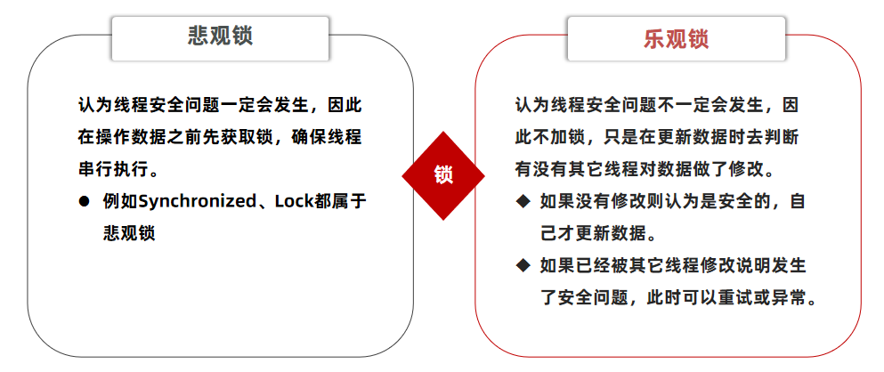
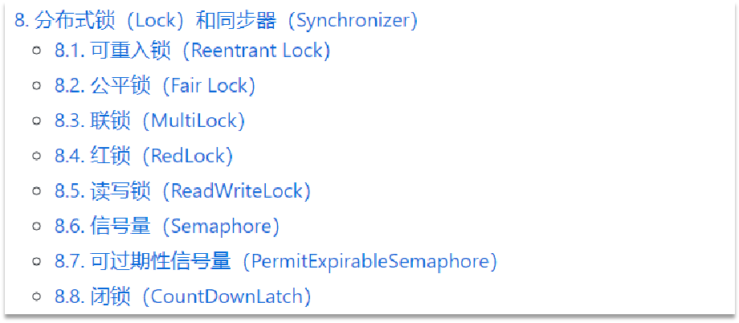

# Redis

### 2.3 缓存更新策略

缓存更新是redis为了节约内存而设计出来的一个东西，主要是因为内存数据宝贵，当我们向redis插入太多数据，此时就可能会导致缓存中的数据过多，所以redis会对部分数据进行更新，或者把他叫为淘汰更合适。

**内存淘汰：**redis自动进行，当redis内存达到咱们设定的max-memery的时候，会自动触发淘汰机制，淘汰掉一些不重要的数据(可以自己设置策略方式)

**超时剔除：**当我们给redis设置了过期时间ttl之后，redis会将超时的数据进行删除，方便咱们继续使用缓存

**主动更新：**我们可以手动调用方法把缓存删掉，通常用于解决缓存和数据库不一致问题


#### 2.3.2 、数据库和缓存不一致采用什么方案

综合考虑使用方案一，但是方案一调用者如何处理呢？这里有几个问题

操作缓存和数据库时有三个问题需要考虑：

如果采用第一个方案，那么假设我们每次操作数据库后，都操作缓存，但是中间如果没有人查询，那么这个更新动作实际上只有最后一次生效，中间的更新动作意义并不大，我们可以把缓存删除，等待再次查询时，将缓存中的数据加载出来

* 删除缓存还是更新缓存？
  * 更新缓存：每次更新数据库都更新缓存，无效写操作较多
  * 删除缓存：更新数据库时让缓存失效，查询时再更新缓存

* 如何保证缓存与数据库的操作的同时成功或失败？
  * 单体系统，将缓存与数据库操作放在一个事务
  * 分布式系统，利用TCC等分布式事务方案

应该具体操作缓存还是操作数据库，我们应当是先操作数据库，再删除缓存，原因在于，如果你选择第一种方案，在两个线程并发来访问时，假设线程1先来，他先把缓存删了，此时线程2过来，他查询缓存数据并不存在，此时他写入缓存，当他写入缓存后，线程1再执行更新动作时，实际上写入的就是旧的数据，新的数据被旧数据覆盖了。

* 先操作缓存还是先操作数据库？
  * 先删除缓存，再操作数据库
  * **先操作数据库，再删除缓存**


### 2.5 缓存穿透问题的解决思路

缓存穿透 ：缓存穿透是指客户端请求的数据在缓存中和数据库中都不存在，这样缓存永远不会生效，这些请求都会打到数据库。

常见的解决方案有两种：

* 缓存空对象
  * 优点：实现简单，维护方便
  * 缺点：
    * 额外的内存消耗
    * 可能造成短期的不一致
* 布隆过滤
  * 优点：内存占用较少，没有多余key
  * 缺点：
    * 实现复杂
    * 存在误判可能


**缓存空对象思路分析：**当我们客户端访问不存在的数据时，先请求redis，但是此时redis中没有数据，此时会访问到数据库，但是数据库中也没有数据，这个数据穿透了缓存，直击数据库，我们都知道数据库能够承载的并发不如redis这么高，如果大量的请求同时过来访问这种不存在的数据，这些请求就都会访问到数据库，简单的解决方案就是哪怕这个数据在数据库中也不存在，我们也把这个数据存入到redis中去，这样，下次用户过来访问这个不存在的数据，那么在redis中也能找到这个数据就不会进入到缓存了


**布隆过滤：**布隆过滤器其实采用的是哈希思想来解决这个问题，通过一个庞大的二进制数组，走哈希思想去判断当前这个要查询的这个数据是否存在，如果布隆过滤器判断存在，则放行，这个请求会去访问redis，哪怕此时redis中的数据过期了，但是数据库中一定存在这个数据，在数据库中查询出来这个数据后，再将其放入到redis中，

假设布隆过滤器判断这个数据不存在，则直接返回

这种方式优点在于节约内存空间，存在误判，误判原因在于：布隆过滤器走的是哈希思想，只要哈希思想，就可能存在哈希冲突


缓存穿透产生的原因是什么？

* 用户请求的数据在缓存中和数据库中都不存在，不断发起这样的请求，给数据库带来巨大压力

缓存穿透的解决方案有哪些？

* 缓存null值

* 布隆过滤

* 增强id的复杂度，避免被猜测id规律

* 做好数据的基础格式校验

* 加强用户权限校验

* 做好热点参数的限流

  

### 2.7 缓存雪崩问题及解决思路

缓存雪崩是指在同一时段大量的缓存key同时失效或者Redis服务宕机，导致大量请求到达数据库，带来巨大压力。

解决方案：

* 给不同的Key的TTL添加随机值
* 利用Redis集群提高服务的可用性
* 给缓存业务添加降级限流策略
* 给业务添加多级缓存


### 2.8 缓存击穿问题及解决思路

缓存击穿问题也叫热点Key问题，就是一个被**高并发访问**并且**缓存重建业务较复杂**的key突然失效了，无数的请求访问会在瞬间给数据库带来巨大的冲击。

常见的解决方案有两种：

* 互斥锁
* 逻辑过期

逻辑分析：假设线程1在查询缓存之后，本来应该去查询数据库，然后把这个数据重新加载到缓存的，此时只要线程1走完这个逻辑，其他线程就都能从缓存中加载这些数据了，但是假设在线程1没有走完的时候，后续的线程2，线程3，线程4同时过来访问当前这个方法， 那么这些线程都不能从缓存中查询到数据，那么他们就会同一时刻来访问查询缓存，都没查到，接着同一时间去访问数据库，同时的去执行数据库代码，对数据库访问压力过大


解决方案一、使用锁来解决：

因为锁能实现互斥性。假设线程过来，只能一个人一个人的来访问数据库，从而避免对于数据库访问压力过大，但这也会影响查询的性能，因为此时会让查询的性能从并行变成了串行，我们可以采用tryLock方法 + double check来解决这样的问题。

假设现在线程1过来访问，他查询缓存没有命中，但是此时他获得到了锁的资源，那么线程1就会一个人去执行逻辑，假设现在线程2过来，线程2在执行过程中，并没有获得到锁，那么线程2就可以进行到休眠，直到线程1把锁释放后，线程2获得到锁，然后再来执行逻辑，此时就能够从缓存中拿到数据了。


解决方案二、逻辑过期方案

方案分析：我们之所以会出现这个缓存击穿问题，主要原因是在于我们对key设置了过期时间，假设我们不设置过期时间，其实就不会有缓存击穿的问题，但是不设置过期时间，这样数据不就一直占用我们内存了吗，我们可以采用逻辑过期方案。

我们把过期时间设置在 redis的value中，注意：这个过期时间并不会直接作用于redis，而是我们后续通过逻辑去处理。假设线程1去查询缓存，然后从value中判断出来当前的数据已经过期了，此时线程1去获得互斥锁，那么其他线程会进行阻塞，获得了锁的线程他会开启一个 线程去进行 以前的重构数据的逻辑，直到新开的线程完成这个逻辑后，才释放锁， 而线程1直接进行返回，假设现在线程3过来访问，由于线程线程2持有着锁，所以线程3无法获得锁，线程3也直接返回数据，只有等到新开的线程2把重建数据构建完后，其他线程才能走返回正确的数据。

这种方案巧妙在于，异步的构建缓存，缺点在于在构建完缓存之前，返回的都是脏数据。


进行对比

**互斥锁方案：**由于保证了互斥性，所以数据一致，且实现简单，因为仅仅只需要加一把锁而已，也没其他的事情需要操心，所以没有额外的内存消耗，缺点在于有锁就有死锁问题的发生，且只能串行执行性能肯定受到影响

**逻辑过期方案：** 线程读取过程中不需要等待，性能好，有一个额外的线程持有锁去进行重构数据，但是在重构数据完成前，其他的线程只能返回之前的数据，且实现起来麻烦


### 2.9 利用互斥锁解决缓存击穿问题

核心思路：相较于原来从缓存中查询不到数据后直接查询数据库而言，现在的方案是 进行查询之后，如果从缓存没有查询到数据，则进行互斥锁的获取，获取互斥锁后，判断是否获得到了锁，如果没有获得到，则休眠，过一会再进行尝试，直到获取到锁为止，才能进行查询

如果获取到了锁的线程，再去进行查询，查询后将数据写入redis，再释放锁，返回数据，利用互斥锁就能保证只有一个线程去执行操作数据库的逻辑，防止缓存击穿


**操作锁的代码：**

核心思路就是利用redis的setnx方法来表示获取锁，该方法含义是redis中如果没有这个key，则插入成功，返回1，在stringRedisTemplate中返回true，  如果有这个key则插入失败，则返回0，在stringRedisTemplate返回false，我们可以通过true，或者是false，来表示是否有线程成功插入key，成功插入的key的线程我们认为他就是获得到锁的线程。

###  3.0 、利用逻辑过期解决缓存击穿问题

**需求：修改根据id查询商铺的业务，基于逻辑过期方式来解决缓存击穿问题**

思路分析：当用户开始查询redis时，判断是否命中，如果没有命中则直接返回空数据，不查询数据库，而一旦命中后，将value取出，判断value中的过期时间是否满足，如果没有过期，则直接返回redis中的数据，如果过期，则在开启独立线程后直接返回之前的数据，独立线程去重构数据，重构完成后释放互斥锁。


超卖问题是典型的多线程安全问题，针对这一问题的常见解决方案就是加锁：而对于加锁，我们通常有两种解决方案：见下图：



**悲观锁：**

 悲观锁可以实现对于数据的串行化执行，比如syn，和lock都是悲观锁的代表，同时，悲观锁中又可以再细分为公平锁，非公平锁，可重入锁，等等

**乐观锁：**

 乐观锁：会有一个版本号，每次操作数据会对版本号+1，再提交回数据时，会去校验是否比之前的版本大1 ，如果大1 ，则进行操作成功，这套机制的核心逻辑在于，如果在操作过程中，版本号只比原来大1 ，那么就意味着操作过程中没有人对他进行过修改，他的操作就是安全的，如果不大1，则数据被修改过，当然乐观锁还有一些变种的处理方式比如cas

乐观锁的典型代表：就是cas，利用cas进行无锁化机制加锁，var5 是操作前读取的内存值，while中的var1+var2 是预估值，如果预估值 == 内存值，则代表中间没有被人修改过，此时就将新值去替换 内存值


### 3.7 集群环境下的并发问题

通过加锁可以解决在单机情况下的一人一单安全问题，但是在集群模式下就不行了。

**有关锁失效原因分析**

由于现在我们部署了多个tomcat，每个tomcat都有一个属于自己的jvm，那么假设在服务器A的tomcat内部，有两个线程，这两个线程由于使用的是同一份代码，那么他们的锁对象是同一个，是可以实现互斥的，但是如果现在是服务器B的tomcat内部，又有两个线程，但是他们的锁对象写的虽然和服务器A一样，但是锁对象却不是同一个，所以线程3和线程4可以实现互斥，但是却无法和线程1和线程2实现互斥，这就是 集群环境下，syn锁失效的原因，在这种情况下，我们就需要使用分布式锁来解决这个问题。

解决这个问题。


## 4、分布式锁

### 4.1 、基本原理和实现方式对比

分布式锁：满足分布式系统或集群模式下多进程可见并且互斥的锁。

分布式锁的核心思想就是让大家都使用同一把锁，只要大家使用的是同一把锁，那么我们就能锁住线程，不让线程进行，让程序串行执行，这就是分布式锁的核心思路


那么分布式锁他应该满足一些什么样的条件呢？

可见性：多个线程都能看到相同的结果，注意：这个地方说的可见性并不是并发编程中指的内存可见性，只是说多个进程之间都能感知到变化的意思

互斥：互斥是分布式锁的最基本的条件，使得程序串行执行

高可用：程序不易崩溃，时时刻刻都保证较高的可用性

高性能：由于加锁本身就让性能降低，所有对于分布式锁本身需要他就较高的加锁性能和释放锁性能

安全性：安全也是程序中必不可少的一环


常见的分布式锁有三种

Mysql：mysql本身就带有锁机制，但是由于mysql性能本身一般，所以采用分布式锁的情况下，其实使用mysql作为分布式锁比较少见

Redis：redis作为分布式锁是非常常见的一种使用方式，现在企业级开发中基本都使用redis或者zookeeper作为分布式锁，利用setnx这个方法，如果插入key成功，则表示获得到了锁，如果有人插入成功，其他人插入失败则表示无法获得到锁，利用这套逻辑来实现分布式锁

Zookeeper：zookeeper也是企业级开发中较好的一个实现分布式锁的方案，由于本套视频并不讲解zookeeper的原理和分布式锁的实现，所以不过多阐述


### 4.2 、Redis分布式锁的实现核心思路

实现分布式锁时需要实现的两个基本方法：

* 获取锁：

  * 互斥：确保只能有一个线程获取锁
  * 非阻塞：尝试一次，成功返回true，失败返回false

* 释放锁：

  * 手动释放
  * 超时释放：获取锁时添加一个超时时间

  

核心思路：

我们利用redis 的setNx 方法，当有多个线程进入时，我们就利用该方法，第一个线程进入时，redis 中就有这个key 了，返回了1，如果结果是1，则表示他抢到了锁，那么他去执行业务，然后再删除锁，退出锁逻辑，没有抢到锁的哥们，等待一定时间后重试即可

 

### 4.3 实现分布式锁版本一

* 加锁逻辑

**锁的基本接口**


**SimpleRedisLock**

利用setnx方法进行加锁，同时增加过期时间，防止死锁，此方法可以保证加锁和增加过期时间具有原子性

### 4.4 Redis分布式锁误删情况说明

逻辑说明：

持有锁的线程在锁的内部出现了阻塞，导致他的锁自动释放，这时其他线程，线程2来尝试获得锁，就拿到了这把锁，然后线程2在持有锁执行过程中，线程1反应过来，继续执行，而线程1执行过程中，走到了删除锁逻辑，此时就会把本应该属于线程2的锁进行删除，这就是误删别人锁的情况说明

解决方案：解决方案就是在每个线程释放锁的时候，去判断一下当前这把锁是否属于自己，如果属于自己，则不进行锁的删除，假设还是上边的情况，线程1卡顿，锁自动释放，线程2进入到锁的内部执行逻辑，此时线程1反应过来，然后删除锁，但是线程1，一看当前这把锁不是属于自己，于是不进行删除锁逻辑，当线程2走到删除锁逻辑时，如果没有卡过自动释放锁的时间点，则判断当前这把锁是属于自己的，于是删除这把锁。


### 4.5 解决Redis分布式锁误删问题

需求：修改之前的分布式锁实现，满足：在获取锁时存入线程标示（可以用UUID表示）
在释放锁时先获取锁中的线程标示，判断是否与当前线程标示一致

* 如果一致则释放锁
* 如果不一致则不释放锁

核心逻辑：在存入锁时，放入自己线程的标识，在删除锁时，判断当前这把锁的标识是不是自己存入的，如果是，则进行删除，如果不是，则不进行删除。


### 4.6 分布式锁的原子性问题

更为极端的误删逻辑说明：

线程1现在持有锁之后，在执行业务逻辑过程中，他正准备删除锁，而且已经走到了条件判断的过程中，比如他已经拿到了当前这把锁确实是属于他自己的，正准备删除锁，但是此时他的锁到期了，那么此时线程2进来，但是线程1他会接着往后执行，当他卡顿结束后，他直接就会执行删除锁那行代码，相当于条件判断并没有起到作用，这就是删锁时的原子性问题，之所以有这个问题，是因为线程1的拿锁，比锁，删锁，实际上并不是原子性的，我们要防止刚才的情况发生，


### 4.7 Lua脚本解决多条命令原子性问题

Redis提供了Lua脚本功能，在一个脚本中编写多条Redis命令，确保多条命令执行时的原子性。Lua是一种编程语言，它的基本语法大家可以参考网站：https://www.runoob.com/lua/lua-tutorial.html，这里重点介绍Redis提供的调用函数，我们可以使用lua去操作redis，又能保证他的原子性，这样就可以实现拿锁比锁删锁是一个原子性动作了，作为Java程序员这一块并不作一个简单要求，并不需要大家过于精通，只需要知道他有什么作用即可。


#### 小总结：

基于Redis的分布式锁实现思路：

* 利用set nx ex获取锁，并设置过期时间，保存线程标示
* 释放锁时先判断线程标示是否与自己一致，一致则删除锁
  * 特性：
    * 利用set nx满足互斥性
    * 利用set ex保证故障时锁依然能释放，避免死锁，提高安全性
    * 利用Redis集群保证高可用和高并发特性

## 5、分布式锁-redission

### 5.1 分布式锁-redission功能介绍

基于setnx实现的分布式锁存在下面的问题：

**重入问题**：重入问题是指 获得锁的线程可以再次进入到相同的锁的代码块中，可重入锁的意义在于防止死锁，比如HashTable这样的代码中，他的方法都是使用synchronized修饰的，假如他在一个方法内，调用另一个方法，那么此时如果是不可重入的，不就死锁了吗？所以可重入锁他的主要意义是防止死锁，我们的synchronized和Lock锁都是可重入的。

**不可重试**：是指目前的分布式只能尝试一次，我们认为合理的情况是：当线程在获得锁失败后，他应该能再次尝试获得锁。

**超时释放：**我们在加锁时增加了过期时间，这样的我们可以防止死锁，但是如果卡顿的时间超长，虽然我们采用了lua表达式防止删锁的时候，误删别人的锁，但是毕竟没有锁住，有安全隐患

**主从一致性：** 如果Redis提供了主从集群，当我们向集群写数据时，主机需要异步的将数据同步给从机，而万一在同步过去之前，主机宕机了，就会出现死锁问题。


那么什么是Redission呢

Redisson是一个在Redis的基础上实现的Java驻内存数据网格（In-Memory Data Grid）。它不仅提供了一系列的分布式的Java常用对象，还提供了许多分布式服务，其中就包含了各种分布式锁的实现。

Redission提供了分布式锁的多种多样的功能



### 5.2 分布式锁-Redission快速入门

引入依赖：

```java
<dependency>
	<groupId>org.redisson</groupId>
	<artifactId>redisson</artifactId>
	<version>3.13.6</version>
</dependency>
```

配置Redisson客户端：

```java
@Configuration
public class RedissonConfig {

    @Bean
    public RedissonClient redissonClient(){
        // 配置
        Config config = new Config();
        config.useSingleServer().setAddress("redis://192.168.150.101:6379")
            .setPassword("123321");
        // 创建RedissonClient对象
        return Redisson.create(config);
    }
}

```

如何使用Redission的分布式锁

```java
@Resource
private RedissionClient redissonClient;

@Test
void testRedisson() throws Exception{
    //获取锁(可重入)，指定锁的名称
    RLock lock = redissonClient.getLock("anyLock");
    //尝试获取锁，参数分别是：获取锁的最大等待时间(期间会重试)，锁自动释放时间，时间单位
    boolean isLock = lock.tryLock(1,10,TimeUnit.SECONDS);
    //判断获取锁成功
    if(isLock){
        try{
            System.out.println("执行业务");          
        }finally{
            //释放锁
            lock.unlock();
        }
        
    }
    
    
    
}
```


# 实战篇其他的以后再看


# 高级篇

# 分布式缓存

-- 基于Redis集群解决单机Redis存在的问题


单机的Redis存在四大问题：


# 0.学习目标


# 1.Redis持久化

Redis有两种持久化方案：

- RDB持久化
- AOF持久化


## 1.1.RDB持久化

RDB全称Redis Database Backup file（Redis数据备份文件），也被叫做Redis数据快照。简单来说就是把内存中的所有数据都记录到磁盘中。当Redis实例故障重启后，从磁盘读取快照文件，恢复数据。快照文件称为RDB文件，默认是保存在当前运行目录。

### 1.1.1.执行时机

RDB持久化在四种情况下会执行：

- 执行save命令
- 执行bgsave命令
- Redis停机时
- 触发RDB条件时


**1）save命令**

执行下面的命令，可以立即执行一次RDB：


save命令会导致主进程执行RDB，这个过程中其它所有命令都会被阻塞。只有在数据迁移时可能用到。


**2）bgsave命令**

下面的命令可以异步执行RDB：


这个命令执行后会开启独立进程完成RDB，主进程可以持续处理用户请求，不受影响。


**3）停机时**

Redis停机时会执行一次save命令，实现RDB持久化。


**4）触发RDB条件**

Redis内部有触发RDB的机制，可以在redis.conf文件中找到，格式如下：

```properties
# 900秒内，如果至少有1个key被修改，则执行bgsave ， 如果是save "" 则表示禁用RDB
save 900 1  
save 300 10  
save 60 10000 
```


RDB的其它配置也可以在redis.conf文件中设置：

```properties
# 是否压缩 ,建议不开启，压缩也会消耗cpu，磁盘的话不值钱
rdbcompression yes

# RDB文件名称
dbfilename dump.rdb  

# 文件保存的路径目录
dir ./ 
```


### 1.1.2.RDB原理

bgsave开始时会fork主进程得到子进程，子进程共享主进程的内存数据。完成fork后读取内存数据并写入 RDB 文件。

fork采用的是copy-on-write技术：

- 当主进程执行读操作时，访问共享内存；
- 当主进程执行写操作时，则会拷贝一份数据，执行写操作。


### 1.1.3.小结

RDB方式bgsave的基本流程？

- fork主进程得到一个子进程，共享内存空间
- 子进程读取内存数据并写入新的RDB文件
- 用新RDB文件替换旧的RDB文件

RDB会在什么时候执行？save 60 1000代表什么含义？

- 默认是服务停止时
- 代表60秒内至少执行1000次修改则触发RDB

RDB的缺点？

- RDB执行间隔时间长，两次RDB之间写入数据有丢失的风险
- fork子进程、压缩、写出RDB文件都比较耗时


## 1.2.AOF持久化


### 1.2.1.AOF原理

AOF全称为Append Only File（追加文件）。Redis处理的每一个写命令都会记录在AOF文件，可以看做是命令日志文件。


### 1.2.2.AOF配置

AOF默认是关闭的，需要修改redis.conf配置文件来开启AOF：

```properties
# 是否开启AOF功能，默认是no
appendonly yes
# AOF文件的名称
appendfilename "appendonly.aof"
```


AOF的命令记录的频率也可以通过redis.conf文件来配：

```properties
# 表示每执行一次写命令，立即记录到AOF文件
appendfsync always 
# 写命令执行完先放入AOF缓冲区，然后表示每隔1秒将缓冲区数据写到AOF文件，是默认方案
appendfsync everysec 
# 写命令执行完先放入AOF缓冲区，由操作系统决定何时将缓冲区内容写回磁盘
appendfsync no
```


三种策略对比：


### 1.2.3.AOF文件重写

因为是记录命令，AOF文件会比RDB文件大的多。而且AOF会记录对同一个key的多次写操作，但只有最后一次写操作才有意义。通过执行bgrewriteaof命令，可以让AOF文件执行重写功能，用最少的命令达到相同效果。


如图，AOF原本有三个命令，但是`set num 123 和 set num 666`都是对num的操作，第二次会覆盖第一次的值，因此第一个命令记录下来没有意义。

所以重写命令后，AOF文件内容就是：`mset name jack num 666`


Redis也会在触发阈值时自动去重写AOF文件。阈值也可以在redis.conf中配置：

```properties
# AOF文件比上次文件 增长超过多少百分比则触发重写
auto-aof-rewrite-percentage 100
# AOF文件体积最小多大以上才触发重写 
auto-aof-rewrite-min-size 64mb 
```


## 1.3.RDB与AOF对比

RDB和AOF各有自己的优缺点，如果对数据安全性要求较高，在实际开发中往往会**结合**两者来使用。


# 2.Redis主从

## 2.1.搭建主从架构

单节点Redis的并发能力是有上限的，要进一步提高Redis的并发能力，就需要搭建主从集群，实现读写分离。


具体搭建流程参考课前资料《Redis集群.md》：

 


## 2.2.主从数据同步原理


### 2.2.1.全量同步 

主从第一次建立连接时，会执行**全量同步**，将master节点的所有数据都拷贝给slave节点，流程：


这里有一个问题，master如何得知salve是第一次来连接呢？？

有几个概念，可以作为判断依据：

- **Replication Id**：简称replid，是数据集的标记，id一致则说明是同一数据集。每一个master都有唯一的replid，slave则会继承master节点的replid
- **offset**：偏移量，随着记录在repl_baklog中的数据增多而逐渐增大。slave完成同步时也会记录当前同步的offset。如果slave的offset小于master的offset，说明slave数据落后于master，需要更新。

因此slave做数据同步，必须向master声明自己的replication id 和offset，master才可以判断到底需要同步哪些数据。


因为slave原本也是一个master，有自己的replid和offset，当第一次变成slave，与master建立连接时，发送的replid和offset是自己的replid和offset。

master判断发现slave发送来的replid与自己的不一致，说明这是一个全新的slave，就知道要做全量同步了。

master会将自己的replid和offset都发送给这个slave，slave保存这些信息。以后slave的replid就与master一致了。

因此，**master判断一个节点是否是第一次同步的依据，就是看replid是否一致**。

如图：


完整流程描述：

- slave节点请求增量同步
- master节点判断replid，发现不一致，拒绝增量同步
- master将完整内存数据生成RDB，发送RDB到slave
- slave清空本地数据，加载master的RDB
- master将RDB期间的命令记录在repl_baklog，并持续将log中的命令发送给slave
- slave执行接收到的命令，保持与master之间的同步


### 2.2.2.增量同步

全量同步需要先做RDB，然后将RDB文件通过网络传输个slave，成本太高了。因此除了第一次做全量同步，其它大多数时候slave与master都是做**增量同步**。

什么是增量同步？就是只更新slave与master存在差异的部分数据。如图：


那么master怎么知道slave与自己的数据差异在哪里呢?


### 2.2.3.repl_backlog原理

master怎么知道slave与自己的数据差异在哪里呢?

这就要说到全量同步时的repl_baklog文件了。

这个文件是一个固定大小的数组，只不过数组是环形，也就是说**角标到达数组末尾后，会再次从0开始读写**，这样数组头部的数据就会被覆盖。

repl_baklog中会记录Redis处理过的命令日志及offset，包括master当前的offset，和slave已经拷贝到的offset：

 

slave与master的offset之间的差异，就是salve需要增量拷贝的数据了。

随着不断有数据写入，master的offset逐渐变大，slave也不断的拷贝，追赶master的offset：

 


直到数组被填满：

 

此时，如果有新的数据写入，就会覆盖数组中的旧数据。不过，旧的数据只要是绿色的，说明是已经被同步到slave的数据，即便被覆盖了也没什么影响。因为未同步的仅仅是红色部分。


但是，如果slave出现网络阻塞，导致master的offset远远超过了slave的offset： 

 

如果master继续写入新数据，其offset就会覆盖旧的数据，直到将slave现在的offset也覆盖：

 


棕色框中的红色部分，就是尚未同步，但是却已经被覆盖的数据。此时如果slave恢复，需要同步，却发现自己的offset都没有了，无法完成增量同步了。只能做全量同步。


## 2.3.主从同步优化

主从同步可以保证主从数据的一致性，非常重要。

可以从以下几个方面来优化Redis主从就集群：

- 在master中配置repl-diskless-sync yes启用无磁盘复制，避免全量同步时的磁盘IO。
- Redis单节点上的内存占用不要太大，减少RDB导致的过多磁盘IO
- 适当提高repl_baklog的大小，发现slave宕机时尽快实现故障恢复，尽可能避免全量同步
- 限制一个master上的slave节点数量，如果实在是太多slave，则可以采用主-从-从链式结构，减少master压力

主从从架构图：


## 2.4.小结

简述全量同步和增量同步区别？

- 全量同步：master将完整内存数据生成RDB，发送RDB到slave。后续命令则记录在repl_backlog，逐个发送给slave。
- 增量同步：slave提交自己的offset到master，master获取repl_backlog中从offset之后的命令给slave

什么时候执行全量同步？

- slave节点第一次连接master节点时
- slave节点断开时间太久，repl_backlog中的offset已经被覆盖时

什么时候执行增量同步？

- slave节点断开又恢复，并且在repl_backlog中能找到offset时


# 3.Redis哨兵

Redis提供了哨兵（Sentinel）机制来实现主从集群的自动故障恢复。

## 3.1.哨兵原理

### 3.1.1.集群结构和作用

哨兵的结构如图：


哨兵的作用如下：

- **监控**：Sentinel 会不断检查您的master和slave是否按预期工作
- **自动故障恢复**：如果master故障，Sentinel会将一个slave提升为master。当故障实例恢复后也以新的master为主
- **通知**：Sentinel充当Redis客户端的服务发现来源，当集群发生故障转移时，会将最新信息推送给Redis的客户端


### 3.1.2.集群监控原理

Sentinel基于心跳机制监测服务状态，每隔1秒向集群的每个实例发送ping命令：

•主观下线：如果某sentinel节点发现某实例未在规定时间响应，则认为该实例**主观下线**。

•客观下线：若超过指定数量（quorum）的sentinel都认为该实例主观下线，则该实例**客观下线**。quorum值最好超过Sentinel实例数量的一半。


### 3.1.3.集群故障恢复原理

一旦发现master故障，sentinel需要在salve中**选择一个作为新的master**，选择依据是这样的：

- 首先会判断slave节点与master节点断开时间长短，如果超过指定值（down-after-milliseconds * 10）则会排除该slave节点
- 然后判断slave节点的slave-priority值，越小优先级越高，如果是0则永不参与选举
- 如果slave-prority一样，则判断slave节点的offset值，越大说明数据越新，优先级越高
- 最后是判断slave节点的运行id大小，越小优先级越高。


当选出一个新的master后，该如何实现**切换**呢？

流程如下：

- **sentinel给备选的slave1节点发送slaveof no one命令，让该节点成为master**
- **sentinel给所有其它slave发送slaveof 192.168.150.101 7002 命令，让这些slave成为新master的从节点，开始从新的master上同步数据。**
- **最后，sentinel将故障节点标记为slave，当故障节点恢复后会自动成为新的master的slave节点**


### 3.1.4.小结

Sentinel的三个作用是什么？

- 监控
- 故障转移
- 通知

Sentinel如何判断一个redis实例是否健康？

- 每隔1秒发送一次ping命令，如果超过一定时间没有相向则认为是主观下线
- 如果大多数sentinel都认为实例主观下线，则判定服务下线

故障转移步骤有哪些？

- 首先选定一个slave作为新的master，执行slaveof no one
- 然后让所有节点都执行slaveof 新master
- 修改故障节点配置，添加slaveof 新master


## 3.2.搭建哨兵集群

具体搭建流程参考课前资料《Redis集群.md》：

 


## 3.3.RedisTemplate

在Sentinel集群监管下的Redis主从集群，其节点会因为自动故障转移而发生变化，Redis的客户端必须感知这种变化，及时更新连接信息。Spring的RedisTemplate底层利用lettuce实现了节点的感知和自动切换。

下面，我们通过一个测试来实现RedisTemplate集成哨兵机制。

### 3.3.1.导入Demo工程

首先，我们引入课前资料提供的Demo工程：

 


### 3.3.2.引入依赖

在项目的pom文件中引入依赖：

```xml
<dependency>
    <groupId>org.springframework.boot</groupId>
    <artifactId>spring-boot-starter-data-redis</artifactId>
</dependency>
```


### 3.3.3.配置Redis地址

然后在配置文件application.yml中指定redis的sentinel相关信息：

```java
spring:
  redis:
    sentinel:
      master: mymaster
      nodes:
        - 192.168.150.101:27001
        - 192.168.150.101:27002
        - 192.168.150.101:27003
```


### 3.3.4.配置读写分离

在项目的启动类中，添加一个新的bean：

```java
@Bean
public LettuceClientConfigurationBuilderCustomizer clientConfigurationBuilderCustomizer(){
    return clientConfigurationBuilder -> clientConfigurationBuilder.readFrom(ReadFrom.REPLICA_PREFERRED);
}
```


这个bean中配置的就是读写策略，包括四种：

- MASTER：从主节点读取
- MASTER_PREFERRED：优先从master节点读取，master不可用才读取replica
- REPLICA：从slave（replica）节点读取
- REPLICA _PREFERRED：优先从slave（replica）节点读取，所有的slave都不可用才读取master


# 4.Redis分片集群


## 4.1.搭建分片集群

主从和哨兵可以解决高可用、高并发读的问题。但是依然有两个问题没有解决：

- 海量数据存储问题

- 高并发写的问题

使用分片集群可以解决上述问题，如图:


分片集群特征：

- 集群中有多个master，每个master保存不同数据

- 每个master都可以有多个slave节点

- master之间通过ping监测彼此健康状态

- 客户端请求可以访问集群任意节点，最终都会被转发到正确节点


具体搭建流程参考课前资料《Redis集群.md》：

 


## 4.2.散列插槽

### 4.2.1.插槽原理

Redis会把每一个master节点映射到0~16383共16384个插槽（hash slot）上，查看集群信息时就能看到：


数据key不是与节点绑定，而是与插槽绑定。redis会根据key的有效部分计算插槽值，分两种情况：

- key中包含"{}"，且“{}”中至少包含1个字符，“{}”中的部分是有效部分
- key中不包含“{}”，整个key都是有效部分


例如：key是num，那么就根据num计算，如果是{itcast}num，则根据itcast计算。计算方式是利用CRC16算法得到一个hash值，然后对16384取余，得到的结果就是slot值。

 

如图，在7001这个节点执行set a 1时，对a做hash运算，对16384取余，得到的结果是15495，因此要存储到103节点。

到了7003后，执行`get num`时，对num做hash运算，对16384取余，得到的结果是2765，因此需要切换到7001节点


### 4.2.1.小结

Redis如何判断某个key应该在哪个实例？

- 将16384个插槽分配到不同的实例
- 根据key的有效部分计算哈希值，对16384取余
- 余数作为插槽，寻找插槽所在实例即可

如何将同一类数据固定的保存在同一个Redis实例？

- 这一类数据使用相同的有效部分，例如key都以{typeId}为前缀


## 4.3.集群伸缩

redis-cli --cluster提供了很多操作集群的命令，可以通过下面方式查看：


比如，添加节点的命令：


### 4.3.1.需求分析

需求：向集群中添加一个新的master节点，并向其中存储 num = 10

- 启动一个新的redis实例，端口为7004
- 添加7004到之前的集群，并作为一个master节点
- 给7004节点分配插槽，使得num这个key可以存储到7004实例


这里需要两个新的功能：

- 添加一个节点到集群中
- 将部分插槽分配到新插槽


### 4.3.2.创建新的redis实例

创建一个文件夹：

```sh
mkdir 7004
```

拷贝配置文件：

```sh
cp redis.conf /7004
```

修改配置文件：

```sh
sed /s/6379/7004/g 7004/redis.conf
```

启动

```sh
redis-server 7004/redis.conf
```


### 4.3.3.添加新节点到redis

添加节点的语法如下：


执行命令：

```sh
redis-cli --cluster add-node  192.168.150.101:7004 192.168.150.101:7001
```


通过命令查看集群状态：

```sh
redis-cli -p 7001 cluster nodes
```


如图，7004加入了集群，并且默认是一个master节点：


但是，可以看到7004节点的插槽数量为0，因此没有任何数据可以存储到7004上


### 4.3.4.转移插槽

我们要将num存储到7004节点，因此需要先看看num的插槽是多少：


如上图所示，num的插槽为2765.


我们可以将0~3000的插槽从7001转移到7004，命令格式如下：


具体命令如下：

建立连接：


得到下面的反馈：


询问要移动多少个插槽，我们计划是3000个：

新的问题来了：


那个node来接收这些插槽？？

显然是7004，那么7004节点的id是多少呢？


复制这个id，然后拷贝到刚才的控制台后：


这里询问，你的插槽是从哪里移动过来的？

- all：代表全部，也就是三个节点各转移一部分
- 具体的id：目标节点的id
- done：没有了


这里我们要从7001获取，因此填写7001的id：


填完后，点击done，这样插槽转移就准备好了：


确认要转移吗？输入yes：

然后，通过命令查看结果：

 

可以看到： 


目的达成。


## 4.4.故障转移

集群初识状态是这样的：


其中7001、7002、7003都是master，我们计划让7002宕机。


### 4.4.1.自动故障转移

当集群中有一个master宕机会发生什么呢？

直接停止一个redis实例，例如7002：

```sh
redis-cli -p 7002 shutdown
```


1）首先是该实例与其它实例失去连接

2）然后是疑似宕机：


3）最后是确定下线，自动提升一个slave为新的master：


4）当7002再次启动，就会变为一个slave节点了：


### 4.4.2.手动故障转移

利用cluster failover命令可以手动让集群中的某个master宕机，切换到执行cluster failover命令的这个slave节点，实现无感知的数据迁移。其流程如下：


这种failover命令可以指定三种模式：

- 缺省：默认的流程，如图1~6歩
- force：省略了对offset的一致性校验
- takeover：直接执行第5歩，忽略数据一致性、忽略master状态和其它master的意见


**案例需求**：在7002这个slave节点执行手动故障转移，重新夺回master地位

步骤如下：

1）利用redis-cli连接7002这个节点

2）执行cluster failover命令

如图：


效果：


## 4.5.RedisTemplate访问分片集群

RedisTemplate底层同样基于lettuce实现了分片集群的支持，而使用的步骤与哨兵模式基本一致：

1）引入redis的starter依赖

2）配置分片集群地址

3）配置读写分离

与哨兵模式相比，其中只有分片集群的配置方式略有差异，如下：

```yaml
spring:
  redis:
    cluster:
      nodes:
        - 192.168.150.101:7001
        - 192.168.150.101:7002
        - 192.168.150.101:7003
        - 192.168.150.101:8001
        - 192.168.150.101:8002
        - 192.168.150.101:8003
```


