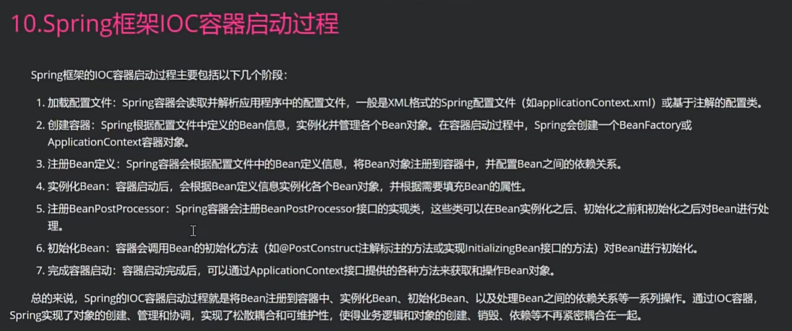
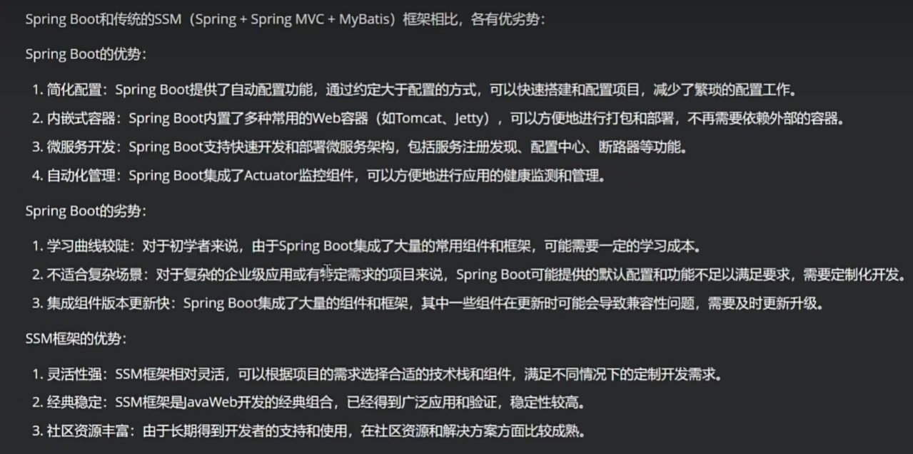
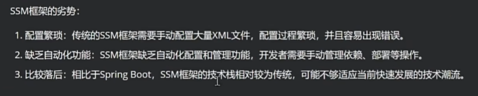
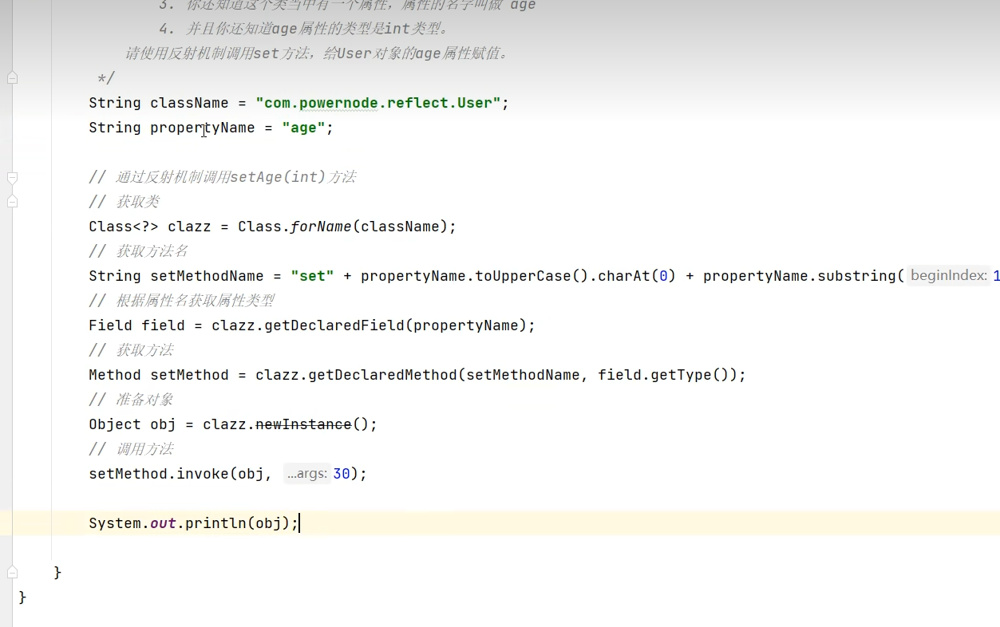
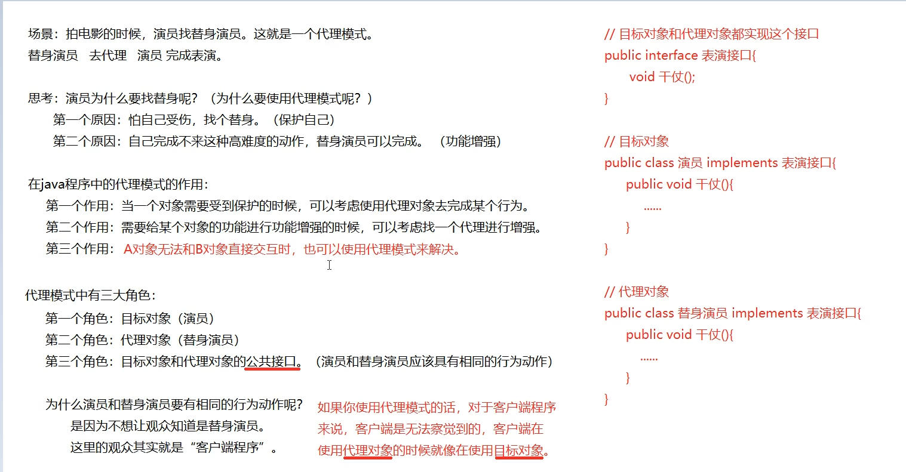
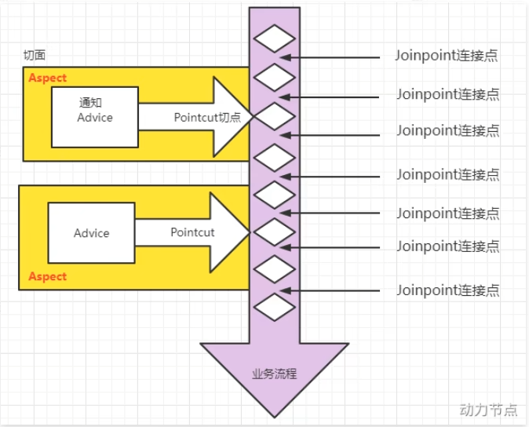

# Spring6

# 面试

### 什么是Spring IOC容器？

Spring IOC 全称叫控制反转。在传统的Java程序开发里面，我们只能通过new关键字去创建个对象，那么这种方式会导致程序里面对象的依赖关系比较复杂而且耦合度比较高。而IOC的主要作用就是实现了对象的管理，也就是我们把设计好的对象交给IOC 容器来控制，然后在需要用到目标对象的时候直接从容器里面去获取，相当于把对象的创建和对象之间的维护关系交给了容器，这种设计理念使得对象和对象之间是一种松耦合状态，极大的提升的程序的灵活性和功能的复用性。然后 DI 表示依赖注入也是说对于IOC容器中管理的bean，如果bean之间存在依赖关系，那么IOC容器需要自动去实现依赖对象的实例注入。有set注入、构造方法注入、以及 @Autowired 、 @Resource 分别去根据bean的类型和bean的名字去实现依赖注入。




SpringBoot 和 ssm 框架的优劣势：

	




##### Spring 事务失效的场景：

1. 非public方法上使用 `@Transactional`，只对公有方法有效

2. 同类方法调用，当一个没有`@Transactional`注解方法的内部，调用了同一个类中标记为`@Transactional`注解方法的时候，事务是不会生效的。那么通常的解决方法是：可以通过Spring 的 ApplicationContext 或者注入自己的 bean 来实现方法调用
3. 数据库不支持事务，比如说某些 NOSQL 数据库或者是MYSQL里面不支持事务的引擎。确保使用的数据库都支持事务
4. 事务的传播行为不当导致，可以通过propagation去设置事务的传播行为，根据业务的需求正确的使用他们
5. 异常类型不触发事务回滚，在默认情况下，只有出现运行时异常的时候，事务才会回滚。受检异常是不会触发回滚，可以指定触发回滚的异常类型。


2024/06/26

1. ##### OCP开闭原则

​    \* 什么是OCP？
​        OCP是软件七大开发原则当中最基本的一个原则：开闭原则
​        对什么开？对扩展开放。
​        对什么闭？对修改关闭。
​    \* OCP原则是最核心的，最基本的，其他的六个原则都是为这个原则服务的。
​    \* OCP开闭原则的核心是什么？
​        只要你在扩展系统功能的时候，没有修改以前写好的代码，那么你就是符合OCP原则的。
​        反之，如果在扩展系统功能的时候，你修改了之前的代码，那么这个设计是失败的，违背OCP原则。
​    \* 当进行系统功能扩展的时候，如果动了之前稳定的程序，修改了之前的程序，之前所有程序都需要进行重新测试。这是不想看到的，因为非常麻烦。

2. ##### 依赖倒置原则（DIP原则）

​    \* 什么是依赖倒置原则？
​        面向接口编程，面向抽象编程，不要面向具体编程。
​    \* 依赖倒置原则的目的？
​        降低程序的耦合度，提高扩展力。
​    \* 什么叫做符合依赖倒置？
​        上 不依赖 下，就是符合。
​    \* 什么叫做违背依赖倒置？
​        上 依赖 下，就是违背。
​        只要“下”一改动，“上”就受到牵连。

3. 当前程序的设计，显然既违背OCP，又违背DIP，怎么办？

​    可以采用“控制反转”这种编程思想来解决这个问题。

4. 什么是**控制反转？**

​    控制反转：IoC（Inversion of Control）
​    反转是什么呢？
​        反转的是两件事：
​            第一件事：我不在程序中采用硬编码的方式来new对象了。（new对象我不管了，new对象的权利交出去了。）
​            第二件事：我不在程序中采用硬编码的方式来维护对象的关系了。（对象之间关系的维护权，我也不管了，交出去了。）

​    控制反转：是一种编程思想。或者叫做一种新型的设计模式。由于出现的比较新，没有被纳入GoF23种设计模式范围内。

5. Spring框架

​    \* Spring框架实现了控制反转IoC这种思想
​        Spring框架可以帮你new对象。
​        Spring框架可以帮你维护对象和对象之间的关系。
​    \* Spring是一个实现了IoC思想的容器。
​    \* 控制反转的实现方式有多种，其中比较重要的叫做：依赖注入(Dependency Injection，简称DI)。
​    \* 控制反转是思想。依赖注入是这种思想的具体实现。
​    \* **依赖注入DI**，又包括常见的两种方式：
​        第一种：**set注入**（执行set方法给属性赋值）
​        第二种：**构造方法注入**（执行构造方法给属性赋值）
​    \* 依赖注入 中 “依赖”是什么意思？ “注入”是什么意思？
​        依赖：A对象和B对象的关系。
​        注入：是一种手段，通过这种手段，可以让A对象和B对象产生关系。
​        依赖注入：对象A和对象B之间的关系，靠注入的手段来维护。而注入包括：set注入和构造注入。

6. ##### 注意术语：

​    OCP：开闭原则（开发原则）
​    DIP：依赖倒置原则（开发原则）
​    IoC：控制反转（一种思想，一种新型的设计模式）
​    DI：依赖注入（控制反转思想的具体实现方式）


##### Bean的作用域

- 小细节

  1. Spring默认情况下是单例的

     在Spring上下文初始化的时候实例化（单例：singleton）每一次调用getBean()方法的时候，都返回那个单例的对象

  2. Bean在spring.xml配置文件中设置 scope="prototype" 在加载Spring上下文初始化的时候并不会实例化

     Beanbean 是多例的，每一次调用getBean()方法的时候，实例化bean对象

     

# 六、GoF之工厂模式（面试）

- 设计模式：一种可以被重复利用的解决方案。
- GoF（Gang of Four），中文名——四人组。
- 《Design Patterns: Elements of Reusable Object-Oriented Software》（即《设计模式》一书），1995年由 Erich Gamma、Richard Helm、Ralph Johnson 和 John Vlissides 合著。这几位作者常被称为"四人组（Gang of Four）"。
- 该书中描述了23种设计模式。我们平常所说的设计模式就是指这23种设计模式。
- 不过除了GoF23种设计模式之外，还有其它的设计模式，比如：JavaEE的设计模式（DAO模式、MVC模式等）。
- GoF23种设计模式可分为三大类：
  - **创建型**（5个）：解决对象创建问题。
    - 单例模式
    - 工厂方法模式
    - 抽象工厂模式
    - 建造者模式
    - 原型模式
  - **结构型**（7个）：一些类或对象组合在一起的经典结构。
    - 代理模式
    - 装饰模式
    - 适配器模式
    - 组合模式
    - 享元模式
    - 外观模式
    - 桥接模式
  - **行为型**（11个）：解决类或对象之间的交互问题。
    - 策略模式
    - 模板方法模式
    - 责任链模式
    - 观察者模式
    - 迭代子模式
    - 命令模式
    - 备忘录模式
    - 状态模式
    - 访问者模式
    - 中介者模式
    - 解释器模式
- 工厂模式是解决对象创建问题的，所以工厂模式属于创建型设计模式。这里为什么学习工厂模式呢？这是因为Spring框架底层使用了大量的工厂模式。

## 6.1 工厂模式的三种形态

工厂模式通常有三种形态：

- 第一种：**简单工厂模式（Simple Factory）：不属于23种设计模式之一。简单工厂模式又叫做：静态 工厂方法模式。简单工厂模式是工厂方法模式的一种特殊实现。**
- 第二种：工厂方法模式（Factory Method）：是23种设计模式之一。
- 第三种：抽象工厂模式（Abstract Factory）：是23种设计模式之一。

## 6.2 简单工厂模式

简单工厂模式的角色包括三个：

- 抽象产品 角色
- 具体产品 角色
- 工厂类 角色

简单工厂模式的代

## 6.3 工厂方法模式

工厂方法模式既保留了简单工厂模式的优点，同时又解决了简单工厂模式的缺点。
工厂方法模式的角色包括：

- **抽象工厂角色**
- **具体工厂角色**
- 抽象产品角色
- 具体产品角色

## 6.4 抽象工厂模式（了解）

抽象工厂模式相对于工厂方法模式来说，就是工厂方法模式是针对一个产品系列的，而抽象工厂模式是针对多个产品系列的，即工厂方法模式是一个产品系列一个工厂类，而抽象工厂模式是多个产品系列一个工厂类。
抽象工厂模式特点：抽象工厂模式是所有形态的工厂模式中最为抽象和最具一般性的一种形态。抽象工厂模式是指当有多个抽象角色时，使用的一种工厂模式。抽象工厂模式可以向客户端提供一个接口，使客户端在不必指定产品的具体的情况下，创建多个产品族中的产品对象。它有多个抽象产品类，每个抽象产品类可以派生出多个具体产品类，一个抽象工厂类，可以派生出多个具体工厂类，每个具体工厂类可以创建多个具体产品类的实例。每一个模式都是针对一定问题的解决方案，工厂方法模式针对的是一个产品等级结构；而抽象工厂模式针对的是多个产品等级结果。
抽象工厂中包含4个角色：

- 抽象工厂角色
- 具体工厂角色
- 抽象产品角色
- 具体产品角色

## 7.5 BeanFactory和FactoryBean的区别

### 7.5.1 BeanFactory

Spring IoC容器的顶级对象，BeanFactory被翻译为“Bean工厂”，在Spring的IoC容器中，“Bean工厂”负责创建Bean对象。
BeanFactory是工厂。

### 7.5.2 FactoryBean

FactoryBean：它是一个Bean，是一个能够**辅助Spring**实例化其它Bean对象的一个Bean。
在Spring中，Bean可以分为两类：

- 第一类：普通Bean
- 第二类：工厂Bean（记住：工厂Bean也是一种Bean，只不过这种Bean比较特殊，它可以辅助Spring实例化其它Bean对象。）

# 八、Bean的生命周期（面试）

## 8.1 什么是Bean的生命周期

Spring其实就是一个管理Bean对象的工厂。它负责对象的创建，对象的销毁等。
所谓的生命周期就是：对象从创建开始到最终销毁的整个过程。
什么时候创建Bean对象？
创建Bean对象的前后会调用什么方法？
Bean对象什么时候销毁？
Bean对象的销毁前后调用什么方法？

## 8.2 为什么要知道Bean的生命周期

其实生命周期的本质是：在哪个时间节点上调用了哪个类的哪个方法。
我们需要充分的了解在这个生命线上，都有哪些特殊的时间节点。
只有我们知道了特殊的时间节点都在哪，到时我们才可以确定代码写到哪。
我们可能需要在某个特殊的时间点上执行一段特定的代码，这段代码就可以放到这个节点上。当生命线走到这里的时候，自然会被调用。

## 8.3 Bean的生命周期之5步

Bean生命周期的管理，可以参考Spring的源码：**AbstractAutowireCapableBeanFactory类的doCreateBean()方法。**
Bean生命周期可以粗略的划分为五大步：

- 第一步：实例化Bean
- 第二步：Bean属性赋值
- 第三步：初始化Bean
- 第四步：使用Bean
- 第五步：销毁Bean

需要注意的：

- 第一：只有正常关闭spring容器，bean的销毁方法才会被调用。
- 第二：ClassPathXmlApplicationContext类才有close()方法。
- 第三：配置文件中的init-method指定初始化方法。destroy-method指定销毁方法。

## 8.4 Bean生命周期之7步

在以上的5步中，第3步是初始化Bean，如果你还想在初始化前和初始化后添加代码，可以加入“Bean后处理器”。
编写一个类实现BeanPostProcessor类，并且重写before和after方法：


**一定要注意：在spring.xml文件中配置的Bean后处理器将作用于当前配置文件中所有的Bean。
如果加上Bean后处理器的话，Bean的生命周期就是7步了：


## 8.5 Bean生命周期之10步

如果根据源码跟踪，可以划分更细粒度的步骤，10步：
上图中检查Bean是否实现了Aware的相关接口是什么意思？
Aware相关的接口包括：BeanNameAware、BeanClassLoaderAware、BeanFactoryAware

- 当Bean实现了BeanNameAware，Spring会将Bean的名字传递给Bean。
- 当Bean实现了BeanClassLoaderAware，Spring会将加载该Bean的类加载器传递给Bean。
- 当Bean实现了BeanFactoryAware，Spring会将Bean工厂对象传递给Bean。

测试以上10步，可以让User类实现5个接口，并实现所有方法：

- BeanNameAware
- BeanClassLoaderAware
- BeanFactoryAware
- InitializingBean
- DisposableBean

- **InitializingBean的方法早于init-method的执行。**
- **DisposableBean的方法早于destroy-method的执行。**

10步：

1. 实例化bean
2. 给bean属性赋值
3. 检查bean是否实现aware的相关接口，并设置依赖
4. bean后处理器before执行
5. 检查bean是否实现initializing接口，并调用接口方法
6. 初始化bean
7. bean后处理器after执行
8. 使用bean
9. 检查bean是否调用disposable接口，并调用接口方法
10. 销毁bean

## 8.6 Bean的作用域不同，管理方式不同

Spring 根据Bean的作用域来选择管理方式。

- 对于singleton作用域的Bean，Spring 能够精确地知道该Bean何时被创建，何时初始化完成，以及何时被销毁；
- 而对于 prototype 作用域的 Bean，Spring 只负责创建，当容器创建了 Bean 的实例后，Bean 的实例就交给客户端代码管理，Spring 容器将不再跟踪其生命周期。

## 8.7 自己new的对象如何让Spring管理

```java
  @Test
    public void testBeanRegister(){
        // 自己new的对象
        User user = new User();
        System.out.println(user);

        // 创建 默认列表BeanFactory 对象
        DefaultListableBeanFactory factory = new DefaultListableBeanFactory();
        // 注册Bean
        factory.registerSingleton("userBean", user);
        // 从spring容器中获取bean
        User userBean = factory.getBean("userBean", User.class);
        System.out.println(userBean);
    }
```


### 只有singleton+setter 可以解决循环依赖。

## 9.5 Spring解决循环依赖的机理

Spring为什么可以解决set + singleton模式下循环依赖？
根本的原因在于：这种方式可以做到将“实例化Bean”和“给Bean属性赋值”这两个动作分开去完成。
实例化Bean的时候：调用无参数构造方法来完成。**此时可以先不给属性赋值，可以提前将该Bean对象“曝光”给外界。**
给Bean属性赋值的时候：调用setter方法来完成。
**两个步骤是完全可以分离开去完成的，并且这两步不要求在同一个时间点上完成。**
也就是说，Bean都是单例的，我们可以先把所有的单例Bean实例化出来，放到一个集合当中（我们可以称之为缓存），所有的单例Bean全部实例化完成之后，以后我们再慢慢的调用setter方法给属性赋值。这样就解决了循环依赖的问题。
那么在Spring框架底层源码级别上是如何实现的呢？请看：

在以上类中包含三个重要的属性：
_**Cache of singleton objects: bean name to bean instance. **_**单例对象的缓存：key存储bean名称，value存储Bean对象【一级缓存】**
_**Cache of early singleton objects: bean name to bean instance. **_**早期单例对象的缓存：key存储bean名称，value存储早期的Bean对象【二级缓存】**
_**Cache of singleton factories: bean name to ObjectFactory. **_**单例工厂缓存：key存储bean名称，value存储该Bean对应的ObjectFactory对象【三级缓存】**
这三个缓存其实本质上是三个Map集合。
我们再来看，在该类中有这样一个方法addSingletonFactory()，这个方法的作用是：将创建Bean对象的ObjectFactory对象提前曝光。

再分析下面的源码：

从源码中可以看到，spring会先从一级缓存中获取Bean，如果获取不到，则从二级缓存中获取Bean，如果二级缓存还是获取不到，则从三级缓存中获取之前曝光的ObjectFactory对象，通过ObjectFactory对象获取Bean实例，这样就解决了循环依赖的问题。
**总结：**
**Spring只能解决setter方法注入的单例bean之间的循环依赖。ClassA依赖ClassB，ClassB又依赖ClassA，形成依赖闭环。Spring在创建ClassA对象后，不需要等给属性赋值，直接将其曝光到bean缓存当中。在解析ClassA的属性时，又发现依赖于ClassB，再次去获取ClassB，当解析ClassB的属性时，又发现需要ClassA的属性，但此时的ClassA已经被提前曝光加入了正在创建的bean的缓存中，则无需创建新的的ClassA的实例，直接从缓存中获取即可。从而解决循环依赖问题。**


#### 反射机制所需具备的四个要素：

调用哪个对象的哪个方法，传什么参数，返回什么值

**set注入的底层原理（通过反射机制）**




## 12.2 声明Bean的注解

负责声明Bean的注解，常见的包括四个：

- @Component
- @Controller
- @Service
- @Repository


## 12.5 负责注入的注解

@Component @Controller @Service @Repository 这四个注解是用来声明Bean的，声明后这些Bean将被实例化。接下来我们看一下，如何给Bean的属性赋值。给Bean属性赋值需要用到这些注解：

- @Value（负责注入简单类型）
- @Autowired（可以注入非简单类型）
- @Qualifier
- @Resource

### 12.5.1 @Value

当属性的类型是简单类型时，可以使用@Value注解进行注入。

### 12.5.2 @Autowired与@Qualifier

@Autowired注解可以用来注入**非简单类型**。被翻译为：自动连线的，或者自动装配。
**单独**使用@Autowired注解，**默认根据类型装配**。【默认是byType】

```java
@Service("orderService")
public class OrderService {

    // @Autowired 注解使用的时候，不需要指定任何属性，直接使用这个注解即可。
    // 这个注解的作用是根据类型 byType 进行自动装配。
//    @Autowired // 使用默认值(默认类型匹配)：只能有一个同一类型的数据
//    private OrderDao orderDao;

    // 如果想解决以上问题，只能根据名字进行装配。
    // @Autowired利@Qualifier联合使用，可以根据名字进行装配。
    @Autowired
    @Qualifier("orderDaoImplForOracle")
    private OrderDao orderDao;

    public void generate(){
        orderDao.insert();
    }
}

```

### 12.5.3 @Resource

@Resource注解也可以完成非简单类型注入。那它和@Autowired注解有什么区别？

- @Resource注解是JDK扩展包中的，也就是说属于JDK的一部分。所以该注解是标准注解，更加具有通用性。(JSR-250标准中制定的注解类型。JSR是Java规范提案。)
- @Autowired注解是Spring框架自己的。
- **@Resource注解默认根据名称装配byName，未指定name时，使用属性名作为name。通过name找不到的话会自动启动通过类型byType装配。**
- **@Autowired注解默认根据类型装配byType，如果想根据名称装配，需要配合@Qualifier注解一起用。**
- @Resource注解用在属性上、setter方法上。
- @Autowired注解用在属性上、setter方法上、构造方法上、构造方法参数上。

@Resource注解属于JDK扩展包，所以不在JDK当中，需要额外引入以下依赖：【**如果是JDK8的话不需要额外引入依赖。高于JDK11或低于JDK8需要引入以下依赖。**】


**代理模式**

什么时候使用代理模式？

1. 在程序中，对象A和对象B无法直接交互时。
2. 在程序中，功能需要增强时。
3. 在程序中，目标需要被保护时。




一般一个系统当中都会有一些系统服务，例如：日志、事务管理、安全等。这些系统服务被称为：***交叉业务***

**用一句话总结AOP：将与核心业务无关的代码独立的抽取出来，形成一个独立的组件，然后以横向交叉的方式应用到业务流程当中的过程被称为AOP。**
**AOP的优点：**

- **第一：代码复用性增强。**
- **第二：代码易维护。**
- **第三：使开发者更关注业务逻辑。**

## 15.2 AOP的七大术语

```java
public class UserService{
    public void do1(){
        System.out.println("do 1");
    }
    public void do2(){
        System.out.println("do 2");
    }
    public void do3(){
        System.out.println("do 3");
    }
    public void do4(){
        System.out.println("do 4");
    }
    public void do5(){
        System.out.println("do 5");
    }
    // 核心业务方法
    public void service(){
        do1();
        do2();
        do3();
        do5();
    }
}
```

- **连接点 Joinpoint**
  - 在程序的整个执行流程中，**可以织入**切面的位置。方法的执行前后，异常抛出之后等位置。
- **切点 Pointcut**
  - 在程序执行流程中，**真正织入**切面的方法。（一个切点对应多个连接点）
- **通知 Advice**
  - 通知又叫增强，就是具体你要织入的代码。
  - 通知包括：
    - 前置通知
    - 后置通知
    - 环绕通知
    - 异常通知
    - 最终通知
- **切面 Aspect 操作，把增强使用到切入点过程**  
  - **切点 + 通知就是切面。**
- 织入 Weaving
  - 把通知应用到目标对象上的过程。
- 代理对象 Proxy
  - 一个目标对象被织入通知后产生的新对象。
- 目标对象 Target
  - 被织入通知的对象。




#### 事务属性包括哪些


事务中的重点属性：

- 事务传播行为
- 事务隔离级别
- 事务超时
- 只读事务
- 设置出现哪些异常回滚事务
- 设置出现哪些异常不回滚事务


#### 事务传播行为

什么是事务的传播行为？
在service类中有a()方法和b()方法，a()方法上有事务，b()方法上也有事务，当a()方法执行过程中调用了b()方法，事务是如何传递的？合并到一个事务里？还是开启一个新的事务？这就是事务传播行为。
事务传播行为在spring框架中被定义为枚举类型：

一共有七种传播行为：

- REQUIRED：支持当前事务，如果不存在就新建一个(默认)**【没有就新建，有就加入】**
- SUPPORTS：支持当前事务，如果当前没有事务，就以非事务方式执行**【有就加入，没有就不管了】**
- MANDATORY：必须运行在一个事务中，如果当前没有事务正在发生，将抛出一个异常**【有就加入，没有就抛异常】**
- REQUIRES_NEW：开启一个新的事务，如果一个事务已经存在，则将这个存在的事务挂起**【不管有没有，直接开启一个新事务，开启的新事务和之前的事务不存在嵌套关系，之前事务被挂起】**
- NOT_SUPPORTED：以非事务方式运行，如果有事务存在，挂起当前事务**【不支持事务，存在就挂起】**
- NEVER：以非事务方式运行，如果有事务存在，抛出异常**【不支持事务，存在就抛异常】**
- NESTED：如果当前正有一个事务在进行中，则该方法应当运行在一个嵌套式事务中。被嵌套的事务可以独立于外层事务进行提交或回滚。如果外层事务不存在，行为就像REQUIRED一样。**【有事务的话，就在这个事务里再嵌套一个完全独立的事务，嵌套的事务可以独立的提交和回滚。没有事务就和REQUIRED一样。】**

required	supports 	mandatory	required_new	not_support	never	nested	


#### 事务超时（面试有坑，注意）

代码如下：

```java
@Transactional(timeout = 10)
```

以上代码表示设置事务的超时时间为10秒。
**表示超过10秒如果该事务中所有的DML语句还没有执行完毕的话，最终结果会选择回滚。**
默认值-1，表示没有时间限制。
**这里有个坑，事务的超时时间指的是哪段时间？**
**在当前事务当中，最后一条DML语句执行之前的时间。如果最后一条DML语句后面很有很多业务逻辑，这些业务代码执行的时间不被计入超时时间。**

```java
@Transactional(timeout = 10) // 设置事务超时时间为10秒。
public void save(Account act) {
    accountDao.insert(act);
    // 睡眠一会
    try {
        Thread.sleep(1000 * 15);
    } catch (InterruptedException e) {
        e.printStackTrace();
    }
}
```

```java
@Transactional(timeout = 10) // 设置事务超时时间为10秒。
public void save(Account act) {
    // 睡眠一会
    try {
        Thread.sleep(1000 * 15);
    } catch (InterruptedException e) {
        e.printStackTrace();
    }
    accountDao.insert(act);
}
```

**当然，如果想让整个方法的所有代码都计入超时时间的话，可以在方法最后一行添加一行无关紧要的DML语句。**


# 十九、Spring中的八大模式

## 19.1 简单工厂模式

BeanFactory的getBean()方法，通过唯一标识来获取Bean对象。是典型的简单工厂模式（静态工厂模式）；

## 19.2 工厂方法模式

FactoryBean是典型的工厂方法模式。在配置文件中通过factory-method属性来指定工厂方法，该方法是一个实例方法。

## 19.3 单例模式

Spring用的是双重判断加锁的单例模式。请看下面代码，我们之前讲解Bean的循环依赖的时候见过：


## 19.4 代理模式

Spring的AOP就是使用了动态代理实现的。

## 19.5 装饰器模式

JavaSE中的IO流是非常典型的装饰器模式。
Spring 中配置 DataSource 的时候，这些dataSource可能是各种不同类型的，比如不同的数据库：Oracle、SQL Server、MySQL等，也可能是不同的数据源：比如apache 提供的org.apache.commons.dbcp.BasicDataSource、spring提供的org.springframework.jndi.JndiObjectFactoryBean等。
这时，能否在尽可能少修改原有类代码下的情况下，做到动态切换不同的数据源？此时就可以用到装饰者模式。
Spring根据每次请求的不同，将dataSource属性设置成不同的数据源，以到达切换数据源的目的。
**Spring中类名中带有：Decorator和Wrapper单词的类，都是装饰器模式。**


## 19.6 观察者模式

定义对象间的一对多的关系，当一个对象的状态发生改变时，所有依赖于它的对象都得到通知并自动更新。Spring中观察者模式一般用在listener的实现。
Spring中的事件编程模型就是观察者模式的实现。在Spring中定义了一个ApplicationListener接口，用来监听Application的事件，Application其实就是ApplicationContext，ApplicationContext内置了几个事件，其中比较容易理解的是：ContextRefreshedEvent、ContextStartedEvent、ContextStoppedEvent、ContextClosedEvent

## 19.7 策略模式

策略模式是行为性模式，调用不同的方法，适应行为的变化 ，强调父类的调用子类的特性 。
getHandler是HandlerMapping接口中的唯一方法，用于根据请求找到匹配的处理器。
比如我们自己写了AccountDao接口，然后这个接口下有不同的实现类：AccountDaoForMySQL，AccountDaoForOracle。对于service来说不需要关心底层具体的实现，只需要面向AccountDao接口调用，底层可以灵活切换实现，这就是策略模式。

## 19.8 模板方法模式

Spring中的JdbcTemplate类就是一个模板类。它就是一个模板方法设计模式的体现。在模板类的模板方法execute中编写核心算法，具体的实现步骤在子类中完成。


