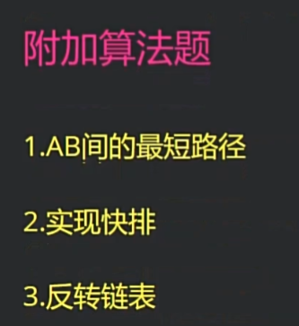
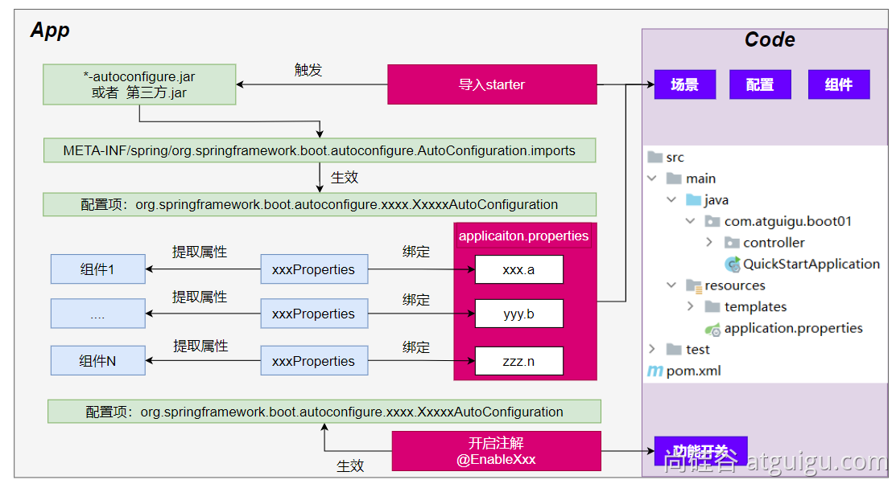
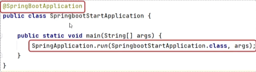
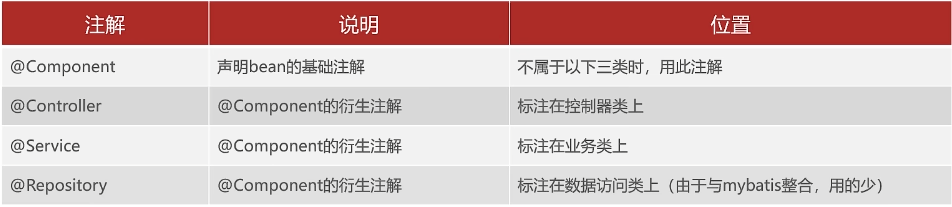
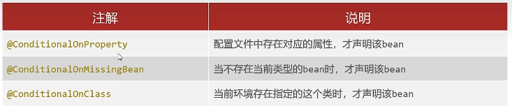
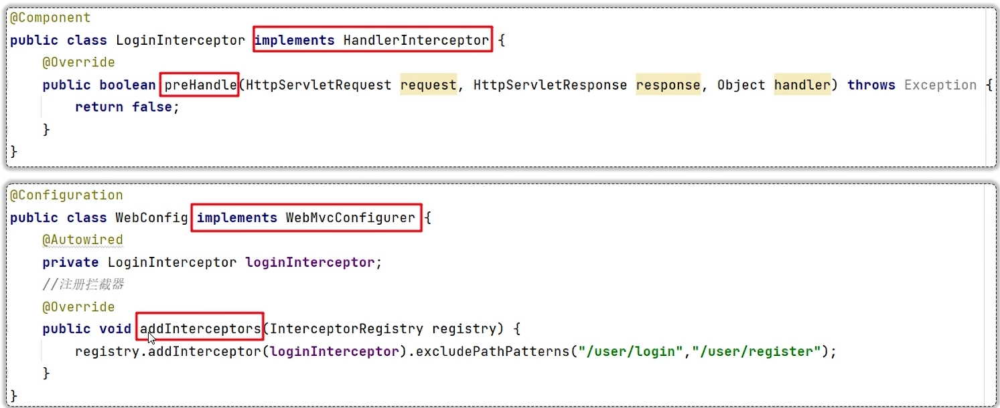

# SpringBoot3

### 01 SpringBoot特性

- 起步依赖：将所需要的依赖都整合到一块
- 自动配置
- 其他特性
  - 内嵌的Tomcat、Jetty（无需部署WAR文件）
  - 外部化配置
  - 不需要XML配置（properties/yml）


### 2.自动配置机制

- 默认的包扫描规则

  `@SpringBootApplication` 标注的类就是主程序类

​	**SpringBoot只会扫描主程序所在的包及其下面的子包，自动的component-scan功能**

- 自定义扫描路径

​	@SpringBootApplication(scanBasePackages = "com.atguigu")

​	@ComponentScan("com.atguigu") 直接指定扫描的路径

- **配置默认值**

​	**配置文件**的所有配置项是和某个**类的对象**值进行一一绑定的。

​	绑定了配置文件中每一项值的类： **属性类**。

​	比如：

​	`ServerProperties`绑定了所有Tomcat服务器有关的配置

​	`MultipartProperties`绑定了所有文件上传相关的配置

- 按需加载自动配置

​	导入场景`spring-boot-starter-web`场景启动器除了会导入相关功能依赖，导入一个`spring-boot-starter`，是所有`starter`的`starter`，基础核心	starter

​	`spring-boot-starter`导入了一个包 `spring-boot-autoconfigure`。包里面都是各种场景的`AutoConfiguration`**自动配置类**

​	虽然全场景的自动配置都在 `spring-boot-autoconfigure`这个包，但是不是全都开启的。

​	导入哪个场景就开启哪个自动配置

​	总结： 导入场景启动器、触发 `spring-boot-autoconfigure`这个包的自动配置生效、容器中就会具有相关场景的功能

- **多文档合并**

- 使用`---`可以把多个yaml文档合并在一个文档中，每个文档区依然认为内容独立


### 03 日志

**可以打印从浏览器中请求的参数，自己方法定义的**

```java
@Slf4j
@RestController
public class HelloController {
    @GetMapping("/h")
    public String hello(String a,String b){

        log.trace("trace 日志...");
        log.debug("debug 日志...");
        log.info("info 日志...参数a:{} b:{}",a,b); // 可以获取浏览器传来的值
        log.warn("warn 日志...");
        log.error("error 日志");
        return "hello";
    }

}
```


```yml
# 调整日志级别
# 默认所有日志没有精确指定级别就使用root的默认级别
logging:
  level:
#    root: debug
    com.hyx.boot303logging.controller : info
    
    --- properties---
# 调整日志级别
# 默认所有日志没有精确指定级别就使用root的默认级别

logging.level.com.hyx.boot303logging.controller =  info

logging.group.abc = com.hyx.boot303logging,com.fasterxml.jackson
logging.level.abc = debug

# 1、只写名字，就生成到当前项目同位置的demo.log
# 2、写名字+路径
#    name: demo.log # 指定日志文件的路径
# 指定日志文件的名
logging.file.name= haha.log

# 归档、切割
logging.logback.rollingpolicy.file-name-pattern=${LOG_FILE}.%d{yyyy-MM-dd}.%i.gz
logging.logback.rollingpolicy.max-file-size=1MB

```


#### 04 多端内容适配(既可以返回json数据，又可以返回xml数据，xml需要配置相关依赖)

1. 默认规则

   1. SpringBoot 多端内容适配。
      - 基于请求头内容协商：（默认开启）
      - 客户端向服务端发送请求，携带HTTP标准的Accept请求头。
      - Accept: `application/json`、`text/xml`、`text/yaml`
      - 服务端根据客户端请求头期望的数据类型进行动态返回

   2. 基于请求参数内容协商：（需要开启）
      - 发送请求 GET /projects/spring-boot?format=json 
      - 匹配到 @GetMapping("/projects/spring-boot") 
      - 根据**参数协商**，优先返回 json 类型数据【**需要开启参数匹配设置**】
      - 发送请求 GET /projects/spring-boot?format=xml,优先返回 xml 类型数据

```yml
spring:
  mvc:
    contentnegotiation:
      favor-parameter: true # 开启基于请求参数的协商功能，默认参数是format
      parameter-name: type
  thymeleaf:   # spring.thymeleaf
    prefix: classpath:/templates/
    suffix: .html
    cache: false # 禁止缓存，开发期间关闭，上线以后开启

# 当发生错误以后，错误请求转发给 /error 进行处理
server:
  error:
    path: /error

```

在pojo类上添加注解表明

```java
@JacksonXmlRootElement // 可以写出为xml文档
```


### SpringBoot生命周期全流程（8步）

starting（启动）-> environmentPrepared（环境准备完成）

-> contextPrepared（ioc创建，准备完成、主程序未加载） -> contextLoaded（ioc 加载，并未刷新） -> strated（ioc刷新，runner未调用） -> ready（ioc 刷新，runner调用完成）

-> failed （启动失败，感知包含的6个过程的错误） / context.isRunning() 运行中


# 2. 自动配置原理

## 1. 入门理解

应用关注的**三大核心**：**场景**、**配置**、**组件**

### 1. 自动配置流程



1. 导入`starter`

2. 依赖导入`autoconfigure`

3. 寻找类路径下 `META-INF/spring/org.springframework.boot.autoconfigure.AutoConfiguration.imports`文件

4. 启动，加载所有 `自动配置类` `xxxAutoConfiguration`

5. 给容器中配置**功能**`组件`

6. `组件参数`绑定到 `属性类`中。`xxxProperties`

7. `属性类`和`配置文件`前缀项绑定

8. `@Contional派生的条件注解`进行判断**是否组件生效**

9. 效果：

10. 修改配置文件，修改底层参数

11. 所有场景自动配置好直接使用

12. 可以注入SpringBoot配置好的组件随时使用

    

- **Java中的SPI（Service Provider Interface）是一种软件设计模式，用于**在应用程序中动态地发现和加载组件。SPI的思想是，定义一个接口或抽象类，然后通过在classpath中定义实现该接口的类来实现对组件的动态发现和加载。

## 自定义strater流程

1. 将代码的公共部分抽取出来（包括pml的配置依赖）

2. 在自定义的starter中定义一个自动配置类，用来获取starter中配置组件

   ```java
   /**
    * hyx
    * 机器人的自动配置类
    * 使用 Import 注解给容器中导入Robot功能要用的所有组件
    */
   @Import({RobotController.class, RobotProperties.class, RobotService.class})
   @Configuration
   public class RobotAutoConfiguration {
   }
   ```

3. 定义一个注解，导入自动配置类

   ```java
   @Retention(RetentionPolicy.RUNTIME)
   @Target(ElementType.TYPE)
   @Documented
   @Import(RobotAutoConfiguration.class)
   public @interface EnableRobot {
   }
   ```

4. 完全自动配置

   - 依赖SpringBoot的SPI机制
   - META-INF/spring/org.springframework.boot.autoconfigure.AutoConfiguration.imports 文件中编写好我们自动配置类的全类名即可
   - 项目启动，自动加载我们的自动配置类

   ```imports
   com.hyx.starter.robot.RobotAutoConfiguration
   ```

   


### 02 SpringBoot入门

1. 创建maven工程
2. 导入spring-boot-stater-web起步依赖
3. 编写Controller
4. 提供启动类




### 学习路径

1. 配置文件
2. 整合MyBatis
3. Bean管理
4. 自动配置原理
5. 自定义stater


### 03 配置文件

- properties配置文件
- yaml配置文件


##### 配置文件格式

- SpringBoot提供了多种属性配置方式

  - application.properties

    ```properties
    # 修改配置端口号
    server.port=9090
    # 修改虚拟目录 (访问时就需要这样：http://localhost:9090/start/hello)
    server.servlet.context-path=/start
    
    ```

  - application.yml / application.yaml（开发中更常用）

    ```yml
    server:
      port: 9191
      servlet:
        context-path: /start2
    ```

- yml配置信息书写与获取

  1. 三方技术配置信息
  2. 自定义配置信息

  - 值前边必须有空格，作为分隔符

  - 使用空格作为缩进表示层级关系，相同的层级左侧对齐

  

  yml配置信息书写

  ```yml
  # 发件人相关信息(自定义配置信息)
  email:
    user: 3259679405.com
    code: qweretyutoiu
    host: smtp.qq.com
    auth: true
  # 学生的爱好（配置数组信息）
  hobbies:
    - 打篮球
    - rap
    - 打豆豆
    - 打游戏
  ```

  yml配置信息获取

  1. @Value("${键名}")

  ```yml
  @Value("${email.user}")
  public String user;
  ```

  2. @ConfigurationProperties(prefix="前缀")

     实体类的成员变量名与配置文件中的键名保持一致

  ```yml
  @ConfigurationProperties(prefix="email")
  ```

  

### 04 整合mybatis

1. 添加pom依赖

   ```xml
           <!--mysql的驱动依赖-->
           <dependency>
               <groupId>com.mysql</groupId>
               <artifactId>mysql-connector-j</artifactId>
           </dependency>
   
           <!--mybatis的起步依赖-->
           <!-- https://mvnrepository.com/artifact/org.mybatis.spring.boot/mybatis-spring-boot-starter -->
           <dependency>
               <groupId>org.mybatis.spring.boot</groupId>
               <artifactId>mybatis-spring-boot-starter</artifactId>
               <version>3.0.3</version>
           </dependency>
   ```

2. 在yml文件中配置数据源信息

   ```yml
   spring:
     datasource:
       driver-class-name: com.mysql.cj.jdbc.Driver
       url: jdbc:mysql://localhost:3306/mybatis
       username: root
       password: 123456
   ```

3. 编写配置文件


### 05 Bean管理

- Bean扫描
- Bean注册
- 注册条件

##### Bean扫描

1. **spring使用的Bean扫描**

- 标签

  ```xml
  <context:component-scan base-package="com.itheima"/>
  ```

- 注解

  ```xml
  @ComponentScan(basePackages="com.itheima")
  ```

2. **springboot使用的Bean扫描**

- @SpringBootApplication

  ```java
  包括三个注解
  @SpringBootConfiguration
  @EnableAutoConfiguration
  @ComponentScan
  ```

  SpringBoot默认扫描启动类所在的包及其子包

##### Bean注册



如果要注册的bean对象来自于第三方(不是自定义的)，是无法用@Component 及衍生注解声明bean的

自定义：

- @Bean

  如果要注册的bean对象来自于第三方（不是自定义的），是无法用@Component及衍生注解声明Bean的。

  建议在配置类中集中注册

  ```java
  @Configuration
  public class CommonConfig { // 配置类
  
      // 注入Country对象
      @Bean
      public Country country(){
          return new Country();
      }
  
  }
  ```

- @Import

  1. 导入配置类

     直接导入配置文件

  ```java
  @Import(CommonConfig.class)
  ```

  2. 导入 ImportSelector 接口实现类（需要配置文件 common.imports）

     ```java
     public class CommonImportSelector implements ImportSelector {
         @Override
         public String[] selectImports(AnnotationMetadata importingClassMetadata) {
             // 读取配置文件的内容
             List<String> imports = new ArrayList<>();
             InputStream resourceAsStream = CommonImportSelector.class.getClassLoader().getResourceAsStream("common.imports");
             BufferedReader br = new BufferedReader(new InputStreamReader(resourceAsStream));
             String line = null;
             try {
                 while ((line = br.readLine()) != null) {
                     imports.add(line);
                 }
     
             } catch (IOException e) {
                 e.printStackTrace();
             } finally {
                 if (br != null) {
                     try {
                         br.close();
                     } catch (IOException e) {
                         throw new RuntimeException(e);
                     }
                 }
                 if (resourceAsStream != null) {
                     try {
                         resourceAsStream.close();
                     } catch (IOException e) {
                         throw new RuntimeException(e);
                     }
                 }
             }
     
             // 将集合转化为字符串数组传过去
             return imports.toArray(new String[0]);
         }
     }
     
     ```

     common.imports配置文件（放的是全限定类名）：

     com.ithemai.config.CommonConfig

  3. @EnableXxx注解，封装 @Import注解


##### 注册条件

SpringBoot提供了设置注册生效条件的注解@Conditional




### 06 自动配置原理（面试）

自动配置

遵循约定大约配置的原则，在boot程序启动后，起步依赖中的一些bean对象会自动注入到ioc容器

**说一说SpringBoot自动配置原理**

在主启动类上添加了SpringBootApplication注解,这个注解组合了EnableAutoConfiguration注解

EnableAutoConfiguration 注解又组合了Import注解,导入了AutoConfigurationlmportSelector 类

实现selectlmports方法,这个方法经过层层调用,最终会读取META-INF目录下的后缀名为imports的文件,当然了,boot2.7以前的版本,读取的是spring.factories文件,

读取到全类名了之后,会解析注册条件,也就是@Conditional及其衍生注解,把满足注册条件的Bean对象自动注入到Ioc容器中

##### 自定义starter

需求：自定义mybatis的starter

步骤：

- 创建dmybatis-spring-boot-autoconfigure模块，提供自动配置功能，并自定义配置文件META-INF/spring/xxx.imports
- 创建dmybatis-spring-boot-starter模块，在starter中引入自动配置模块

##### 


步骤
使用Spring Validation,对注册接口的参数进行合法性校验

1. 引入Spring Validation起步依赖
2. 在参数前面添加@Pattern注解
3. 在Controller类上添加@Validated注解


登录认证

在未登录的情况下，可以访问的其他资源（解决办法：session或者令牌）

令牌就是一段字符串

- 承载业务数据,减少后续请求查询数据库的次数
- 防篡改,保证信息的合法性和有效性

##### JWT

- 全称:JSON Web Token (https://jwt.io/)
- 定义了一种简洁的、自包含的格式，用于通信双方以**json**数据格式**安全**的传输信息。

- 组成:
  - 第一部分:Header(头)，记录令牌类型、签名算法等。例如: "alg"."HS256" "type":"JWT")
  - 第二部分: Payload(有效载荷)，携带一些自定义信息、默认信息等。例如:{"id":"1","username":"Tom"}
  - 第三部分:Signature(签名)，防止Token被篡改、确保安全性。将header、payload，并加入指定秘钥，通过指定签名算法计算而来。


**判断登录状态（添加拦截器）**



编写拦截器

```java
@Component
public class LoginInterceptor implements HandlerInterceptor {

    @Override
    public boolean preHandle(HttpServletRequest request, HttpServletResponse response, Object handler) throws Exception {
        // 令牌验证
        String token = request.getHeader("Authorization");
        // 验证token
        try {
            Map<String, Object> cliams = JwtUtil.parseToken(token);
            return true;//放行
        } catch (Exception e) {
            // http的响应状态码为401
            response.setStatus(401);
            // 不放行
            return false;
        }
    }
}
```

注册拦截器：

```java
@Configuration
public class WebConfig implements WebMvcConfigurer {

    @Autowired
    private LoginInterceptor loginInterceptor;

    // 注册拦截器
    @Override
    public void addInterceptors(InterceptorRegistry registry) {
        // 登录接口和注册接口不拦截
        registry.addInterceptor(loginInterceptor).excludePathPatterns("/user/login", "/user/register");
    }
}
```


mybatis:
  configuration:
    map-underscore-to-camel-case: true *#* *开启驼峰命名和下划线的自动转换*

Thredlocal

提供线程局部变量

- 用来存取数据：set()/get()
- 使用ThreadLocal存储的数据，线程安全
- 用完记得调用remove方法释放

主要有两个功能，

1. 实现资源对象的线程隔离，避免因征用资源引发的线程安全问题;

2. 实现同一线程内资源的共享


