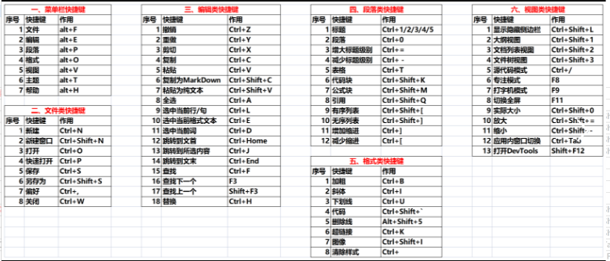

## 常用快捷键

### 一、菜单栏快捷键

```markdown
文件：alt+F
编辑：alt+E
段落：alt+P
格式：alt+O
视图：alt+V
主题：alt+T
帮助：alt+H
```

### 二、文件类快捷键

```markdown
新建：Ctrl+N
新建窗口：Ctrl+Shift+N
打开：Ctrl+O
快速打开：Ctrl+P
保存：Ctrl+S
另存为：Ctrl+Shift+S
偏好：Ctrl+,
关闭：Ctrl+W
```

### 三、编辑类快捷键

```markdown
撤销：Ctrl+Z
重做：Ctrl+Y
剪切：Ctrl+X
复制：Ctrl+C
粘贴：Ctrl+V
复制为MarkDown：Ctrl+Shift+C
粘贴为纯文本：Ctrl+Shift+V
全选：Ctrl+A
选中当前行/句：Ctrl+L
选中当前格式文本：Ctrl+E
选中当前词：Ctrl+D
跳转到文首：Ctrl+Home
跳转到所选内容：Ctrl+J
跳转到文末：Ctrl+End
查找：Ctrl+F
查找下一个：F3
查找上一个：Shift+F3
替换：Ctrl+H
```

### 四、段落类快捷键

```markdown
标题：Ctrl+1/2/3/4/5
段落：Ctrl+0
增大标题级别：Ctrl+=
减少标题级别：Ctrl±
表格：Ctrl+T
代码块：Ctrl+Shift+K
公式块：Ctrl+Shift+M
引用：Ctrl+Shift+Q
有序列表：Ctrl+Shift+[
无序列表：Ctrl+Shift+]
增加缩进：Ctrl+]
减少缩进：Ctrl+[
```

### 五、格式类快捷键

```
加粗：Ctrl+B
斜体：Ctrl+I
下划线：Ctrl+U
代码：Ctrl+Shift+K
删除线：Alt+Shift+5
超链接：Ctrl+K
图像：Ctrl+Shift+I
清除样式：Ctrl+
```

### 六、视图类快捷键

```
显示隐藏侧边栏：Ctrl+Shift+L
大纲视图：Ctrl+Shift+1
文档列表视图：Ctrl+Shift+2
文件树视图：Ctrl+Shift+3
源代码模式：Ctrl+/
专注模式：F8
打字机模式：F9
切换全屏：F11
实际大小：Ctrl+Shift+0
放大：Ctrl+Shift+=
缩小：Ctrl+Shift±
应用内窗口切换：Ctrl+Tab
打开DevTools：Shift+F12
```


上次看到这个视频还是在12H之前![[泠鸢yousa_大哭]](images/typora快捷键/3f757b147b9b1e201470eae7dac9cc0360172569.png@112w_112h.webp)，已同步到视频笔记，手机端右上角三个点笔记选项。
省流![[水瓶座_灌水]](images/typora快捷键/57b277a56c5833460c8399c4a7b317eb98831095.png@112w_112h.webp)小管家:
✔Java一条龙服务
《卷》
阶段①:Java入门，培养兴趣
\>在线写代码:菜鸟工具
\>记笔记:typora+markdown语法（可导HTML）
\>多写代码，少背代码
\>找资料小技巧:评论区，新视频
<Java知识>
基础语法，面向![[热词系列_对象]](images/typora快捷键/a41763740a90c2b11bf282bf44ccee78066c98ff.png@112w_112h.webp)。


（课程推荐韩顺平老师的0基础30天入门Java)


Java8（宋红康老师的Java8入门视频）
阶段②:巩固基础【1星期】
《Java核心技术卷1》
牛客网刷题
数据结构算法练习（leetbook）
计算机网络
计算机基础
操作系统
（先看些有趣的书籍，当成课外书）
阶段③:Java企业开发基础
数据库入门（7天，老杜MySQL入门视频，SQL自学网）
学习开发框架（Java web——>spring5，spring mvc，mybatis，springboot框架——>同一家视频教程>尚硅谷老师）
开发规范（保命用——>阿里巴巴Java开发手册）
git，github（《GitHub漫游指南》）
Linux服务器（……）
前端基础（HTML，css，Java script，vue）
阶段④:Java企业开发进阶
设计模式（……）
中间件
（Redis缓存，RebbitMQ消息对列，nginx网关）
netty网络编程
微服务（springcloud，springcloud alibaba）
接口管理（尚硅谷老师的视频）
容器技术（docker，K8S，狂神老师的教程）
ci/cd（狂神老师）
阶段⑤:项目实战
【干货资源】
阶段⑥:Java高级知识
并发编程（尚硅谷老师的教程）
jvm Java虚拟机（重点，尚硅谷老师，宋老师，狂神老师等)
架构设计
阶段⑦:Java求职
\>尽早规划
\>雕琢简历
\>多读面经
\>多参与面试
\>持续复盘总结
【干货资源】
阶段⑧:持续学习
深入学习源码，了解底层原理，更多数据库中间键分布式技术，面相业务的解决方案，提升架构能力，大数据【干货资源】