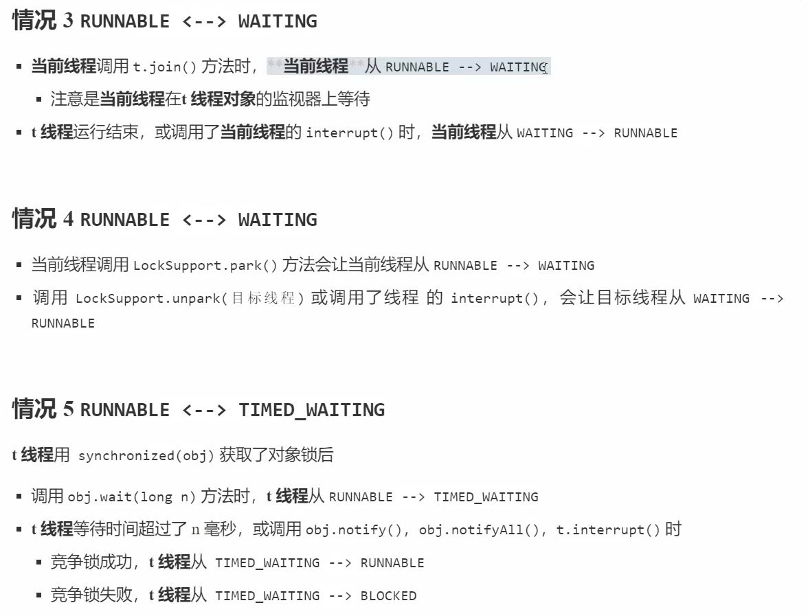
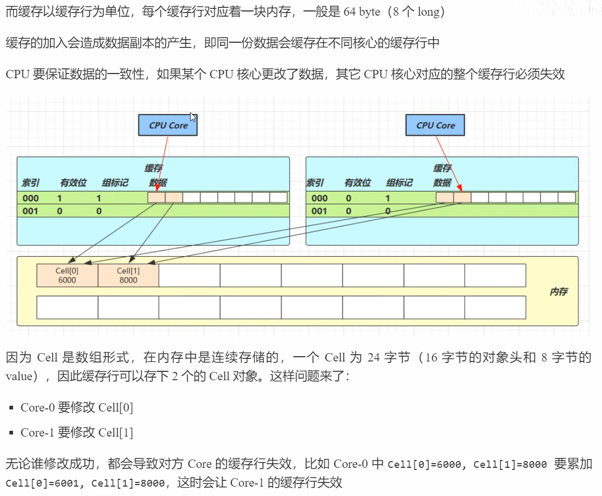
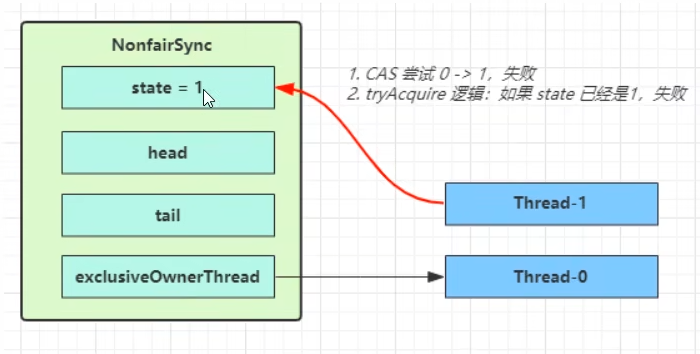
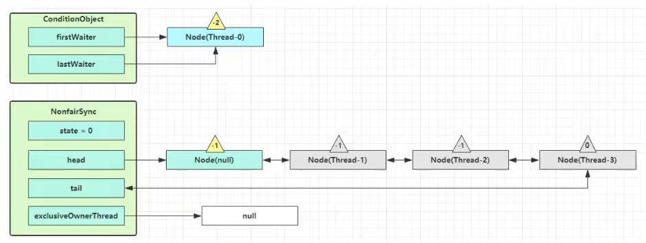
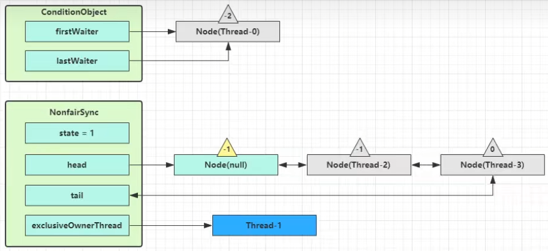

# JUC（cheer up）

##### 应用之提高效率（案例1）

充分利用多核cpu的优势，提高运行效率。单核的不行。

##### 结论：

1. 单核cpu下，多线程不能实际提高程序运行效率，只是为了能够在不同的任务之间切换，不同线程轮流使用

   cpu，不至于一个线程总占用cpu，别的线程没法干活

2. 多核cpu可以并行跑多个线程，但能否提高程序运行效率还是要分情况的

   - 有些任务，经过精心设计，将任务拆分，并行执行，当然可以提高程序的运行效率。但不是所有计算任务都能拆分(参考后文的【阿姆达尔定律】)
   - 也不是所有任务都需要拆分，任务的目的如果不同，谈拆分和效率没啥意义

3. IO操作不占用cpu，只是我们一般拷贝文件使用的是【阻塞IO】，这时相当于线程虽然不用cpu，但需要一直

   等待IO结束，没能充分利用线程。所以才有后面的【非阻塞IO】和【异步IO】优化

# 3. Java线程

本章内容

- 创建和运行线程
- 查看线程
- 线程API
- 线程状态

## 3.1 创建和运行线程

##### 方法一，直接使用Thread

```java
 Thread thread = new Thread() {
            @Override
            public void run() {
                log.debug("running");
            }
        };
        thread.setName("t1");
        thread.start();
// 或者这样更简洁
        Thread thread = new Thread(() -> log.debug("running"),"t1");
        thread.start();
```

##### 方法二，使用Runnable 配合 Thread

把线程 和 任务 （要执行的代码）分开

- Thread 代表线程
- Runnable 可运行的任务（线程要执行的代码）

```java
        Runnable t2 = () -> log.debug("running");
        Thread thread1 = new Thread(t2);
        thread1.setName("t2");
        thread1.start();
```

##### 方法三，FutureTask 配合 Thread

Future Task能够接收Callable类型的参数，用来处理有返回结果的情况

```java
        FutureTask<Integer> integerFutureTask = new FutureTask<>(new Callable<Integer>() {
            @Override
            public Integer call() throws Exception {
                log.debug("running ......");
                Thread.sleep(2000);
                return 100;
            }
        });
        Thread t1 = new Thread(integerFutureTask,"t1");
        t1.start();
        log.debug("{}",integerFutureTask.get());
```

## 3.2 查看进程线程的方法

**windows**

- 任务管理器可以查看进程和线程数,也可以用来杀死进程
- tasklist  查看进程
  - tasklist | findstr java：通过管道运算符，筛选 名字中带有 java 的进程
- taskkill  杀死进程

**linux**

- ps -fe 查看所有进程
- ps -fT -p  <PID>    查看某个进程(PID)的所有线程
- kill   杀死进程
- top 按大写H切换是否显示线程
- top -H -p <PID>查看某个进程(PID)的所有线程

**Java**

- jps	命令查看所有Java进程
- jstack     <PID>查看某个Java进程(PID)的所有线程状态
- jconsole     来查看某个Java进程中线程的运行情况(图形界面)

## 3.3 原理之线程运行

#### 栈与栈帧

我们都知道JVM中由堆、栈、方法区所组成，其中栈内存是给谁用的呢?其实就是线程，每个线程启动后，虚拟机就会为其分配一块栈内存。

- 每个栈由多个栈帧(Frame)组成，对应着每次方法调用时所占用的内存
- 每个线程只能有一个活动栈帧，对应着当前正在执行的那个方法

### 线程上下文切换(Thread Context Switch)

因为以下一些原因导致cpu不再执行当前的线程，转而执行另一个线程的代码

- 线程的cpu时间片用完

- 垃圾回收

- 有更高优先级的线程需要运行

- 线程自己调用了sleep、yield、wait、join、park、synchronized、lock等方法

  当Context Switch 发生时，需要由操作系统保存当前线程的状态，并恢复另一个线程的状态，Java 中对应的概念就是程序计数器(Program Counter Register)，它的作用是记住下一条jvm指令的执行地址，是线程私有的

- 状态包括程序计数器、虚拟机栈中每个栈帧的信息，如局部变量、操作数栈、返回地址等

- Context Switch频繁发生会影响性能

## 3.4 常见方法


## 3.5 start 与 run

## 3.6 sleep 与 yield

#### sleep

1. 调用sleep 会让当前线程从Running进入Timed Waiting（阻塞）状态
2. 其它线程可以使用interrupt方法打断正在睡眠的线程，这时 sleep 方法会抛出InterruptedException
3. 睡眠结束后的线程未必会立刻得到执行
4. 建议用 TimeUnit 的sleep 代替 Thread 的sleep来获得更好的可读性

```java
 Thread t1 = new Thread(() -> {
            try {
                Thread.sleep(2000);
            } catch (InterruptedException e) {
                log.debug("wake up......");
                e.printStackTrace();
            }
        }, "t1");
        t1.start();

        Thread.sleep(1000);
        log.debug("interrupt......");
        // 打断 t1 的睡眠状态
        t1.interrupt();
```

```java
        // TimeUnit : 睡眠一秒
        TimeUnit.SECONDS.sleep(1000);
```

#### yield

1. 调用yield 会让当前线程从Running 进入Runnable(就绪) 状态，然后调度执行其它同优先级的线程。如果这时没有同优先级的线程，那么不能保证让当前线程暂停的效果
2. 具体的实现依赖于操作系统的任务调度器

## 线程优先级

- 线程优先级会提示(hint)调度器优先调度该线程，但它仅仅是一个提示，调度器可以忽略它
- 如果cpu 比较忙，那么优先级高的线程会获得更多的时间片，但cpu闲时，优先级几乎没作用不使用yield

## 3.7 join 方法详解

**为什么需要join**

等待某个方法运行结束

以调用方角度来讲，如果

- 需要等待结果返回，才能继续运行就是同步
- 不需要等待结果返回，就能继续运行就是异步

## 3.8 interrupt 方法详解

##### 打断`sleep`，`wait`，`join` （阻塞状态）的线程

打断sleep 的线程,会清空打断状态，以sleep为例

```java
        Thread t1 = new Thread(() -> {
            log.debug("sleep");
            try {
                Thread.sleep(5000); // sleep、wait、join会清空打断标记
            } catch (InterruptedException e) {
                throw new RuntimeException(e);
            }
        }, "t1");

        t1.start();
        TimeUnit.SECONDS.sleep(1);
        log.debug("interrupt...");
        t1.interrupt();
        log.debug("打断标记： {}",t1.isInterrupted()); // 打断标记为 false
```

##### 打断正常运行的线程

打断正常运行的线程，不会清空打断状态

```java
        Thread t1 = new Thread(() ->{
            while (true){
                // 如果打断标记为真。则退出线程
                if(Thread.currentThread().isInterrupted()){
                    log.debug("被打断了，退出循环");
                    break;
                }
            }
        },"t1");
        t1.start();
        Thread.sleep(1000);
        log.debug("interrupt...");
// interrupt 并不会直接打断正在进行的线程，会将打断标记置为true，可以根据打断标记来打断线程
        t1.interrupt();
```

##### 两阶段终止模式


代码实现：

```java
@Slf4j(topic = "c.Test10TwoPhaseTermination")
public class Test10TwoPhaseTermination {
    public static void main(String[] args) throws InterruptedException {
        TwoPhaseTermination tpt = new TwoPhaseTermination();
        tpt.start();
        TimeUnit.SECONDS.sleep(3);
        tpt.stop();
    }
}

@Slf4j(topic = "c.TwoPhaseTermination")
class TwoPhaseTermination{
    private Thread monitor;
    
    // 启动监控线程
    public void start(){
        monitor = new Thread(()->{
            while (true){
                // 判断是否被打断
                if (Thread.currentThread().isInterrupted()){
                    log.debug("料理后事");
                    break;
                }
                try {
                    Thread.sleep(1000); // 情况1
                    log.debug("执行监控记录"); // 情况2
                } catch (InterruptedException e) {
                    e.printStackTrace();
                    // 重新设置打断标记
                    Thread.currentThread().interrupt();
                }
            }
        },"t1");
        monitor.start();
    }
    // 停止监控线程
    public void stop(){
        monitor.interrupt();
    }
}
```

##### 注意：

- isInterrupted()：判断是否被打断，**<u>不会</u>**清除打断标记
- interrupted() static 判断当前线程是否被打断，**<u>会</u>**清除打断标记

### 打断 park 线程

打断 park 线程,**<u>不会</u>**清空打断状态

```java
@Slf4j(topic = "c.Test11Park")
public class Test11Park {
    public static void main(String[] args) throws InterruptedException {
        test3();
    }

    private static void test3() throws InterruptedException {
        Thread t1 = new Thread(()->{
            log.debug("park...");
            LockSupport.park();
            log.debug("unpark...");
//            log.debug("打断状态：{}",Thread.currentThread().isInterrupted());
            // Thread.interrupted():判断是否被打断，清空打断标记。
            log.debug("打断状态：{}",Thread.interrupted());

 			// 当打断标记为 true 时，park()会失效
            LockSupport.park(); // 只有当打断标记为 false 时，park()才会生效
            log.debug("unpark...");
        },"t1");
        t1.start();

        sleep(1);
        t1.interrupt();
    }
}
```


## 3.9 不推荐的方法

还有一些不推荐使用的方法，这些方法已过时，容易破坏同步代码块，造成线程死锁

|  方法名  |      功能说明      |
| :------: | :----------------: |
|  stop()  |    停止线程运行    |
| suspend( | 挂起(暂停)线程运行 |
| resume() |    恢复线程运行    |


## 3.10 主线程与守护线程

默认情况下，Java进程需要等待所有线程都运行结束，才会结束。有一种特殊的线程叫做守护线程，只要其它非守护线程运行结束了，即使守护线程的代码没有执行完，也会强制结束。

```java
@Slf4j(topic = "c.Test12SetDaemon")
public class Test12SetDaemon {
    public static void main(String[] args) throws InterruptedException {
        Thread t1 = new Thread(() -> {
            while (true) {
                if (Thread.currentThread().isInterrupted()) {
                    break;
                }
            }
            log.debug("结束");
        }, "t1");
        // 设置 t1 为守护线程
        t1.setDaemon(true);
        t1.start();

        Thread.sleep(1000);
        log.debug("结束");
    }
}
```

**注意：**

- 垃圾回收器线程就是一种守护线程
- Tomcat 中的 Acceptor 和 Poller 线程都是守护线程，所以 Tomcat 接收到 shutdown 命令后，不会等待它们处理完当前请求。


## 3.11 五种状态

这是从 **操作系统** 层面来描述的


- 【初始状态】仅是在语言层面创建了线程对象，还未与操作系统线程关联

- 【可运行状态】（就绪状态）指该线程已经被创建(与操作系统线程关联)，可以由CPU调度执行

- 【运行状态】指获取了CPU时间片运行中的状态

  - 当CPU时间片用完，会从【运行状态】转换至【可运行状态】，会导致线程的上下文切换

- 【阻塞状态】

  - 如果调用了阻塞API，如BIO读写文件，这时该线程实际不会用到CPU，会导致线程上下文切换，进入【阻塞状态】

  - 等BIO操作完毕，会由操作系统唤醒阻塞的线程，转换至【可运行状态】

  - 与【可运行状态】的区别是，对【阻塞状态】的线程来说只要它们一直不唤醒，调度器就一直不会考虑调

    度它们

- 【终止状态】表示线程已经执行完毕，生命周期已经结束，不会再转换为其它状态


## 3.12 六种状态

这是从 Java API 层面来描述的

根据 Thread State 枚举，分为六种状态


- NEW 线程刚被创建,但是还没有调用 start() 方法
- RUNNABLE当调用了start()方法之后，注意，Java API层面的 RUNNABLE状态涵盖了操作系统层面的【可运行状态】、【运行状态】和【阻塞状态】(由于BIO导致的线程阻塞，在Java里无法区分，仍然认为是可运行)

- BLOCKED，WAITING，TIMED_WAITING都是Java API层面对【阻塞状态】的细分，后面会在状态转换一节详述
- TERMINATED当线程代码运行结束

## 本章小结

**本章的重点在于掌握**

- 线程创建
- 线程重要api，如start，run，sleep，join，interrupt等
- 线程状态
- 应用方面
  - 异步调用:主线程执行期间，其它线程异步执行耗时操作
  - 提高效率:并行计算，缩短运算时间
  - 同步等待: join
  - 统筹规划:合理使用线程，得到最优效果
- 原理方面
  - 线程运行流程:栈、栈帧、上下文切换、程序计数器
  - Thread 两种创建方式的源码
- 模式方面
  - 两阶段终止


# 4.共享模型之管程（monitor）

##### 本章内容

- 共享问题
- synchronized
- 线程安全分析
- Monitor
- wait/notify
- 线程状态转换
- 活跃性
- Lock


## 4.1 共享问题

#### 临界区

- 一个程序运行多个线程本身是没有问题的
- 问题出在多个线程访问**共享资源**
  - 多个线程读**共享资源**其实也没有问题
  - 在多个线程对**共享资源**读写操作时发生指令交错，就会出现问题
- 一段代码块内如果存在对**共享资源**的多线程读写操作，称这段代码块为**临界区**

#### 竞态条件

多个线程在临界区内执行，由于代码的**执行序列不同**而导致结果无法预测,称之为发生了**竞态条件**

## 4.2 synchronized 解决方案

##### synchronized 语法：

```
synchronized(对象)
{
	临界区
}
```


#### 应用之互斥

为了避免临界区的竞态条件发生，有多种手段可以达到目的。

- 阻塞式的解决方案: synchronized，Lock
- 非阻塞式的解决方案<u>:原子变量</u>

本次课使用阻塞式的解决方案: synchronized，来解决上述问题，即俗称的【对象锁】，它采用互斥的方式让同一时刻至多只有一个线程能持有【对象锁】，其它线程再想获取这个【对象锁】时就会阻塞住。这样就能保证拥有锁的线程可以安全的执行临界区内的代码，不用担心线程上下文切换

- 注意

  虽然java中互斥和同步都可以采用synchronized关键字来完成，但它们还是有区别的:

  - 互斥是保证临界区的竞态条件发生，同一时刻只能有一个线程执行临界区代码
  - 同步是由于线程执行的先后、顺序不同、需要一个线程等待其它线程运行到某个点

执行流程


### 思考

synchronized实际是用**对象锁**保证了**临界区内代码的原子性**，临界区内的代码对外是不可分割的，不会被线程切换所打断。

为了加深理解，请思考下面的问题

- 如果把synchronized(obj)放在for循环的外面，如何理解?
- 如果t1 synchronized(obj1)而t2 synchronized(obj2)会怎样运作?
- 如果t1 synchronized(obj)而t2没有加会怎么样?如何理解? -- 锁对象


### 面向对象改进


## 4.3 方法上的 synchronized

```java
class Test{
    public synchronized void test(){
        
    }
}
等价于
class Test{
    public void test(){
        synchronized(this){ // 锁住的是this 对象
            
        }
    }
}
```

```java
class Test{
    public synchronized static void test(){
        
    }
}
等价于
class Test{
    public static void test(){
        synchronized(Test.class){ // 锁住的是类对象
            
        }
    }
}
```

#### 不加synchronized的方法

不加synchronzied 的方法就好比不遵守规则的人，不去老实排队（好比翻窗户进去的)


### 所谓的“线程八锁”

其实就是考察synchronized锁住的是哪个对象


## 4.4 变量的线程安全分析

####   成员变量和静态变量是否线程安全?

- 如果它们没有共享，则线程安全
- 如果它们被共享了，根据它们的状态是否能够改变，又分两种情况
  - 如果只有读操作，则线程安全
  - 如果有读写操作，则这段代码是临界区，需要考虑线程安全

#### 局部变量是否线程安全?

- 局部变量是线程安全的
- 但局部变量引用的对象则未必
  - 如果该对象没有逃离方法的作用访问，它是线程安全的
  - 如果该对象逃离方法的作用范围，需要考虑线程安全

#### 局部变量线程安全分析 p66


#### 常见线程安全类

- String

- Integer

- StringBuffer

- Random

- Vector

- Hashtable

- java.util.concurrent包下的类

  这里说它们是线程安全的是指，多个线程调用它们同一个实例的某个方法时，是线程安全的。也可以理解为

  - 它们的每个方法是原子的
  - 但**注意**它们多个方法的组合不是原子的，见后面分析


#### 不可变类线程安全性

String、Integer等都是不可变类，因为其内部的状态不可以改变，因此它们的方法都是线程安全的

有同学或许有疑问，String有replace，substring等方法【可以】改变值啊，那么这些方法又是如何保证线程安全

的呢?

没有其他的成员变量可以被多个线程共享，也就是不可变，那么就是线程安全的。

其中方法中的行为是不确定的，可能导致不安全的发生，被称之为**外星方法**

##### 面试题

​	String类设计为 final，可以有效的避免多线程环境下，某个线程破坏 String 类中的方法的行为。体现了 java 中的闭合原则 。


## 4.5 习题

#### 买票练习

#### 转账练习


## 4.6 Monitor概念

#### Java 对象头

以 32 位虚拟机为例


#### Monitor（锁）

Monitor被翻译为**监视器**或**管程**

每个Java对象都可以关联一个Monitor对象，如果使用synchronized给对象上锁（重量级)之后，该对象头的 Mark Word 中就被设置指向Monitor 对象的指针

Monitor结构如下


- 刚开始Monitor中 Owner 为 null

- 当Thread-2执行synchronized(obj)就会将Monitor的所有者Owner置为Thread-2，Monitor中只能有一个Owner

- 在Thread-2上锁的过程中，如果Thread-3，Thread-4，Thread-5也来执行synchronized(obj)，就会进入EntryList BLOCKED

- Thread-2执行完同步代码块的内容，然后唤醒EntryList 中等待的线程来竞争锁，竞争的时是非公平的

- 图中WaitSet 中的Thread-0，Thread-1是之前获得过锁，但条件不满足进入 WAITING 状态的线程，后面讲

  wait-notify时会分析

  注意:

  - synchronized必须是进入同一个对象的monitor才有上述的效果
  - 不加synchronized的对象不会关联监视器，不遵从以上规则


### synchronized 原理进阶

#### 1. 轻量级锁（线程栈中的锁记录充当轻量级锁）

轻量级锁的使用场景:如果一个对象虽然有多线程访问，但多线程访问的时间是错开的（也就是没有竞争)，那么可以使用轻量级锁来优化。

轻量级锁对使用者是透明的，即语法仍然是synchronized

假设有两个方法同步块，利用同一个对象加锁


- 创建锁记录（Lock Record）对象，每个线程都的栈帧都会包含一个锁记录的结构，内部可以存储锁定对象的Mark Word


#### 2. 锁膨胀

如果在尝试加轻量级锁的过程中，CAS操作无法成功，这时一种情况就是有其它线程为此对象加上了轻量级锁(有竞争)，这时需要进行锁膨胀，将轻量级锁变为重量级锁。


#### 3. 自旋优化

重量级锁竞争的时候，还可以使用自旋来进行优化，如果当前线程自旋成功（即这时候持锁线程已经退出了同步块，释放了锁)，这时当前线程就可以避免阻塞。


#### 4. 偏向锁

轻量级锁在没有竞争时(就自己这个线程)，每次重入仍然需要执行CAS操作。

Java 6中引入了偏向锁来做进一步优化:只有第一次使用CAS将线程ID设置到对象的Mark Word头，之后发现这个线程ID是自己的就表示没有竞争，不用重新CAS。以后只要不发生竞争，这个对象就归该线程所有


#### 偏向状态

回忆一下对象头格式


#### 撤销 - 调用对象 hashCode

调用了对象的 hashCode，但偏向锁的对象 MarkWord中存储的是线程id，如果调用hashCode 会导致偏向锁被撤销

- 轻量级锁会在锁记录中记录hashCode·重量级锁会在Monitor 中记录hashCode
- 在调用hashCode后使用偏向锁，记得去掉-XX :-UseBiasedLocking

#### 撤销 - 其它线程使用对象

当有其它线程使用偏向锁对象时，会将偏向锁升级为轻量级锁

#### 撤销-调用wait/notify


#### 批量重定向

如果对象虽然被多个线程访问，但没有竞争，这时偏向了线程T1的对象仍有机会重新偏向T2，重偏向会重置对象的Thread ID

当撤销偏向锁阈值超过20次后，jvm 会这样觉得，我是不是偏向错了呢，于是会在给这些对象加锁时重新偏向至加锁线程


#### 批量撤销

当撤销偏向锁阈值超过40次后，jvm会这样觉得，自己确实偏向错了，根本就不该偏向。于是整个类的所有对象都会变为不可偏向的，新建的对象也是不可偏向的


## 4.7 wait / notify

#### 原理之 wait / notify


- Owner线程发现条件不满足，调用wait方法，即可进入WaitSet变为WAITING状态
- BLOCKED和WAITING的线程都处于阻塞状态，不占用CPU时间片
- BLOCKED线程会在Owner线程**释放锁时唤醒**
- WAITNG线程会在Owner线程**调用notify或notifyAll时唤醒**，但<u>唤醒后并不意味者立刻获得锁，仍需进入EntryList重新竞争</u>

#### API 介绍

- obj.wait()  让进入object 监视器的线程到 waitSet 等待
- obj.notify()  在 object 上正在 waitSet 等待的线程中挑一个唤醒
- obj.notifyAll()  让 object 上正在waitSet 等待的线程全部唤醒

它们都是线程之间进行协作的手段，都属于Object对象的方法。<u>必须获得此对象的锁</u>，才能调用这几个方法

wait()方法会释放对象的锁，进入WaitSet等待区，从而让其他线程就机会获取对象的锁。无限制等待，直到notify为止

wait( long n)有时限的等待,到n毫秒后结束等待，或是被notify。


#### 4.8 wait notify 的正确姿势（面试）

##### sleep(long n) 和 wait(long n)的区别（面试）

-  sleep是Thread方法，而wait是Object的方法
-  sleep不需要强制和synchronized配合使用，但wait需要和synchronized一起用
-  sleep在睡眠的同时，不会释放对象锁的，但wait在等待的时候会释放对象锁。

共同点：他们状态都是 TIMED_WAITING

正确姿势

```java
synchronized(lock){
    while(条件不成立){
        lock.wait();
	}
    // 干活
}

// 另一个线程
synchronized(lock){
    lock.notifyAll();
}
```

#### 同步模式之保护性暂停（一一对应模式）

定义：即 Guarded Suspension，用在一个线程等待另一个线程的执行结果

要点：

- 有一个结果需要从一个线程传递到另一个线程，让他们关联同一个 GuardedObject
- 如果有结果不断从一个线程到另一个线程那么可以使用消息队列 (见生产者/消费者)
- JDK中，join的实现、Future的实现，采用的就是此模式
- 因为要等待另一方的结果，因此归类到同步模式


#### 原理之 join（实际上就是使用了保护性暂停模式）

```java
    public final synchronized void join(final long millis)
    throws InterruptedException {
        if (millis > 0) {
            if (isAlive()) {
                final long startTime = System.nanoTime();
                long delay = millis;
                do {
                    wait(delay);
                } while (isAlive() && (delay = millis -
                        TimeUnit.NANOSECONDS.toMillis(System.nanoTime() - startTime)) > 0);
            }
        } else if (millis == 0) {
            while (isAlive()) {
                wait(0);
            }
        } else {
            throw new IllegalArgumentException("timeout value is negative");
        }
    }
```


#### 保护暂停模式的应用实例（解耦结果产生者和结果消费者）具体见并发编程-模式

#### 异步模式之生产者/消费者（生产者产生的消息不能立刻被消费）具体见并发编程-模式


#### 4.9 Park & Unpark

##### 基本使用

它们是 LockSupport 类中的方法

```java
// 暂停当前线程
LockSupport.park();
    
// 恢复某个线程的运行
LockSupport.unpark(暂停线程对象);
```

##### 特点

与Object的 wait & notify 相比

- wait，notify  和  notifyAll  必须配合  Object Monitor  一起使用，而  unpark  不必
- park  & unpark 是以**线程**为单位来【阻塞】和【唤醒】线程，而notify只能随机唤醒一个等待线程，notifyAll是唤醒所有等待线程，就不那么【精确】
- park & unpark可以先unpark，而wait & notify不能先notify

#### 原理之 Park & Unpark


#### 4.10 重新理解线程状态转换（重点）


假设有线程Thread t

##### 情况1  NEW <-->RUNNABLE

- 当调用t.start()方法时，由NEW -->RUNNABLE

##### 情况2 RUNNABLE <--> WAITING

**t线程**用synchronized(obj)获取了对象锁后

- 用obj.wait()方法时，t线程从RUNNABLE --> WAITING
- 调用obj.notify( ), obj.notifyAll( )， t.interrupt()时
  - 竞争锁成功，**t线程**从 WAITING --> RUNNABLE
  - 竞争锁失败，**t线程**从 WAITING --> BLOCKED




## 4.11 多把锁

#### 多把不相干的锁

将锁的粒度细分

- 好处，是可以增强并发度
- 坏处，如果一个线程需要同时获得多把锁，就容易发生死锁


## 4.12 活跃性

#### 死锁

有这样的情况:一个线程需要同时获取多把锁，这时就容易发生死锁

- t1线程获得A对象锁，接下来想获取B对象的锁
- t2线程获得B对象锁，接下来想获取A对象的锁

##### 定位死锁

- 检测死锁可以使用 jconsole工具
- 或者使用jps定位进程id，再用jstack + 进程名  定位死锁:

#### 活锁

活锁出现在两个线程互相改变对方的结束条件，最后谁也无法结束，

#### 饥饿

很多教程中把饥饿定义为，一个线程由于优先级太低，始终得不到CPU调度执行，也不能够结束，饥饿的情况不易演示，讲读写锁时会涉及饥饿问题

下面我讲一下我遇到的一个线程饥饿的例子，先来看看使用顺序加锁的方式解决之前的死锁问题


## 4.13 ReentrantLock

相对于synchronized它具备如下特点.

- 可中断
- 可以设置超时时间
- 可以设置为公平锁
- 支持多个条件变量（可以对等待条件进行细分）

与synchronized一样，都支持可重入

```java
// 获取锁
reentrantLock.lock();
try{
    // 临界区
} finally{
    // 释放锁
    reentrantLock.unlock();
}
```

#### 可重入

可重入是指同一个线程如果首次获得了这把锁，那么因为它是这把锁的拥有者，因此有权利再次获取这把锁

如果是不可重入锁，那么第二次获得锁时，自己也会被锁挡住。

#### 可打断(要用lock.lockInterruptibly();// 可打断，加入了打断机制，可以防止死锁)

```java
@Slf4j(topic = "c.Test16")
public class Test16ReentrantLockInterrupt {
    private static ReentrantLock lock = new ReentrantLock();

    public static void main(String[] args) throws InterruptedException {
        Thread t1 = new Thread(() -> {
            try {
                // 如果没有竞争那么此方法就会获取Lock对象锁
                // 如果有竞争就进入阻塞队列,可以被其它线程用interrupt方法打断
                log.debug("尝试获得锁");
                lock.lockInterruptibly();// 可打断
            } catch (InterruptedException e) {
                e.printStackTrace();
                log.debug("没有获得锁，返回");
                return;
            }

            try {
                log.debug("获取到锁");
            } finally {
                lock.unlock();
            }

        }, "t1");

        lock.lock();
        t1.start();
        TimeUnit.SECONDS.sleep(1);
        log.debug("打断 t1");
        t1.interrupt();
    }
}
```

#### 锁超时（lock.trylock(Time.Unit)// 尝试(时间)获得锁）


#### 公平锁

公平锁一般没有必要，会降低并发度，后面分析原理时会讲解

#### 条件变量

synchronized 中也有条件变量，就是我们讲原理时那个waitSet休息室，当条件不满足时进入waitSet等待

ReentrantLock的条件变量比synchronized强大之处在于，它是支持多个条件变量的，这就好比

- synchronized是那些不满足条件的线程都在一间休息室等消息
- 而ReentrantLock支持多间休息室，有专门等烟的休息室、专门等早餐的休息室、唤醒时也是按休息室来唤醒

使用流程

- await 前需要获得锁
- await 执行后，会释放锁，进入 conditionObject 等待
- await 的线程被唤醒 (或打断、或超时) 去重新竞争lock锁
- 竞争lock锁成功后，从await后继续执行

```java
    static ReentrantLock lock = new ReentrantLock();
    public static void main(String[] args) throws InterruptedException {
        // 创建一个新的条件变量（休息室）
        Condition condition1 = lock.newCondition();
        Condition condition2 = lock.newCondition();

        lock.lock();
        // 进入休息室等待
        condition1.await();

        // 唤醒休息室的线程
        condition1.signal();
        condition1.signalAll();
    }
```


#### 同步模式之顺序控制（固定运行顺序）具体见并发编程-模式

#### 交替输出之交替控制 具体见并发编程-模式

## 本章小结

本章我们需要重点掌握的是

- 分析多线程访问共享资源时，哪些代码片段属于临界区

- 使用synchronized互斥解决临界区的线程安全问题
  - 掌握synchronized锁对象语法
  - 掌握synchronzied加载成员方法和静态方法语法
  - 掌握wait/notify同步方法

- 使用lock互斥解决临界区的线程安全问题
  - 掌握lock的使用细节:可打断、锁超时、公平锁、条件变量
- 学会分析变量的线程安全性、掌握常见线程安全类的使用
- 了解线程活跃性问题:死锁、活锁、饥饿
- 应用方面
  - 互斥:使用synchronized 或Lock达到共享资源互斥效果
  - 同步:使用wait/notify或Lock的条件变量来达到线程间通信效果
- 原理方面
  -  monitor、synchronized 、wait/notify 原理
  -  synchronized进阶原理
  -  park & unpark原理
- 模式方面
  - 同步模式之保护性暂停
  - 异步模式之生产者消费者
  - 同步模式之顺序控制


# 5. 共享模型之内存（JMM）

##### 本章内容

上一章讲解的 Monitor主要关注的是访问共享变量时，保证临界区代码的原子性

这一章我们进一步深入学习共享变量在多线程间的【可见性】问题与多条指令执行时的【有序性】问题


## 5.1 Java 内存模型

JMM即 Java Memory Model，它定义了主存、工作内存抽象概念，底层对应着CPU寄存器、缓存、硬件内存、CPU指令优化等。

JMM体现在以下几个方面

- 原子性-保证指令不会受到线程上下文切换的影响
- 可见性-保证指令不会受cpu缓存的影响
- 有序性-保证指令不会受cpu指令并行优化的影响


## 5.2 可见性


分析：

1. 初始状态，t线程刚开始从主内存读取了 run 的值到工作内存。


2. 因为t线程要频繁从主内存中读取run的值，但 **<u>JIT</u>** 编译器会将run的值缓存至自己工作内存中的高速缓存中，

   减少对主存中run的访问，提高效率


3. 1秒之后，main线程修改了run的值，并同步至主存，而t是从自己工作内存中的高速缓存中读取这个变量的

   值，结果永远是旧值


#### 解决方法

volatile(易变关键字)

它可以用来修饰成员变量和静态成员变量，他可以避免线程从自己的工作缓存中查找变量的值，必须到主存中获取它的值，线程操作volatile变量都是直接操作主存


##### 注意

synchronized语句块既可以保证代码块的原子性，也同时保证代码块内变量的可见性。但缺点是synchronized是属于重量级操作，性能相对更低

如果在前面示例的死循环中加入 System.out.printIn()会发现即使不加volatile修饰符，线程t也能正确看到对run变量的修改了，想一想为什么?


## 终止模式之两阶段终止模式（改进）

## 同步模式之 Balking


## 5.3 有序性


#### 2.指令重排序优化

事实上，现代处理器会设计为一个时钟周期完成一条执行时间最长的CPU指令。为什么这么做呢?可以想到指令还

可以再划分成一个个更小的阶段，

例如，每条指令都可以分为:`取指令`–`指令译码`–`执行指令`-`内存访问`–`数据写回`这5个阶段


#### 3. 支持流水线的处理器

现代CPU支持多级指令流水线，例如支持同时执行`取指令`–`指令译码`–`执行指令`-`内存访问`–`数据写回`的处理器，就可以称之为**五级指令流水线**。这时CPU可以在一个时钟周期内，同时运行五条指令的不同阶段(相当于一条执行时间最长的复杂指令)，IPC = 1，本质上，流水线技术并不能缩短单条指令的执行时间，但它变相地提高了指令地吞吐率。


 在不改变程序结果的前提下，这些指令的各个阶段可以通过**重排序**和**组合**来实现**指令级并行**，这一技术在80's中叶到90's 中叶占据了计算架构的重要地位。

提示:  分阶段，分工是提升效率的关键!

指令重排的前提是，重排指令不能影响结果。


#### 指令重排-禁用

- 加入 volatile 关键字即可。

## volatile原理（保证了可见性和有序性）

volatile的底层实现原理是内存屏障，Memory Barrier (Memory Fence)

- 对volatile变量的写指令后会加入写屏障

- 对volatile变量的读指令前会加入读屏障

#### 1. 如何保证可见性

- 写屏障(sfence)保证在该屏障之前的，对共享变量的改动，都同步到主存当中

- 而读屏障(lfence)保证在该屏障之后，对共享变量的读取，加载的是主存中最新数据


#### 2. 如何保证有序性

- 写屏障会确保指令重排序时，不会将写屏障之前的代码排在写屏障之后

- 读屏障会确保指令重排序时，不会将读屏障之后的代码排在读屏障之前

  

还是那句话，不能解决指令交错：

- 写屏障仅仅是保证之后的读能够读到最新的结果，但不能保证读跑到它前面去
- 而有序性的保证也只是保证了本线程内相关代码不被重排序

#### 3.double-checked locking 问题

以著名的double-checked locking单例模式为例


以上的实现特点是：

- 懒惰实例化
- 首次使用getInstance()才使用synchronized 加锁，后续使用时无需加锁
- 有隐含的，但很关键的一点:第一个if使用了 INSTANCE变量，是在同步块之外

但在多线程环境下，上面的代码是有问题的，getInstance方法对应的字节码为:

#### 4.double-checked locking 解决


因为使用 volatile 关键字，加入了写屏障，阻止了指令重排序。


#### happens-before

happens-before规定了对共享变量的写操作对其它线程的读操作可见，它是可见性与有序性的一套规则总结，抛开以下happens-before规则，JMM并不能保证一个线程对共享变量的写，对于其它线程对该共享变量的读可见

- 线程解锁m之前对变量的写，对于接下来对m加锁的其它线程对该变量的读可见

  

- 线程对volatile变量的写，对接下来其它线程对该变量的读可见

  

- 线程start前对变量的写，对该线程开始后对该变量的读可见

  

- 线程结束前对变量的写，对其它线程得知它结束后的读可见(比如其它线程调用 t1.isAlive()或t1.join()等待它结束)

  

- 线程t1打断 t2 ( interrupt）前对变量的写，对于其他线程得知t2被打断后对变量的读可见（通过t2.interrupted或 t2.isInterrupted)

- 对变量默认值（0, false，null)的写，对其它线程对该变量的读可见

- 具有传递性，如果x hb-> y并且y hb-> z那么有x hb-> z，配合volatile的防指令重排，有下面的例子

  

  

## 本章小结

本章重点讲解了JMM中的

- 可见性-由JVM缓存优化引起
- 有序性-由JVM指令重排序优化引起
- happens-before规则
- 原理方面
  - CPU指令并行
  - volatile
- 模式方面
  - 两阶段终止模式的volatile改进
  - 同步模式之balking


# 6.共享模型之无锁

#### 本章内容

- CAS与volatile
- 原子整数
- 原子引用
- 原子累加器
- Unsafe


## 6.1 CAS与volatile

#### CAS

前面看到的AtomicInteger的解决方法，内部并没有用锁来保护共享变量的线程安全。那么它是如何实现的呢?


其中的关键是compareAndSet，它的简称就是CAS (也有Compare And Swap的说法)，它必须是原子操作。


#### volatile

获取共享变量时，为了保证该变量的可见性，需要使用volatile修饰。

它可以用来修饰成员变量和静态成员变量，他可以避免线程从自己的工作缓存中查找变量的值，必须到主存中获取它的值，线程操作volatile变量都是直接操作主存。即一个线程对volatile变量的修改，对另一个线程可见。

注意

- volatile仅仅保证了共享变量的可见性，让其它线程能够看到最新值，但不能解决指令交错问题〈不能保证原子性)

**<u>CAS必须借助volatile才能读取到共享变量的最新值来实现【比较并交换】的效果</u>**


  

#### CAS的特点

<u>结合CAS和volatile可以实现无锁并发</u>，适用于线程数少、多核CPU的场景下。

- CAS是基于乐观锁的思想：最乐观的估计，不怕别的线程来修改共享变量，就算改了也没关系，我吃亏点再重试呗。
- synchronized是基于悲观锁的思想：最悲观的估计，得防着其它线程来修改共享变量，我上了锁你们都别想改，我改完了解开锁，你们才有机会。

- CAS体现的是无锁并发、无阻塞并发，请仔细体会这两句话的意思
  - 因为没有使用synchronized，所以线程不会陷入阻塞，这是效率提升的因素之一
  - 但如果竞争激烈，可以想到重试必然频繁发生，反而效率会受影响


## 6.3 原子整数

J.U.C并发包提供了：

- AtomicBoolean
- AtomicInteger
- AtomicLong

以 AtomicInteger 为例

```java
        AtomicInteger i = new AtomicInteger(0);

        System.out.println(i.incrementAndGet());// ++i
        System.out.println(i.getAndIncrement());// i++
        i.decrementAndGet(); // --i
        i.getAndDecrement(); // i--
        System.out.println(i.getAndAdd(5)); // 获取并增加5  2   7
        System.out.println(i.addAndGet(5)); // 增加并获取5  12  12
		//可以自定义运算 读取到   设置值
        i.updateAndGet(x -> x * 10);
        i.getAndUpdate(x -> x * 10);

        System.out.println(i.get());
        System.out.println(updateAndGet(i, p -> p / 2));

        System.out.println(i.get());
    }
    public static int updateAndGet(AtomicInteger i, IntUnaryOperator operator) {
        while (true) {
            int prev = i.get();
            int next = operator.applyAsInt(prev);
            if (i.compareAndSet(prev, next)) {
                return next;
            }
        }
    }
```


## 6.4 原子引用

为什么需要原子引用类型?

- AtomicReference

  主线程仅能判断出共享变量的值与最初值A是否相同，不能感知到这种从A改为B又改回A的情况,如果主线程希望:

  只要有其它线程【动过了】共享变量，那么自己的cas 就算失败，这时，仅比较值是不够的需要再加一个版本号

- AtomicStampedReference（添加一个版本号，可以知道是否更改以及更改了几次）

  AtomicStampedReference可以给原子引用加上版本号，追踪原子引用整个的变化过程，如:A ->B-> A -> C，通过AtomicStampedReference，我们可以知道，引用变量中途被更改了几次。

  但是有时候，并不关心引用变量更改了几次，只是单纯的关心是否更改过，所以就有了AtomicMarkableReference

- AtomicMarkableReference（添加一个版本号，可以知道是否更改，不关心更改了几次）


## 6.5原子数组

- AtomicIntegerArray
- AtomicLongArray
- AtomicReferenceArray


## 6.6 字段更新器

- AtomicReferenceFieldUpdater //域  字段

- AtomicIntegerFieldUpdater

- AtomicLongFieldUpdater

  利用字段更新器，可以针对对象的某个域(Field)进行原子操作，只能配合volatile修饰的字段使用，否则会出现异常

  ```java
  Exception in thread "main" java.lang.IllegalArgumentException: Must be volatile type
  ```

   

## 6.7 原子累加器

#### 累加器性能比较

#### LongAdder原理分析

性能提升的原因很简单，就是在有竞争时，设置多个累加单元，Therad-0累加Cell[0]，而Thread-1 累加Cell[1]...最后将结果汇总。这样它们在累加时操作的不同的Cell变量，因此减少了CAS重试失败，从而提高性能。

#### 源码之 LongAdder

LongAdder类有几个关键域

```java
// 累加单元数组，懒惰初始化
transient volatile Cell[] Cells;
// 基础值，如果没有竞争，则用 cas 累加这个域
transient volatile long base;
// 在 cells 创建或扩容时，置为1，表示加锁
transient volatile int cellsBusy ;
```

#### 原理之伪共享

其中Cell即为累加单元





## 6.8 Unsafe

#### 概述

Unsafe 对象提供了非常底层的，操作内存、线程的方法CUnsafe对象不能直接调用，只能通过反射获得

##### Unsafe CAS 操作

```java
        Field theUnsafe = Unsafe.class.getDeclaredField("theUnsafe");
        theUnsafe.setAccessible(true);
        Unsafe unsafe = (Unsafe) theUnsafe.get(null);

        // 1，获取域的偏移地址
        long idOffset = unsafe.objectFieldOffset(Teacher.class.getDeclaredField("id"));
        long nameOffset = unsafe.objectFieldOffset(Teacher.class.getDeclaredField("name"));

        Teacher teacher = new Teacher();
        // 2.执行 cas 操作
        unsafe.compareAndSwapInt(teacher,idOffset,0,1);
        unsafe.compareAndSwapObject(teacher,nameOffset,null,"张三");
        // 3.验证
        System.out.println(teacher);
```


## 本章小结

- CAS 与 volatile
- API
  - 原子整数
  - 原子引用
  - 原子数组
  - 字段更新器
  - 原子累加器
- Unsafe
- 原理方面
  - LongAdder 源码
  - 伪共享


# 7.共享模型之不可变

#### 本章内容

- 不可变类的使用
- 不可变类设计
- 无状态类设计


## 7.1 日期转换的问题

##### 问题提出

下面的代码在运行时，由于SimpleDateFormat 不是线程安全的

有很大几率出现java.lang.NumberFormatException或者出现不正确的日期解析结果，

使用 DateTimeFormatter 类来解决这个问题


## 7.2 不可变设计

另一个大家更为熟悉的String类也是不可变的，以它为例，说明一下不可变设计的要素


#### final的使用

发现该类、类中所有属性都是final的

- 属性用final修饰保证了该属性是只读的，不能修改
- 类用final修饰保证了该类中的方法不能被覆盖，防止子类无意间破坏不可变性

#### 保护性拷贝

但有同学会说，使用字符串时，也有一些跟修改相关的方法啊，比如substring等，那么下面就看一看这些方法是如何实现的，就以substring为例:


发现其内部是调用String的构造方法创建了一个新字符串，再进入这个构造看看，是否对final char[]value做出了修改:


结果发现也没有，构造新字符串对象时，会生成新的char[]value，对内容进行复制。这种通过创建副本对象来避免共享的手段称之为【保护性拷贝(defensive copy) 】


## 模式之享元模式


#### 1. 设置final变量的原理

理解了volatile原理,再对比 final的实现就比较简单了

发现 final变量的赋值也会通过putfield指令来完成，同样在这条指令之后**<u>也会加入写屏障</u>**，保证在其它线程读到它的值时不会出现为0的情况

#### 2. 获取final变量的原理

#### 3. 无状态

因为成员变量保存的数据也可以称为状态信息，因此没有成员变量就称之为【无状态】


## 本章小结

不可变类使用

不可变类设计

- 原理方面
  - final

- 模式方面
  - 享元


# 8. 并发工具

##### 本章内容


## 8.1 线程池


步骤1:自定义拒绝策略接口


## 8.2  ThreadPoolExecutor


#### 1）线程池状态

ThreadPoolExecutor使用int的高3位来表示线程池状态，低29位表示线程数量I


这些信息存储在一个原子变量ctl中，目的是将线程池状态与线程个数合二为一，这样就可以用一次cas原子操作进行赋值


#### 2) 构造方法（七大核心参数，重要）

```java
public ThreadPoolExecutor(	int corePoolsize,
							int maximumPoolsize,
                          	long keepAliveTime,
                          	TimeUnit unit,
                          	BlockingQueue<Runnable> workQueue,
                          	ThreadFactory threadFactory ,
                          	RejectedExecutionHandler handler)
```

- corePoolSize核心线程数目(最多保留的线程数)
- maximumPoolSize最大线程数目
- keepAliveTime生存时间-针对救急线程
- unit时间单位-针对救急线程
- workQueue阻塞队列
- threadFactory线程工厂-- 可以为线程创建时起个好名字
- handler拒绝策略

工作方式：


- 线程池中刚开始没有线程，当一个任务提交给线程池后，线程池会创建一个新线程来执行任务。
- 当线程数达到corePoolSize并没有线程空闲，这时再加入任务，新加的任务会被加入workQueue队列排队，直到有空闲的线程。
- 如果队列选择了<u>*有界队列*</u>，那么任务超过了队列大小时，会创建 maximumPoolSize - corePoolSize数目的线程来救急。
- 如果线程到达maximumPoolSize仍然有新任务这时会执行拒绝策略。拒绝策略jdk 提供了4种实现，其它著名框架也提供了实现
  - AbortPolicy让调用者抛出RejectedExecutionException异常，这是默认策略
  - CallerRunsPolicy 让调用者运行任务
  - DiscardPolicy放弃本次任务
  - DiscardOldestPolicy放弃队列中最早的任务，本任务取而代之
  - Dubbo的实现，在抛出RejectedExecutionException异常之前会记录日志，并dump线程栈信息，方便定位问题
  - Netty 的实现，是创建一个新线程来执行任务
  - ActiveMQ的实现，带超时等待(60s）尝试放久队列，类似我们之前自定义的拒绝策略
  - PinPoint的实现，它使用了一个拒绝策略链，会逐一尝试策略链中每种拒绝策略

- 当高峰过去后，超过corePoolSize的救急线程如果一段时间没有任务做，需要结束节省资源，这个时间由keepAliveTime和unit来控制。


根据这个构造方法，JDKExecutors类中提供了众多工厂方法来创建各种用途的线程池

#### 3）newFixedThreadPool（固定大小的线程池，没有救急线程）


特点

- 核心线程数--最大线程数（没有救急线程被创建)，因此也无需超时时间

- 阻塞队列是无界的，可以放任意数量的任务

  **评价**

  适用于任务量已知，相对耗时的任务

#### 4） newCachedThreadPool


特点

- 核心线程数是0，最大线程数是Integer.MAX_VALUE，救急线程的空闲生存时间是60s，意味着

  - 全部都是救急线程(60s 后可以回收)

  - 救急线程可以无限创建

- 队列采用了 SynchronousQueue 实现特点是，它没有容量，没有线程来取是放不进去的(一手交钱、一手交货)

##### 评价

1. 整个线程池表现为线程数会根据任务量不断增长，没有上限，当任务执行完毕，空闲1分钟后释放线程。
2. 适合任务数比较密集，但每个任务执行时间较短的情况

#### 5） newSingleThreadExecutor（排队执行）

```java
    public static ExecutorService newSingleThreadExecutor() {
        return new FinalizableDelegatedExecutorService
            (new ThreadPoolExecutor(1, 1,
                                    0L, TimeUnit.MILLISECONDS,
                                    new LinkedBlockingQueue<Runnable>()));
    }
```

使用场景：

希望多个任务排队执行。线程数固定为1，任务数多于1时，会放入无界队列排队。任务执行完毕，这唯一的线程也不会被释放。

区别:

- 自己创建一个单线程串行执行任务，如果任务执行失败而终止那么<u>没有任何补救措施</u>，而线程池还会<u>新建一个线程</u>，保证池的正常工作
- Executors.newSingleThreadExecutor()线程个数始终为1，不能修改
  - **FinalizableDelegatedExecutorService应用的是装饰器模式**，只对外暴露了ExecutorService接口，因此不能调用ThreadPoolExecutor中特有的方法
- Executors.newFixedThreadPool(1)初始时为1，以后还可以修改
  - 对外暴露的是ThreadPoolExecutor对象，可以强转后调用setCorePoolSize等方法进行修改

#### 6) 提交任务

```java
// 执行任务
void exedute(Runnable command);

// 提交任务task，用返回值 Future获得任务执行结果
<T> Future<T> submit(Callable<T> task);

// 提交tasks中所有任务
<T>List<Future<T>> invokeAll(Collection<? extends Callable<T>> tasks)
throws InterruptedException;

// 提交tasks中所有任务，带超时时间
<T> List<Future<T>> invokeAll(Collection<? extends Callable<T>> tasks,long timeout，TimeUnit unit)throws InterruptedException;

// 提交 tasks中所有任务，哪个任务先成功执行完毕，返回此任务执行结果，其它任务取消
<T> T invokeAny(Collection< ? extends Callable<T>> tasks)
throws InterruptedException，ExecutionException;

//提交 tasks 中所有任务，哪个任务先成功执行完毕，返回此任务执行结果，其它任务取消，带超时时间
<T> T invokeAny(Collection< ? extends Callable<T>> tasks,long timeout，TimeUnit unit)throws InterruptedException，ExecutionException，TimeoutException;
```

#### 7) 关闭线程池

##### shutdown

```java
/*
    线程池状态变为SHUTDOWN
        - 不会接收新任务
        - 但已提交任务会执行完
        - 此方法不会阻塞调用线程的执行
*/
void shutddwn( );
```


##### shutdownNow

```java
/*
    线程池状态变为STOP
    - 不会接收新任务
    - 会将队列中的任务返回
    - 并用interrupt的方式中断正在执行的任务
*/
List<Runnable>shutdownNow( );
```


##### 其他方法


#### 8）任务调度线程池

在『任务调度线程池』功能加入之前，可以使用java.util.Timer来实现定时功能，Timer的优点在于简单易用，但由于所有任务都是由同一个线程来调度，因此所有任务都是<u>串行执行</u>的，同一时间只能有一个任务在执行，前一个任务的延迟或异常都将会影响到之后的任务。


#### 9) 可以使用 Executors.newScheduledThreadPool 代替。

```java
ScheduledExecutorService pool = Executors.newScheduledThreadPool(1);
        log.debug("start...");
//        pool.scheduleAtFixedRate(()->{ // 定时执行,睡眠的时间会覆盖定时时间
//        TimeUnit.SECONDS.sleep(2);
//            log.debug("running...");
//        },1,1,TimeUnit.SECONDS);

        // 定时执行，睡眠的时间不会覆盖定时时间，累加
        pool.scheduleWithFixedDelay(() -> {
            log.debug("running...");
            try {
                TimeUnit.SECONDS.sleep(2);
            } catch (InterruptedException e) {
                e.printStackTrace();
            }
        }, 1, 1, TimeUnit.SECONDS);

        // 延时执行
//        method(pool);
    }
	// 延时执行
    private static void method(ScheduledExecutorService pool) {
        pool.schedule(() -> {
            log.debug("task1");
            int i = 1 / 0; // 出现异常并没有在控制台打印出来
        }, 1, TimeUnit.SECONDS); // 支持延时执行任务

        pool.schedule(() -> {
            log.debug("task2");
        }, 1, TimeUnit.SECONDS);
    }
```

**可以看出上述代码出现了异常，但并未在控制台上显示，那么正确的处理办法为：**

- 在可能出现异常的地方加入 try{}catch{}代码块中
- 调用 `Callable`接口，将异常信息封装在 `Future`对象中 通过get()方法进行接收后，拿到的就是异常信息


#### Tomcat 线程池


#### 8.3 Fork / Join（递归）

##### 1）概念


##### 2）使用


## 9  J.U.C

1. **AQS原理**

2. **ReentrantLock 原理**

3. 读写锁

   **读写锁原理**

4. Semaphore

   **Semaphore 原理**

5. CountdownLatch

6. CyclicBarrier

7. ConcurrentHashMap

   **ConcurrentHashMap原理**

8. ConcurrentLinkedQueue

9. BlockingQueue


### 9.1 AQS 原理（面试！！！）

1. 概述

   全称是AbstractQueuedSynchronizer，是阻塞式锁和相关的同步器工具的框架

   特点：

   - 用state属性来表示资源的状态（分独占模式和共享模式)，子类需要定义如何维护这个状态，控制如何获取锁和释放锁
     - getState -获取state状态
     - setState -设置state状态
     - compareAndSetState - 乐观锁机制设置state状态
     - 独占模式是只有一个线程能够访问资源，而共享模式可以允许多个线程访问资源
   - 提供了基于FIFO的等待队列,类似于Monitor的EntryList
   - 条件变量来实现等待、唤醒机制，支持多个条件变量，
   - 类似于Monitor的WaitSet

   子类主要实现这样一些方法（默认抛出 UnsupportedOperationException）

   - tryAcquire
   - tryRelease
   - tryAcquireShared
   - tryReleaseShared
   - isHeldExclusively


### 9.2 ReentrantLock 原理


##### 1.  非公平锁实现原理

**加锁解锁流程**

先从构造器开始看，默认为非公平锁实现

```java
    public ReentrantLock() {
        sync = new NonfairSync();
    }
```

NonfairSync继承自AQS

没有竞争时


第一个竞争出现时



Thread-1执行了

- CAS尝试将state由0改为1，结果失败

- 进入tryAcquire逻辑，这时state已经是1，结果仍然失败

- 接下来进入addWaiter逻辑，构造Node队列

  - 图中黄色三角表示该Node的waitStatus状态，其中0为默认正常状态

  - Node的创建是懒惰的

  - 其中第一个Node称为Dummy(哑元)或哨兵，用来占位，并不关联线程


当前线程进入acquireQueued逻辑

1. acquireQueued会在一个死循环中不断尝试获得锁，失败后进入park阻塞
2. 如果自己是紧邻着head(排第二位)，那么再次 tryAcquire尝试获取锁，当然这时state仍为1，失败
3. 进入shouldParkAfterFailedAcquire逻辑，将前驱node，即head的 waitStatus改为-1，这次返回false


4. shouldParkAfterFailedAcquire执行完毕回到acquireQueued，再次 tryAcquire尝试获取锁，当然这时state仍为1，失败
5. 当再次进入shouldParkAfterFailedAcquire时，这时因为其前驱node的waitStatus已经是-1，这次返回true
6. 进入parkAndCheckInterrupt，Thread-1 park(灰色表示)


再次有多个线程经历上述过程竞争失败，变成这个样子


Thread-0释放锁，进入tryRelease流程，如果成功

- 设置exclusiveOwnerThread为null
- state = 0


当前队列不为null，并且head的waitStatus = - 1，进入unparkSuccessor 流程

找到队列中离head最近的一个Node(没取消的)，unpark恢复其运行，本例中即为Thread-1

回到Thread-1的acquireQucued流程


##### 2 reentrantLock可重入原理

```java
// Sync继承过来的方法,方便阅读,放在此处    
    static final class NonfairSync extends Sync {
        private static final long serialVersionUID = 7316153563782823691L;

        final boolean initialTryLock() {
            Thread current = Thread.currentThread();
            if (compareAndSetState(0, 1)) { // first attempt is unguarded
                setExclusiveOwnerThread(current);
                return true;
            // 如果已经获得了锁，线程还是当前线程，表示发生了锁重入
            } else if (getExclusiveOwnerThread() == current) {
                int c = getState() + 1;
                if (c < 0) // overflow
                    throw new Error("Maximum lock count exceeded");
                setState(c);
                return true;
            } else
                return false;
        }
        
        // Sync继承过来的方法,方便阅读,放在此处    
        protected final boolean tryRelease(int releases) {
            // state--
            int c = getState() - releases;
            if (getExclusiveOwnerThread() != Thread.currentThread())
                throw new IllegalMonitorStateException();
            boolean free = (c == 0);
            // 支持锁重入，只有 state 减为0，才能释放成功
            if (free)
                setExclusiveOwnerThread(null);
            setState(c);
            return free;
        }        
```


##### 3 可打断原理

##### 不可打断模式

在此模式下，即使它被打断，仍会驻留在AQS队列中，等获得锁后方能继续运行（是继续运行!只是打断标记被设置为true)

**与可打断模式的区别在于，不可打断模式只是重置了打断标记，而可打断模式在打断时抛出了异常。**


##### 4 公平锁实现原理

```java
        	// 与非公平锁主要区别在于tryAcquire方法的实现
			protected final boolean tryAcquire(int acquires) {
            // 先检查AQS队列中是否有前驱节点,没有才去竞争
            if (getState() == 0 && !hasQueuedPredecessors() &&
                compareAndSetState(0, acquires)) {
                setExclusiveOwnerThread(Thread.currentThread());
                return true;
            }
            return false;
        }
```


##### 5  条件变量实现原理

每个条件变量其实就对应着一个等待队列，其实现类是ConditionObject

##### **await流程**

开始Thread-0持有锁，调用await，进入ConditionObject的addConditionWaiter流程创建新的Node状态

为-2(Node.CONDITION)，关联Thread-0，加入等待队列尾部


接下来进入AQS的fullyRelease流程，释放同步器上的锁



unpark AQS队列中的下一个节点，竞争锁，假设没有其他竞争线程，那么Thread-1竞争成功


park 阻塞 Thread-0


##### signal 流程

假设Thread-1要来唤醒Thread-0



进入ConditionObject的doSignal流程，取得等待队列中第一个Node，即 Thread-0所在Node


执行transferForSignal流程，将该Node加入AQS队列尾部，将Thread-0的waitStatus改为0,Thread-3的waitStatus 改为-1


Thread-1释放锁,进入unlock 流程,略


### 9.3 读写锁

#### 1.ReentrantReadWriteLock

当读操作远远高于写操作时，这时候使用读写锁让**读-读可以并发**，提高性能。

类似于数据库中的select ... from ... lock in share mode

提供一个数据容器类内部分别使用读锁保护数据的read()方法，写锁保护数据的write()方法


**注意事项**

- 读锁不支持条件变量
- 重入时升级不支持:即持有读锁的情况下去获取写锁，会导致获取写锁永久等待
- 重入时降级支持:即持有写锁的情况下去获取读锁


#### 读写锁原理

##### 1. 图解流程

读写锁用的是同一个 Sycn同步器，因此等待队列、state等也是同一个
**t1 w.lock, t2 r.lock**

l） t1成功上锁，流程与ReentrantLock加锁相比没有特殊之处，不同是写锁状态占了state的低16位，而读锁使用的是state的高16位


2 ) t2执行r.lock，这时进入读锁的sync.acquireShared(1)流程，首先会进入tryAcquireShared流程。如果有写锁占据，那么tryAcquireShared返回-1表示失败


#### 2. StampedLock

该类自JDK 8加入，是为了进一步优化读性能，它的特点是在使用读锁、写锁时都必须配合【戳】使用


乐观读，StampedLock支持tryoptimisticRead()方法(乐观读)，读取完毕后需要做一次戳校验如果校验通过，表示这期间确实没有写操作，数据可以安全使用，如果校验没通过，需要重新获取读锁，保证数据安全。

注意

- StampedLock不支持条件变量
- StampedLock不支持可重入


#### 4. Semaphore

信号量，用来限制能同时访问共享资源的线程上限。

##### 应用

- 使用Semaphore限流，在访问高峰期时，让请求线程阻塞，高峰期过去再释放许可，当然它只<u>适合限制单机线程数量</u>，并且仅是<u>限制线程数</u>，而不是限制资源数（例如连接数，请对比Tomcat LimitLatch的实现)
- 用Semaphore实现简单连接池，对比『享元模式』下的实现（用wait notify)，性能和可读性显然更好，注意下面的实现中线程数和数据库连接数是相等的

##### Semaphore 原理

1. 加锁解锁流程

Semaphore有点像一个停车场,permits 就好像停车位数量，当线程获得了permits就像是获得了停车位，然后停车场显示空余车位减一

刚开始,permits (state)为3，这时5个线程来获取资源


假设其中Thread-1，Thread-2，Thread-4 cas竞争成功，而Thread-0和Thread-3竞争失败，进入AQS队列 park阻塞


#### 5. CountdownLatch

用来进行线程同步协作，等待所有线程完成倒计时。

其中构造参数用来初始化等待计数值,await()用来等待计数归零，countDown()用来让计数减一

```java
@Slf4j(topic = "c.Test31")
public class Test31CountDownLatch {
    public static void main(String[] args) throws InterruptedException {
        ExecutorService service = Executors.newFixedThreadPool(10);
        CountDownLatch countDownLatch = new CountDownLatch(10);
        Random random = new Random();
        String[] all = new String[10];
        for (int j = 0; j < 10; j++) {
            int k = j;
            service.submit(() -> {
                for (int i = 0; i <= 100; i++) {
                    try {
                        Thread.sleep(random.nextInt(100));
                        all[k] = i + "%";
                        // 回车符'\r'的使用——\r在java中是回车符的意思，将光标切换到当前行的开头
                        System.out.print("\r" + Arrays.toString(all));
                    } catch (InterruptedException e) {
                        e.printStackTrace();
                    }
                }
                countDownLatch.countDown();
            });
        }
        countDownLatch.await();
        System.out.println("\n游戏开始");
        service.shutdown();
    }
```


#### 6.CyclicBarrier（可重用）

循环栅栏，用来进行线程协作，等待线程满足某个计数。构造时设置『计数个数』，每个线程执行到某个需要“同步”的时刻调用await()方法进行等待，当等待的线程数满足『计数个数』时，继续执行。


#### 7. 线程安全集合类概述


线程安全集合类可以分为三大类:

- 遗留的线程安全集合如Hashtable，Vector

- 使用 Collections 装饰的线程安全集合，如:
  - Collections.synchronizedcollection
  - Collections.synchronizedList
  - Collections.synchronizedMap
  - Collections.synchronizedSet
  - Collections.synchronizedNavigableMap
  - Collections.synchronizedNavigableset
  - Collections.synchronizedSortedMap
  - Collections.synchronizedSortedSet

- java.util.concurrent.*

重点介绍java.util.concurrent.*下的线程安全集合类，可以发现它们有规律，里面包含三类关键词:


### 8. ConcurrentHashMap

##### 1.  JDK 7 HashMap并发死链（头插法导致死链）

**小结**：

- 究其原因，是因为在多线程环境下使用了非线程安全的map集合
- JDK8虽然将扩容算法做了调整，不再将元素加入链表头(而是保持与扩容前一样的顺序)，但仍不意味着能够在多线程环境下能够安全扩容，还会出现其它问题(如扩容丢数据)

##### 2. JDK 8 ConcurrentHashMap（将锁加在了链表头）

重要属性和内部类


##### get流程


##### put 流程（以后二刷）

·


##### size计算流程


##### 3. JDK 7 ConcurrentHashMap（将锁加在了segment上）

它维护了一个segment 数组，每个segment对应一把锁

- 优点:如果多个线程访问不同的segment，实际是没有冲突的，这与jdk8中是类似的
- 缺点: Segments数组默认大小为16，这个容量初始化指定后就不能改变了，并且不是懒惰初始化

可以看到ConcurrentHashMap 没有实现懒惰初始化，空间占用不友好


#### 9.LinkedBlockingQueue原理

1.基本的入队出队


2. 加锁分析


#### 10. ConcurrentLinkedQueue


