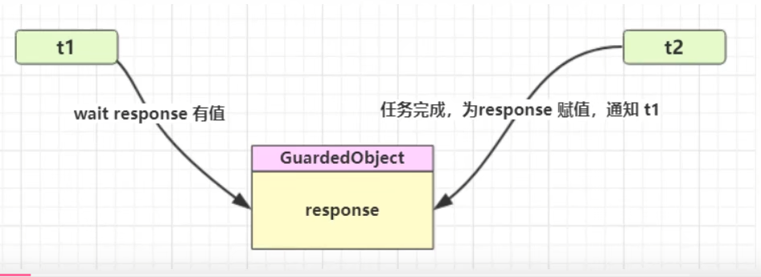
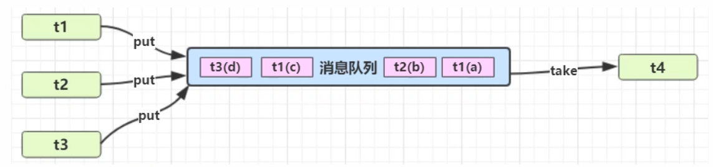
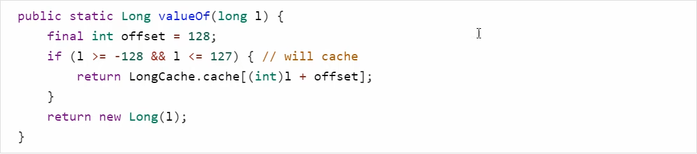
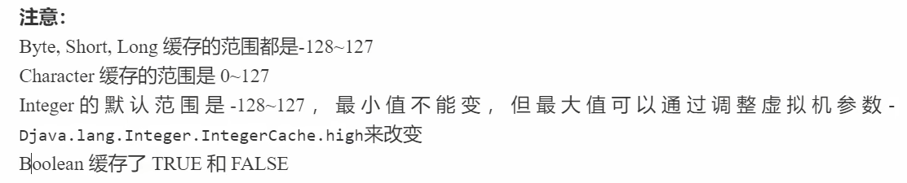
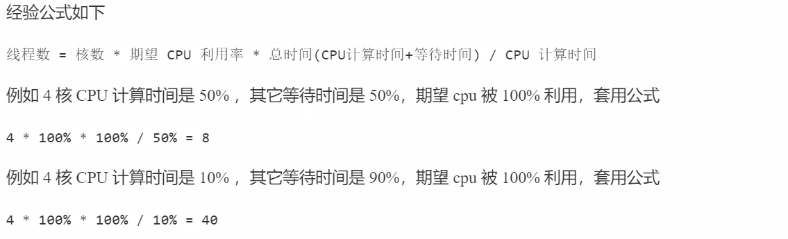

# 模式篇

## 同步模式之保护性暂停（一一对应模式）

定义：即 Guarded Suspension，用在一个线程等待另一个线程的执行结果

要点：

- 有一个结果需要从一个线程传递到另一个线程，让他们关联同一个 GuardedObject
- 如果有结果不断从一个线程到另一个线程那么可以使用消息队列 (见生产者/消费者)
- JDK中，join的实现、Future的实现，采用的就是此模式
- 因为要等待另一方的结果，因此归类到同步模式




#### 原理之 join（实际上就是使用了保护性暂停模式）

```java
    public final synchronized void join(final long millis)
    throws InterruptedException {
        if (millis > 0) {
            if (isAlive()) {
                final long startTime = System.nanoTime();
                long delay = millis;
                do {
                    wait(delay);
                } while (isAlive() && (delay = millis -
                        TimeUnit.NANOSECONDS.toMillis(System.nanoTime() - startTime)) > 0);
            }
        } else if (millis == 0) {
            while (isAlive()) {
                wait(0);
            }
        } else {
            throw new IllegalArgumentException("timeout value is negative");
        }
    }
```


#### 保护暂停模式的应用实例（解耦结果产生者和结果消费者）

```java
@Slf4j(topic = "c.Test14")
public class Test14GuardedObject {

    public static void main(String[] args) throws InterruptedException {
        for (int i = 0; i < 3; i++) {
            new People().start();
        }
        TimeUnit.SECONDS.sleep(1);
        for (Integer id : MailBoxes.getIds()) {
            new Postman(id, "内容" + id).start();
        }
    }
}

@Slf4j(topic = "c.People")
class People extends Thread {
    @Override
    public void run() {
        // 收信
        GuardedObject guardedObject = MailBoxes.createGuardedObject();
        log.debug("收信id:{}", guardedObject.getId());
        Object mail = guardedObject.get(5000);
        log.debug("收信id:{},内容：{}", guardedObject.getId(), mail);
    }
}

@Slf4j(topic = "c.Postman")
class Postman extends Thread {
    private int id;// 信件id
    private String mail; // 信件内容

    public Postman(int id, String mail) {
        this.id = id;
        this.mail = mail;
    }

    @Override
    public void run() {
        // 送信
        GuardedObject guardedObject = MailBoxes.getGuardedObject(id);
        log.debug("送信id:{},内容：{}", id, mail);
        guardedObject.complete(mail);
    }
}

class MailBoxes {
    private static Map<Integer, GuardedObject> boxes = new Hashtable<>();

    private static int id = 1;

    // 产生唯一id
    private static synchronized int generatedId() {
        return id++;
    }

    // 获取 id 所对应的信
    public static GuardedObject getGuardedObject(int id) {
        // 用完移除
        return boxes.remove(id);
    }

    // 产生 GuardedObject 对象
    public static GuardedObject createGuardedObject() {
        GuardedObject guardedObject = new GuardedObject(generatedId());
        boxes.put(guardedObject.getId(), guardedObject);
        return guardedObject;
    }

    public static Set<Integer> getIds() {
        return boxes.keySet();
    }

}

class GuardedObject {

    // 标识 GuardedObject
    private int id;

    public GuardedObject(int id) {
        this.id = id;
    }

    public int getId() {
        return id;
    }

    // 结果
    private Object response;

    // 获取结果
    // timeout 表示要等待多久
    public Object get(long timeout) {
        synchronized (this) {
            // 开始时间
            long begin = System.currentTimeMillis();
            // 经历的时间
            long passedTime = 0;
            // 没有结果
            while (response == null) {
                // 经历的时间超过最大等待时间，退出循环
                if (passedTime >= timeout) {
                    break;
                }
                try {
                    this.wait(timeout - passedTime); // 可以避免虚假唤醒
                } catch (InterruptedException e) {
                    e.printStackTrace();
                }
                // 求得经历时间
                passedTime = System.currentTimeMillis() - begin;
            }
            return response;
        }
    }

    // 产生结果
    public void complete(Object response) {
        synchronized (this) {
            // 给结果成员变量赋值
            this.response = response;
            this.notify();
        }
    }

}
```


## 异步模式之生产者/消费者（生产者产生的消息不能立刻被消费）

要点

- 与前面的保护性暂停中的GuardObject 不同，不需要产生结果和消费结果的线程一一对应
- 消费队列可以用来平衡生产和消费的线程资源
- 生产者仅负责产生结果数据，不关心数据该如何处理，而消费者专心处理结果数据
- 消息队列是有容量限制的，满时不会再加入数据，空时不会再消耗数据
- JDK中各种阻塞队列，采用的就是这种模式




```java
@Slf4j(topic = "c.Test15MessageQueue")
public class Test15MessageQueue {

    public static void main(String[] args) {

        MessageQueue queue = new MessageQueue(2);

        for (int i = 0; i < 3; i++) {
            int id = i;
            new Thread(() -> {
                queue.put(new Message(id, "值" + id));
            }, "生产者" + i).start();
        }


        new Thread(() -> {
            try {
                while (true) {
                    TimeUnit.SECONDS.sleep(1);
                    Message message = queue.take();
                }
            } catch (InterruptedException e) {
                e.printStackTrace();
            }
        }, "消费者").start();

    }

}


// 消息队列类,java线程之间通信
@Slf4j(topic = "c.MessageQueue")
class MessageQueue {
    // 模拟消息队列
    private LinkedList<Message> list = new LinkedList<>();
    // 队列容量
    private int capcity;

    public MessageQueue(int capcity) {
        this.capcity = capcity;
    }

    // 获取消息
    public Message take() {
        // 看看 list 中是否为空
        synchronized (list) {
            while (list.isEmpty()) {
                try {
                    log.debug("队列为空，消费者线程等待");
                    list.wait();
                } catch (InterruptedException e) {
                    e.printStackTrace();
                }
            }
            // 从队列头部获取消息并返回
            Message message = list.removeFirst();
            log.debug("已消费消息{}", message);
            list.notifyAll();
            return message;
        }
    }

    // 存入消息
    public void put(Message message) {
        synchronized (list) {
            // 检查对象是否已满
            while (list.size() == capcity) {
                try {
                    log.debug("队列已满，生产者线程等待");
                    list.wait();
                } catch (InterruptedException e) {
                    e.printStackTrace();
                }
            }
            // 将消息加入队列尾部
            list.addLast(message);
            log.debug("已生产消息{}", message);
            list.notifyAll();
        }
    }
}

final class Message {
    private int id;
    private Object value;

    public Message(int id, Object value) {
        this.id = id;
        this.value = value;
    }

    @Override
    public String toString() {
        return "Message{" +
                "id=" + id +
                ", value=" + value +
                '}';
    }
}
```


## 同步模式之顺序控制（固定运行顺序）

#### wait notify 版

```java
@Slf4j
public class Test18wait_notify {
    static final Object lock = new Object();
    // 表示 t2 是否运行过
    static boolean t2Runned = false;

    public static void main(String[] args) {
        Thread t1 = new Thread(() -> {
            synchronized (lock) {
                while (!t2Runned) {
                    try {
                        lock.wait();
                    } catch (InterruptedException e) {
                        e.printStackTrace();
                    }
                }
                log.debug("1");
            }
        }, "t1");

        Thread t2 = new Thread(() -> {
            synchronized (lock){
                log.debug("2");
                t2Runned = true;
                lock.notify();
            }

        }, "t2");
        t1.start();
        t2.start();
    }
}
```

#### await signal版（与wait notify 版基本一致）

#### park unpark版

```java
    public static void main(String[] args) {

        Thread t1 = new Thread(() -> {
            LockSupport.park();
            log.debug("1");
        }, "t1");
        t1.start();

        new Thread(() -> {
            log.debug("2");
            LockSupport.unpark(t1);
        }, "t1").start();
    }
```


### 交替输出

线程1输出 a 5次，线程2输出 b 5次，线程3输出 c 5次。现在要求输出abcabcabcabcabc怎么实现

#### wait notify 版

```java
@Slf4j(topic = "c.Test20")
public class Test20wait_notify {

    public static void main(String[] args) {
        WaitNotify wn = new WaitNotify(1, 5);
        new Thread(() -> {
            wn.print("a", 1, 2);
        }, "t1").start();
        new Thread(() -> {
            wn.print("b", 2, 3);
        }, "t2").start();
        new Thread(() -> {
            wn.print("c", 3, 1);
        }, "t3").start();
    }

}

class WaitNotify {

    // 打印
    public void print(String str, int waitFlag, int nextFlag) {
        for (int i = 0; i < loopNumber; i++) {
            synchronized (this) {
                while (flag != waitFlag) {
                    try {
                        this.wait();
                    } catch (InterruptedException e) {
                        e.printStackTrace();
                    }
                }
                System.out.print(str);
                flag = nextFlag;
                this.notifyAll();
            }
        }
    }

    // 等待标记
    private int flag; // 1 a 2 b 3 c
    // 循环次数
    private int loopNumber;

    public WaitNotify(int flag, int loopNumber) {
        this.flag = flag;
        this.loopNumber = loopNumber;
    }
}
```

#### await signal版

```java
public class Test21await_signal {
    public static void main(String[] args) throws InterruptedException {
        AwaitSignal awaitSignal = new AwaitSignal(5);
        Condition a = awaitSignal.newCondition();
        Condition b = awaitSignal.newCondition();
        Condition c = awaitSignal.newCondition();
        new Thread(() -> {
            awaitSignal.print("a", a, b);
        }).start();
        new Thread(() -> {
            awaitSignal.print("b", b, c);
        }).start();
        new Thread(() -> {
            awaitSignal.print("c", c, a);
        }).start();

        TimeUnit.SECONDS.sleep(1);
        awaitSignal.lock();
        try {
            System.out.println("开始...");
            a.signal();
        } finally {
            awaitSignal.unlock();
        }
    }
}

class AwaitSignal extends ReentrantLock {
    private int loopNumber;

    public AwaitSignal(int loopNumber) {
        this.loopNumber = loopNumber;
    }

    public void print(String str, Condition current, Condition next) {
        for (int i = 0; i < loopNumber; i++) {
            lock();
            try {
                current.await();
                System.out.print(str);
                next.signal();
            } catch (InterruptedException e) {
                e.printStackTrace();
            } finally {
                unlock();
            }
        }
    }
}
```

#### Park & unPark版

```java
public class Test22Park_unPark {

    static Thread t1;
    static Thread t2;
    static Thread t3;

    public static void main(String[] args) {
        ParkUnPark pu = new ParkUnPark(5);
        t1 = new Thread(() -> {
            pu.print("a", t2);
        } );
        t2 = new Thread(() -> {
            pu.print("b", t3);
        });
        t3 = new Thread(() -> {
            pu.print("c", t1);
        });
        t1.start();
        t2.start();
        t3.start();

        LockSupport.unpark(t1);
    }

}

class ParkUnPark{
    public void print(String str,Thread next){
        for (int i = 0; i < loopNumber; i++) {
            LockSupport.park();
            System.out.print(str);
            LockSupport.unpark(next);
        }
    }
    
    private int loopNumber;
    
    public ParkUnPark(int loopNumber) {
        this.loopNumber = loopNumber;
    }
}
```


# 终止模式之两阶段终止模式（改进）

```java
 */
@Slf4j(topic = "c.Test10TwoPhaseTermination")
public class Test10TwoPhaseTermination {
    public static void main(String[] args) throws InterruptedException {
        TwoPhaseTermination tpt = new TwoPhaseTermination();
        tpt.start();
        Thread.sleep(3500);
        log.debug("停止监控");
        tpt.stop();
    }
}

@Slf4j(topic = "c.TwoPhaseTermination")
class TwoPhaseTermination {

    private Thread monitor;
    private volatile boolean stop = false;

    // 启动监控线程
    public void start() {
        monitor = new Thread(() -> {
            while (true) {
                // 判断是否被打断
//                if (Thread.currentThread().isInterrupted()){
                if (stop) {
                    log.debug("料理后事");
                    break;
                }
                try {
                    Thread.sleep(1000); // 情况1
                    log.debug("执行监控记录"); // 情况2
                } catch (InterruptedException e) {
                    e.printStackTrace();
                    // 重新设置打断标记
//                    Thread.currentThread().interrupt();
                }
            }
        }, "t1");
        monitor.start();
    }

    // 停止监控线程
    public void stop() {
        stop = true;
        monitor.interrupt();
    }
}
```


## 同步模式之 Balking

Balking (犹豫）模式用在一个线程发现另一个线程或本线程已经做了某一件相同的事，那么本线程就无需再做了，直接结束返回

```java
@Slf4j(topic = "c.TwoPhaseTermination")
class TwoPhaseTermination {

    // 监控线程
    private Thread monitor;
    // 停止标记
    private volatile boolean stop = false;
    // 判断是否执行过 start 方法
    private boolean starting = false;

    // 启动监控线程
    public void start() {

        synchronized (this) {
            if (starting) {
                return;
            }
            starting = true;
        }
        monitor = new Thread(() -> {
            while (true) {
                // 判断是否被打断
//                if (Thread.currentThread().isInterrupted()){
                if (stop) {
                    log.debug("料理后事");
                    break;
                }
                try {
                    Thread.sleep(1000); // 情况1
                    log.debug("执行监控记录"); // 情况2
                } catch (InterruptedException e) {
                    e.printStackTrace();
                    // 重新设置打断标记
//                    Thread.currentThread().interrupt();
                }
            }
        }, "t1");
        monitor.start();
    }

    // 停止监控线程
    public void stop() {
        stop = true;
        monitor.interrupt();
    }
}
```

它还经常用来实现线程安全的单例


## 模式之享元模式

#### 1.简介

当需要重用数量有限的同一类对象时，可以使用享元模式

#### 2.体现

##### 2.1 包装类

在JDK中 Boolean，Byte，Short，Integer，Long，Character等包装类提供了valucOf方法，例如Long的valueOf会缓存- 128~127之间的Long对象，在这个范围之间会重用对象，大于这个范围，才会新建Long对象:





##### 2.2 String串池

##### 2.3 BigDecimal BigInteger


## 数据库连接池

```java
public class Test26Pool {
    public static void main(String[] args) {
        Pool pool = new Pool(2);
        for (int i = 0; i < 5; i++) {
            new Thread(() -> {
                Connection connection = pool.borrow();
                try {
                    TimeUnit.SECONDS.sleep(1);
                } catch (InterruptedException e) {
                    e.printStackTrace();
                } finally {
                    pool.free(connection);
                }
            }).start();
        }
    }
}

@Slf4j(topic = "c.Pool")
class Pool {
    // 1.连接池大小
    private final int poolSize;

    // 2.连接对象的数组
    private Connection[] connections;

    // 3.连接状态数组 0表示空闲，1表示繁忙
    private AtomicIntegerArray states;

    // 4.构造方法初始化
    public Pool(int poolSize) {
        this.poolSize = poolSize;
        this.connections = new Connection[poolSize];
        this.states = new AtomicIntegerArray(new int[poolSize]);
        for (int i = 0; i < poolSize; i++) {
            connections[i] = new MockConnection("连接" + (i + 1));
        }
    }

    // 5.借出连接
    public Connection borrow() {
        // 查看是否有空闲的线程
        // 乐观锁的机制
        while (true) {
            for (int i = 0; i < poolSize; i++) {
                // 获取空闲连接
                if (states.get(i) == 0) {
//                    states.set(i,1); // 存在线程安全的问题
                    // 利用 cas 的方法 解决线程安全的问题
                    if (states.compareAndSet(i, 0, 1)) {
                        log.debug("borrow {}", connections[i]);
                        return connections[i];
                    }
                }
            }
            // 没有空闲连接，当前线程进入等待
            synchronized (this) {
                try {
                    log.debug("wait........");
                    this.wait();
                } catch (InterruptedException e) {
                    e.printStackTrace();
                }
            }
        }
    }

    // 6.归还连接
    public void free(Connection conn) {
        // 检查归还的连接是否是线程池的连接
        for (int i = 0; i < poolSize; i++) {
            if (connections[i] == conn) {
                states.set(i, 0); // 只有线程的持有者才会归还连接，不存在线程间的竞争
                // 唤醒等待线程
                synchronized (this) {
                    log.debug("free {}", conn);
                    this.notifyAll();
                }
                break;
            }
        }
    }
}

class MockConnection implements Connection {

    private String name;

    @Override
    public String toString() {
        return "MockConnection{" +
                "name='" + name + '\'' +
                '}';
    }

    public MockConnection(String name) {
        this.name = name;
    }
}
```

以上实现没有考虑:·

- 连接的动态增长与收缩
- 连接保活(可用性检测)
- 等待超时处理
- 分布式hash

对于关系型数据库，有比较成熟的连接池实现，例如c3p0, druid等

对于更通用的对象池，可以考虑使用apache commons pool，例如redis连接池可以参考jedis中关于连接池的实现


## 异步模式之工作线程

#### 1. 定义

让有限的工作线程（Worker Thread）来轮流异步处理无限多的任务。也可以将其归类为分工模式，它的典型实现就是线程池，也体现了经典设计模式中的享元模式。

注意，不同任务类型应该使用不同的线程池，这样能够避免饥饿，并能提升效率

#### 2. 饥饿

固定大小线程池会有饥饿现象

- 两个工人是同一个线程池中的两个线程
- 他们要做的事情是:为客人点餐和到后厨做菜，这是两个阶段的工作
  - 客人点餐:必须先点完餐，等菜做好，上菜，在此期间处理点餐的工人必须等待
  - 后厨做菜:没啥说的，做就是了
- 比如工人A处理了点餐任务，接下来它要等着工人B把菜做好，然后上菜，他俩也配合的蛮好
- 但现在同时来了两个客人，这个时候工人A和工人B都去处理点餐了，这时没人做饭了，死锁

#### 3. 创建多少线程池合适

- 过小会导致程序不能充分地利用系统资源、容易导致饥饿
- 过大会导致更多的线程上下文切换，占用更多内存

##### 3.1 CPU 密集型运算

通常采用 `cpu核数`＋1能够实现最优的CPU利用率，+1是保证当线程由于页缺失故障（操作系统）或其它原因导致暂停时，额外的这个线程就能顶上去，保证CPU时钟周期不被浪费

##### 3.2 I/O密集型运算

CPU不总是处于繁忙状态，例如，当你执行业务计算时，这时候会使用CPU资源，但当你执行I0操作时.远程RPC调用时，包括进行数据库操作时，这时候CPU就闲下来了，你可以利用多线程提高它的利用率。


