注释合集：

import com.fasterxml.jackson.annotation.JsonIgnore;
@JsonIgnore 
// 让springmvc把当前对象转换成json字符串的时候，忽略password ,最终的json字符串中就没有password这个属性了

@RequestBody 将前端传回来的json字符串转换为一个实体类对象

@RequestParam：将请求参数绑定到你控制器的方法参数上，属性有value和name，这两个属性的作用相同，都是用来指定提交数据的name。

`@Value(“${xxxx}”)`注解从配置文件读取值的用法，也就是从application.yml / application.properties文件中获取值。


使用Spring Validation,对注册接口的参数进行合法性校验

1. 引入Spring Validation起步依赖
2. 在参数前面添加@Pattern注解
3. 在Controller类上添加@Validated注解


@PatchMapping ：patch的目的是对资源数据打补丁或局部更新

 @PutMapping ：put请求是从客户端向服务端发送数据，但与post不同的是，put真正的目的其实是执行大规模的替换操作，而不是更新操作

@DeleteMapping ：就能够非常便捷的声明能够处理DELETE请求的方法

` @PathVariable`:路径占位符，单个参数时使用

` @RequestParam`：前端参数为Map集合时使用

`@RequestBody`:接收前端传来的json字符串，转换为pojo对象

要让`MybatisPlus`处理枚举与数据库类型自动转换，我们必须告诉`MybatisPlus`，枚举中的哪个字段的值作为数据库值。 `MybatisPlus`提供了`@EnumValue`注解来标记枚举属性：


##### **3.3.2.**配置枚举处理器

在application.yaml文件中添加配置：

```YAML
mybatis-plus:
  configuration:
    default-enum-type-handler: com.baomidou.mybatisplus.core.handlers.MybatisEnumTypeHandler
```

`@JsonValue`注解标记JSON序列化时展示的字段

@JsonFormat(pattern = "yyyy-MM-dd HH:mm:ss")

将时间类型转化为指定形式的json对象


@SpringBootTest

// 如果再测试类上添加了这个注解，那么将来单元测试方法执行之前，会先初始化Spring容器

实体参数校验

- 实体类的成员变量上添加注解
  - @NotNull : 值不能为null
  - @NotEmpty ：值不能为null，并且内容不为空
  - @Email：满足邮箱格式
- 接口方法的实体参数上添加 @Validated 注解
- @URL

Ajax ：@CrossOrigin//支持跨域

异常处理

@ControllerAdvice:统一处理所有错误
@ExceptionHandler:标识一个方法处理错误，默认只能处理这个类发生的指定错误

```
@ControllerAdvice // 这个类是集中处理所有 Controller 发生的错误
public class GlobalExceptionHandler {

    @ResponseBody
    @ExceptionHandler(Exception.class)
    public String handleException(Exception e) {
        return "Ohho~~~统一处理,原因：" + e.getMessage();
    }
}
```


`@EnumValue`，Mybatis-Plus便可完成从`ItemType`对象到`code`属性之间的相互映射 

`@JsonValue`，Jackson便可完成从`ItemType`对象到`code`属性之间的互相映射。

`@EnableScheduling`：启用SpringBoot对定时任务的支持

`@Scheduled`：表明该方法需要定时去执行

- **知识点**:

  SpringBoot中的cron表达式语法如下

  ```
    ┌───────────── second (0-59)
    │ ┌───────────── minute (0 - 59)
    │ │ ┌───────────── hour (0 - 23)
    │ │ │ ┌───────────── day of the month (1 - 31)
    │ │ │ │ ┌───────────── month (1 - 12) (or JAN-DEC)
    │ │ │ │ │ ┌───────────── day of the week (0 - 7)
    │ │ │ │ │ │          (0 or 7 is Sunday, or MON-SUN)
    │ │ │ │ │ │
    * * * * * *
  ```


`@EnableConfigurationProperties`(MinioProperties.class) ：启用配置注解（一个类）

`@ConfigurationPropertiesScan`("com.atguigu.lease.common.minio")：启用配置注解（一个包），范围更大


##### knife4j的注解

- @Tag(name = "用户信息管理")：用于类上的说明信息
- @Operation(summary = "根据id查询用户信息")：用于方法上的说明信息
- @Parameter(description = "用户ID")：用于调试参数上的说明信息
- @Schema(description = "用户信息实体")：用于响应结果的说明信息（类上）
- @Schema(description = "用户ID")：用于响应结果的说明信息（参数上）


`@Profile`标记

- Spring Profiles 提供一种**隔离配置**的方式，使其仅在**特定环境**生效；

- 任何@Component, @Configuration 或 @ConfigurationProperties 可以使用 @Profile 标记，来指定何时被加载。【**容器中的组件**都可以被 `@Profile`标记】

  环境激活

  1. 配置激活指定环境； 配置文件

  ```properties
  spring.profiles.active=production,hsqldb
  ```

  2. 也可以使用命令行激活。--spring.profiles.active=dev,hsqldb

  3. 还可以配置**默认环境**； 不标注@Profile 的组件永远都存在。

  4. 以前默认环境叫default`spring.profiles.default=test`

     推荐使用激活方式激活指定环境

```yml
spring:
  banner:
    location: classpath:banner.txt
  profiles:
    active: production # 配置激活指定的一个或多个环境
    # include: 包含指定环境，不管你激活哪个环境，总是要生效的环境
    # default: 指定默认环境
    group: # 指定分组
      hh[0]: test,dev
      hh[1]: test,dev
      haha: prod,abc
# 生效的环境 = 激活的环境/默认环境  + 包含的环境
```

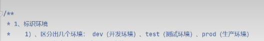

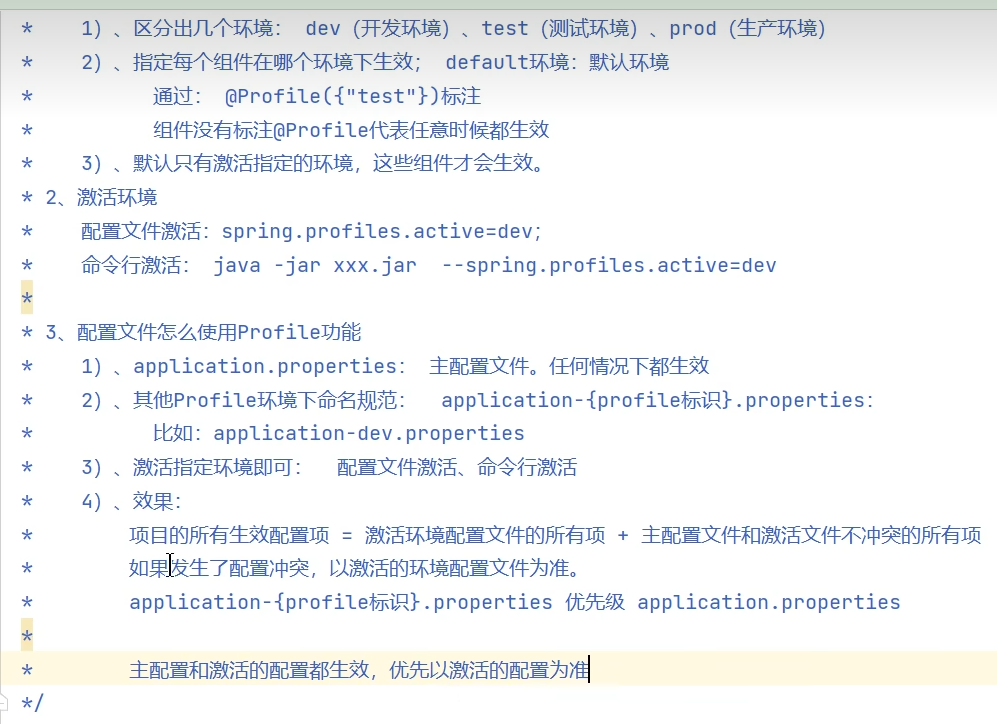


SpringMVC在处理并发状态请求时，会给每一个请求都单独分配一个线程，然后每个请求的处理流程都会在他们各自的线程内完成，比如说：拦截器-->controller层的方法-->service层的方法-->mapper层的方法都会在一个线程里去完成。所以，将解析后的token放入threadlocal中，controller层的方法、service层的方法、mapper层的方法都可以直接get到，都在一个线程中。把变量保存在线程本地当中，所以多个线程之间也不会相互干扰


@RequiredArgsConstructor

一、什么是@RequiredArgsConstructor?
@RequiredArgsConstructor是Lombok的一个注解，简化了我们对@Autowired书写，我们在写Controller层或者Service层的时候，总是需要注入很多mapper接口或者service接口，如果每个接口都写上@Autowired，这样看起来就会很繁琐，@RequiredArgsConstructor注解可以代替@Autowired注解

二、@RequiredArgsConstructor怎么使用?
导包
<dependency>
   <groupId>org.projectlombok</groupId>
   <artifactId>lombok</artifactId>
   <version>1.18.22</version>
</dependency>
使用
将@RequiredArgsConstructor写在类上面


 注意点
1、声明的变量必须加上final修饰

2、基于构造方法为属性赋值，容器通过调用类的构造方法将其进行依赖注入

三、@AllArgsConstructor和@RequiredArgsConstructor区别
@AllArgsConstructor 生成一个包含所有字段的构造方法,如果使用了@Value注入，@Value注入会失效，原因时因为@Value注解是通过对象的set方法赋值的，构造方法的执行还在set方法之前，所以在构造方法中使用变量会变量为null。
@RequiredArgsConstructor会将类的每一个final字段或者non-null字段生成一个构造方法
总结:@AllArgsConstructor和@RequiredArgsConstructor都可以用来替代@Autowired写法，区别在于@RequiredArgsConstructor必须要有final修饰，如果有@Value注解，@RequiredArgsConstructor修饰可以成功注入，@AllArgsConstructor修饰会注入失败


`@PostConstruct`: *//* *在* *bean* *初始化后执行*


​	


#### 1. 组件注册

@Configuration、@SpringBootConfiguration

@Bean、@Scope

@Controller、 @Service、@Repository、@Component

@Import

@ComponentScan

#### 2. 条件注解

如果注解指定的条件成立，则触发指定行为

*@ConditionalOnXxx*

@ConditionalOnClass：如果类路径中存在这个类，则触发指定行为

@ConditionalOnMissingClass：如果类路径中不存在这个类，则触发指定行为

@ConditionalOnBean：如果容器中存在这个Bean（组件），则触发指定行为

@ConditionalOnMissingBean：如果容器中不存在这个Bean（组件），则触发指定行为

@ConditionalOnBean（value=组件类型，name=组件名字）：判断容器中是否有这个类型的组件，并且名字是指定的值

#### 3. 属性绑定

@ConfigurationProperties： 声明组件的属性和配置文件哪些前缀开始项进行绑定

@EnableConfigurationProperties(prefix='sheep.class')：//多用于导入第三方组件进行数据绑定

- 1、给容器中注册组件（@Component、@Bean）
- 2、使用@ConfigurationProperties 声明组件和配置文件的哪些配置项进行绑定


@JacksonXmlRootElement // 可以写出为xml文档


**分组校验**

把校验项进行归类分组，在完成不同的功能的时候，校验指定组中的校验项

1. 定义分组

2. 定义校验时：指定归属的分组

3. 校验时指定要校验的分组

   ```
   //1.定义分组
       public interface Add{
       }
   
       public interface Update{
       }
   // 2.定义校验时：指定归属的分组
       @NotNull(groups = {Update.class})
       private Integer id;//主键ID
       @NotEmpty
       private String categoryName;//分类名称
       @NotEmpty
       private String categoryAlias;//分类别名
       private Integer createUser;//创建人ID  
   // 3.校验时指定要校验的分组
   @Validated(Category.Add.class) 
   
       @PostMapping
       public Result add(@RequestBody @Validated(Category.Add.class) Category category){
           categoryService.add(category);
           return Result.success();
       }
       
       
       // 如果说某个校验项没有指定分组，默认属于Default分组
       // 分组之间可以继承，A extends B ，那么A中拥有B中所有的校验项
       public interface Add extends Default {
   
       }
   
       public interface Update extends Default{
   
       }
   ```

注意事项：

- 定义校验项时如果没有指定分组，则属于Default分组，分组可以继承


##### **自定义校验**

已有的注解不能满足所有的校验需求，特殊的情况需要自定义校验(自定义校验注解)

1. 自定义注解State
2. 自定义校验数据的类StateValidation实现ConstraintValidator接口
3. 在需要校验的地方使用自定义注解


##### 文件上传

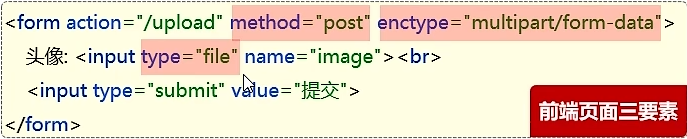

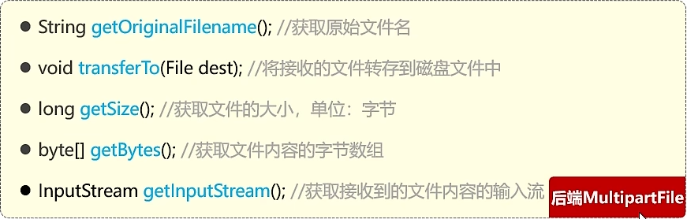


阿里云

String ACCESS_KEY_ID = "LTAI5t6FK6MRa8WhcM36HqnD";
String ACCESS_KEY_SECRET = "LfA9GockZsf4sYhl3FUXEmRKpguxtV";


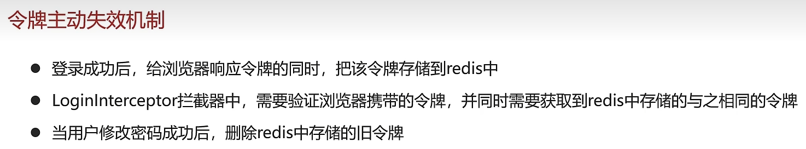


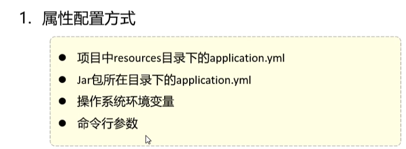


##### 多环境开发

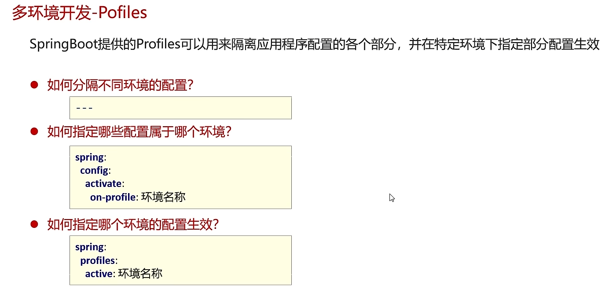

```yml
--多环境单文件--
# 通用信息,指定生效的环境
# 多环境下共性的属性
# 如果特定环境中的配置和通用信息冲突了，特定环境中的配置生效
spring:
  profiles:
    active: test
server:
  servlet:
    context-path: /aaa

---
# 开发环境
spring:
  config:
    activate:
      on-profile: dev

server:
  port: 8081

---

# 测试环境
spring:
  config:
    activate:
      on-profile: test

server:
  port: 8082

```

多文件配置（更易维护），就是将上面的四个环境拆分为4个 yml 文件。


##### 多环境开发-pofile-分组

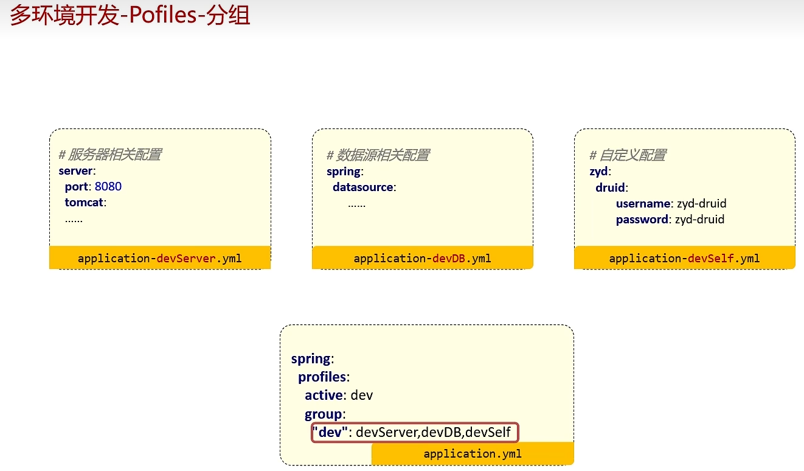


```yml
spring:
  profiles:
    group:
      "dev": devservice,devDB,devself

#      "test": testServer,testDB,testSelf
    active: dev
```


# 前端

##### JS提供的导入导出机制，可以实现按需导入

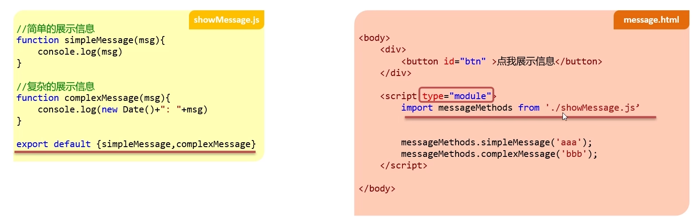

js代码：

```js
//简单的展示信息
function simpleMessage(msg){
    console.log(msg)
}
//复杂的展示信息
function complexMessage(msg){
    console.log(new Date()+": "+msg)
}
// 批量导出
// export {complexMessage,simpleMessage}

// 默认导出
export default {complexMessage,simpleMessage}
```

html代码

```html
<body>
    <div id="app">
        <button id="btn">点我展示信息</button>
    </div>
    <script type="module">
        // import {complexMessage as cm} from './showMessage.js';
       
        import messageMethods from './showMessage.js';
        window.onload = function(){
            document.getElementById("btn").onclick = function(){
                // cm("我被点击了...")
                messageMethods.complexMessage("我还是被点击了...")
            }
        }
    </script>
</body>
```

### Axios

- 介绍:Axios 对原生的Ajax进行了封装，简化书写，快速开发。
- Axios使用步骤
  - 引入Axios的js文件（参照官网)
  - 使用Axios发送请求，并获取相应结果

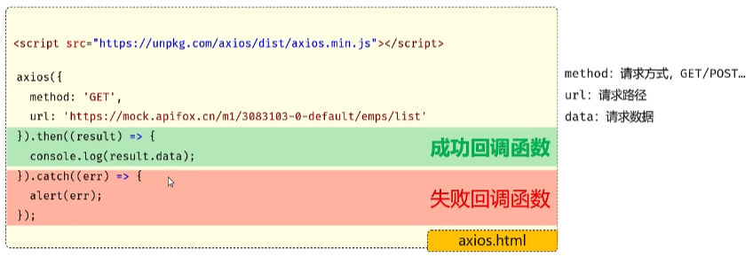

- 为了方便起见，Axios已经为所有支持的请求方法提供了别名
- 格式: axios.请求方式(url [, data [, config]])

**推荐使用别名开发**

```html
<body>
    <!--引入axios的js文件-->
    <script src="https://cdn.jsdelivr.net/npm/axios/dist/axios.min.js"></script>
    <script>
        // 发送请求
        // axios({
        //     method:'get',
        //     url:'http://localhost:8080/article/getAll'
        // }).then(result=>{
        //     // 成功的回调
        //     // result代表服务器响应的所有的数据,包含了响应头,响应体.result.data代表的是接口响应的核心数据
        //     console.log(result.data);
        // }).catch(err=>{
        //     // 失败的回调
        //     console.log(err);
        // });
        let article={
            title:'明天会更好',
            category:'生活',
            time:'2000-10-01',
            state:'草稿'
        }
        // axios({
        //     method:'post',
        //     url:'http://localhost:8080/article/add',
        //     data:article
        // }).then(result=>{
        //     // 成功的回调
        //     // result代表服务器响应的所有的数据,包含了响应头,响应体.result.data代表的是接口响应的核心数据
        //     console.log(result.data);
        // }).catch(err=>{
        //     // 失败的回调
        //     console.log(err);
        // });

        // Axios-请求方式别名
        // axios.get('http://localhost:8080/article/getAll').then((result)=>{
        //     console.log(result.data);
        // }).catch((err)=>{
        //     console.log(err);
        // });
        axios.post('http://localhost:8080/article/add',article).then((result)=>{
            console.log(result.data);
        }).catch((err)=>{
            console.log(err);
        });
    </script>
</body>
```


### NodeJs

##### 环境准备

- npm: Node Package Manager，是NodeJs的软件包管理器。

## Vue项目

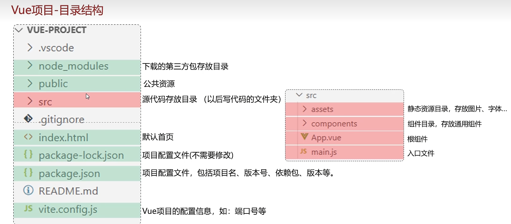

##### 启动

- 执行命令: npm run dev ，就可以启动vue项目了。

- 或者vscode启动

  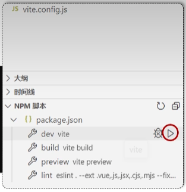

- 访问项目：打开浏览器，在浏览器地址栏访问http://127.0.0.1:5173就可以访问到vue项目。


VUE的快速入门

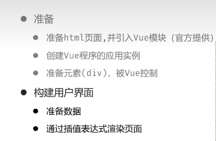

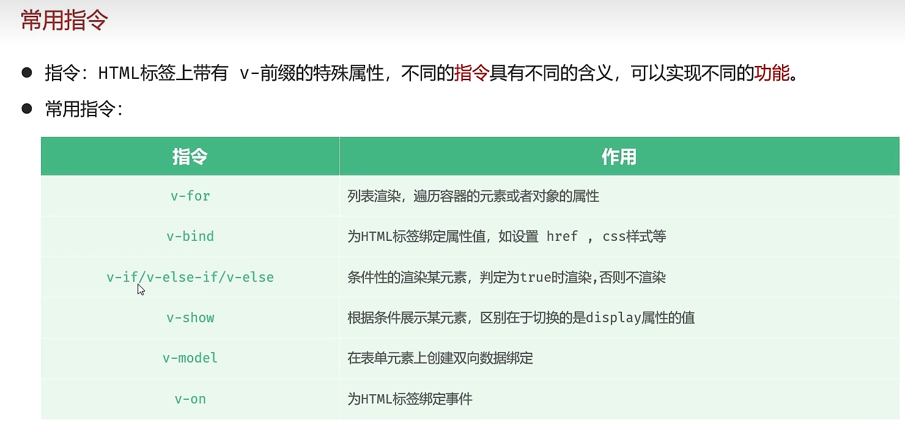

##### v-for

- 作用:列表渲染，遍历容器的元素或者对象的属性
- 语法: v-for = "(item, index) in items"
  - 参数说明:
    - items为遍历的数组
    - item为遍历出来的元素
    - index为索引/下标，从0开始﹔可以省略，省略index语法: v-for = "item in items"

注意：遍历的数组，必须在data中定义;要想让哪个标签循环展示多次，就在哪个标签上使用v-for指令。

```html
<body>

    <div id="app">
        <table border="1 solid" colspa="0" cellspacing="0">
            <tr>
                <th>文章标题</th>
                <th>分类</th>
                <th>发表时间</th>
                <th>状态</th>
                <th>操作</th>
            </tr>
            <!--哪个元素要出现多次，v-for指令就添加到哪个元素上-->
            <tr v-for="(article,index) in articleList">
                <td>{{article.title}}</td>
                <td>{{article.category}}</td>
                <td>{{article.time}}</td>
                <td>{{article.state}}</td>
                <td>
                    <button>编辑</button>
                    <button>删除</button>
                </td>
            </tr>
       
        </table>
    </div>

    <script type="module">
        //导入vue模块
        import { createApp } from
            'https://unpkg.com/vue@3/dist/vue.esm-browser.js'
        //创建应用实例
        createApp({
            data() {
                return {
                    articleList: [
                        {
                            title: "医疗反腐绝非砍医护收入",
                            category: "时事",
                            time: "2023-09-5",
                            state: "已发布"
                        },
                        {
                            title: "中国男篮缘何一败涂地？",
                            category: "篮球",
                            time: "2023-09-5",
                            state: "草稿"
                        },
                        {
                            title: "华山景区已受大风影响阵风达7-8级，未来24小时将持续",
                            category: "旅游",
                            time: "2023-09-5",
                            state: "已发布"
                        }
                    ]
                }
            }
        }).mount("#app")//控制页面元素
    </script>
</body>
```

##### v-bind

- 作用:动态为HTML标签绑定属性值，如设置href, src, style样式等。
- 语法: v-bind:属性名="属性值"
- 简化::属性名="属性值"

```html
<body>
    <div id="app">
        <!-- <a v-bind:href="url">黑马官网</a> -->
        <a :href="url">黑马官网</a>
    </div>

    <script type="module">
        //引入vue模块
        import { createApp} from 
                'https://unpkg.com/vue@3/dist/vue.esm-browser.js'
        //创建vue应用实例
        createApp({
            data() {
                return {
                    url: "https://www.itheima.com"
                }
            }
        }).mount("#app")//控制html元素
    </script>
</body>
```

##### v-if

- 作用：用来控制元素的显示与隐藏的
- 语法: v-if="表达式”，表达式值为true，显示;false，隐藏
- 其它:可以配合v-else-if / v-else 进行链式调用条件判断
- 原理:基于条件判断,来控制创建或移除元素节点(条件渲染)
- 场景:要么显示，要么不显示，不频繁切换的场景

##### v-show

- 作用：用来控制元素的显示与隐藏的
- 语法: v-show="表达式"，表达式值为true，显示; false，隐藏
- 原理:基于CSS样式display来控制显示与隐藏
- 场景:频繁切换显示隐藏的场景

**两者区别：**

- v-if 是根据条件判断是创建还是移除元素节点（条件渲染）。
- v-show 是根据css样式display来控制元素的显示与隐藏。

**适用场景：**

- v-if  适用于显示与隐藏切换不频繁的场景。
- v-show 适用于显示与隐藏切换频繁的场景。

```html
<body>
    <div id="app">
        手链价格为:
        <span v-if="customer.level>=0 && customer.level<=1">9.9</span>
        <span v-else-if="customer.level>=2 && customer.level<=4">19.9</span>
        <span v-else>29.9</span>
        
        <br>
        
        <span v-show="customer.level>=0 && customer.level<=1">9.9</span>
        <span v-show="customer.level>=2 && customer.level<=4">19.9</span>
        <span v-show="customer.level>=5">29.9</span>
    </div>
    
    <script type="module">
        //导入vue模块
        import { createApp } from 'https://unpkg.com/vue@3/dist/vue.esm-browser.js'

        //创建vue应用实例
        createApp({
            data() {
                return {
                    customer: {
                        name: "张三",
                        level: 2
                    }
                }
            }
        }).mount("#app")//控制html元素
    </script>
</body>
```


##### v-on

- 作用:为html标签绑定事件

- 语法:

  - v-on:事件名="函数名"

  - 简写为  @事件名="函数名"

```html
body>
    <div id="app">
        <button v-on:click="money">点我有惊喜</button> &nbsp;
        <button @click="love">再点更惊喜</button>
    </div>

    <script type="module">
        //导入vue模块
        import { createApp} from 'https://unpkg.com/vue@3/dist/vue.esm-browser.js'

        //创建vue应用实例
        createApp({
            data() {
                return {
                    //定义数据
                }
            },
            methods: {
                money: function(){
                    alert("送你钱100")
                },
                love: function(){
                    alert("爱你一万年")
                }
            }
        }).mount("#app");//控制html元素

    </script>
</body>
```


##### v-model

- 作用:在表单元素上使用，**双向数据绑定**。可以方便的获取或设置表单项数据
- 数据 <-------------------------> 视图
- 语法：v-model="变量名"

```html
<body>
    <div id="app">

        文章分类: <input type="text" v-model="searchConditions.category"/>

        <span>{{searchConditions.category}}</span>

        发布状态: <input type="text" v-model="searchConditions.state"/>
        <span>{{searchConditions.state}}</span>

        <button>搜索</button>
        <button v-on:click="clear">重置</button>

        <br />
        <br />
        <table border="1 solid" colspa="0" cellspacing="0">
            <tr>
                <th>文章标题</th>
                <th>分类</th>
                <th>发表时间</th>
                <th>状态</th>
                <th>操作</th>
            </tr>
            <tr v-for="(article,index) in articleList">
                <td>{{article.title}}</td>
                <td>{{article.category}}</td>
                <td>{{article.time}}</td>
                <td>{{article.state}}</td>
                <td>
                    <button>编辑</button>
                    <button>删除</button>
                </td>
            </tr>
        </table>
    </div>
    <script type="module">
        //导入vue模块
        import { createApp } from 'https://unpkg.com/vue@3/dist/vue.esm-browser.js'
        //创建vue应用实例
        createApp({
            data() {
                return {
                    //定义数据
                    searchConditions:{
                        category:'',
                        state:''
                    },
                    articleList: [{
                        title: "医疗反腐绝非砍医护收入",
                        category: "时事",
                        time: "2023-09-5",
                        state: "已发布"
                    },
                    {
                        title: "中国男篮缘何一败涂地？",
                        category: "篮球",
                        time: "2023-09-5",
                        state: "草稿"
                    },
                    {
                        title: "华山景区已受大风影响阵风达7-8级，未来24小时将持续",
                        category: "旅游",
                        time: "2023-09-5",
                        state: "已发布"
                    }]
                }
                
            }, 
            methods:{
                clear: function(){
                    // 清空category 以及 state 的数据
                    // 在methods对应的方法里面,使用this就代表的是vue实例,可以使用this获取到vue实例中准备的数据
                    this.searchConditions.category="";
                    this.searchConditions.state="";
                }           
           }
        }).mount("#app")//控制html元素
    </script>
</body>
```


### 生命周期

- 生命周期:指一个对象从创建到销毁的整个过程。
- 生命周期的八个阶段:每个阶段会自动执行一个生命周期方法(钩子)，让开发者有机会在特定的阶段执行自己的代码
- 生命周期的八个阶段:每个阶段会自动执行一个生命周期方法(钩子)让开发者有机会在特定的阶段执行自己的代码
- Vue生命周期典型的应用场景?
  - 在页面加载完毕时，发起异步请求，加载数据，渲染页面。

|     状态      |  阶段周期  |
| :-----------: | :--------: |
| beforecreate  |   创建前   |
|    created    |   创建后   |
|  beforeMount  |   载入前   |
|    mounted    |  挂载完成  |
| beforeUpdate  | 数据更新前 |
|    updated    | 数据更新后 |
| beforeUnmount | 组件销毁前 |
|   unmounted   | 组件销毁后 |


#### API风格

- Vue的组件有两种不同的风格:**组合式API**和选项式API

##### 组合式API

- setup:是一个标识，告诉Vue需要进行一些处理，让我们可以更简洁的使用组合式API。
- ref():接收一个内部值，返回一个响应式的ref对象，此对象只有一个指向内部值的属性value。
- onMounted():在组合式API中的钩子方法，注册一个回调函数，在组件挂载完成后执行。

注意：使用 async...await 同步接收网络请求的结果

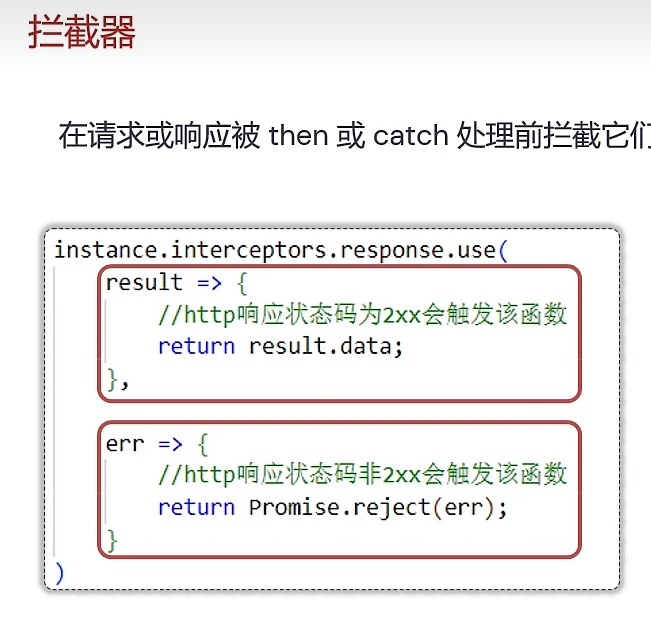

```js
拦截器
// 定制请求的实例

import axios from "axios";
// 定义一个变量,记录公共的前缀, baseURL
const baseURL = 'http://localhost:8080';
const instance = axios.create({baseURL})
// 添加响应拦截器
instance.interceptors.response.use(
    result=>{
        return result.data;
    },
    err=>{
        alert('服务异常')
        return Promise.reject(err);//异步的状态转化成失败的状态
    }
)
export default instance; // 对外暴露实例


```

#### 路由

- 路由，决定从起点到终点的路径的进程
- 在前端工程中，路由指的是根据不同的访问路径，展示不同组件的内容
- Vue Router是Vue.js的官方路由
  1. 安装vue-router npm install vue-router@4
  2. 在src/router/index.js中创建路由器，并导出
  3. 在vue应用实例中使用vue-router
  4. 声明router-view标签，展示组件内容

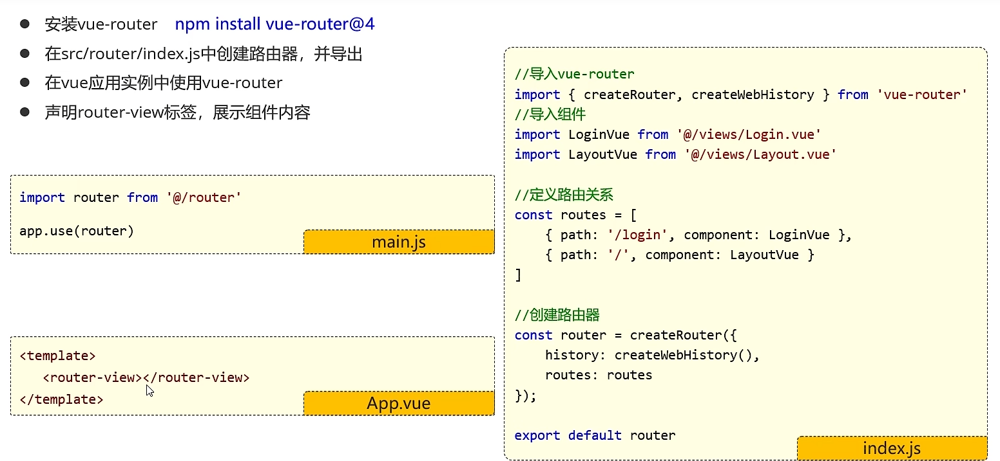

##### 子路由

- 复制资料中提供好的五个组件
- 配置子路由
- 声明router-view标签
- 为菜单项el-menu-item 设置index属性，设置点击后的路由路径

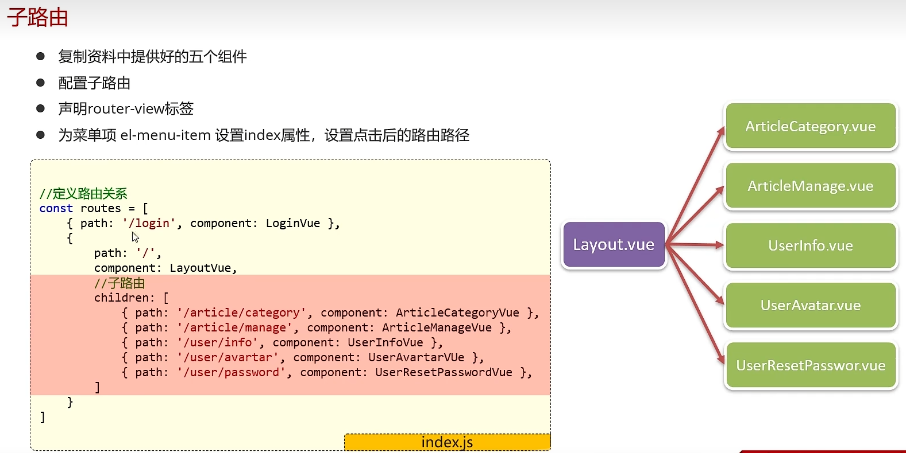

```js
// 定义路由关系
const routes = [
    { path: '/login', component: LoginVue },
    {
        path: '/',
        component: LayoutVue,
        redirect: '/article/manage',
        
        children: [
            { path: '/article/category', component: ArticleCategoryVue },
            { path: '/article/manage', component: ArticleManageVue },
            { path: '/user/info', component: UserInfoVue },
            { path: '/user/avatar', component: UserAvatarVue },
            { path: '/user/resetPassword', component: UserResetPasswordVue }
        ]
    }
]
```

# 九、Pinia状态管理库

Pinia是Vue的专属状态管理库，它允许你跨组件或页面共享状态

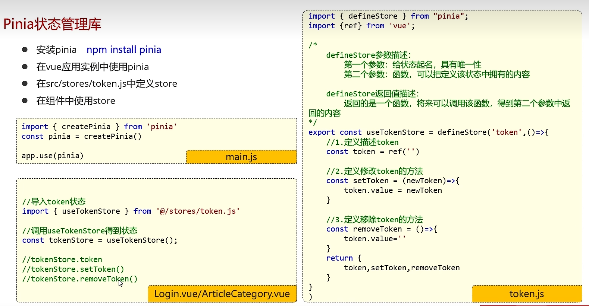

### 9.1安装

```js
npm install pinia
```

### 9.2使用Pinia

在main.js中，引入pinia，创建pinia实例，并调用vue应用实例的use方法使用pinia

```js
import { createPinia } from 'pinia'

const pinia = createPinia()
app.use(pinia)
```

### 9.3 定义Store

在src/stores目录下定义token.js

```js
import { defineStore } from "pinia";
import {ref} from 'vue';

/*
    defineStore参数描述：
        第一个参数：给状态起名，具有唯一性
        第二个参数：函数，可以把定义该状态中拥有的内容

    defineStore返回值描述：
        返回的是一个函数，将来可以调用该函数，得到第二个参数中返回的内容
*/
export const useTokenStore = defineStore('token',()=>{
    //1.定义描述token
    const token = ref('')

    //2.定义修改token的方法
    const setToken = (newToken)=>{
        token.value = newToken
    }

    //3.定义移除token的方法
    const removeToken = ()=>{
        token.value=''
    }
    return {
        token,setToken,removeToken
    }
})
```

### 9.4 使用Store

在需要使用状态的地方，导入@/stores/*.js , 使用即可

在Login.vue中导入@/stores/token.js, 并且当用户登录成功后，将token保存pinia中

```js
//导入token状态
import { useTokenStore } from '@/stores/token.js'

//调用useTokenStore得到状态
const tokenStore = useTokenStore();

//用于登录的事件函数
const login = async () => {
    let result = await loginService(registerData.value)
    //保存token
    tokenStore.setToken(result.data)
    
    ElMessage.success('登录成功!')
    router.push('/')
}
```


在article.js中导入@/stores/token.js, 从pinia中获取到存储的token，在发起查询文章分类列表的时候把token通过请求头的形式携带给服务器

```js
//导入@/stores/token.js
import { useTokenStore } from '../stores/token'


//文章分类列表查询
export const articleCategoryListService = () => {
    //获取token状态
    const tokenStore = useTokenStore()
    //通过请求头Authorization携带token
    return request.get('/category', { headers: { 'Authorization': tokenStore.token } })
}
```


### Pinia状态持久化插件-persist

- Pinia默认是内存存储，当刷新浏览器的时候会丢失数据。
- Persist插件可以将pinia中的数据持久化的存储

安装

- 安装persist   npm install pinia-persistedstate-plugin
- 在pinia中使用persist
- 定义状态Store时指定持久化配置参数


# Element Plus

- 快速入门

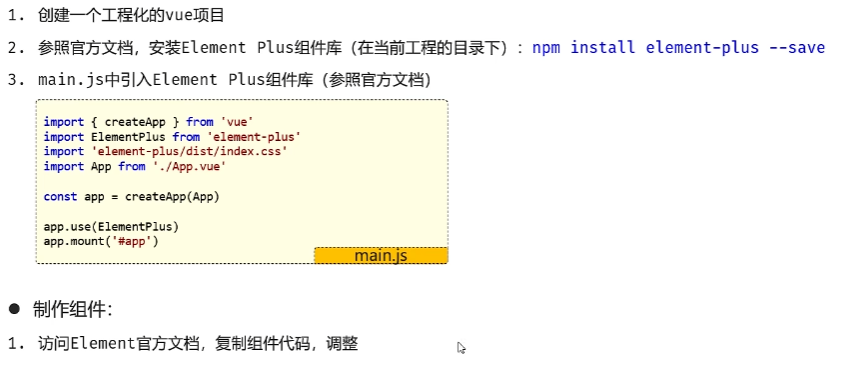

- 常用组件（官网查）


